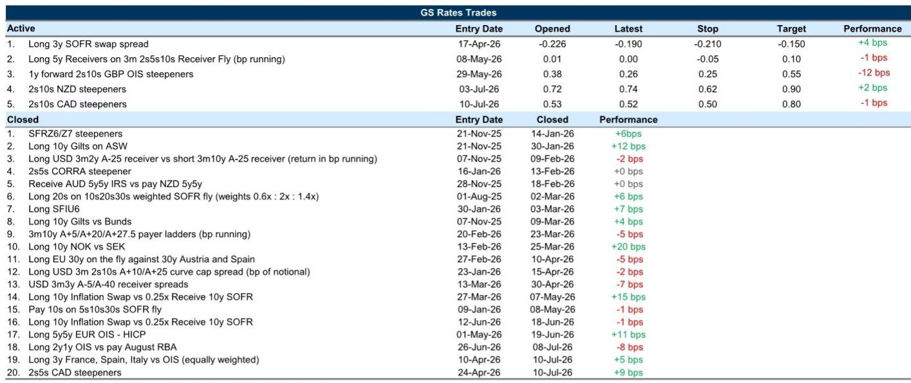
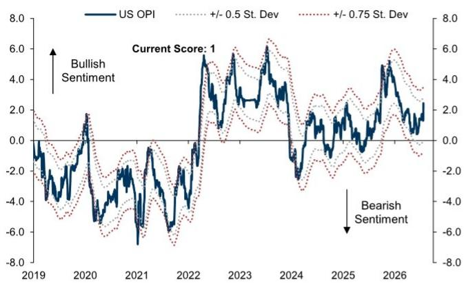
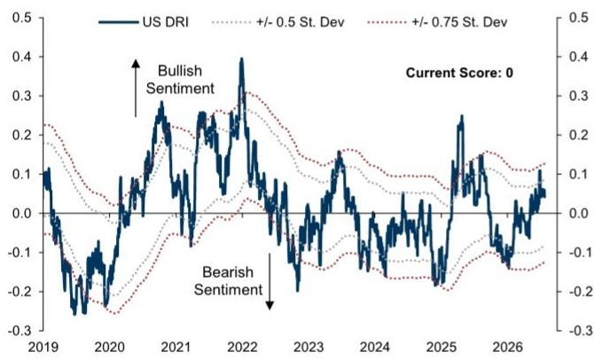

# 美联储7月决策：整个利率体系的可信度十字路口

美联储在7月会议上面临一个异常关键的节点。自上次CPI发布以来，油价上涨15%，已将市场对7月加息的定价从极小可能性推升至值得关注的风险。在此背景下，我们的研究员预计美联储将维持政策利率稳定。如果当前定价保持不变，市场预期与美联储实际举措之间的差距，将是近几十年来非降息会议日中最大的“意外”——其结果对市场的影响几乎完全取决于主席如何阐述这一决策。风险不仅在于市场对利率路径的判断有误。更深层的风险在于，若沟通不当，可能抵消6月FOMC会议所实现的可信度重定价，将通胀风险重新引入长期远期利率，并暴露出长期利率的相对稳定是建立在有限指引之上的脆弱平衡。

这种紧张关系十分突出，因为影响远不止于前端。在近期的抛售中，长期远期估值已进入公允价值偏便宜的一侧，但尚未充分偏离到足以在没有宏观催化剂（要么遏制通胀风险，要么削弱增长韧性预期）的情况下出现修正。我们仍认为，这两种力量对较短期限品种的影响会更大。因此，7月决策不仅关乎美联储是否加息或维持不变。它更关乎美联储能否维持住那个让期限溢价受控、防止通胀风险溢价重新走高的叙事。答案将影响今年剩余时间内G10国家的曲线动态。

## 缺乏明确指引的决策可能将通胀风险重新引入中期和长期利率

市场已对7月加息定价了相当高的概率。如果美联储选择维持不变，直接的问题是：这种定价是否会简单地转移到后续会议日期，还是预示着更广泛的可信度丧失？这种区别很重要，因为6月FOMC会议产生了一次强烈的鹰派重定价，压缩了期限溢价，并降低了长期远期利率中隐含的通胀风险。那次重定价是清晰度的结果：市场相信他们理解了美联储的反应函数。如果维持利率不变，却对前景或触发政策回应的条件解释有限，将削弱这种清晰度。

具体的脆弱点在于中期和长期利率。如果市场将维持不变解读为美联储不愿验证能源成本所引发的鹰派定价，那么长期回报表现中积累的“可信度”溢价就可能被侵蚀。这将把通胀风险重新引入此前相对稳定的远期利率。其机制并不抽象。缺乏指引的维持不变会让市场仅从数据中推断美联储的反应函数，而在油价高企的背景下，这种推断很可能会嵌入更高的期限溢价。结果将是熊市陡化，推动10年期回报表现走高，即使前端因维持不变本身而保持稳定。

风险是不对称的。加息可能会将前端利率峰值提前，压缩预期紧缩的时间。但缺乏指引的维持不变不会仅仅维持现状。它会降低决策本身的信息含量，迫使市场对更广泛的结果范围进行定价。这正是长期波动率上升和互换利差扩大的条件。8月的再融资公告（在FOMC会议后一周发布）将考验财政部能否在不增加压力的情况下管理供给。但下一阶段回报表现变动的主要催化剂并非供给。而是美联储能否维持那个让6月重定价成为可能的叙事。

## 缺乏宏观催化剂的能源驱动型欧洲前端重定价不可持续

欧洲前端利率仍与能源价格挂钩，伊朗局势的再度升级推高了回报表现。欧洲央行7月会议对压低回报表现作用有限，市场预期围绕9月加息趋于一致。前端呈现熊市陡化，Z6Z7合约目前定价了在2026年12月前两次加息的基础上再加息近一次。这种模式在通胀风险上升时很常见，但前端会议定价的波动性仍然受限。这种组合是不稳定的。

解决方案将走两条路径之一。要么能源带来的通胀压力消退，允许前端正常化；要么近期会议的速度限制被提高，意味着市场对加息步伐而非终端水平进行重定价。迄今为止的数据表明，相对于能源变动，2y2y通胀的定价是公允的。但欧洲利率波动率重定价的滞后意味着，除非能源风险消退，否则前端波动率存在上行风险。这对追踪利率波动率而非核心利率水平的欧洲主权信用很重要。

对持仓的影响是明确的。欧元互换曲线应因前端回报表现下降而陡化，1y1y OIS接近3%看起来尤其偏高。但稳健的经济数据和粘性的欧洲天然气价格可能会推迟这种缓解。欧洲前端的熊市陡化是一种动量驱动的交易，只要能源价格继续上涨就会持续。当这种动量被打破时，反转将很剧烈，并且很可能从前端而非长期端开始。关键问题是催化剂将是能源价格下跌还是央行沟通的转变。目前，前者尚未出现，后者也明显缺席。

## 财政压力叠加能源冲击，英国国债风险溢价将保持高位

能源价格再度上涨已将英国国债回报表现和前端定价推回到冲突时期的高点。最近的局势升级产生了两次轮动：从前端Z6合约到Z7合约，以及从石油到天然气成为英国央行会议定价的主要驱动因素。这些轮动与英国央行不愿比当前市场定价暗示的更快加息是一致的，考虑到行长相对鸽派的立场。我们的研究员预计，由于经济活动依然疲软且潜在通胀动态受控，英国央行将在下次会议及年底前维持利率不变。

复杂因素在于财政方面。首相关注生活成本压力尚未产生实质性的支出承诺，但如果能源冲击恶化，市场越来越关注财政措施的可能性。其机制是直接的：财政空间是政府融资成本的函数，而能源价格上涨增加了这些成本。这种动态使得英国国债风险溢价保持高位，无论前端利率的短期方向如何。英国2s10s曲线将在三个月内陡化，不是因为前端会反弹，而是因为长期端将难以消化能源驱动的通胀风险和财政不确定性带来的双重压力。

市场已对2027年定价了近三次加息。相对于英国央行的指引和经济数据，这种定价是激进的。但它不会仅仅因为看起来过度就进行修正。只有当能源价格下跌或英国央行发出明确信号表明不会验证市场的鹰派预期时，它才会修正。在此之前，英国国债曲线被困在动量与价值之间，而动量正在胜出。

## 应对7月FOMC及其全球溢出效应的决策框架

7月FOMC决策，加上能源驱动的G10市场重定价，创造了一系列清晰的条件性结果，可用于跨市场布局。该框架基于三个变量：美联储的决策、围绕该决策的沟通，以及能源价格的走势。

在基准情景下（美联储维持不变且提供有限指引），最脆弱的头寸是美国国债的中期和长期多头。风险在于6月的可信度重定价被逆转，将通胀风险重新引入远期利率。适当的对冲是减少5至10年期部分的久期敞口，并倾向于从前端稳定和长期端疲软中受益的陡化交易。在另一种情景下（美联储加息），前端利率峰值前移，曲线因近期紧缩预期被拉入当前定价而趋平。这种结果将有利于前端趋平交易，并可能压缩整个曲线的期限溢价。

对于欧洲和英国市场，该框架由能源价格主导。如果石油和天然气价格继续上涨，前端动量将持续，熊市陡化将继续有效。风险在于波动率从较晚的会议日期迁移到较早的日期，使前端趋平。这种迁移将是市场正在提高近期加息速度限制的信号，它将有利于趋平交易而非陡化交易。如果能源价格稳定或下跌，前端的缓解将很剧烈，曲线陡化交易将受益，因为前端反弹速度快于长期端。

对于日本，该框架取决于日本央行的信号。如果行长发出鹰派基调，暗示对更高终端利率持开放态度，将支持进一步的曲线趋平，并减轻日本国债的贬值压力。鸽派或模糊的基调将强化市场的观点，即当前终端利率不足，需要进一步增加期限溢价。对中期和长期端最持久的支持将来自更紧缩的货币和财政政策组合，而非关于加息步伐的孤立信号。

对于加拿大、澳大利亚和新西兰，该框架是能源驱动的回报表现溢出与国内增长风险之间的拉锯。在加拿大，贸易紧张局势增加了鸽派风险，应使前端的加息溢价随时间衰减，但更高的能源价格为多头创造了战术性逆风。在澳大利亚和新西兰，数据的积累应抑制前端远期利率中定价的过高加息溢价，支持陡化交易。这些市场的共同点是，前端定价的紧缩程度超过了数据的支持，修正将在能源动量被打破时到来。

该框架并非预测。它是一种将结果映射到头寸的方法。关键见解是，7月FOMC并非单一事件风险。它是对美联储能否维持那个让期限溢价受控的叙事的考验。该考验的结果将决定当前G10市场的重定价是暂时的能源驱动调整，还是更持久制度转变的开始。

*仅供参考。部分内容可能基于源材料通过AI辅助生成、翻译、总结或编辑，可能存在遗漏或错误。请独立核实。本文不构成专业建议。*

仅供参考。部分内容可能基于源材料通过AI辅助生成、翻译、总结或编辑，可能存在遗漏或错误。请独立核实。本文不构成专业建议。

