## 宏观环境研究：7月观察指标更新

以下是我们对宏观环境观察指标的更新。这些指标背后的数据可在此处下载（附录中包含方法说明）。

## 宏观环境观察指标

图1：6月当前活动指标（CAI）环比年化增长5.3%，5月为4.2%

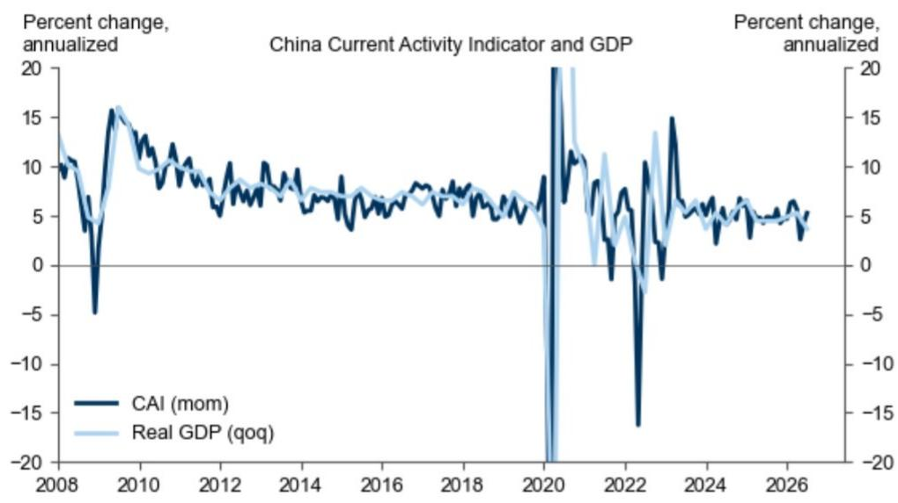  
来源：研究机构、国家统计局、CEIC

图2：6月CAI的改善主要由制造业和消费推动  
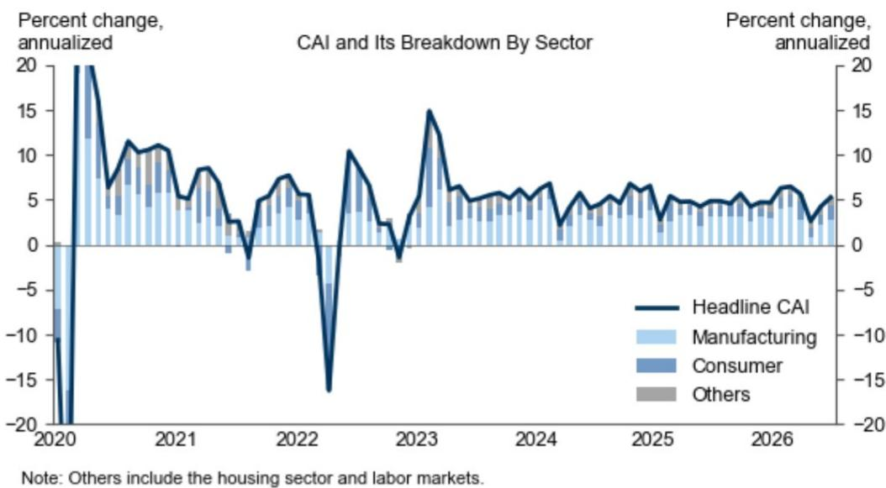  
来源：研究机构、国家统计局、CEIC  

图3：进口隐含的国内需求指标显示二季度国内需求增长保持平稳

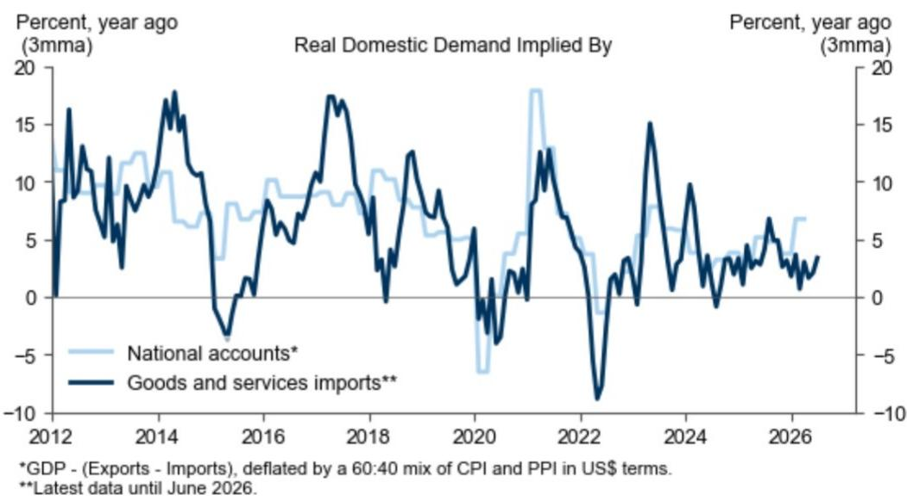  
来源：Haver Analytics、研究机构

图4：MAP惊喜指数（21天移动平均）显示近期宏观数据整体高于市场预期  
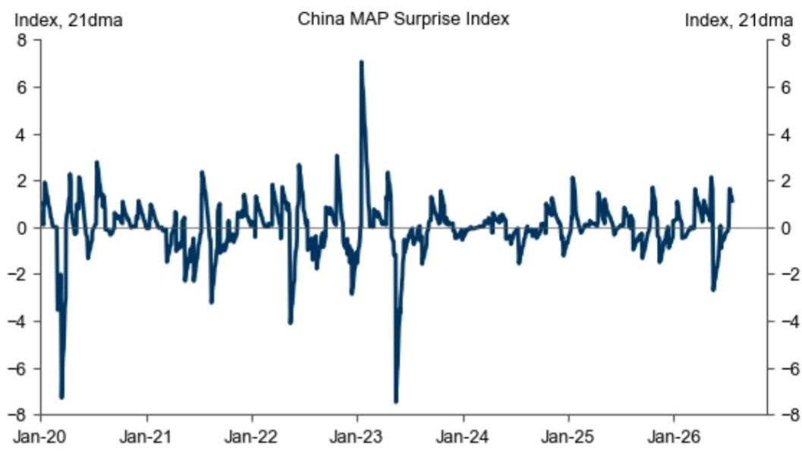  
来源：彭博、研究机构

图5：制造业增长代理指标和建筑业增长代理指标6月均有所回升  
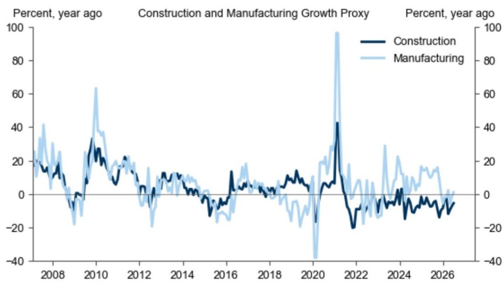  
来源：Haver Analytics、研究机构

图6：初步投资追踪指标（基于实际增加值）显示二季度增长有所调整  
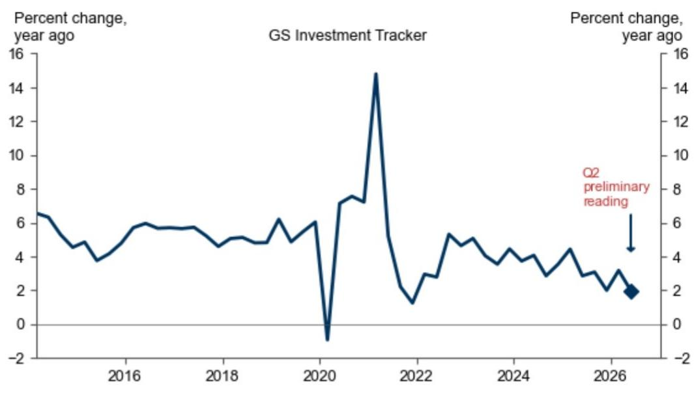  
来源：研究机构

图7：库存追踪指标显示2026年二季度库存水平可能有所上升  
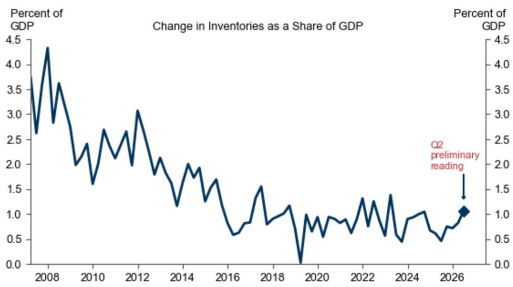  
来源：研究机构、Haver Analytics

图8：库存变化对GDP环比增长的贡献在2026年二季度可能有所增加  
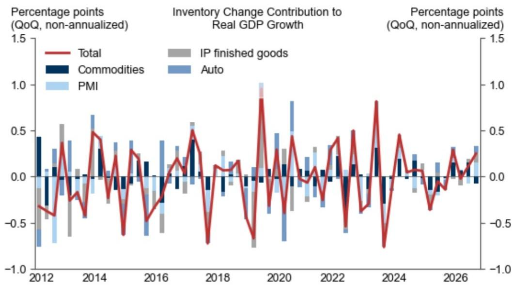  
来源：研究机构、Haver Analytics、CEIC、彭博  

图9：外部出口追踪指标与5月官方出口增长数据基本一致

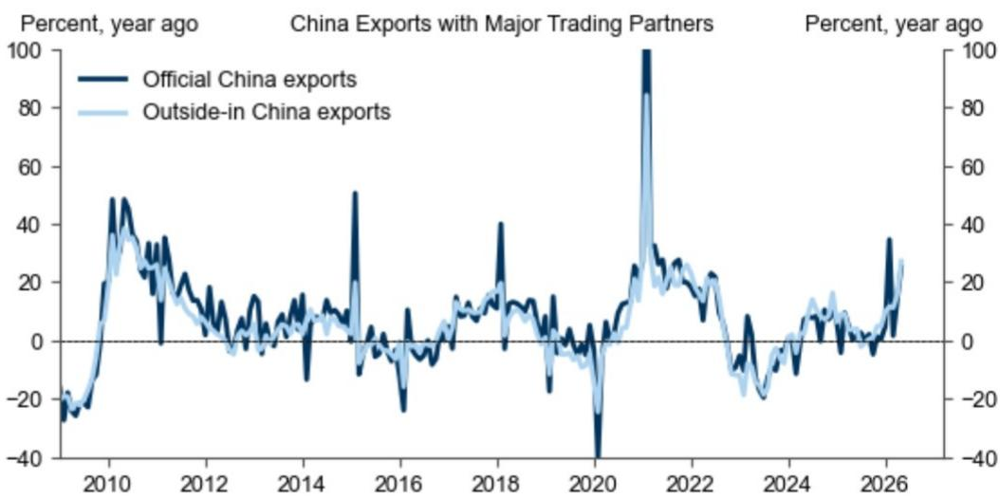  
注：2026年5月数据基于有进口数据的国家估算，这些国家占2025年中国出口值的31.1%。  
来源：Haver Analytics、CEIC、研究机构

图10：外部进口追踪指标在5月略低于官方进口增长数据  
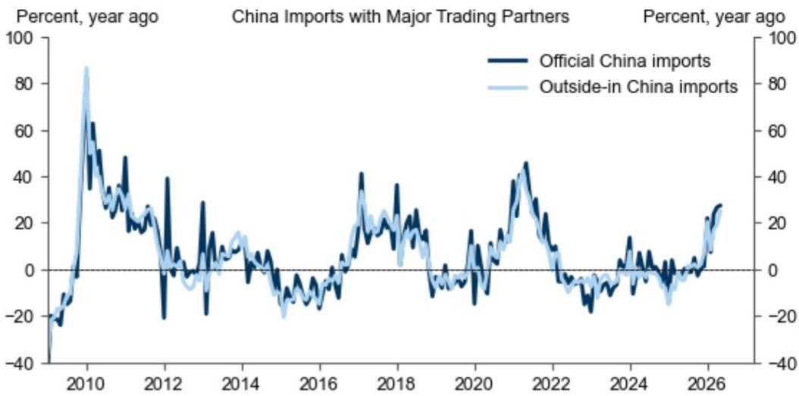  
注：2026年5月数据基于有出口数据的国家估算，这些国家占2025年中国进口值的65.5%。  
来源：Haver Analytics、CEIC、研究机构

图11：6月资金条件指数（FCI；含信贷量）有所收紧  
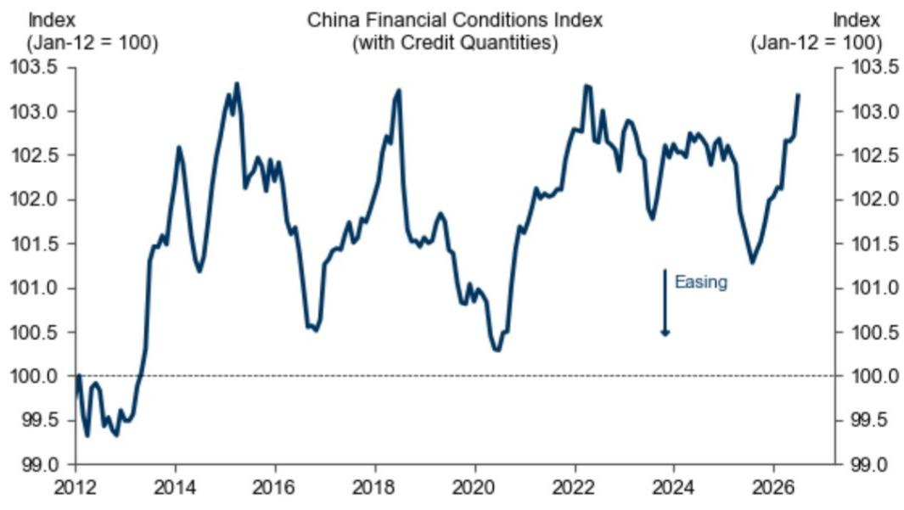  
来源：研究机构、CEIC、彭博

图12：6月FCI收紧主要受贸易加权汇率变动影响  
  
来源：研究机构、CEIC、彭博

图13：由于信贷增长放缓，今年信贷脉冲估计已转为负值  
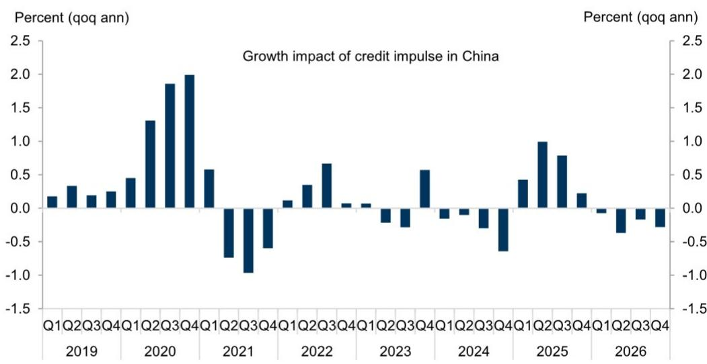  
脉冲估算假设今年剩余时间信贷投放保持平稳。  
来源：研究机构

图14：偏好的指标显示6月资金持续流入  
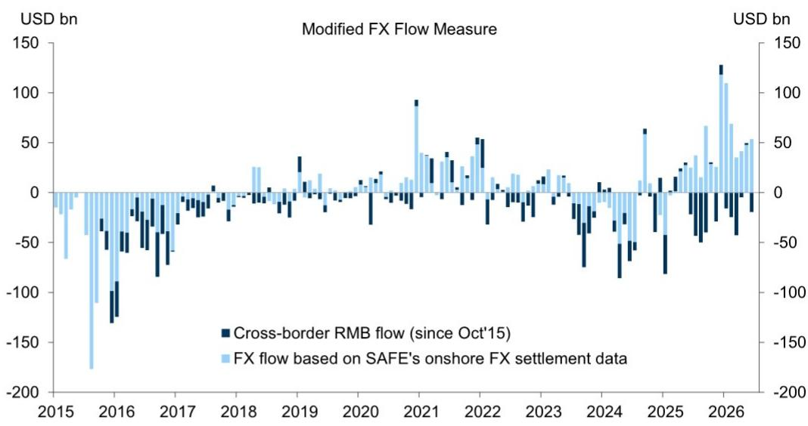  
来源：研究机构、外管局

图15：国内宏观政策代理指标6月进一步收紧  
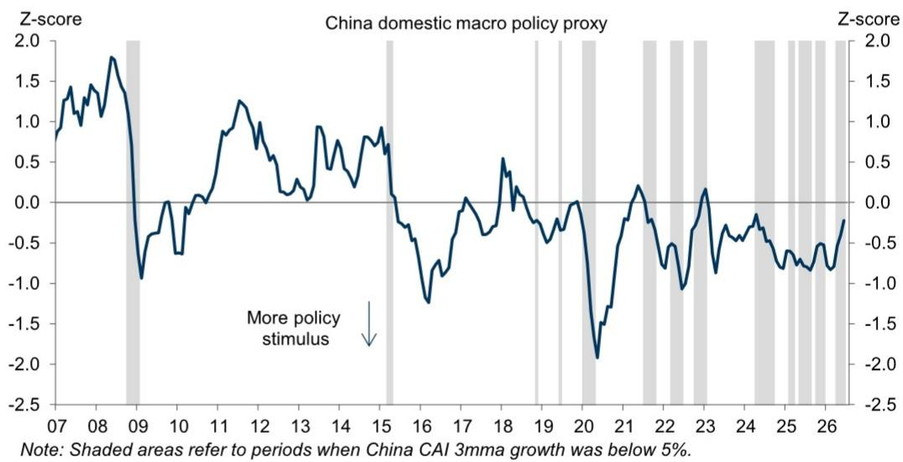  
来源：研究机构、Wind、Haver Analytics、CEIC

图16：6月宏观政策代理指标的收紧主要由财政政策驱动  
  
来源：研究机构、Wind、Haver Analytics、CEIC

图17：扩大财政赤字指标6月进一步收窄  
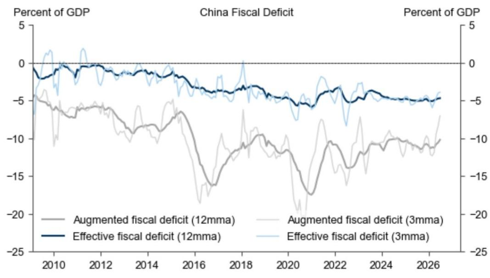  
来源：研究机构、CEIC、Wind

图18：财政支出比率6月有所上升  
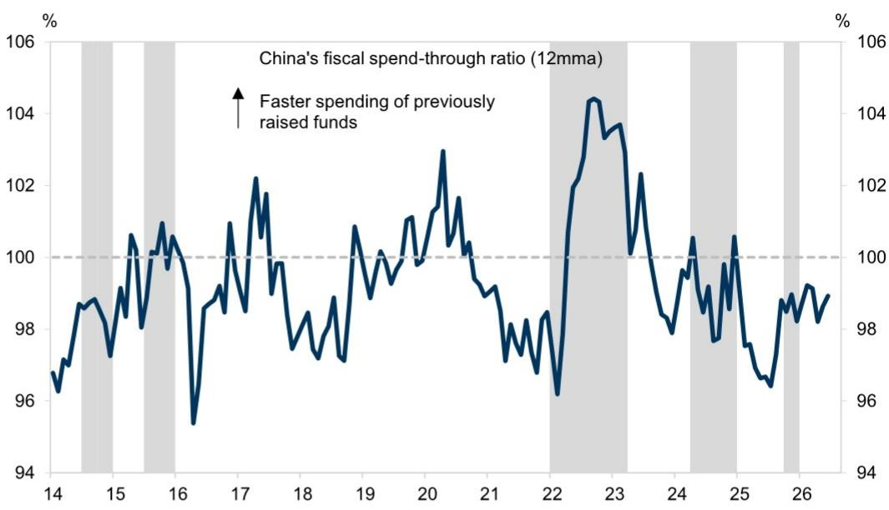  
阴影区域表示中国年初至今实际GDP增长等于或低于全年增长目标的时期。注：2020年中国政府未设定全国增长目标。  
来源：财政部、Wind、CEIC、研究机构

图19：政府债券净发行量预计在未来几个月将加快  
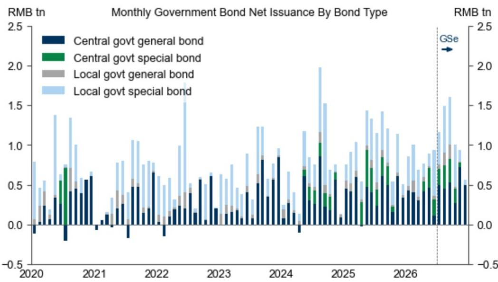  
不包括用于债务化解的地方政府再融资债券发行。  
来源：Wind、CEIC、研究机构

图20：城市层面房地产相对宽松指数显示住房政策持续宽松  
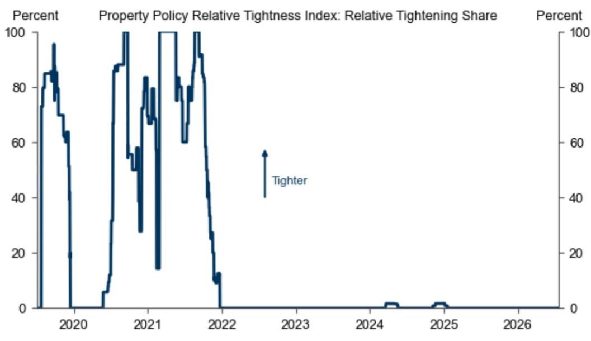  
来源：研究机构、地方政府、搜房网

## 宏观环境观察指标方法说明

1. 图1和图2：当前活动指标（CAI）是多项实际活动指标（包括工业产出、用电量、PMI等）的“第一主成分”，以GDP等价单位表示。这些指标可重新分类，以衡量经济不同领域（制造业、消费及其他，如住房和劳动力市场）的环比动能。

2. 图3：进口隐含的实际国内需求通过中国投入产出表，将各行业进口分配至最终需求的最终来源，从而推断国内需求。国民账户隐含的实际国内需求根据国民账户数据（GDP -（出口 - 进口））估算，作为基于行业进口的国内需求有效性的交叉验证。

3. 图4：MAP惊喜指数汇总了经济指标的重要性和相对于市场预期的强度。随时间汇总MAP，可以考察经济数据在特定时期内是否高于或低于市场预期。

4. 图5：建筑业增长代理指标是房屋新开工、钢材、水泥和玻璃产量同比增速的中位数。制造业增长代理指标是金属切削机床、汽车、发电设备和微型计算机产量同比增速的中位数。

5. 图6：修订后的投资追踪指标基于七项基础投资指标，包括商品需求和产出、设备销售、建筑产出和新建筑合同。数据清洗后，提取第一主成分（解释七个序列总变异的62%），然后映射至固定资本形成总额，以衡量实际增加值基础上的投资。

6. 图7和图8：修订后的库存追踪指标基于六项基础库存指标，包括商品、PMI子指数、工业企业产成品库存和汽车库存。数据清洗后，提取第一主成分（解释六个序列总变异的25%），然后映射为GDP百分比，作为库存变化的追踪指标。

7. 图9和图10：修订后的“外部”贸易指标利用主要贸易伙伴报告的“镜像”统计数据，基于国别领先滞后关系，估算出口和进口增长，作为中国海关贸易数据有效性的交叉验证。

8. 图11和图12：修订后的资金条件指数追踪流动性状况，包括：1）资金指数：AA中票回报表现、3个月SHIBOR、M2和社会融资规模流量；2）市场估值比率；3）贸易加权汇率。因此，FCI的环比变化可通过四个主要渠道（汇率、市场、信贷和利率）归因。

9. 图13：FCI脉冲对增长的估计影响衡量FCI变化对GDP增长的影响。

10. 图14：偏好的资金流动指标追踪外管局月度净外汇销售/结算以及人民币跨境净流动。

11. 图15和图16：国内宏观政策代理指标从四个方面总结国内宏观政策立场：1）财政政策；2）货币政策；3）信贷政策；4）住房政策。

12. 图17：扩大财政赤字指标是有效预算内财政赤字和预算外财政赤字的总和。我们通过为准财政活动融资的主要渠道估算预算外支出，包括新增地方政府专项债券、土地出让收入、地方政府融资平台债券、政策性银行支持、影子银行信贷等。

13. 图18：财政支出比率定义为政府收入、政府债券净发行量和财政存款环比变化等变量的函数，以衡量政策制定者部署从政府收入和债券发行中筹集资金的程度。

14. 图19：政府债券融资追踪指标衡量每月政府债券净发行速度及其按债券类型的细分，包括中央国债、中央特别国债、地方一般债和专项债。我们还根据年度政府债券发行额度、财政政策立场和季节性模式，提供今年剩余时间的月度净发行时间表预测，但这些预测可能会随着更多数据/政策信号的发布而进一步调整。

15. 图20：房地产政策相对宽松指数从以下方面追踪超过100个城市的房地产政策相对宽松程度：1）需求：限购（户籍、社保缴纳等）、信贷限制（按揭利率、首付）、限售；2）供给：限价、预售限制、土地交易税等；3）其他：投机性购房、土地供应。

## 研究团队

（团队成员信息及联系方式略）

## 附录

（披露信息及法律声明略）
