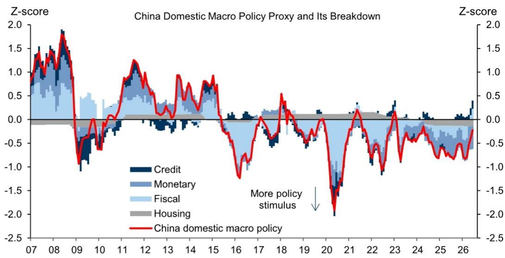
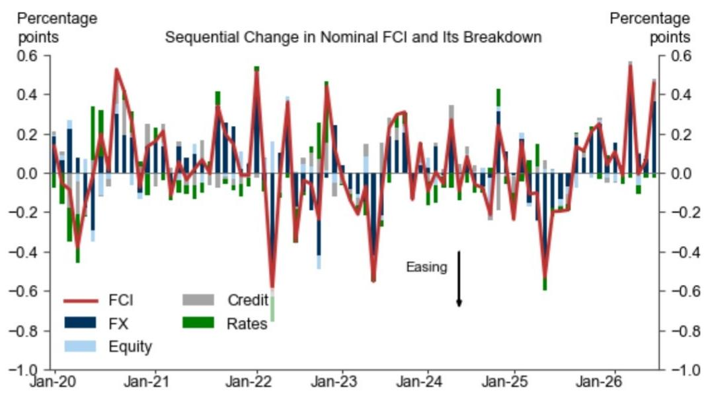

# 宏观环境观察：近期数据背后的结构特征与政策环境

近期宏观活动指标（CAI）显示，6月环比年化增长率为+5.3%，高于5月的+4.2%，表明短期增长动能有所改善。该指标从工业产出、用电量、采购经理指数等实际活动数据中提取主要成分，并以GDP等效单位呈现。观察者可将此视为第二季度增长轨迹的一个积极信号。

然而，增长的结构比总量数字更为重要。6月的改善主要由制造业和消费驱动，而其他组成部分——包括住房和劳动力市场指标——表现相对平稳。这不是一个全面的复苏，而是一个行业集中度较高的改善，其可持续性值得关注。当主要引擎运行较快而辅助系统相对平稳时，出现波动的风险会增加。

与此同时，宏观数据普遍高于预期，但政策环境却在收紧。MAP惊喜指数显示，近期数据在21天移动平均基础上高于市场预期。但中国金融状况指数（FCI）在6月收紧，该指数追踪资金条件、市场估值和贸易加权汇率。信用脉冲——衡量金融条件变化对GDP增长影响的先行指标——今年已转为负值。经济在加速运行，但金融环境的方向正在发生变化。

值得关注的核心问题是：在支撑基础收窄、金融条件收紧以及宏观政策环境趋严的背景下，这种增长能否持续。数据表明，经济表现与政策环境之间存在一定程度的脱节，这是下半年需要关注的主要风险。

## 增长加速背后的结构特征：支撑基础收窄

CAI从环比年化+4.2%升至+5.3%，在统计上是一个有意义的改善。但分解显示了一个关键特征：制造业和消费是6月加速的相对少见驱动因素。“其他”类别——包括住房和劳动力市场指标——贡献了很少的正向动能。这不是一个多元化的扩张。

制造业增长代理指标和建筑业增长代理指标在6月均有所上升。制造业代理指标取金属切削机床、汽车、发电设备和微型计算机的同比增长中位数，显示改善。建筑业代理指标基于新开工面积和钢铁、水泥、玻璃产量的同比增长中位数，也略有上升。这些是实际生产指标，反映了真实的工厂产出和建筑活动。

然而，初步投资追踪指标显示了不同的情况。该指标从七个基础投资指标（包括商品需求、设备销售、建筑产出和新建筑合同）中提取主要成分，表明第二季度实际增加值基础上的增长有所减弱。如果投资在制造业和消费改善的同时走弱，那么增长基础实际上在收窄。

这意味着：增长基础越窄，经济的缓冲能力就越弱。如果制造业需求因外部关税压力、库存调整或全球贸易放缓而减弱，替代行业将难以填补缺口。住房领域仍然是一个制约因素。劳动力市场尚未产生足以独立支撑消费的收入增长。6月的加速虽然是真实的，但也是脆弱的。

## 进口隐含的国内需求：第二季度仍显温和

报告中最具揭示性的指标之一是进口隐含的实际国内需求代理指标。该指标利用中国的投入产出表，将所有进口按行业分配到最终需求的最终来源。它提供了对国民账户中国内需求估计的交叉验证。该代理指标表明，第二季度国内需求增长仍然温和。

这是一个重要的差异。如果制造业和消费推动CAI走高，但进口隐含的国内需求较弱，那么推动CAI的消费可能更多与库存补充或出口导向型生产有关，而非来自中国家庭和企业的真实最终需求。库存追踪指标强化了这一解读。修订后的库存追踪指标基于六个基础指标（包括商品、PMI子指数、工业企业产成品库存和汽车库存），表明第二季度库存水平可能有所增加。

库存驱动的增长本质上不如需求驱动的增长可持续。当公司预期未来需求或生产超过销售时，它们会积累库存。如果是后者，当公司最终削减生产以匹配实际需求时，库存积累就会成为拖累。外部贸易指标（利用主要贸易伙伴的镜像统计数据估算中国的出口和进口增长）与5月的官方海关数据基本一致。这表明贸易数据并非扭曲的来源。疲软的是国内最终需求。

这意味着CAI的消费部分可能高估了消费经济的健康状况。从进口模式推断，中国家庭的实际支出能力并未像生产数据所显示的那样快速反弹。任何依赖中国持续消费驱动复苏的观察，都应谨慎看待这一证据。

## 金融条件与信用脉冲：未来几个季度的环境变化

FCI在6月收紧，分解显示收紧主要由人民币对贸易加权篮子升值驱动。FCI通过四个渠道追踪流动性状况：融资指数（AA级中期票据回报表现、3个月SHIBOR、M2和社会融资规模流量）、市场市盈率、贸易加权人民币和信用数量。外汇渠道是主要的收紧因素。

这是一个看似矛盾的发展。人民币走强通常与资本流入和信心相关。但在当前经济结构背景下，贸易加权升值起到了收紧作用，因为它降低了出口导向型制造业的竞争力，而这正是推动CAI加速的行业。因此，金融条件收紧与制造业主导的增长动能直接相悖。

更值得关注的是信用脉冲。报告估计，由于信用增长疲弱，今年信用脉冲已转为负值。该估算假设信用投放在今年剩余时间保持不变。如果信用增长仍然疲弱，负脉冲将持续。信用脉冲衡量金融条件变化对GDP增长的影响。负脉冲意味着金融系统正在减少对实体经济的支持，即使信用水平在相对量上仍在增长。

FCI收紧和负信用脉冲共同表明，在经济需要持续支持以将复苏范围扩大到制造业之外的时候，货币和信用环境正变得不那么宽松。这不是一个危机情景。金融条件在相对意义上并非紧缩。但方向是不利的，且势头正在对当前增长驱动因素形成压力。

## 宏观政策环境：6月进一步趋紧

中国国内宏观政策代理指标（综合财政、货币、信用和住房维度的政策立场）在6月进一步收紧。收紧主要由财政政策驱动。扩大财政赤字（AFD）指标——汇总有效预算内财政赤字和预算外财政赤字（包括新增地方政府专项债券、土地出让收入、地方政府融资平台债券、政策性银行支持和影子银行贷款）——在6月进一步收窄。

这是一个重要的发展。AFD收窄意味着来自所有来源（预算内和预算外）的综合财政脉冲正在收缩。财政“支出率”指标（衡量政策制定者部署从政府收入和债券发行中筹集的资金的程度）在6月上升。这是一个积极信号：表明已经筹集的资金正在更有效地使用。但由于赤字本身在收窄，整体资金池正在缩小。

政府债券融资追踪指标显示，根据年度配额、财政政策立场和季节性模式，未来几个月的净发行量将加速。如果新发行债券的资金能迅速支出，这种加速可能会逆转AFD的收紧。历史模式表明，当实际GDP增长率处于或低于全年目标时，支出率往往会上升。如果下半年增长不及预期，财政支出可能会加速。

住房政策相对紧缩指数（追踪超过100个城市的政策，包括限购、限贷、限售和供给侧措施）显示持续宽松。这是政策方向与总体宏观立场相反的一个领域。住房宽松可能部分抵消财政收紧，但房地产行业的响应能力受到结构性因素（人口结构、开发商资产负债表和购房者信心）的制约，仅靠政策宽松无法迅速解决。

## 观察框架：如何理解不同信号

这些指标呈现了一系列需要结构化解读的信号。可以从三个维度评估数据：动能、结构和政策一致性。

首先，使用CAI和MAP惊喜指数评估动能。CAI显示正向的短期动能。MAP惊喜指数显示数据超出预期。这些都是明确的积极信号。经济在短期内增长快于预期。

其次，通过比较CAI的行业分解与投资追踪指标、进口隐含的国内需求代理指标和库存追踪指标来评估结构。如果CAI由制造业和消费驱动，但投资追踪指标走弱、进口隐含需求疲软且库存正在积累，那么增长是狭窄且可能由库存驱动的。这会降低对可持续性的信心。

第三，通过比较FCI、信用脉冲、宏观政策代理指标和AFD的方向来评估政策一致性。如果这四个指标都在收紧或转为负值，而经济在加速，则存在政策与经济之间的差异。差异可能持续数月，但最终会通过政策宽松或经济调整来解决。关键问题是哪种调整机制将占主导。

当前的配置表明，经济动能是积极的但脆弱，结构狭窄，政策环境正变得不那么支持。应关注8月和9月的数据发布，以观察CAI是否能在没有政策响应的情况下维持其加速。如果CAI在FCI保持紧缩且信用脉冲保持负值的情况下减速，那么政策宽松（尤其是财政宽松）的理由将增强。如果CAI继续加速，当前的政策立场可能持续，但随着库存周期转变和金融条件继续收紧，今年晚些时候出现突然放缓的风险将增加。

未来几个月最重要的单一指标是信用脉冲。它是一个领先信号。历史上，持续多个季度的负信用脉冲与经济调整相关。如果它在第三季度仍然为负，那么第四季度增长放缓的概率将显著上升，无论CAI在短期内显示什么。

*仅供参考。部分内容可能基于源材料通过AI辅助生成、翻译、总结或编辑，可能存在遗漏或错误。请独立核实。本文不构成专业建议。*
