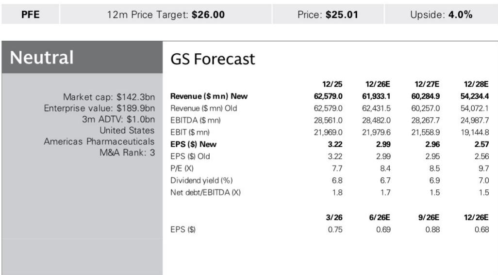
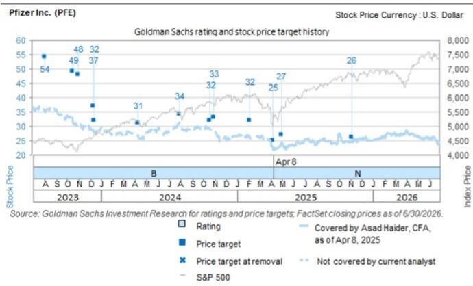

# GS：辉瑞业务与季度数据观察

辉瑞即将于8月4日发布2Q26财报。GS在最新报告中指出，市场对这份财报的预期已相对充分，真正决定报价方向的因素，正从季度业绩转向下半年两项关键临床数据读出——尤其是前列腺癌药物mevrometostat的3期试验结果。在估值处于历史低位（2027年市盈率8.75倍，远低于制药同业均值14.5倍）的背景下，辉瑞报价年内仅上涨0.4%，而同类指数DRG上涨10%。CFO离职与近期管线挫折进一步压制了市场情绪。

## 1. 2Q26业绩预期整体持平，新冠产品构成主要影响

GS预计辉瑞2Q26总收入145.61亿美元，略高于市场共识143.78亿美元，差异主要来自Eliquis和Padcev等核心产品的超预期表现。但新冠产品线是明确的影响项：Paxlovid预计收入1.45亿美元，低于市场共识的1.61亿美元，降幅约10%。GS指出，新冠感染率和废水病毒活性数据仍处低位，处方量同比下降77%、环比下降72%。公司此前对2026全年新冠产品线给出了50亿美元的指引，而GS和市场的预期分别为41亿和45亿美元，差距意味着管理层可能面临下调不确定性。

> **KC评论：** 新冠产品指引是本次财报电话会最值得关注的数字之一。如果管理层维持50亿美元目标，市场会追问依据；如果下调，则可能触发对整体收入预期的重新校准。GS认为，即便其他产品表现稳健，新冠影响也足以抵消管理层在1Q电话会上提到的“收入指引存在上行空间”的说法。

## 2. 产品层面存在多重同比逆风，部分品种面临结构性不确定性

与2025年2季度相比，辉瑞多个产品面临一次性因素消退后的同比不确定性。GS列出了四个主要逆风：Seagen系列产品（Padcev、Adcetris、Tukysa、Tivdak）在2025年2季度因批发商转换获得约2-3周的额外销售；Paxlovid在2025年2季度有有利的返利计提；Xeljanz在2025年2季度有美国一次性有利调整；Abrysvo在2025年2季度有美国净销售额调整。

此外，Xeljanz美国专利已于2026年6月初到期，2季度处方量同比下降16%、环比下降5%。Vyndaqel/Vyndamax的处方量增速从1季度的15%节奏变化至2季度的6%，竞争不确定性导致净价格持续承压。但Eliquis和Padcev是亮点：GS预计Eliquis全年收入87亿美元，高于市场共识83亿美元，部分受益于2026年3季度开始生效的净定价优势；Padcev则受益于EV-303和EV-304适应症的持续放量，GS预计全年收入27亿美元，高于市场共识25亿美元。

## 3. CFO过渡期与资本配置框架成为市场关注焦点

6月18日，辉瑞宣布CFO Dave Denton将于8月15日离职，由Cecile Guegan担任临时CFO。GS在2季度业绩前的公司沟通中了解到，新任CFO的财务理念与前任相似，指引哲学预计维持现状。但市场对管理层是否会借2季度业绩上调全年指引存在分歧——1季度电话会上管理层曾提及“收入指引存在上行空间”，但CFO过渡可能使管理层更倾向于保守。

资本配置方面，在完成与信达生物的全球许可合作后（预计3季度产生6.5亿美元里程碑付款），辉瑞剩余BD能力约70亿美元。公司仍聚焦于核心治疗领域的小型补强交易，但管理层表示若出现有吸引力的机会，也有灵活性进行更大规模交易。股息是另一个市场辩论焦点：2025年辉瑞股息支付占自由现金流（扣除资本支出后）的108%，而欧美制药同业中位数为64%。当前约7%的股息回报表现对报价形成一定支撑，但GS认为，在CFO过渡期间，管理层对股息的表述将受到密切关注。

## 4. MEVPRO-1数据读出：下半年最重要的报价催化剂

GS认为，mevrometostat（EZH2抑制剂）在转移性去势抵抗性前列腺癌（mCRPC）中的3期试验MEVPRO-1，是辉瑞下半年最重要的临床催化剂。该试验主要完成日期为2026年7月，预计在2H26读出数据。在Sig Vedotin在2L NSCLC遭遇挫折后，MEVPRO-1已成为辉瑞仅剩的两个重大临床催化剂之一（另一个是GLP-1/Amylin组合的1/2期数据）。

mCRPC市场规模超过110亿美元，涉及darolutamide、apalutamide和enzalutamide等药物。从战略角度看，mevrometostat若成功上市，将延续辉瑞的Xtandi前列腺癌特许经营权——该产品2025年为辉瑞美国业务贡献22亿美元收入，美国物质专利将于2027年8月到期。

GS对MEVPRO-1的统计门槛持乐观态度。在1期剂量扩展研究中，mevrometostat 875mg BID随餐服用联合enzalutamide 160mg QD，在既往接受过abiraterone治疗的患者中显示中位rPFS为14.3个月，PSA50应答率为40%；在enzalutamide初治患者中，中位PFS尚未达到，PSA50为42.9%。作为参照，已获批药物Pluvicto在mCRPC患者中的中位PFS为11.6个月。GS指出，医生选择方案（Xtandi或多西他赛）的历史中位PFS约为6-8个月，因此mevrometostat的统计门槛是可达的，但对照组表现和交叉设计是关键变量。

> **KC评论：** GS测算，mevrometostat数据每带来0.25倍市盈率变动，对应约3%的报价波动。考虑到当前市场对辉瑞管线的低容忍度，一个阳性结果可能触发更大程度的情绪修复——不仅是估值倍数扩张，还可能改变市场对辉瑞研发能力的整体判断。反之，若数据不及预期，在当前低估值背景下，节奏变化空间可能同样有限，但会进一步削弱读者对管线的信心。

GS对辉瑞更新公司观点，基于9.0倍市盈率对2026-2029年调整后EPS的估值。当前报价25.01美元，隐含约4%的上行空间。2026/2027/2028年EPS预测分别为2.99/2.96/2.57美元。

For informational purposes only. Portions may be generated,translated,summarized,or edited with AI assistance based on source materials and may contain omissions or errors. Please verify independently. This is not investment,legal,tax,accounting,or other professional advice.

For informational purposes only. Portions may be generated,translated,summarized,or edited with AI assistance based on source materials and may contain omissions or errors. Please verify independently. This is not investment,legal,tax,accounting,or other professional advice.

