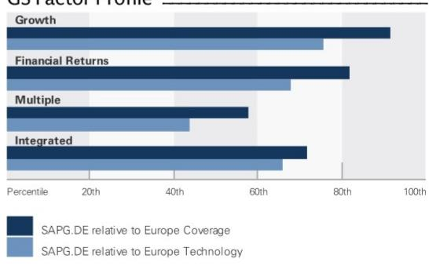
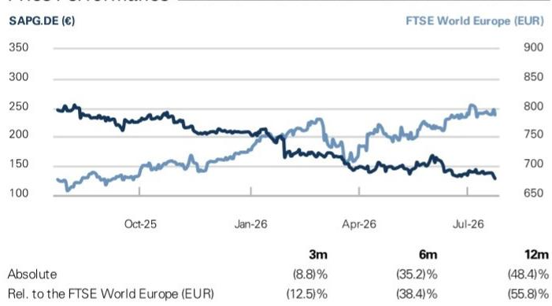
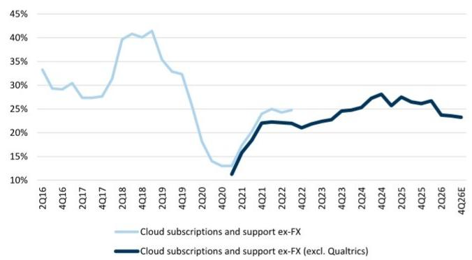
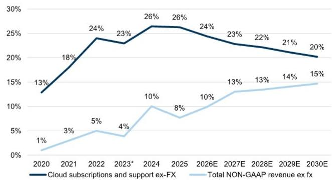
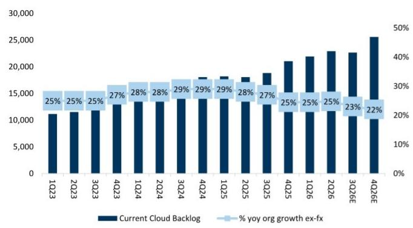
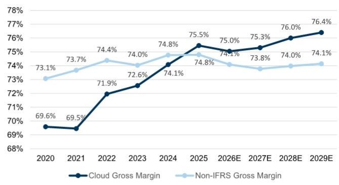

# SAP (SAPG.DE)

# 稳健的CCB和强劲的管道，尽管宏观环境存在不确定性；调整EBIT假设；重申积极看法

<table><tr><td>SAPG.DE</td><td>12个月目标价: €215.00</td><td>当前价: €128.32</td><td>潜在空间: 67.5%</td></tr><tr><td>SAP</td><td>12个月目标价: $245.00</td><td>当前价: $146.38</td><td>潜在空间: 67.4%</td></tr></table>

我们重申对SAP的积极看法。在2Q26之后，尽管宏观环境存在不确定性，公司再次展现了CCB的韧性。展望未来，我们预计市场讨论将围绕FY26全年CCB的走势展开，管理层重申其预期CCB将在FY26全年略有放缓。然而，我们认为1H26的增长表现，加上SAPPHIRE大会后管道跟踪情况好于预期，为下半年云业务增长提供了更高的可见性。考虑到指引未变，我们认为这一增长在很大程度上风险已降低。虽然我们承认运营支出增加和收购带来的稀释效应对营业利润构成一定影响，但我们仍看到SAP在向AI消费模式转型的过程中，有潜力在其运营支出中释放结构性成本效率。总体而言，我们继续预期SAP将凭借其独特产品周期的韧性而表现优于同行，并等待未来几个季度在自主企业和商业AI平台推出后，关于AI采用和变现的验证点。

我们更新了汇率影响下的预测，这将对收入构成约30个基点的增量影响。我们继续预测FY26全年（不含CCB）的有机同比增长（扣除汇率影响）为+22%。我们小幅上调FY26全年云收入预测至同比增长24.4%（扣除汇率影响）（此前为24.0%），同时将FY26全年EBIT增长预测小幅下调至同比增长14.5%（扣除汇率影响）（此前为14.8%），这反映了较低的云毛利率和略高的运营支出，略低于指引中点。我们也小幅下调了FY27的EBIT增长预测，后续年份保持不变。根据我们的预测，SAP目前CY27E的EV/经常性收入、P/E和EV/FCF分别约为4倍、15倍和13倍，对应FY26-30年经常性收入、EPS和FCF的CAGR分别约为15%、22%和17%。我们重申积极看法，12个月目标价为€215（ADR $245）。

## 积极看法

Mohammed Moawalla
+44(20)7774-1726 | mohammed.moawalla@gs.com
GS International

Deepshikha Agarwal
+1(212)934-6961 | deepshikha.agarwal@gs.com
GS India SPL

Uzair Merchant
+44(20)7774-7645 | uzair.merchant@gs.com
GS International

## 关键数据

GS预测

<table><tr><td colspan="5">GS预测</td></tr><tr><td></td><td>12/25</td><td>12/26E</td><td>12/27E</td><td>12/28E</td></tr><tr><td>收入 (€ mn) 新</td><td>36,800.0</td><td>40,452.5</td><td>45,724.3</td><td>51,872.4</td></tr><tr><td>收入 (€ mn) 旧</td><td>36,800.0</td><td>40,329.9</td><td>45,446.3</td><td>51,528.2</td></tr><tr><td>EBIT (€ mn)</td><td>9,830.0</td><td>11,356.4</td><td>13,374.0</td><td>16,186.0</td></tr><tr><td>EPS (€) 新</td><td>6.29</td><td>7.26</td><td>8.65</td><td>10.57</td></tr><tr><td>EPS (€) 旧</td><td>6.29</td><td>7.01</td><td>8.70</td><td>10.61</td></tr><tr><td>EV/销售额 (X)</td><td>7.8</td><td>3.6</td><td>3.0</td><td>2.4</td></tr><tr><td>EV/EBITDA (X)</td><td>25.6</td><td>11.6</td><td>9.3</td><td>7.2</td></tr><tr><td>P/E (X)</td><td>38.6</td><td>17.7</td><td>14.8</td><td>12.1</td></tr><tr><td>有机销售增长率 (%)</td><td>10.1</td><td>10.6</td><td>12.2</td><td>13.4</td></tr><tr><td></td><td>3/26</td><td>6/26</td><td>9/26E</td><td>12/26E</td></tr><tr><td>EPS (€)</td><td>1.66</td><td>1.88</td><td>1.79</td><td>1.93</td></tr></table>

GS因子概况

  
来源：公司数据，GS预测。详情请参阅披露。

积极看法

SAP (SAPG.DE) 自2011年1月28日起评级

比率与估值

<table><tr><td></td><td>12/25</td><td>12/26E</td><td>12/27E</td><td>12/28E</td></tr><tr><td>EV/销售额 (X)</td><td>7.8</td><td>3.6</td><td>3.0</td><td>2.4</td></tr><tr><td>EV/EBITDAR (X)</td><td>25.6</td><td>11.6</td><td>9.3</td><td>7.2</td></tr><tr><td>EV/EBIT (X)</td><td>29.1</td><td>12.9</td><td>10.2</td><td>7.8</td></tr><tr><td>P/E (调整后) (X)</td><td>35.1</td><td>15.2</td><td>12.8</td><td>10.7</td></tr><tr><td>EV/FCF (X)</td><td>34.6</td><td>14.2</td><td>12.0</td><td>9.4</td></tr><tr><td>自由现金流 (€ mn)</td><td>8,263.5</td><td>10,271.5</td><td>11,410.0</td><td>13,516.9</td></tr><tr><td>FCF回报表现 (%)</td><td>2.9</td><td>6.9</td><td>8.0</td><td>9.5</td></tr><tr><td>净债务 (€ mn)</td><td>(147.5)</td><td>(2,650.1)</td><td>(6,043.7)</td><td>(15,557.5)</td></tr><tr><td>净债务/EBITDA (X)</td><td>(0.0)</td><td>(0.2)</td><td>(0.4)</td><td>(0.9)</td></tr><tr><td>股息回报表现 (%)</td><td>1.0</td><td>2.1</td><td>2.2</td><td>2.4</td></tr><tr><td>资本支出/销售额 (X)</td><td>2.0</td><td>2.0</td><td>1.9</td><td>1.8</td></tr></table>

增长与利润率 (%)

<table><tr><td colspan="5">增长与利润率 (%)</td></tr><tr><td></td><td>12/25</td><td>12/26E</td><td>12/27E</td><td>12/28E</td></tr><tr><td>总收入增长</td><td>7.7</td><td>9.9</td><td>13.0</td><td>13.4</td></tr><tr><td>有机销售增长</td><td>10.1</td><td>10.6</td><td>12.2</td><td>13.4</td></tr><tr><td>EBITDA增长</td><td>87.4</td><td>13.4</td><td>16.2</td><td>19.2</td></tr><tr><td>EBIT增长</td><td>110.8</td><td>15.5</td><td>17.8</td><td>21.0</td></tr><tr><td>营业利润率 (调整后)</td><td>32.9</td><td>33.2</td><td>33.8</td><td>35.2</td></tr><tr><td>EPS增长</td><td>137.2</td><td>15.4</td><td>19.3</td><td>22.1</td></tr><tr><td>EPS (调整后) 增长</td><td>20.0</td><td>22.3</td><td>18.3</td><td>19.2</td></tr></table>

价格表现  
  
来源：FactSet。价格截至2026年7月23日收盘。

利润表 (€ mn)

<table><tr><td colspan="5">利润表 (€ mn)</td></tr><tr><td></td><td>12/25</td><td>12/26E</td><td>12/27E</td><td>12/28E</td></tr><tr><td>总收入</td><td>36,800.0</td><td>40,452.5</td><td>45,724.3</td><td>51,872.4</td></tr><tr><td>总运营支出</td><td>(20,286.0)</td><td>(21,754.8)</td><td>(23,972.9)</td><td>(26,269.9)</td></tr><tr><td>研发</td><td>(6,633.0)</td><td>(7,286.2)</td><td>(8,377.4)</td><td>(9,416.4)</td></tr><tr><td>其他运营收入/(支出)</td><td>(51.0)</td><td>(55.0)</td><td>-</td><td>-</td></tr><tr><td>EBITDA</td><td>11,140.5</td><td>12,630.7</td><td>14,677.1</td><td>17,493.2</td></tr><tr><td>折旧与摊销</td><td>(1,310.5)</td><td>(1,274.3)</td><td>(1,303.1)</td><td>(1,307.2)</td></tr><tr><td>EBIT</td><td>9,830.0</td><td>11,356.4</td><td>13,374.0</td><td>16,186.0</td></tr><tr><td>营业利润 (调整后)</td><td>12,112.0</td><td>13,445.2</td><td>15,451.4</td><td>18,263.4</td></tr><tr><td>净利息收入/(支出)</td><td>533.0</td><td>460.1</td><td>225.0</td><td>300.0</td></tr><tr><td>来自联营公司的收入/(亏损)</td><td>0.0</td><td>0.0</td><td>0.0</td><td>-</td></tr><tr><td>其他净额合计</td><td>118.0</td><td>(15.9)</td><td>-</td><td>-</td></tr><tr><td>税前利润</td><td>10,481.0</td><td>11,800.6</td><td>13,599.0</td><td>16,486.0</td></tr><tr><td>所得税拨备</td><td>(2,990.0)</td><td>(3,351.2)</td><td>(3,943.7)</td><td>(4,780.9)</td></tr><tr><td>少数股东权益</td><td>(107.0)</td><td>(64.0)</td><td>(40.0)</td><td>(40.0)</td></tr><tr><td>净利润 (扣除非常项目前)</td><td>7,384.0</td><td>8,385.5</td><td>9,615.3</td><td>11,665.1</td></tr><tr><td>税后非常项目</td><td>744.3</td><td>1,401.0</td><td>1,515.0</td><td>1,515.0</td></tr><tr><td>净利润 (扣除非常项目后)</td><td>8,128.3</td><td>9,786.5</td><td>11,130.2</td><td>13,180.0</td></tr><tr><td>EPS (基本, 扣除非常项目前) (€)</td><td>6.29</td><td>7.26</td><td>8.65</td><td>10.57</td></tr><tr><td>EPS (调整后) (€)</td><td>6.92</td><td>8.47</td><td>10.02</td><td>11.94</td></tr><tr><td>加权平均流通股数 (基本) (mn)</td><td>1,174.0</td><td>1,155.6</td><td>1,111.0</td><td>1,104.1</td></tr><tr><td>税率 (%)</td><td>28.5</td><td>28.4</td><td>29.0</td><td>29.0</td></tr><tr><td>已宣告普通股股息</td><td>2,938.8</td><td>3,186.5</td><td>3,173.0</td><td>3,406.2</td></tr><tr><td>每股股息 (€)</td><td>2.50</td><td>2.76</td><td>2.86</td><td>3.09</td></tr><tr><td>股息支付率 (%)</td><td>39.8</td><td>38.0</td><td>33.0</td><td>29.2</td></tr><tr><td>有机销售增长率 (%)</td><td>10.1</td><td>10.6</td><td>12.2</td><td>13.4</td></tr></table>

<table><tr><td colspan="5">资产负债表 (€ mn)</td></tr><tr><td></td><td>12/25</td><td>12/26E</td><td>12/27E</td><td>12/28E</td></tr><tr><td>现金及现金等价物</td><td>8,218.5</td><td>9,621.1</td><td>11,920.7</td><td>20,340.5</td></tr><tr><td>应收账款</td><td>6,675.0</td><td>8,256.7</td><td>9,407.9</td><td>10,672.9</td></tr><tr><td>存货</td><td>-</td><td>-</td><td>-</td><td>-</td></tr><tr><td>其他流动资产</td><td>5,362.0</td><td>5,362.0</td><td>5,362.0</td><td>5,362.0</td></tr><tr><td>流动资产合计</td><td>20,255.5</td><td>23,239.9</td><td>26,690.6</td><td>36,375.4</td></tr><tr><td>不动产、厂房及设备净额</td><td>4,497.0</td><td>4,104.6</td><td>4,037.6</td><td>4,031.5</td></tr><tr><td>无形资产净额</td><td>31,296.0</td><td>31,296.0</td><td>31,296.0</td><td>(4,411.0)</td></tr><tr><td>总投资</td><td>7,269.0</td><td>7,269.0</td><td>7,269.0</td><td>7,269.0</td></tr><tr><td>其他长期资产</td><td>7,044.0</td><td>6,146.2</td><td>6,282.6</td><td>2,042.1</td></tr><tr><td>资产总计</td><td>70,361.5</td><td>72,055.7</td><td>75,575.8</td><td>45,307.0</td></tr><tr><td>应付账款</td><td>2,432.5</td><td>2,659.9</td><td>3,006.5</td><td>3,410.8</td></tr><tr><td>短期债务</td><td>-</td><td>-</td><td>-</td><td>-</td></tr><tr><td>短期租赁负债</td><td>-</td><td>-</td><td>-</td><td>-</td></tr><tr><td>其他流动负债</td><td>7,895.0</td><td>9,124.9</td><td>9,994.6</td><td>10,943.0</td></tr><tr><td>流动负债合计</td><td>10,327.5</td><td>11,784.7</td><td>13,001.1</td><td>14,353.7</td></tr><tr><td>长期债务</td><td>8,071.0</td><td>6,971.0</td><td>5,877.0</td><td>4,783.0</td></tr><tr><td>长期租赁负债</td><td>-</td><td>-</td><td>-</td><td>-</td></tr><tr><td>其他长期负债</td><td>-</td><td>-</td><td>-</td><td>-</td></tr><tr><td>长期负债合计</td><td>14,795.0</td><td>14,751.2</td><td>14,458.1</td><td>14,375.8</td></tr><tr><td>负债合计</td><td>25,122.5</td><td>26,535.9</td><td>27,459.3</td><td>28,729.6</td></tr><tr><td>优先股</td><td>--</td><td>--</td><td>--</td><td>--</td></tr><tr><td>普通股权益合计</td><td>44,752.0</td><td>45,032.8</td><td>47,629.6</td><td>16,090.5</td></tr><tr><td>少数股东权益</td><td>487.0</td><td>487.0</td><td>487.0</td><td>487.0</td></tr><tr><td>负债及权益总计</td><td>70,361.5</td><td>72,055.7</td><td>75,575.8</td><td>45,307.0</td></tr><tr><td>未备基金养老金及商誉调整</td><td>-</td><td>-</td><td>-</td><td>-</td></tr><tr><td>GCI, 名义 (扣除现金)</td><td>57,786.9</td><td>58,720.4</td><td>59,524.0</td><td>24,663.1</td></tr></table>

<table><tr><td colspan="5">现金流量表 (€ mn)</td></tr><tr><td></td><td>12/25</td><td>12/26E</td><td>12/27E</td><td>12/28E</td></tr><tr><td>净利润</td><td>7,385.0</td><td>8,385.5</td><td>9,615.3</td><td>11,665.1</td></tr><tr><td>加回折旧与摊销</td><td>2,188.5</td><td>2,403.5</td><td>2,450.6</td><td>2,454.7</td></tr><tr><td>加回少数股东权益</td><td>107.0</td><td>64.0</td><td>40.0</td><td>40.0</td></tr><tr><td>营运资本净变动</td><td>(888.0)</td><td>606.5</td><td>172.9</td><td>290.8</td></tr><tr><td>其他运营现金流</td><td>210.0</td><td>(379.0)</td><td>0.0</td><td>0.0</td></tr><tr><td>经营活动现金流</td><td>9,002.5</td><td>11,080.5</td><td>12,278.8</td><td>14,450.6</td></tr><tr><td>资本支出</td><td>(739.0)</td><td>(809.0)</td><td>(868.8)</td><td>(933.7)</td></tr><tr><td>收购</td><td>(702.0)</td><td>-</td><td>-</td><td>-</td></tr><tr><td>剥离</td><td>-</td><td>-</td><td>-</td><td>-</td></tr><tr><td>其他</td><td>55.0</td><td>170.0</td><td>170.0</td><td>170.0</td></tr><tr><td>投资活动现金流</td><td>(1,386.0)</td><td>(639.0)</td><td>(698.8)</td><td>(763.7)</td></tr><tr><td>偿还租赁负债</td><td>-</td><td>-</td><td>-</td><td>-</td></tr><tr><td>已支付股息 (普通股及优先股)</td><td>(2,743.0)</td><td>(2,938.8)</td><td>(3,186.5)</td><td>(3,173.0)</td></tr><tr><td>债务增加/(减少)</td><td>(3,488.0)</td><td>(1,100.0)</td><td>(1,094.0)</td><td>(1,094.0)</td></tr><tr><td>其他融资现金流</td><td>(1,939.0)</td><td>(5,000.0)</td><td>(5,000.0)</td><td>(1,000.0)</td></tr><tr><td>融资活动现金流</td><td>(8,170.0)</td><td>(9,038.8)</td><td>(9,280.5)</td><td>(5,267.0)</td></tr><tr><td>现金净流量</td><td>(1,389.5)</td><td>1,402.6</td><td>2,299.6</td><td>8,419.8</td></tr></table>

来源：公司数据，GS预测。

## 尽管宏观环境不确定，S/4 HANA产品周期仍具韧性；CCB预计在FY26全年略有放缓

在2Q26，SAP报告的CCB同比增长26%（扣除汇率影响）（有机增长约25%），高于GSe和市场预期的25%/24%，尽管宏观环境存在不确定性，但环比保持稳定，这得益于云ERP套件的持续强劲表现。管理层还强调了其自主套件和商业AI平台的增长势头，使得SAPPHIRE大会后的管道覆盖情况有所改善。

展望未来，管理层重申了其收入指标的指引，并继续预计CCB在FY26全年将略有放缓，同时指出鉴于宏观环境的变化，下半年的结果区间仍然较大。尽管如此，管理层指出SAPPHIRE大会后的管道跟踪情况好于预期，覆盖情况较去年同期有所改善，并且管理层对实现全年指引充满信心，因为进入本年度第七个月，云收入的可预测性有所提高。我们保持审慎，在我们的预测中假设CCB（扣除汇率影响）将放缓约200个基点，预计有机增长（扣除汇率影响）约为22%。在云收入方面，我们小幅上调FY26全年预测至同比增长24.4%（扣除汇率影响）（此前为24.0%），这反映了更好的许可和订阅收入。

Non-IFRS EBIT略低于预期（比GSe/市场预期低2%/5%），同比增长9%（扣除汇率影响）。环比放缓是由于云增长放缓、SBC高于预期（扭转了1Q的低SBC）、研发投入增加（部分反映了针对AI人才的高人均成本招聘）、围绕自主企业发布的销售与营销支出，以及Reltio的稀释影响。SAP还强调了内部AI采用带来的效率提升，并计划在未来12个月内放缓招聘，以实现其中期约€20亿的效率提升目标。管理层预计下半年营业利润增长将与上半年中双位数的增长水平相似。

SAP更新了其FY26全年营业利润展望至€118-122亿（此前为€119-123亿），反映了Dremio和Prior Labs收购的稀释影响（下半年约€1亿）。我们小幅下调FY26全年Non-IFRS（含SBC）EBIT增长预测至同比增长14.5%（扣除汇率影响）（此前为14.8%），略低于指引中点，并继续预期中期内EBIT（扣除汇率影响）将实现双位数增长（GSe预测FY26-30年利润率扩张约80-180个基点）。

图表1：我们认为S/4 HANA产品周期升级的核心驱动因素依然稳健
SAP收入 (€ mn)，股价走势 (1997-2024)  
  
来源：公司数据，GS全球研究

图表2：我们预计FY26全年云增长势头将持续...
云增长同比 (扣除汇率影响) 及云增长同比 (扣除汇率影响，不含Qualtrics)  
  
来源：公司数据，GS全球研究

图表3：...随后增长趋于稳定...
云及总收入增长，% 同比 (扣除汇率影响)  
  
\*2023年为预估的不含Qualtrics的增长  
来源：公司数据，GS全球研究

图表4：...得益于稳健的CCB增长（2Q26有机同比增长+25%，扣除汇率影响），尽管FY26全年预计略有放缓
当前云积压订单，€ mn  
  
来源：公司数据，GS全球研究

## 图表5：我们预计毛利率改善将趋于正常化

云毛利率 % vs 总Non-IFRS毛利率 %

  
来源：公司数据，GS全球研究

## 预测调整

我们更新了汇率影响下的预测，这将对收入构成约30个基点的增量影响。我们继续预测FY26全年（不含CCB）的有机同比增长（扣除汇率影响）为+22%。我们小幅上调FY26全年云收入预测至同比增长24.4%（扣除汇率影响）（此前为24.0%），同时将FY26全年EBIT增长预测小幅下调至同比增长14.5%（扣除汇率影响）（此前为14.8%），这反映了较低的云毛利率和略高的运营支出，略低于指引中点。我们也小幅下调了FY27的EBIT增长预测，后续年份保持不变。

我们重申积极看法，新的12个月目标价从€230调整为€215（ADR目标价从US\$271调整为US\$245）。我们的目标价现在基于约22倍3Q27-2Q28E P/E，而此前为约24倍2Q27-1Q28E P/E。

图表6：新旧预测对比 € mn，每股数据除外

<table><tr><td>截至12月</td><td>2026E 旧</td><td>2026E 新</td><td>% 变动</td><td>2027E 旧</td><td>2027E 新</td><td>% 变动</td><td>2028E 旧</td><td>2028E 新</td><td>% 变动</td><td>2029E 旧</td><td>2029E 新</td><td>% 变动</td><td>2030E 旧</td><td>2030E 新</td><td>% 变动</td></tr><tr><td>当前云积压订单</td><td>25,509</td><td>25,595</td><td>0%</td><td>31,240</td><td>31,440</td><td>1%</td><td>38,113</td><td>38,357</td><td>1%</td><td>46,308</td><td>46,603</td><td>1%</td><td>56,264</td><td>56,623</td><td>1%</td></tr><tr><td>% 同比</td><td>21.2%</td><td>21.6%</td><td></td><td>22.5%</td><td>22.8%</td><td></td><td>22.0%</td><td>22.0%</td><td></td><td>21.5%</td><td>21.5%</td><td></td><td>21.5%</td><td>21.5%</td><td></td></tr><tr><td>% 同比 (扣除汇率影响) 报告</td><td>22.8%</td><td>22.8%</td><td></td><td>22.0%</td><td>22.0%</td><td></td><td>22.0%</td><td>22.0%</td><td></td><td>21.5%</td><td>21.5%</td><td></td><td>21.5%</td><td>21.5%</td><td></td></tr><tr><td>% 同比 (有机, 扣除汇率影响) 报告</td><td>22.0%</td><td>22.0%</td><td></td><td>22.0%</td><td>22.0%</td><td></td><td>22.0%</td><td>22.0%</td><td></td><td>21.5%</td><td>21.5%</td><td></td><td>21.5%</td><td>21.5%</td><td></td></tr><tr><td>许可收入</td><td>645</td><td>666</td><td>3%</td><td>421</td><td>436</td><td>4%</td><td>273</td><td>283</td><td>4%</td><td>178</td><td>184</td><td>4%</td><td>116</td><td>120</td><td>4%</td></tr><tr><td>% 同比</td><td>-34.9%</td><td>-32.7%</td><td></td><td>-34.7%</td><td>-34.5%</td><td></td><td>-35.0%</td><td>-35.0%</td><td></td><td>-35.0%</td><td>-35.0%</td><td></td><td>-35.0%</td><td>-35.0%</td><td></td></tr><tr><td>% 同比 (扣除汇率影响) 报告</td><td>-34.2%</td><td>-32.2%</td><td></td><td>-35.0%</td><td>-35.0%</td><td></td><td>-35.0%</td><td>-35.0%</td><td></td><td>-35.0%</td><td>-35.0%</td><td></td><td>-35.0%</td><td>-35.0%</td><td></td></tr><tr><td>% 同比 (有机, 扣除汇率影响) 报告</td><td>-34.2%</td><td>-32.2%</td><td></td><td>-35.0%</td><td>-35.0%</td><td></td><td>-35.0%</td><td>-35.0%</td><td></td><td>-35.0%</td><td>-35.0%</td><td></td><td>-35.0%</td><td>-35.0%</td><td></td></tr><tr><td>维护</td><td>9,692</td><td>9,718</td><td>0%</td><td>8,872</td><td>8,910</td><td>0%</td><td>7,945</td><td>7,982</td><td>0%</td><td>6,967</td><td>7,001</td><td>0%</td><td>6,027</td><td>6,058</td
