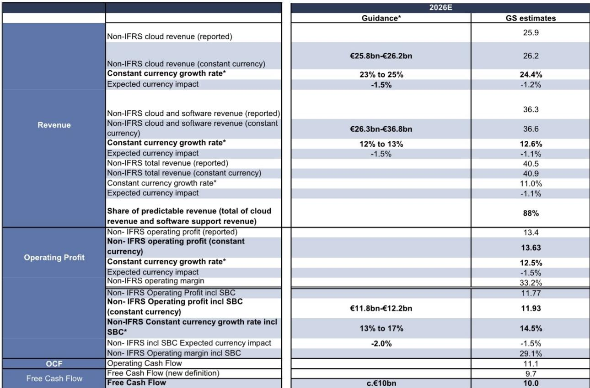
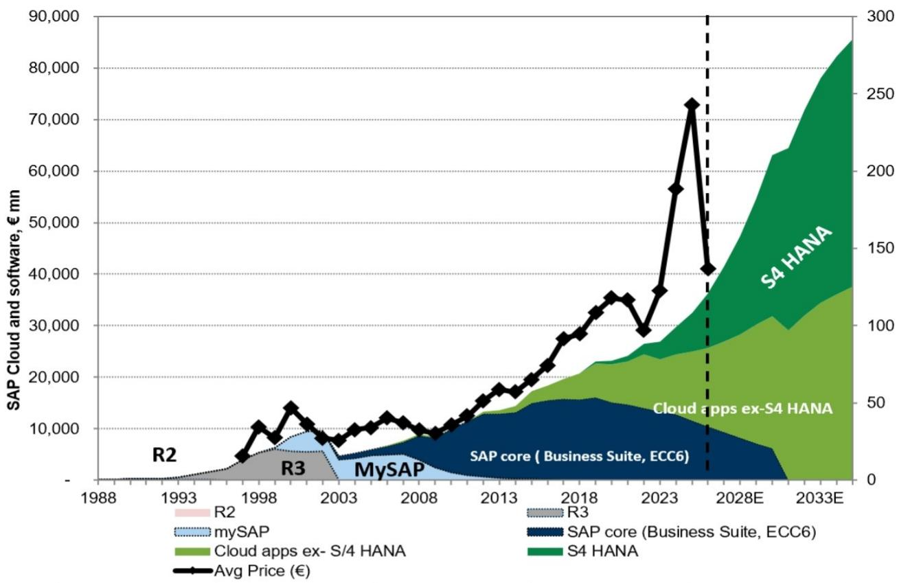
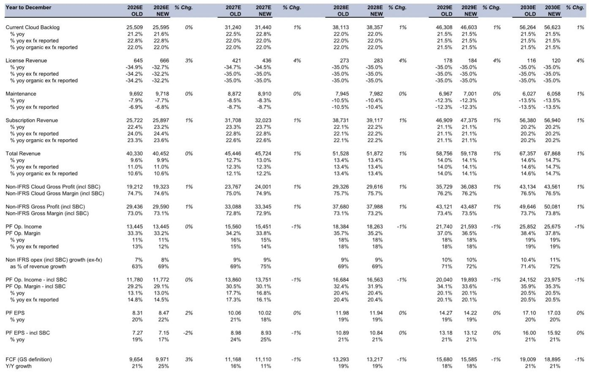

# SAP云业务积压订单比宏观头条所显示的更具韧性，SAPPHIRE大会后的潜在客户管道使下半年增长可见

SAP公布2026年第二季度云业务收入按固定汇率计算同比增长26%，有机增长约25%。这一数字超出了市场普遍预期和多数报告观点分析师的预测，尽管中东局势紧张给企业软件支出决策带来了新的不确定性，但该数据环比保持稳定。公司当前的云业务积压订单（一项衡量已签约但尚未确认收入的远期指标）继续以表明其基础产品周期并未失去动力的速度扩张。

叙述中的张力是显而易见的。管理层已明确指引，在2026财年剩余时间内，云业务积压订单增长将略有放缓，并引用了下半年可能出现的多种结果。然而，春季SAPPHIRE大会后形成的潜在客户管道覆盖情况好于预期，公司目前对其云收入轨迹有七个月的可见性。上半年韧性结果与改善中的管道相结合，形成了一种局面，即全年指引的下行风险低于指引本身谨慎语气所暗示的水平。

关注近期利润状况的观察者则有不同的担忧。第二季度非IFRS营业利润仅同比增长9%，略低于预期。增速放缓反映了股权激励增加、与针对性AI招聘相关的研发支出上升、围绕自主企业平台推出的销售和营销成本，以及近期收购的稀释效应。管理层承认了这些压力，但也指出了内部采用AI带来的效率提升，以及未来十二个月放缓招聘的计划，目标是实现约20亿欧元的结构性成本节约。

战略问题在于，SAP是处于利润率拐点的早期阶段，该拐点将与其云收入增长相结合，还是AI投资和收购整合带来的成本逆风将持续比市场预期更长的时间。2026年上半年的证据支持前一种观点，但前提是云业务积压订单能够按照公司中期目标假设的速率转化为已确认收入。

## 云业务积压订单增长放缓是设计使然，而非疲软，这一区别对市场定价至关重要

SAP第二季度当前云业务积压订单按报告基础同比增长21.6%，按有机固定汇率计算约为22.8%。管理层对2026财年略有放缓的指引意味着第四季度的退出率可能会低于上半年平均水平。但在此背景下，放缓并非需求恶化的信号。这是大数定律作用于过去三年翻了一番多的基数，以及公司有意将组合转向更大、更长期合同（这些合同需要更长时间签署和实施）的战略共同作用的结果。

SAPPHIRE大会后的管道数据支持这一解读。覆盖情况较去年同期有所改善，管理层对实现全年收入指引表达了信心。当一家拥有如此水平企业合同可见性的公司发出管道好于预期的信号时，下半年放缓幅度比指引范围所暗示的更温和的可能性就会显著增加。市场定价反映了全年有机固定汇率云业务积压订单增长约200个基点的放缓，这将意味着第四季度增长率在20%出头的范围。这是一个合理的基线，但风险的不对称性偏向于上行。

出于市场定价目的，区分由需求疲软导致的放缓与由基数效应和合同组合导致的放缓至关重要。在前一种情况下，现金流折现模型中嵌入的终端增长率假设需要下调。在后一种情况下，增长率稳定在比放缓路径最初暗示的更高水平，多年期内的复合效应仍然具有吸引力。当前对SAP的共识预测意味着，从2026财年到2030财年，经常性收入的复合年增长率约为15%。如果云业务积压订单的放缓被证明比模型预测的更浅，那么该复合年增长率可能会趋向于指引范围的上限，而无需竞争环境有任何改善。

## 随着成本逆风逆转，下半年营业利润增长将加速，揭示潜在利润率轨迹

第二季度营业利润未达预期是由三个不太可能在下半年以同样强度重复的离散因素造成的。股权激励扭转了第一季度的低值，并应在今年下半年恢复正常。研发支出包括针对性的AI招聘，其人均成本较高，但这些招聘目前已基本到位，增量成本将趋于缓和。销售和营销费用因SAPPHIRE大会上自主企业平台的推出而升高，这是一个一次性事件，不会每季度重复。

管理层预计，下半年营业利润增长将与上半年合计的中等个位数增长相似。这意味着从第二季度记录的9%增长环比改善，因为上半年数据包含了更强劲的第一季度。计算是成立的。如果上半年合计增长约12%至13%，下半年以类似速度增长，那么全年营业利润增长将落在14%至15%的范围内，与更新后的118亿至122亿欧元非IFRS营业利润指引一致。

更重要的结构性故事是，一旦收购相关的稀释和AI投资周期消退，利润率扩张将变得可见。随着公司扩展其超大规模基础设施并吸收将本地客户迁移到云端的成本，SAP的云业务毛利率一直面临压力。但随着收入基础的增长速度快于基础设施成本基础，这一利润率应会正常化——这种动态通常在云转型的三到四年后出现。SAP目前正处于云加速的第四年，2026年下半年及进入2027年的毛利率轨迹应开始反映经营杠杆。

通过内部采用AI和招聘纪律实现约20亿欧元效率提升的中期目标提供了额外的利润率杠杆。如果SAP能在2028财年前实现该目标的一半，相对于当前共识预期，营业利润率将扩大150至200个基点，且无需假设收入加速。云业务毛利率正常化与结构性成本效率的结合，对每股收益产生了复合效应，而当前的市场定价倍数并未完全反映这一点。

## 决策框架：决定SAP当前市场定价是研究机会还是价值陷阱的三个条件

以2027日历年度预期约15倍远期收益和13倍远期自由现金流评估SAP的研究者，需要一个框架来区分基准情形和风险情形。以下三个条件可作为关键的决策点。

首先，云业务积压订单必须继续以能够维持2026财年24%云收入增长预测的速率转化为已确认收入。积压订单转化率在过去十二个月基础上一直稳定在约45%至50%。如果该比率恶化，已确认收入的隐含放缓将比积压订单放缓更剧烈，2027财年的收入增长轨迹将需要下调。当前的管道数据表明这一风险较低，但这是第三季度财报中最需要关注的单一指标。

其次，营业利润增长必须在2026年下半年重新加速至中等个位数范围。如果第二季度的未达预期不是一次性事件，而是成本吸收增加趋势的开始，那么利润率扩张的叙事将瓦解，公司的市场定价倍数将会压缩。招聘放缓和收购整合时间表使得重新加速的情形看似合理，但若再出现一个季度个位数营业利润增长，市场反应将不会积极。

第三，AI变现路径必须在2027财年下半年之前产生可衡量的收入贡献。SAP已推出其商业AI平台和自主企业套件，但来自AI特定消费的收入贡献目前嵌入在更广泛的云增长数字中，并未单独披露。如果到2027财年，AI消费定价仍仅占云总收入的一小部分，市场将开始质疑投资周期是否值得利润率稀释。在未来十二个月内清晰披露AI相关云收入将消除这一不确定性，并支持更高的倍数。

如果所有三个条件都满足，当前市场定价相对于15%经常性收入复合年增长率和扩张中的利润率所隐含的内在价值，代表着一个显著的折扣。如果三个条件中任何一个未能实现，公司报价将横盘整理，直到缺失的条件得到解决，持有头寸的机会成本将变得显著。

## 汇率逆风和收购稀释是短期摩擦，而非研究主题的结构性损害

约30个基点的增量外汇逆风对收入的影响是可控的拖累，不会改变基本增长轨迹。SAP很大一部分收入以美元和其他非欧元货币产生，欧元走强会降低报告的收入和利润数据。但公司的指引是以固定汇率提供的，基础业务表现不受汇率波动影响。汇率影响造成了报告增长与有机增长之间的暂时差距，随着对冲合约到期和汇率稳定，这一差距将弥合。

来自Dremio和Prior Labs的收购稀释，估计在2026年下半年对营业利润造成约1亿欧元的影响，是一个更切实但也是暂时的逆风。这两项收购都是对SAP数据管理和AI能力的战略补充，并应在交割后十二至十八个月内对收入增长产生积极贡献。稀释集中在当前财年，随着被收购业务规模扩大，基数效应将在2027财年转为顺风。更新后的118亿至122亿欧元营业利润指引已纳入此稀释，因此该指引本身相对于基础运营动能是保守的。

更微妙的风险在于，SAP可能继续收购小型AI和数据公司，造成持续的稀释流，从而阻止营业利润率以中期目标暗示的速度扩张。管理层尚未表示其收购战略有任何变化，公司的资产负债表能力充足，预计到2027财年净债务将转为负值。但研究者应预期每年至少有一到两次额外的补强型收购，而累积的稀释效应，虽然每笔交易很小，但在多年期内会累积起来。招聘放缓和内部效率计划旨在抵消这种稀释，但抵消效果并非有保证。

## 中期收入复合效应是当前风险回报比的最有力论据，且不依赖于AI热潮

SAP的收入预计将从2026财年的约405亿欧元增长到2028财年的近520亿欧元，复合年增长率约为13%。云业务是主要驱动力，预计同期云收入将以24%的复合年增长率增长，而本地许可和支持收入则以中等个位数速度下降。净效应是收入组合的转变，提高了盈利质量，增加了经常性收入基础，并降低了与大型本地许可交易相关的波动性。

对自由现金流的复合效应更为显著。自由现金流预计将从2026财年的约103亿欧元增长到2028财年的135亿欧元，复合年增长率约为15%。按当前报价计算，基于2028财年预期的自由现金流回报表现约为8%，而基于2029财年预期，该回报表现将提升至近10%。对于一家拥有经常性收入基础、在企业资源规划软件领域占据主导地位、并拥有可信AI变现路径的公司而言，10%的自由现金流回报表现并不昂贵。相对于现金流的固有价值，这是一个折扣，前提是增长假设成立。

研究主题中的AI成分是一个潜在的加速器，而非基础。如果SAP的商业AI平台在2028财年及以后产生可观的基于消费的收入，复合增长率可能超过当前共识预期几个百分点。但即使没有AI加速，中等个位数每股收益增长和扩张中的自由现金流利润率这一基准情形，也支持至少比当前水平高出20%的市场定价倍数。AI的上行空间是一种期权，而当前报价并不要求行使该期权。

*仅供参考。部分内容可能基于源材料通过AI辅助生成、翻译、总结或编辑，可能存在遗漏或错误。请独立核实。这不构成专业建议。*

仅供参考。部分内容可能基于源材料通过AI辅助生成、翻译、总结或编辑，可能存在遗漏或错误。请独立核实。这不构成专业建议。

