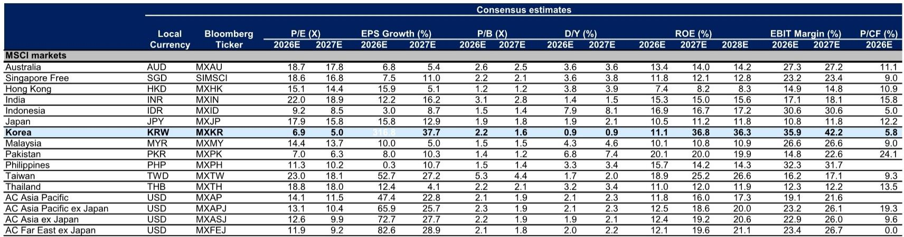
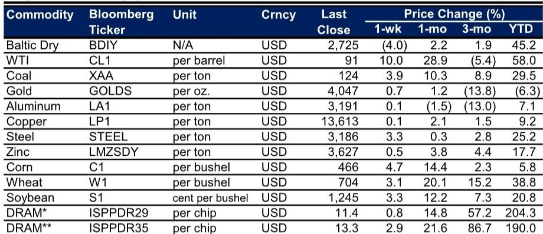
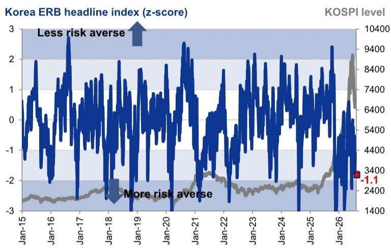

# GS：AI技术与行业应用观察

KOSPI 上周下跌 1.9%，尽管外资连续第二周净买入，且 Alphabet 的 AI 资本支出计划提振了全球科技情绪。这份GS韩国周报捕捉到一个关键矛盾：市场在下跌，但外资在买入；散户在去杠杆，但杠杆水平尚未触及极端。截至 7 月 23 日，韩国散户保证金贷款余额从峰值 250 亿美元降至 220 亿美元，但按市值调整后仍维持在 0.5%。同期，韩国杠杆 ETF 资产管理规模从 530 亿美元峰值腰斩至 260 亿美元，杠杆敞口相当于市场自由流通市值的 2.1%。这些数字指向一个状态：去杠杆正在进行，但未到恐慌性抛售的程度。

报告还显示，KOSPI 的 12 个月远期每股收益在过去一周被下调 0.4%，化工板块获得较强上修，汽车板块则被下调最多。韩元兑美元本周升值 1.6%，兑日元升值 2.5%。GS的韩国权益不确定性晴雨表指数为 -1.1，仍处于不确定性规避区间。

> **KC评论：** 保证金贷款余额下降但市值调整后比例稳定，意味着散户去杠杆更多是主动减仓而非被动强平。杠杆 ETF 规模腰斩则说明追涨资金已大量离场，市场情绪从过热回到中性偏低位置。这两个指标结合起来看，韩国市场的投机性仓位已大幅出清，但尚未出现流动性扰动信号。

## 1. 外资连续净买入，但半导体板块外资持股仍处于历史低位

报告数据显示，尽管 KOSPI 连续两周录得外资净流入，但年初至今的累计外资流出规模仍然显著。一个值得注意的结构性特征是，KOSPI 半导体板块的外资持股比例目前处于近两年标准差以下的低位。这意味着外资整体在回补韩国仓位，但对半导体这一核心板块的配置仍偏轻。

过去一个月，对冲产品在日本、台湾和韩国市场获利了结，而中国市场则获得部分轮动观点偏积极。韩国在过去一到两周开始出现兴趣回升。这种资金流向的变化，与 Alphabet 的 AI 资本支出公告形成时间上的重叠，但报告并未将其直接归因为单一事件。

## 2. 卖空余额与交易量同步下降，市场做空动能减弱

报告指出，在近期市场走弱过程中，卖空余额和卖空交易活动均出现显著下降。卖空活动的调整通常有两种解读：一是空头认为节奏变化空间有限而主动平仓，二是市场流动性下降导致做空成本上升。GS报告没有明确区分这两种情况，但从卖空余额下降与外资流入并存的现象看，前者的可能性更大。

卖空活动的减少，叠加散户杠杆的下降，意味着韩国市场的短期抛售不确定性正在减弱。但这并不等同于买入信号，因为盈利预期仍在被下调。

## 3. 行业表现分化：建筑、软件、电信领涨，标的、汽车、保险垫底

上周 KOSPI 各行业表现呈现明显分化。建筑板块上涨 8.4%，软件板块上涨 7.1%，电信板块上涨 6.9%，成为涨幅前三。而标的板块下跌 6.5%，汽车板块下跌 4.4%，保险板块下跌 3.8%，表现最弱。

这种行业轮动模式值得关注。建筑和电信通常被视为防御性或内需导向板块，在市场整体下跌时获得资金青睐。而标的板块的下跌与交易量调整、散户去杠杆直接相关。汽车板块的下调则与盈利预期下修一致。

> **KC评论：** 行业表现的分化提供了一个观察框架：当市场整体下跌但防御性板块走强时，资金在做“质量切换”而非全面离场。如果后续建筑和电信板块的上涨不能扩散到其他行业，则市场可能仍处于区间震荡而非趋势反转。

## 4. 宏观数据与市场定价的背离值得跟踪

报告中的宏观数据显示，韩国出口（除船舶外）6 月同比增长 73.3%，工业生产和就业数据则相对平淡。CPI 从 2 月的 2.0% 升至 6 月的 3.2%，韩国央行政策利率维持在 2.50% 不变。GS对韩国 2025 年实际 GDP 增速预测为 1.1%，2026 年为 2.7%。

出口强劲与内需仍在调整并存，通胀回升但政策利率按兵不动，这些宏观组合与市场定价之间存在张力。报告没有直接讨论这种张力如何收场，但权益不确定性晴雨表仍处于负值区间，说明市场定价中已包含一定程度的谨慎。

对于关注韩国市场的读者，这份报告提供了一个有用的观察框架：外资流入与散户去杠杆同时发生，卖空活动下降但盈利预期也在下调，行业轮动指向防御而非进攻。这些信号组合在一起，指向一个正在出清但尚未找到新平衡的市场状态。

For informational purposes only. Portions may be generated,translated,summarized,or edited with AI assistance based on source materials and may contain omissions or errors. Please verify independently. This is not investment,legal,tax,accounting,or other professional advice.

For informational purposes only. Portions may be generated,translated,summarized,or edited with AI assistance based on source materials and may contain omissions or errors. Please verify independently. This is not investment,legal,tax,accounting,or other professional advice.

