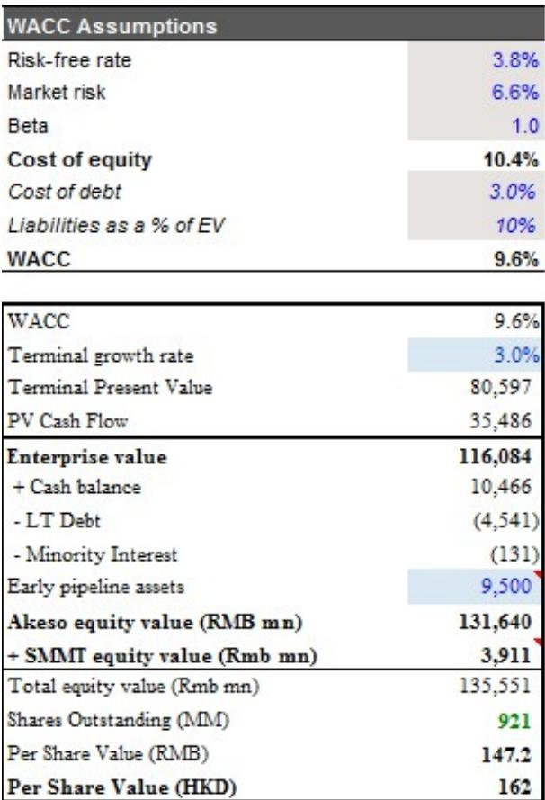
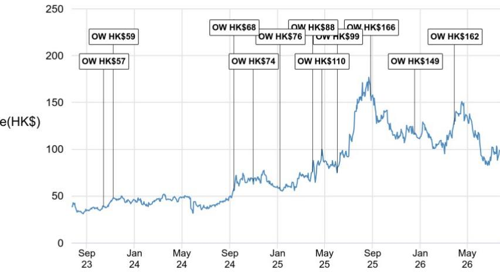

# JPM：康方生物HARMONi试验OS更新

7月22日，Summit Therapeutics公布了其全球III期HARMONi试验（依沃西单抗联合化疗对比化疗，用于二线及以上EGFR突变非鳞状非小细胞肺癌）的更新总生存期（OS）分析。这份分析并非预设的期中分析，而是在更长的西方患者随访和2026年6月数据截止后发布的。JPM在最新研究报告中认为，这一更新对市场情绪有支撑作用，但并未从根本上改变该试验的证据格局。

更新的数据显示，西方患者的OS不确定性比（HR）已收敛至0.76，与全球研究意向治疗（ITT）人群以及中国III期HARMONi-A试验中中国人群的结果一致。此前市场的主要关注点之一，是OS获益可能主要来自亚洲人群，而西方患者的数据是否一致存在不确定性。此次分析在一定程度上缓解了这一疑虑。但JPM同时指出，由于这是一次非预设的探索性分析，没有正式的p值，仅有名义上的p值显示有利趋势，因此不能据此宣称OS获益具有统计学显著性。安全性方面未出现新的信号。

> **KC评论：** 对于关注创新药海外临床的读者，这里的关键不是0.76这个数字本身，而是分析的性质。非预设分析在监管审评中通常被视为支持性证据，而非决定性证据。FDA的BLA审评（PDUFA日期为2026年11月14日）仍将主要依赖预设的OS分析结果（HR 0.79，p=0.057，未达统计学显著性）和已明确达到终点的PFS数据（HR 0.52，p<0.00001）。

## 1. 随访时间延长后OS HR持续下降，提示获益模式与PD-1单抗类似

研报中一个值得关注的趋势是，随着随访时间延长，HARMONi试验的OS HR在持续下降。在ITT人群中，2025年4月、2025年9月和2026年6月的三次分析中，OS HR分别为0.79、0.78和0.76。在西方患者亚组中，这一趋势更为明显，同期OS HR从0.98降至0.84，再降至0.76。JPM认为，这种随时间推移获益持续改善的模式，与PD-1单抗的OS获益特征相似，可能暗示依沃西单抗的OS获益同样具有延迟但持续的特点。这一观察为后续更长期的随访数据提供了积极信号，但同样不能替代预设分析的结果。

## 2. 对HARMONi-3试验的参考意义有限，但方向正面

市场最关注的全球III期HARMONi-3试验（依沃西单抗一线治疗非小细胞肺癌）才是决定该药物海外价值的关键。JPM认为，此次HARMONi试验中西方与亚洲患者OS数据的一致性，对HARMONi-3而言是一个温和的积极信号。HARMONi-3的成功依赖于在西方患者占主导的人群中复制中国HARMONi-6试验的优异数据（OS HR=0.66）。此前JPM估算，HARMONi-3的最终PFS大概率会达到终点，但其期中OS分析需要达到约0.72的HR才具有统计学显著性，这是一个较高的门槛。尽管此次更新提供了部分信心，但HARMONi-3的最终OS能否成功，仍需等待数据读出。

## 3. 下一个关键催化剂：HARMONi-3鳞癌队列数据，预计2026年下半年

对于康方生物和Summit而言，下一个真正的二元事件是HARMONi-3试验中鳞癌队列的最终PFS和期中OS数据，预计在2026年下半年读出。由于该试验此前的期中PFS分析未达到终点，期中OS数据将成为判断依沃西单抗在西方一线非小细胞肺癌患者中OS疗效是否成立的关键信号。此外，2026年11月14日的PDUFA决定（针对二线EGFR突变非小细胞肺癌适应症），以及HARMONi-3非鳞癌队列的PFS数据（预计2027年上半年），也是后续重要的观察节点。

总体而言，JPM维持对康方生物的公司观点，认为此次OS更新对BLA审评有支持作用，但并未提供决定性的统计证据。公司的核心价值仍取决于HARMONi-3试验的最终结果。

For informational purposes only. Portions may be generated,translated,summarized,or edited with AI assistance based on source materials and may contain omissions or errors. Please verify independently. This is not investment,legal,tax,accounting,or other professional advice.

For informational purposes only. Portions may be generated,translated,summarized,or edited with AI assistance based on source materials and may contain omissions or errors. Please verify independently. This is not investment,legal,tax,accounting,or other professional advice.

