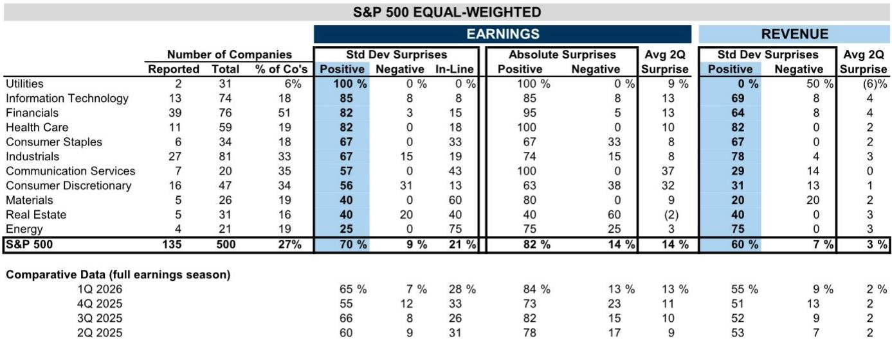
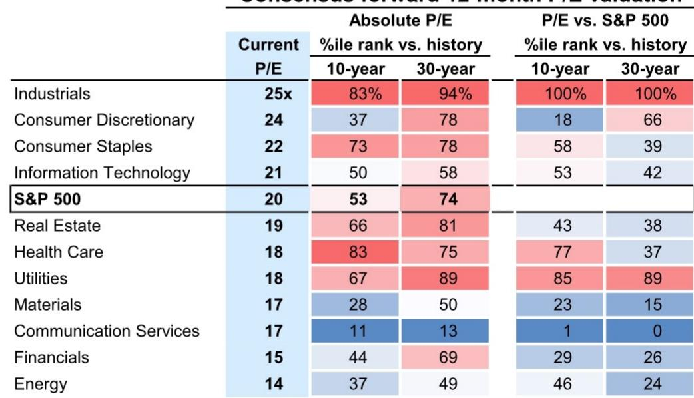
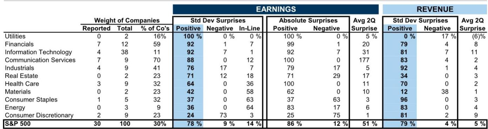

# GS：区域环境与行业变化观察

距离11月3日美国中期选举还有三个月，GS公司策略团队在最新周报中提出一个核心判断：读者对选举的关注度正在上升，但选举结果本身不太可能成为权益市场波动的主要来源。更值得关注的，是选举前宏观不确定性上升、隐含相关性处于历史低位、以及利率波动这三个因素叠加后，对指数波动率的推升作用。

报告基于1974年以来13次中期选举的数据，发现标普500指数在8月初至选举日期间的回报中位数为零，而选举后三个月的中位数回报为6%。这一“先横盘后回升”的规律背后，是共同产品和外国读者在选举前减少权益敞口、选举后重新配置的行为模式。共同产品在选举前三个月平均将现金仓位提高0.4%，选举后三个月再降低0.6%；外国读者同期先观点偏谨慎0.1%的美国权益资产，再观点偏积极0.5%。

## 1. 隐含相关性处于历史低位，指数波动率被低估

报告特别强调了一个当前市场结构特征：标普500成分股之间的期权隐含相关性已降至近几十年最低水平。这意味着公司层面的波动率很高，但指数层面的波动率却被压低。GS认为，随着财报季收尾，读者注意力转向中期选举、通胀数据等宏观议题，宏观驱动因素的重要性将上升，从而对指数波动率形成向上不确定性。

> **KC评论：** 隐含相关性低意味着指数波动率可能无法反映真实的公司不确定性。如果宏观事件引发系统性情绪变化，指数波动率的上升速度可能比历史经验更快。这是当前市场结构中最容易被忽视的不确定性点。

## 2. 利率快速变动是权益市场更直接的约束

报告同时指出，10年期实际回报表现已升至2023年以来最高，30年期实际回报表现接近3%，这一水平仅在资金扰动期间被短暂超越。GS测算，当10年期名义回报表现在一个月内上升约50个基点（即两个标准差）时，权益市场通常表现挣扎。按当前水平，这意味着名义回报表现升至约5%或实际回报表现升至约2.7%时，市场将面临不确定性。

## 3. 选举结果对市场的影响有限，但通胀是核心变量

预测市场数据显示，民主党赢得众议院控制权的概率约为85%，参议院结果接近五五开。GS认为，这一概率分布意味着选举结果本身不太可能成为重大立法变化的信号，因此对权益市场的直接冲击有限。但报告同时指出，近期预测市场赔率的变化与汽油价格高度同步，通胀已成为选民关注的首要议题。此外，AI监管是两党选民共同关注的领域，超过70%的受访者支持某种形式的政府监管。

## 4. 行业层面与选举赔率的相关性仍较弱

GS将各行业、因子和主题组合的回报率与预测市场赔率进行回归分析，发现绝大多数板块与选举概率变化的相关性极低。相对少见例外是可选消费板块，其回报率与共和党胜选概率呈现负相关，但相关性并不强。报告认为，随着选举日临近，这一关系可能发生变化，但目前市场尚未对选举结果进行系统性定价。

综合来看，这份报告的核心价值不在于预测选举结果对市场的方向性影响，而在于提供了一个观察框架：在隐含相关性极低、利率波动加剧、选举不确定性上升的三重叠加下，指数波动率的定价可能正在偏离基本面。对于关注组合不确定性管理的读者而言，这一结构性问题比选举结果本身更值得跟踪。

For informational purposes only. Portions may be generated,translated,summarized,or edited with AI assistance based on source materials and may contain omissions or errors. Please verify independently. This is not investment,legal,tax,accounting,or other professional advice.

For informational purposes only. Portions may be generated,translated,summarized,or edited with AI assistance based on source materials and may contain omissions or errors. Please verify independently. This is not investment,legal,tax,accounting,or other professional advice.

