# 全球资金流动周报：日本资金流动受关注

## 截至7月22日当周的全球资金流动情况

■ 全球股票和固定收益类共同基金及相关产品的资金流入均为正值。

Lexi Kanter
+1(212)855-9701 |
alexandra.kanter@gs.com
GS & Co. LLC

- 截至7月22日当周，全球股票基金净流入保持正值（+300亿美元，前一周为+560亿美元）。发达市场基金除日本外均出现资金流出，美国基金是净流出的主要来源。在新兴市场中，中国大陆、韩国和台湾基金推动了净流入。从行业层面看，科技类基金继续录得最大净流入，而工业类基金则出现最大净流出。

全球固定收益基金的资金流入在各类型基金中均保持良好支撑。短期债券基金和通胀保护债券基金持续获得资金流入。在新兴市场中，硬通货和本币债券基金均录得净流入。货币市场基金资产减少340亿美元。从国家层面看，日本债券基金的国内资金流入近期有所增加（见本周图表）。这些数据主要反映零售资金流动，虽然近期的增长似乎早于日本财务省官员关于鼓励国内投资的表态，但我们注意到，如果出现大规模资金回流，将对日元形成支撑。

跨境外汇资金流动总体为正，美元和英镑的净需求较强。

<table><tr><td rowspan="3"></td><td colspan="4">全球资金流动摘要</td></tr><tr><td colspan="2">百万美元</td><td colspan="2">占管理资产百分比</td></tr><tr><td>4周合计</td><td>7月22日</td><td>4周均值</td><td>7月22日</td></tr><tr><td>股票</td><td>128,677</td><td>30,425</td><td>0.10</td><td>0.10</td></tr><tr><td>固定收益</td><td>95,626</td><td>15,136</td><td>0.24</td><td>0.15</td></tr><tr><td>其中：新兴市场</td><td>3,219</td><td>871</td><td>0.11</td><td>0.12</td></tr><tr><td>货币市场</td><td>-58,933</td><td>-33,856</td><td>-0.13</td><td>-0.30</td></tr><tr><td>外汇资金流动*</td><td>71,945</td><td>17,066</td><td>0.11</td><td>0.10</td></tr></table>

\*跨境资金流动，不包括硬通货和外汇对冲基金
来源：EPFR, Haver Analytics, GS全球研究

本周图表
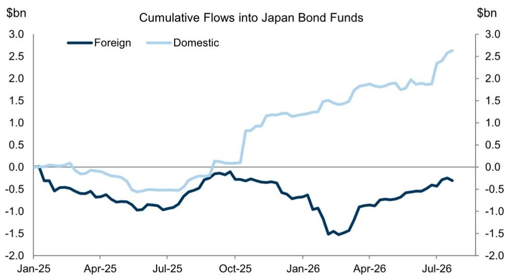
来源：EPFR, Haver Analytics, GS全球研究

## 全球资金流动趋势

来源：EPFR, GS全球研究

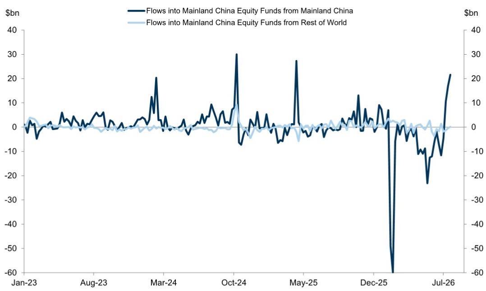
来源：EPFR, GS全球研究

来源：EPFR, GS全球研究
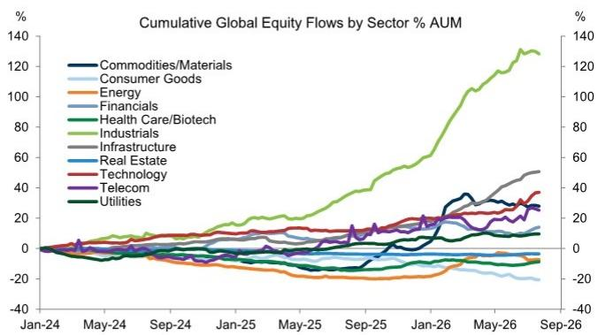
反映行业主题基金的资金流动

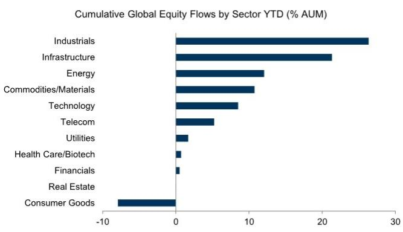
反映行业主题基金的资金流动

来源：EPFR, GS全球研究
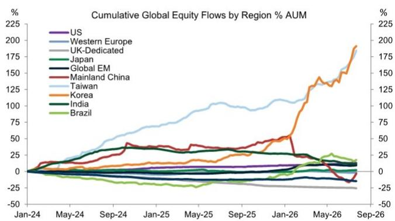
反映国家和区域主题基金的资金流动
来源：EPFR, GS全球研究

来源：EPFR, GS全球研究
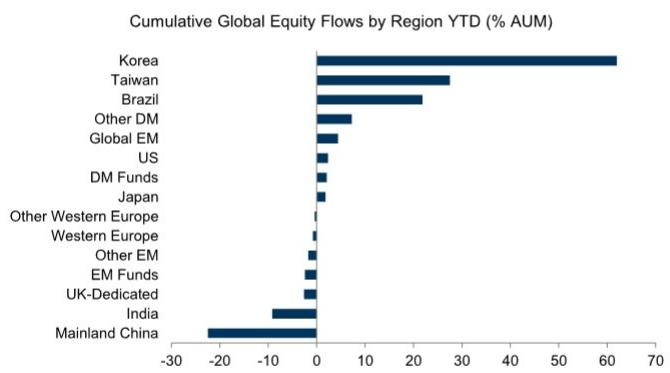
反映国家和区域主题基金的资金流动
来源：EPFR, GS全球研究

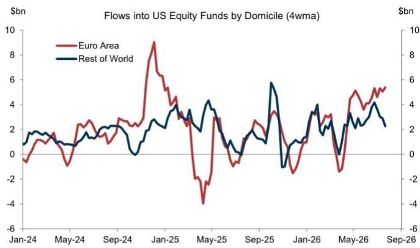
来源：EPFR, GS全球研究

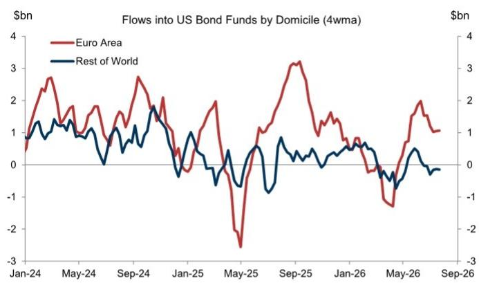
来源：EPFR, GS全球研究

各国未对冲外国资金流动总额
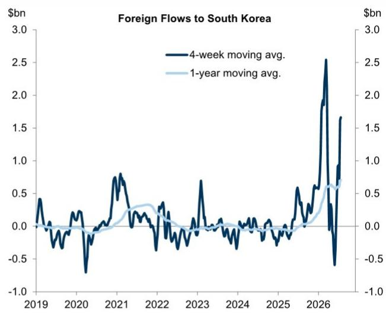

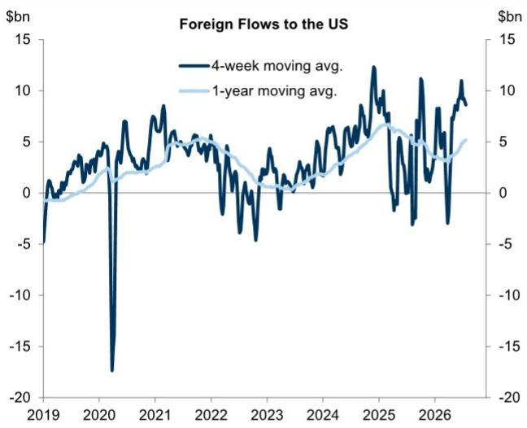

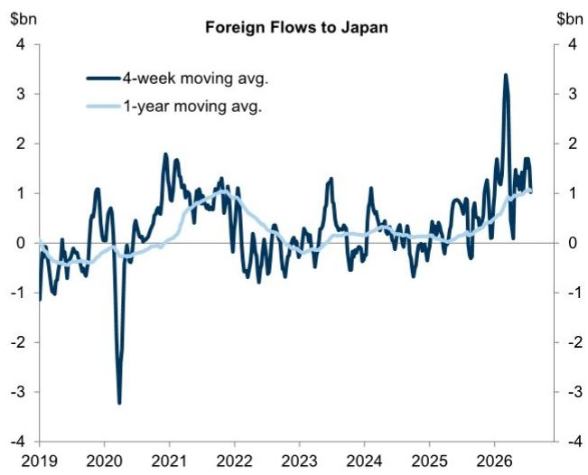

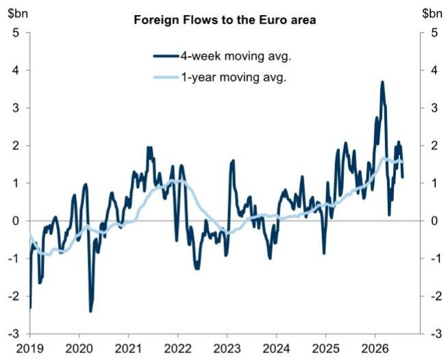
来源：EPFR, GS全球研究

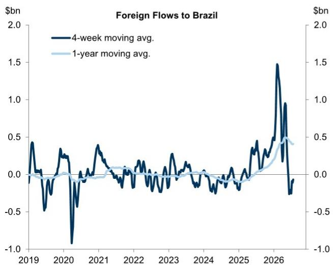

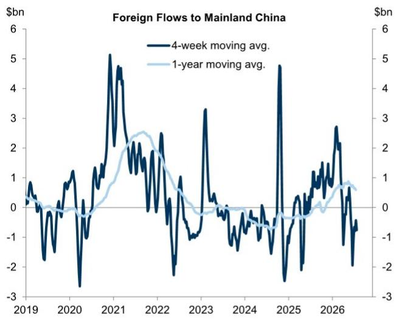

美国股票基金未对冲净资金流动
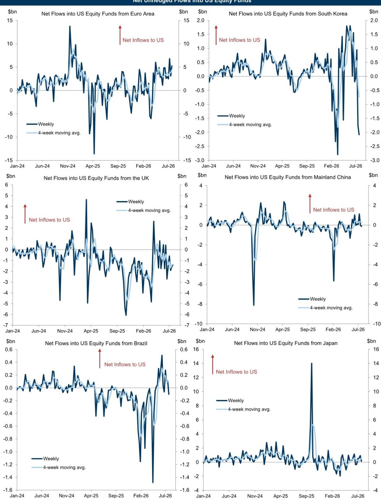
来源：EPFR, Haver Analytics, GS全球研究

固定收益与股票资金流动

<table><tr><td rowspan="3"></td><td colspan="8">全球资金流动</td></tr><tr><td colspan="5">百万美元</td><td colspan="2">占管理资产百分比</td><td rowspan="2">4周合计Z值</td></tr><tr><td>4周合计</td><td>7月22日</td><td>7月15日</td><td>7月8日</td><td>7月1日</td><td>4周均值</td><td>7月22日</td></tr><tr><td>股票总计</td><td>128,677</td><td>30,425</td><td>55,759</td><td>56,352</td><td>-13,859</td><td>0.10</td><td>0.10</td><td>1.75</td></tr><tr><td>全球基准基金¹</td><td>40,010</td><td>6,800</td><td>11,729</td><td>12,561</td><td>8,921</td><td>0.13</td><td>0.09</td><td>1.32</td></tr><tr><td>含美国</td><td>28,748</td><td>3,952</td><td>8,801</td><td>10,410</td><td>5,584</td><td>0.13</td><td>0.07</td><td>1.49</td></tr><tr><td>不含美国</td><td>11,263</td><td>2,848</td><td>2,927</td><td>2,150</td><td>3,337</td><td>0.12</td><td>0.12</td><td>0.56</td></tr><tr><td>发达市场²</td><td>23,133</td><td>-5,972</td><td>19,047</td><td>28,808</td><td>-18,751</td><td>0.03</td><td>-0.03</td><td>-0.37</td></tr><tr><td>美国</td><td>16,397</td><td>-7,227</td><td>15,735</td><td>25,096</td><td>-17,207</td><td>0.02</td><td>-0.04</td><td>-0.54</td></tr><tr><td>西欧</td><td>-4,201</td><td>-1,557</td><td>684</td><td>376</td><td>-3,704</td><td>-0.05</td><td>-0.07</td><td>-0.41</td></tr><tr><td>英国主题</td><td>-1,750</td><td>-1,209</td><td>-561</td><td>102</td><td>-81</td><td>-0.13</td><td>-0.36</td><td>0.25</td></tr><tr><td>其他</td><td>-2,451</td><td>-348</td><td>1,245</td><td>275</td><td>-3,623</td><td>-0.03</td><td>-0.02</td><td>-0.42</td></tr><tr><td>日本</td><td>6,506</td><td>1,536</td><td>1,880</td><td>1,236</td><td>1,855</td><td>0.13</td><td>0.13</td><td>1.08</td></tr><tr><td>其他</td><td>4,431</td><td>1,276</td><td>749</td><td>2,101</td><td>306</td><td>0.26</td><td>0.30</td><td>1.35</td></tr><tr><td>新兴市场³</td><td>65,532</td><td>29,596</td><td>24,983</td><td>14,983</td><td>-4,030</td><td>0.56</td><td>1.02</td><td>2.70</td></tr><tr><td>全球新兴市场基准</td><td>1,627</td><td>1,929</td><td>1,757</td><td>-46</td><td>-2,013</td><td>0.03</td><td>0.14</td><td>0.05</td></tr><tr><td>中国大陆</td><td>40,823</td><td>21,330</td><td>16,165</td><td>9,057</td><td>-5,729</td><td>1.59</td><td>3.31</td><td>1.67</td></tr><tr><td>台湾</td><td>12,655</td><td>4,790</td><td>2,804</td><td>2,635</td><td>2,426</td><td>1.29</td><td>1.99</td><td>3.75</td></tr><tr><td>韩国</td><td>16,337</td><td>1,490</td><td>6,292</td><td>4,009</td><td>4,545</td><td>2.09</td><td>0.82</td><td>3.90</td></tr><tr><td>印度</td><td>-661</td><td>17</td><td>-203</td><td>-225</td><td>-250</td><td>-0.20</td><td>0.02</td><td>-0.70</td></tr><tr><td>巴西</td><td>-270</td><td>414</td><td>-397</td><td>-137</td><td>-151</td><td>-0.29</td><td>1.72</td><td>-0.59</td></tr><tr><td>其他</td><td>-4,979</td><td>-373</td><td>-1,435</td><td>-311</td><td>-2,859</td><td>-0.33</td><td>-0.10</td><td>-2.01</td></tr><tr><td colspan="9">股票行业资金流动</td></tr><tr><td>商品/材料</td><td>-1,114</td><td>-628</td><td>24</td><td>1,334</td><td>-1,843</td><td>-0.10</td><td>-0.24</td><td>-0.36</td></tr><tr><td>消费品</td><td>-1,614</td><td>-462</td><td>-1,863</td><td>299</td><td>412</td><td>-0.20</td><td>-0.23</td><td>-0.12</td></tr><tr><td>能源</td><td>-4,468</td><td>421</td><td>653</td><td>60</td><td>-5,602</td><td>-0.36</td><td>0.13</td><td>-0.88</td></tr><tr><td>金融</td><td>13,110</td><td>1,689</td><td>4,023</td><td>3,390</td><td>4,008</td><td>0.71</td><td>0.36</td><td>2.22</td></tr><tr><td>医疗保健</td><td>6,446</td><td>796</td><td>1,435</td><td>1,713</td><td>2,502</td><td>0.39</td><td>0.19</td><td>2.23</td></tr><tr><td>工业</td><td>36</td><td>-1,385</td><td>-381</td><td>990</td><td>812</td><td>0.00</td><td>-0.50</td><td>-0.73</td></tr><tr><td>基础设施</td><td>1,816</td><td>255</td><td>277</td><td>469</td><td>815</td><td>0.30</td><td>0.16</td><td>0.59</td></tr><tr><td>房地产</td><td>-561</td><td>-501</td><td>-757</td><td>926</td><td>-230</td><td>-0.02</td><td>-0.08</td><td>0.05</td></tr><tr><td>科技</td><td>65,776</td><td>3,544</td><td>17,439</td><td>28,855</td><td>15,937</td><td>0.70</td><td>0.15</td><td>4.57</td></tr><tr><td>电信</td><td>2,932</td><td>-437</td><td>-291</td><td>497</td><td>3,163</td><td>0.87</td><td>-0.53</td><td>1.66</td></tr><tr><td>公用事业</td><td>1,410</td><td>18</td><td>238</td><td>603</td><td>550</td><td>0.19</td><td>0.01</td><td>0.73</td></tr><tr><td>高贝塔⁴</td><td>7,933</td><td>258</td><td>2,554</td><td>4,217</td><td>904</td><td>0.29</td><td>0.04</td><td>0.57</td></tr><tr><td>低贝塔⁴</td><td>-961</td><td>-670</td><td>-1,291</td><td>962</td><td>38</td><td>-0.03</td><td>-0.10</td><td>0.36</td></tr><tr><td>固定收益总计</td><td>95,626</td><td>15,136</td><td>19,840</td><td>31,414</td><td>29,236</td><td>0.24</td><td>0.15</td><td>1.42</td></tr><tr><td>发达市场⁵</td><td>92,010</td><td>13,980</td><td>19,169</td><td>30,625</td><td>28,237</td><td>0.25</td><td>0.15</td><td>1.65</td></tr><tr><td>政府债</td><td>25,340</td><td>5,700</td><td>6,479</td><td>8,425</td><td>4,736</td><td>0.39</td><td>0.35</td><td>1.66</td></tr><tr><td>抵押贷款支持</td><td>1,387</td><td>302</td><td>459</td><td>332</td><td>293</td><td>0.11</td><td>0.10</td><td>-0.48</td></tr><tr><td>市政债</td><td>5,841</td><td>262</td><td>1,843</td><td>1,877</td><td>1,859</td><td>0.21</td><td>0.04</td><td>0.98</td></tr><tr><td>综合型</td><td>27,233</td><td>3,589</td><td>6,209</td><td>8,219</td><td>9,215</td><td>0.24</td><td>0.12</td><td>0.94</td></tr><tr><td>投资级信用债</td><td>8,577</td><td>816</td><td>890</td><td>3,570</td><td>3,301</td><td>0.19</td><td>0.07</td><td>0.48</td></tr><tr><td>高收益债</td><td>5,521</td><td>396</td><td>-246</td><td>2,021</td><td>3,350</td><td>0.20</td><td>0.06</td><td>0.52</td></tr><tr><td>银行贷款</td><td>3,856</td><td>955</td><td>567</td><td>1,528</td><td>806</td><td>0.52</td><td>0.51</td><td>0.75</td></tr><tr><td>长久期⁶</td><td>5,584</td><td>1,306</td><td>1,940</td><td>1,214</td><td>1,124</td><td>0.27</td><td>0.26</td><td>0.07</td></tr><tr><td>短久期⁶</td><td>26,940</td><td>5,695</td><td>4,395</td><td>10,273</td><td>6,576</td><td>0.29</td><td>0.24</td><td>1.23</td></tr><tr><td>通胀保护</td><td>1,713</td><td>391</td><td>586</td><td>442</td><td>294</td><td>0.25</td><td>0.22</td><td>0.94</td></tr><tr><td>新兴市场</td><td>3,219</td><td>871</td><td>878</td><td>631</td><td>838</td><td>0.11</td><td>0.12</td><td>0.27</td></tr><tr><td>硬通货</td><td>1,053</td><td>155</td><td>397</td><td>339</td><td>162</td><td>0.10</td><td>0.06</td><td>0.64</td></tr><tr><td>混合</td><td>794</td><td>450</td><td>132</td><td>293</td><td>-81</td><td>0.29</td><td>0.65</td><td>1.07</td></tr><tr><td>本币</td><td>1,372</td><td>266</td><td>348.4</td><td>0</td><td>757</td><td>0.09</td><td>0.07</td><td>-0.13</td></tr><tr><td>货币市场</td><td>-58,933</td><td>-33,856</td><td>-119,614</td><td>39,538</td><td>54,999</td><td>-0.13</td><td>-0.30</td><td>-1.81</td></tr></table>

1. 主要为MSCI World和MSCI ACWI基准。2. 发达市场国家和区域主题基金合计；不包括全球发达市场基准基金（如MSCI World基金）。3. 全球新兴市场基准基金与新兴市场国家和区域主题基金合计。4. 高贝塔基金包括商品、金融和工业行业基金。低贝塔基金包括消费品、房地产和公用事业行业基金。5. 基准可能包含部分投资级新兴市场债券；以下类别包括发达市场和新兴市场基金。6. 长久期包括长期综合型、长期公司债和长期政府债基金。短久期包括短期综合型、短期公司债和短期政府债基金。
来源：EPFR, Haver Analytics, GS全球研究

外汇资金流动

<table><tr><td rowspan="3"></td><td colspan="8">外汇资金流动¹</td></tr><tr><td colspan="5">百万美元</td><td colspan="2">占管理资产百分比</td><td rowspan="2">4周合计Z值</td></tr><tr><td>4周合计</td><td>7月22日</td><td>7月15日</td><td>7月8日</td><td>7月1日</td><td>4周均值</td><td>7月22日</td></tr><tr><td>总计</td><td>71,945</td><td>17,066</td><td>24,827</td><td>26,241</td><td>3,811</td><td>0.11</td><td>0.10</td><td>0.98</td></tr><tr><td>G10</td><td>54,260</td><td>11,272</td><td>16,601</td><td>18,814</td><td>7,573</td><td>0.13</td><td>0.10</td><td>1.32</td></tr><tr><td>美元</td><td>34,441</td><td>8,395</td><td>9,757</td><td>11,464</td><td>4,825</td><td>0.14</td><td>0.14</td><td>1.13</td></tr><tr><td>欧元</td><td>4,640</td><td>413</td><td>1,459</td><td>1,553</td><td>1,215</td><td>0.09</td><td>0.03</td><td>0.35</td></tr><tr><td>英镑</td><td>5,853</td><td>1,329</td><td>1,784</td><td>1,890</td><td>850</td><td>0.14</td><td>0.13</td><td>1.14</td></tr><tr><td>澳元</td><td>281</td><td>143</td><td>52</td><td>278</td><td>-192</td><td>0.04</td><td>0.07</td><td>-0.10</td></tr><tr><td>新西兰元</td><td>70</td><td>25</td><td>13</td><td>25</td><td>6</td><td>0.13</td><td>0.19</td><td>1.01</td></tr><tr><td>加元</td><td>1,589</td><td>395</td><td>336</td><td>745</td><td>112</td><td>0.11</td><td>0.11</td><td>0.75</td></tr><tr><td>瑞士法郎</td><td>1,616</td><td>360</td><td>674</td><td>560</td><td>22</td><td>0.09</td><td>0.08</td><td>0.60</td></tr><tr><td>挪威克朗</td><td>540</td><td>97</td><td>168</td><td>209</td><td>66</td><td>0.14</td><td>0.10</td><td>1.29</td></tr><tr><td>瑞典克朗</td><td>1,129</td><td>124</td><td>483</td><td>356</td><td>166</td><td>0.12</td><td>0.05</td><td>1.13</td></tr><tr><td>日元</td><td>4,102</td><td>-9</td><td>1,875</td><td>1,733</td><td>503</td><td>0.11</td><td>0.00</td><td>0.79</td></tr><tr><td>亚洲</td><td>4,206</td><td>2,397</td><td>5,249</td><td>14</td><td>-3,453</td><td>0.04</td><td>0.10</td><td>0.25</td></tr><tr><td>人民币</td><td>-3,033</td><td>239</td><td>-314</td><td>-1,232</td><td>-1,727</td><td>-0.10</td><td>0.03</td><td>-0.59</td></tr><tr><td>港币</td><td>243</td><td>75</td><td>77</td><td>106</td><td>-15</td><td>0.05</td><td>0.07</td><td>0.27</td></tr><tr><td>印度卢比</td><td>-650</td><td>241</td><td>-84</td><td>-236</td><td>-571</td><td>-0.06</td><td>0.09</td><td>-0.70</td></tr><tr><td>韩元</td><td>6,650</td><td>977</td><td>4,881</td><td>1,049</td><td>-257</td><td>0.30</td><td>0.17</td><td>2.64</td></tr><tr><td>马来西亚林吉特</td><td>65</td><td>64</td><td>46</td><td>12</td><td>-57</td><td>0.05</td><td>0.19</td><td>0.19</td></tr><tr><td>新加坡元</td><td>294</td><td>107</td><td>75</td><td>93</td><td>20</td><td>0.08</td><td>0.12</td><td>0.91</td></tr><tr><td>新台币</td><td>295</td><td>514</td><td>412</td><td>163</td><td>-794</td><td>0.01</td><td>0.09</td><td>-0.02</td></tr><tr><td>泰铢</td><td>32</td><td>59</td><td>33</td><td>-2</td><td>-58</td><td>0.02</td><td>0.15</td><td>0.06</td></tr><tr><td>印尼盾</td><td>261</td><td>87</td><td>97</td><td>58</td><td>18</td><td>0.15</td><td>0.20</td><td>0.67</td></tr><tr><td>菲律宾比索</td><td>51</td><td>33</td><td>26</td><td>2</td><td>-11</td><td>0.07</td><td>0.18</td><td>0.34</td></tr><tr><td>美洲</td><td>313</td><td>616</td><td>153</td><td>113</td><td>-569</td><td>0.02</td><td>0.16</td><td>-0.25</td></tr><tr><td>阿根廷比索</td><td>17</td><td>16</td><td>12</td><td>0</td><td>-11</td><td>0.05</td><td>0.17</td><td>-0.26</td></tr><tr><td>巴西雷亚尔</td><td>-267</td><td>290</td><td>-98</td><td>-34</td><td>-426</td><td>-0.03</td><td>0.14</td><td>-0.54</td></tr><tr><td>墨西哥比索</td><td>310</td><td>180</td><td>128</td><td>81</td><td>-80</td><td>0.07</td><td>0.17</td><td>0.18</td></tr><tr><td>智利比索</td><td>88</td><td>39</td><td>41</td><td>25</td><td>-17</td><td>0.07</td><td>0.12</td><td>0.09</td></tr><tr><td>秘鲁索尔</td><td>66</td><td>43</td><td>30</td><td>16</td><td>-23</td><td>0.07</td><td>0.19</td><td>0.12</td></tr><tr><td>哥伦比亚比索</td><td>100</td><td>48</td><td>39</td><td>25</td><td>-12</td><td>0.12</td><td>0.23</td><td>0.28</td></tr><tr><td>欧非中东</td><td>1,180</td><td>504</td><td>369</td><td>414</td><td>-108</td><td>0.12</td><td>0.20</td><td>0.51</td></tr><tr><td>捷克克朗</td><td>159</td><td>66</td><td>35</td><td>53</td><td>6</td><td>0.19</td><td>0.31</td><td>1.11</td></tr><tr><td>匈牙利福林</td><td>141</td><td>56</td><td>43</td><td>50</td><td>-8</td><td>0.14</td><td>0.22</td><td>0.85</td></tr><tr><td>波兰兹罗提</td><td>232</td><td>116</td><td>46</td><td>104</td><td>-34</td><td>0.12</td><td>0.23</td><td>0.41</td></tr><tr><td>罗马尼亚列伊</td><td>101</td><td>33</td><td>31</td><td>36</td><td>1</td><td>0.17</td><td>0.22</td><td>0.73</td></tr><tr><td>俄罗斯卢布</td><td>3</td><td>1</td><td>1</td><td>1</td><td>1</td><td>0.08</td><td>0.08</td><td>0.40</td></tr><tr><td>土耳其里拉</td><td>124</td><td>53</td><td>38</td><td>39</td><td>-5</td><td>0.14</td><td>0.23</td><td>0.59</td></tr><tr><td>以色列谢克尔</td><td>249</td><td>68</td><td>67</td><td>76</td><td>40</td><td>0.13</td><td>0.14</td><td>0.74</td></tr><tr><td>南非兰特</td><td>172</td><td>113</td><td>109</td><td>57</td><td>-107</td><td>0.06</td><td>0.16</td><td>0.14</td></tr><tr><td>前沿市场</td><td>158</td><td>66</td><td>97</td><td>47</td><td>-52</td><td>0.08</td><td>0.14</td><td>0.24</td></tr><tr><td>乌克兰格里夫纳</td><td>14</td><td>6</td><td>5</td><td>4
