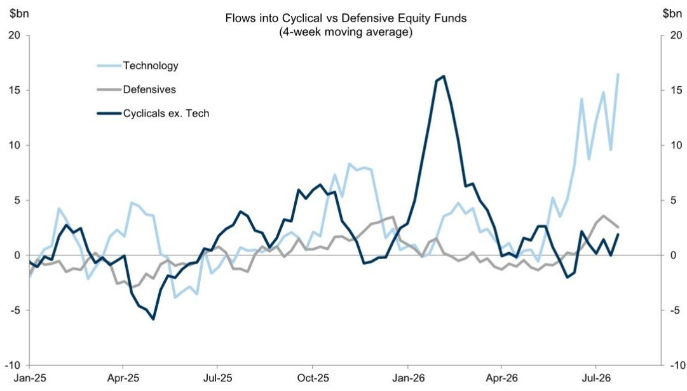
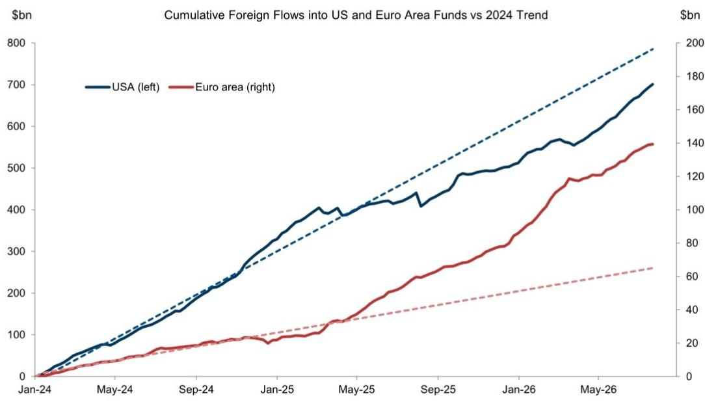

# GS：GS周度资金流向观察，日本资金流入受关注

截至7月22日当周，全球权益类产品净流入约300亿美元，较前一周的560亿美元有所收窄。发达市场除日本外普遍出现资金流出，美国市场是主要影响因素。新兴市场则由中国内地、韩国和台湾地区产品带动，净流入约296亿美元。固定收益类产品继续获得资金支持，短期债券和通胀保护债券需求稳定。货币市场产品资产减少约340亿美元。

这份GS资金流周报最值得关注的信号，并非总量变化，而是结构分化：日本成为发达市场中相对少见的资金流入目的地，而科技板块虽仍为权益类产品最大流入领域，但流入速度已从高位回落。同时，日本国内债券产品近期出现资金流入上升趋势，这一变化早于日本财务省官员关于鼓励国内研究的公开表态。

## 1. 日本成为发达市场权益资金相对少见净流入方向

在截至7月22日的一周内，日本权益类产品净流入约15亿美元，四周累计净流入约65亿美元。同期美国权益类产品净流出约72亿美元，西欧净流出约16亿美元，英国专用产品净流出约12亿美元。日本是发达市场中相对少见录得正流入的国家。

报告特别指出，日本债券产品近期也出现国内资金流入增加。这些数据主要捕捉零售资金流向。虽然这一趋势似乎早于日本财务省官员关于鼓励国内研究的表态，但报告认为，如果发生有意义的资金回流，将对日元形成支撑。

> **KC评论：** 日本国内资金从海外回流本土资产，是日元汇率的一个潜在支撑变量。报告没有断言这一趋势已经确立，但提示了观测窗口——后续需要跟踪日本债券产品流入是否持续，以及零售资金是否向权益类扩散。

## 2. 新兴市场权益资金集中在中国内地、韩国与台湾

当周新兴市场权益类产品净流入约296亿美元，其中中国内地产品贡献约213亿美元，台湾约48亿美元，韩国约15亿美元。印度和巴西则录得净流出。从四周累计看，中国内地约408亿美元，韩国约163亿美元，台湾约127亿美元，三者合计占新兴市场权益流入的绝大部分。

报告没有对这些流入给出单一解释，但数据本身显示，资金在EM内部的分配高度集中。中国内地产品当周净流入占AUM的3.31%，远高于其他EM市场。

## 3. 科技板块流入节奏变化，工业板块流出明显

行业层面，科技板块产品当周净流入约35亿美元，四周累计约658亿美元，仍是所有行业中流入规模最大的。但与前一周的174亿美元相比，当周流入速度明显节奏变化。工业板块产品当周净流出约14亿美元，是流出最多的行业。资金和医疗板块维持正流入，四周累计分别约131亿和64亿美元。

报告还区分了高beta与低beta产品：高beta产品（含商品、资金、工业）当周净流入约2.6亿美元，低beta产品（含消费品、房地产、公用事业）净流出约6.7亿美元。这一分化表明，资金仍在偏好不确定性暴露较高的板块，但科技板块的流入强度正在减弱。

## 4. 固定收益资金持续流入，短期与通胀保护品种受青睐

固定收益类产品当周净流入约151亿美元，四周累计约956亿美元。短期债券产品和通胀保护债券产品持续获得资金流入。发达市场政府债券产品当周净流入约57亿美元，研究级信用债约8亿美元，高收益债约4亿美元。新兴市场固定收益方面，硬通货和本币债券产品均录得净流入。

货币市场产品当周资产减少约340亿美元，四周累计减少约589亿美元。这一变化可能反映资金从现金类资产向固定收益产品再配置，但报告没有给出明确归因。

> **KC评论：** 固定收益资金流入的持续性，以及货币市场产品资产的下降，是观测市场不确定性偏好的两个辅助指标。如果短期债券和通胀保护债券的流入继续扩大，可能意味着读者在利率预期和通胀预期之间寻求平衡，而非单纯追逐收益。

---

For informational purposes only. Portions may be generated,translated,summarized,or edited with AI assistance based on source materials and may contain omissions or errors. Please verify independently. This is not investment,legal,tax,accounting,or other professional advice.

For informational purposes only. Portions may be generated,translated,summarized,or edited with AI assistance based on source materials and may contain omissions or errors. Please verify independently. This is not investment,legal,tax,accounting,or other professional advice.

