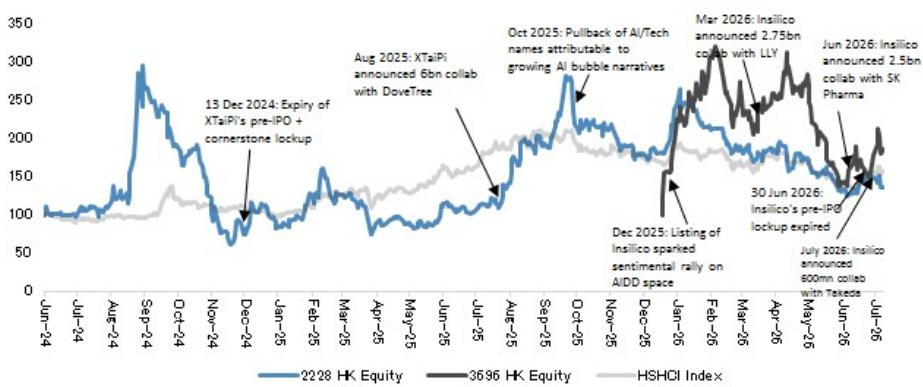
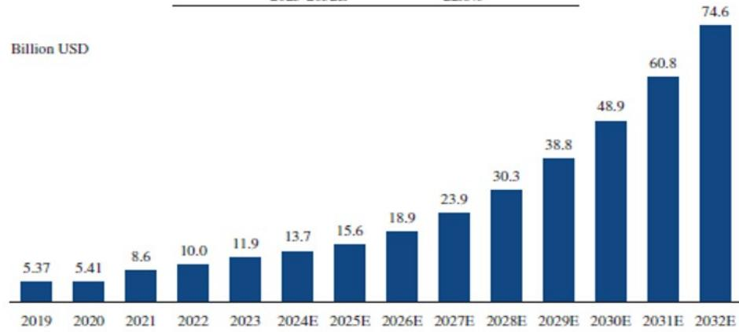
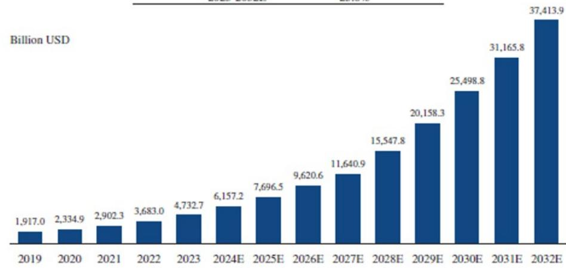
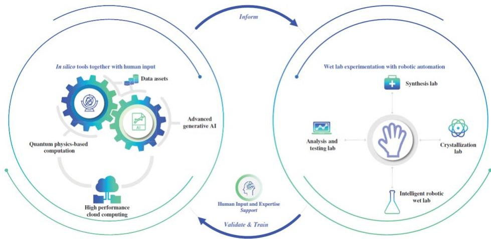

# 人工智能驱动药物研发：中国AI制药行业观察

## 药物研发迎来AI浪潮

我们开始关注两家中国AI驱动药物研发（AIDD）公司——英矽智能（3696.HK）和晶泰科技（2228.HK）。中国AIDD行业正从业务探索转向早期商业化阶段，这一转变得到了业务拓展活动和临床进展的支持。我们对AIDD领域的积极观察基于三个支柱：1）AIDD已显著提升药物研发效率，通过“干湿实验室”闭环平台可进一步提高成功率；2）AIDD结合中国的结构性成本优势、研发节奏和监管优势，使中国成为更具吸引力的AIDD应用热土；3）上述因素推动了大型药企的交易流、临床里程碑和显著的收入增长，为AIDD公司提供了早期验证。

- AIDD实现了可衡量的药物研发单位经济学转变，并为提高药物成功率提供了真实的临床前景。闭环“干实验室+自动化湿实验室”平台将发现过程从试错法转变为迭代、数据循环执行，形成专有数据飞轮，降低早期药物发现成本并提高效率。除小分子和抗体药物外，AIDD还能够处理复杂和新颖的药物模式。此外，AI平台正越来越多地整合到临床和监管流程中，以降低后期药物开发风险。

- 中国AIDD企业在结构性上比部分海外同行更具优势，原因在于能够便捷地利用中国密集的研发基础设施，这有助于将AIDD预测更快、更便宜地转化为经过验证的资产，奠定了该领域的结构性成本优势。监管顺风正在加速中国AIDD的执行，国家药监局缩短审评时间并建立AI特定框架，降低了候选药物进入人体测试的门槛。重要的是，包括来自中国公立医院的真实世界临床数据在内的专有数据，使AIDD公司能够利用跨多个来源的高质量生物学、药学和临床数据。

- 近期通过服务和业务拓展实现的AIDD商业化，加上临床催化剂，使得现在成为关注AIDD的合适时机。与全球大型药企的标志性业务拓展交易提供了数十亿美元的验证，而早期资产货币化将烧钱的生物技术公司转变为非稀释性的收入引擎。AIDD平台正在建立可预测的服务驱动收入流，以补充其业务拓展收入。一批顶尖AI和科技公司正在进入AIDD领域，进一步强化了现在关注AIDD的时机。

## 投资摘要

图1：AI+医疗健康情绪和大型合作事件推动股价，该领域正变得更加活跃

图2：AIDD正转向执行阶段，项目推进加速

| 年份/阶段 | 晶泰科技 | 英矽智能 |
|---------|---------|---------|
| 2024 | - 主要为服务收费研发- 推出Xtalgazer平台 | - ISM001-055（IPF）：中国IIa期阳性顶线数据- 将MEN2312（KAT6）授权给Stemline/Menarini- 5个新PCC |
| 2025（扩张） | - 首个盈利年份（~+201%收入）- 孵化MTS-004（METiS，PBA）：III期完成，授权 | - ISM001-055（IPF）：IIa期数据发表在《自然医学》- 将KIF18A（MEN2501）授权给Stemline- 推出Science MMAI Gym- ~7个PCC（2025–2026年初） |
| 2026及以后（执行） | - 转向平台授权/共同开发- SIGX2649（Signet）：AACR数据，双IND- RTX-117（ReviR），PEP08（PharmaEngine）：I期- ~5–6个孵化临床项目 | - 礼来交易高达~US$27.5亿- SK制药交易高达~US$25亿- ISM001-055：关键III期（中国）- 10个临床资产（2个II期，8个I期）- 目标：每年8–10个PCC- 2027+读出：ISM5411，ISM3091，ISM5043，ISM3412，ISM6331 |

图3：AIDD发现或优化的具有FIC潜力的临床催化剂

| 公司 | FIC资产 | 靶点—适应症 | FIC依据 | 阶段 | 关键催化剂及时间 |
|------|---------|------------|--------|------|----------------|
| 英矽智能（HK 3696） | Rentosertib（ISM001-055） | TNIK — IPF | 首个进入临床的TNIK抑制剂；全球最先进的AI发现/设计药物 | III期 | FPI 2026；顶线~2029 |
| 英矽智能（HK 3696） | Garutadustat（ISM5411） | 肠道限制性PHD抑制剂 — IBD/UC | 潜在FIC肠道限制性HIF-PHD抑制剂 | IIa期 | BETHESDA IIa期给药始于2026年1月；顶线~2027 |
| 晶泰科技（HK 2228）— 通过Signet | SIGX2649 | Pan-TEAD — 实体瘤 | 潜在FIC pan-TEAD抑制剂 | IND启动（2026年1月） | 临床前数据AACR 2026（4月）；II期入组~2026年第三季度。首次临床读出~2027年 |
| Recursion（RXRX） | REC-1245 | RBM39降解剂（分子胶）— 实体瘤/淋巴瘤 | 潜在FIC RBM39分子胶降解剂 | I/II期（DAHLIA） | 初步ORR读出2026年下半年 |
| Relay（RLAY） | Zovegalisib（RLY-2608） | PI3Kα（泛突变）— HR+/HER2- BC | 首个进入临床开发的选择性泛突变变构PI3Kα抑制剂 | III期 | III期顶线读出2027-2028E；FDA突破性疗法（2026年2月） |

图4：晶泰科技拥有以机器人为关键特征的多元化业务，而英矽智能是深度药物管线型公司

| 特征 | 晶泰科技（QuantumPharm） | 英矽智能 |
|------|--------------------------|---------|
| 商业模式 | AI驱动科学药物服务提供商：服务和共同开发平台 | AI赋能深度管线生物技术公司：专注于内部药物开发和对外授权 |
| 战略类比 | “自动化厨房”：为他人提供机器人工具和AI大脑来制造药物，同时设计自己的配方 | “配方大师”：设计药物配方出售给大型药企 |
| 核心技术护城河 | 量子物理+机器人：基于物理算法的大规模自动化湿实验室 | 生成式AI：端到端制药AI平台，涵盖生物学、化学和临床试验 |
| 管线策略 | 高产量资产化：500+合作项目的经济权益 | 临床深度挖掘：20+个专有临床或IND准备阶段资产 |
| 最佳管线资产 | SIGX1094：共同开发的胃癌药物；I期试验，FDA快速通道 | Rentosertib（ISM001-055）：IPF药物；完成IIa期，推进至III期 |
| 收入结构（FY25） | 药物发现解决方案：67.0% AI4S智能解决方案：33.0% | 药物发现：44.4% 管线开发：42.5% 软件解决方案：8.7% 其他发现：4.4% |
| 销售增长 | 相对稳定：FY23、FY24和FY25收入同比增长31%、53%和201% | 波动较大：FY23和FY24收入增长约70%，但2025年因交易时间同比下降34.5% |
| 毛利率（FY25） | 70%：初期因重物理实验室和机器人资本支出而拉低 | 81.5%：高利润、类似软件的利润率，在里程碑执行时飙升 |
| 资本密集度 | 较高：需要大量物理湿实验室和定制硬件 | 较低：数字化优先、软件密集型方法，通过外部CRO/CDMO扩展 |

晶泰科技和英矽智能提供AIDD基础设施和AIDD药物资产，有点像AI厨房。它们仍需要CXO进行部分临床前和临床工作，以及大型药企进行未来商业化。

图5：餐厅类比：AIDD vs CRO vs 制药公司

| 类比 | 晶泰科技 | 英矽智能 | CRO* | 生物制药* |
|------|---------|---------|------|---------|
| 核心身份 | 可出租厨房转为共同拥有 | 发明配方的厨房 | 纯厨房和厨师出租 | 纯发明配方的餐厅 |
| 自有配方？ | 从孵化企业股权开始，现自行开发 | 是，先全资管线，后合作 | 否—始终按订单工作 | 是，按定义 |
| 差异化AI厨房？ | 是—量子AI+机器人 | 是—Pharma.AI | 有限/通用 | 通常没有 |
| 招牌菜（目前） | SIGX1094 | Rentosertib | 无（客户保留IP） | 自有领先候选药物 |
| 价值捕获 | 服务费+股权升值 | 首付款+里程碑+版税 | 服务收费 | 药物销售+授权 |
| 资产密集度 | 通过股权实现轻资产 | 重资产，高管线风险（合作产品除外） | 轻资产，管线风险较低 | 重资产，高管线风险 |

因此，我们的SOTP估值在传统行业倍数基础上赋予了AI溢价。例如，晶泰科技的化学合成服务以中国CRO行业EV/S约5倍估值，乘以约4倍的AI溢价。而英矽智能的药物发现合作业务以中国生物技术公司EV/S约9倍估值，乘以约2倍的AI溢价。

图6：AI确实显著提升了药物研发的经济效益，时间从数年压缩至数月

| 公司 | 指标类别 | 传统基线 | AI赋能结果 |
|------|---------|---------|-----------|
| 晶泰科技 | 先导化合物发现时间 | ~2.5年 | <2个月 |
| | 400分子库合成时间 | 至少3周 | 5天 |
| | 活性靶点化合物发现率（命中率） | 8.5% | 36% |
| | 晶体结构预测成功率 | 86%至93% | 100% |
| | 小分子晶体结构预测时间 | 2个月 | 2至3周 |
| | 结合姿态高精度预测率 | ~30%（商业软件） | ~56% |
| | AI驱动反应成功率（库合成） | 试错法 | >90% |
| | 化学反应预测准确率 | 人类专家水平 | >80% |
| | LCMS谱图分析准确率 | 人工审核 | >95% |
| | X-Buddy研发研究周期时间 | 数周 | 30分钟 |
| 英矽智能 | 临床前候选化合物时间 | 4.5年 | 12至18个月 |
| | I期临床成功率 | 40%至65% | 80%至90% |
| | 总体成功率（I期至批准） | 5%至10% | 9%至18% |
| | 每个PCC平均成本 | 传统高成本 | 300万至500万美元 |
| | II期试验结果预测（inClinico） | 不适用 | 0.86 AUC-ROC |
| | 蛋白质折叠预测准确率 | 不适用 | 84% |
| | 药物毒性预测准确率 | 不适用 | 75% |
| | TargetPro新靶点成药性 | 公共平台基线 | 86.5% |
| | TargetPro靶点检索率 | Open Targets基准 | 71.6%（2-3倍提升） |
| | Science MMAI Gym性能提升 | 基线基础模型 | 高达10倍提升 |

图7：晶泰科技估值中赋予行业倍数AI溢价

| 晶泰科技 | 传统 | AI溢价 | AI赋能 |
|----------|------|--------|--------|
| SoTP（百万元人民币） | 27E销售额 | EV/S | 研发效率提升 | EV/S | 隐含EV |
| 智能解决方案 | 669 | | | | 13,619 |
| - 机器人 | 254 | 3.2x | 6.0x | 19.2x | 4,891 |
| - 化学合成服务 | 414 | 4.9x | 4.3x | 21.1x | 8,729 |
| 药物发现 | 778 | | | | 14,264 |
| - 合作 | 595 | 8.5x | 2.5x | 21.3x | 12,648 |
| - 订阅/FFS | 183 | 2.1x | 4.3x | 8.9x | 1,616 |
| 总计 | 1,446 | | | 19.3x | 27,883 |
| 自营资产 - NPV | | | | | 1,315 |
| 净现金/（债务） | | | | | 6,624 |
| 股权价值（百万元人民币） | | | | | 35,823 |
| 隐含P/S（27E） | | | | | 24.8x |
| 流通股数（百万） | | | | | 4,303 |
| 每股价值（人民币） | | | | | 8.3 |
| 每股价值（港元） | | | | | 10 |

图8：...英矽智能估值中，AI溢价基于AI平台支持的研发效率提升

| 英矽智能 | 传统 | AI溢价 | AI赋能 |
|----------|------|--------|--------|
| SoTP（百万美元） | 27E销售额 | EV/S | 研发效率提升 | EV/S | 隐含EV |
| 药物发现 | 271 | | | 17.5x | 4,737 |
| 合作 | 235 | 8.8x | 2.1x | 18.8x | 4,417 |
| 订阅 | 36 | 2.0x | 4.5x | 8.9x | 320 |
| 软件解决方案及其他 | 9 | 2.0x | 4.5x | 8.9x | 83 |
| 总计 | 280 | | | 17.2x | 4,820 |
| 净现金/（债务） | | | | | 433 |
| 股权价值（百万美元） | | | | | 5,253 |
| 隐含P/S（27E） | | | | | 18.8x |
| 流通股数（百万） | | | | | 572 |
| 每股价值（美元） | | | | | 9.2 |
| 每股价值（港元） | | | | | 71 |

我们的估值对分配的AI赋能EV/S和成功率敏感。晶泰科技的估值将因AI赋能EV/S每变动1倍而变动约4%。

图9：晶泰科技估值对EV/S变化相对更敏感

| | POS增量 |
|---|---------|
| | 5% | 10% | 15% |
| 17.3x | 8.8 | 8.9 | 9.0 |
| 18.3x | 9.2 | 9.3 | 9.4 |
| 19.3x | 9.6 | 10 | 9.8 |
| 20.3x | 10.0 | 10.1 | 10.1 |
| 21.3x | 10.4 | 10.5 | 10.5 |

| | POS增量 |
|---|---------|
| | 5% | 10% | 15% |
| 17.3x | -9% | -8% | -7% |
| 18.3x | -5% | -4% | -3% |
| 19.3x | -1% | - | 1% |
| 20.3x | 3% | 4% | 5% |
| 21.3x | 7% | 8% | 9% |

图10：英矽智能估值基于其深度药物管线，对成功率假设更敏感

| AI赋能EV/S | POS增量 |
|-----------|---------|
| | 10% | 15% | 20% |
| 15.2x | 60.9 | 63.5 | 66.1 |
| 16.2x | 64.6 | 67.3 | 70.1 |
| 17.2x | 68.2 | 71 | 74.0 |
| 18.2x | 71.8 | 74.9 | 78.0 |
| 19.2x | 75.5 | 78.7 | 82.0 |

| | POS增量 |
|---|---------|
| | 10% | 15% | 20% |
| 15.2x | -14% | -11% | -7% |
| 16.2x | -9% | -5% | -1% |
| 17.2x | -4% | - | 4% |
| 18.2x | 1% | 5% | 10% |
| 19.2x | 6% | 11% | 15% |

我们隐含的2027E P/S数字，晶泰科技和英矽智能分别为25倍和19倍，实际上相比海外AIDD公司平均约66倍更为保守；更不用说海外AIDD公司并未受益于中国药物制造基础设施的效率。

图11：AIDD行业比较表

（表格数据略，保留原格式）

# AIDD持续革新药物发现与开发

## 不断扩大的AIDD市场

中国AIDD行业正果断地从算法承诺转向工业执行。我们认为核心观察主题基于：1）研发单位经济学的范式转变，由强大的AIDD平台/工具驱动。更重要的是，由于闭环“干-湿”实验室系统，这些AIDD平台正变得更加强大（支柱1）；2）AIDD独特地锚定于中国在药物研发中无与伦比的供应链密度（支柱2）；3）AIDD持续通过大型药企的里程碑资本获得验证和风险降低（支柱3）。

- AIDD行业瞄准一个快速扩张的市场生态系统，核心AI赋能制药研发支出将蓬勃发展，同时伴随更广泛的生成式AI机会。受制药行业迫切需要压缩药物开发周期、降低成本以及发现生物学上合理的新靶点驱动，F&S预测全球AI赋能药物研发支出将以22.6%的复合年增长率从2023年的119亿美元增长至2032年的746亿美元。此外，该行业得到更广泛的全球生成式AI市场支持，根据F&S数据，该市场以25.8%的复合年增长率扩张，到2032年将达到显著的37.4万亿美元。这一巨大的技术扩张不仅为制药平台提供了基础基础设施，还实现了高利润的跨行业商业化，进入先进材料和农业等相邻市场。

图12：全球AI赋能药物研发支出市场预计到2032E将以23%的复合年增长率增长

| 期间 | 复合年增长率 |
|------|------------|
| 2019-2023 | 22.0% |
| 2023-2032E | 22.6% |

图13：药物研发只是AI帮助转型的领域之一。全球生成式AI市场预计到2032E将以26%的复合年增长率增长

| 期间 | 复合年增长率 |
|------|------------|
| 2019-2023 | 25.3% |
| 2023-2032E | 25.8% |

- 2021-2026年间，AI药物发现领域的活动一直非常活跃，凸显了该行业的可观市场潜力。标志性的风险投资轮次、纳斯达克IPO以及数十亿美元的制药合作伙伴关系吸引了来自一级跨界读者、主权财富基金和战略企业支持者（包括英伟达、Alphabet、辉瑞和安进）的持续信心。融资来源的广度、单轮融资的规模以及风险投资、IPO和制药合作渠道中不断上升的交易价值表明，AIDD正从一个投机性主题转变为一个持久、资本充足的行业，具有可观的商业潜力。

图14：全球范围内，近期大量资金流入AIDD领域，表明强劲的市场机会

| 日期 | 公司 | 事件/轮次 | 募集金额 |
|------|------|-----------|---------|
| 2026年7月14日 | Chai Discovery | C轮 | 4亿美元 |
| 2026年5月 | METiS TechBio（7666.HK） | IPO（港交所，第18C章） | ~2.7亿美元（21亿港元） |
| 2026年2月 | Generate:Biomedicines | IPO | 4亿美元 |
| 2025年12月 | 英矽智能 | IPO（港交所） | 2.93亿美元 |
| 2025年12月 | Chai Discovery | B轮 | 1.3亿美元 |
| 2025年9月 | Enveda Biosciences | D轮 | 1.5亿美元 |
| 2025年7月 | Absci | 公开发行 | 5000万美元 |
| 2025年7月 | METiS TechBio | C轮 | ~4900万美元（3.5亿元人民币） |
| 2025年5月 | Pathos AI | D轮 | 3.65亿美元 |
| 2025年3月 | Isomorphic Labs | 成长股权 | 6亿美元 |
| 2025年2月 | 晶泰科技 | 上市后配售 | 2.68亿美元 |
| 2024年11月 | Recursion x Exscientia | 合并（完成） | 6.88亿美元 |
| 2024年9月 | BioAge Labs | IPO | 1.98亿美元 |
| 2024年6月 | BioMap | 战略轮 | 未披露 |
| 2024年4月 | Xaira Therapeutics | A轮 | 10亿美元 |
| 2023年7月 | Recursion | PIPE | 5000万美元 |
| 2022年4月 | Owkin | B-1轮 | 8000万美元 |
| 2022年4月 | METiS Therapeutics | B轮 | 1.5亿美元 |
| 2022年4月 | BenevolentAI | SPAC | 2.42亿美元 |
| 2021年10月 | Exscientia | IPO | 4.65亿美元 |
| 2021年3月 | insitro | C轮 | 4亿美元 |
| 2021年3月 | Valo Health | B轮 | 3亿美元 |
| 2020年12月 | AbCellera | IPO | 4.83亿美元 |

## AIDD平台/工具的未来在于闭环、底层LLM和具有强大制药知识的智能体应用

AI在制药价值链中的整合已产生了一个独特的AIDD平台和工具生态系统，但我们尚未看到单一的获胜AIDD平台。这些工具从根本上将研究从试错的物理范式转变为预测性、数据驱动的方法，解决了从初始生物靶点发现到分子设计和临床试验预测的不同瓶颈。基于我们的观察，我们认为AIDD工具已围绕三个“堆栈”收敛，主要区别在于（i）什么被视为基本事实（物理/化学/生物学 vs. 学习表征）和（ii）AI在哪里使用（加速、替代建模或端到端生成/推理）。1）物理/药理学/生物学/生理学模型，AI用于加速计算。这些平台保持经典机械形式（分子动力学、量子力学、PK/PD模型、系统生物学）为核心，并添加机器学习用于速度、评分或参数化。典型用途：虚拟筛选分类、更快的自由能近似、改进的评分函数或分子动力学中的自适应采样。例子包括：Schrödinger风格的对接/FEP工作流；基于OpenMM的MD生态系统，带有ML势/替代模型；以及Simcyp生理药代动力学建模工具；2）基于结构或生物数据的现代AI架构（transformer/扩散/图网络）。深度学习是主要引擎，在生物数据上训练，通常带有物理启发的约束（等变性、基于能量的目标）或结构监督。知名例子包括AlphaFold 4、RoseTTAFold、图神经网络属性预测器和ADMET多任务模型；用于骨架跳跃和约束优化的扩散/transformer分子生成器；3）在制药数据上后训练的大型语言模型，用于数据分析、推理、规划和知识工作流。这些系统用于药物化学、药理学、CMC以及文献/专利语料库，有时连接到工具（搜索、ELN、分析数据库）以获得基于事实的答案。典型用途：假设生成、SAR总结、方案起草、靶点/适应症格局审查和决策支持。例子包括基于通用LLM构建的领域适应LLM助手；调用逆合成/属性预测器的化学感知LLM工具链；研发团队使用的文献/专利副驾驶。此外，各种智能体系统构建在LLM之上，进一步促进所有三类AIDD工具的使用。总体而言，AIDD的发展正朝着混合堆栈方向发展：领域知识（如物理）用于正确性，深度模型用于先验和速度，LLM用于编排和面向人类的推理。

图15：一些知名的AIDD平台已在真实场景中找到良好应用

| AI工具/平台 | 开发者/公司 | 药物发现中的主要功能 |
|------------|-----------|-------------------|
| AlphaFold（2和3） | Google DeepMind / Isomorphic Labs | 3D蛋白质结构预测和多分子复合物相互作用 |
| PandaOmics | 英矽智能 | 多组学数据分析，用于新疾病靶点和生物标志物发现 |
| Chemistry42 | 英矽智能 | 用于从头小分子设计、ADMET分析和逆合成的生成式AI |
| AtomNet | Atomwise | 用于高通量虚拟筛选和分子-靶点对接的深度卷积神经网络 |
| Glide & FEP+ | Schrödinger | 基于物理的分子模拟和高精度结合自由能计算 |
| ID4Inno（ID4Gibbs/ID4Idea） | 晶泰科技 | 基于量子物理的计算结合生成式AI，用于小分子虚拟筛选和设计 |
| inClinico | 英矽智能 | 用于预测临床试验结果和优化II期至III期过渡的生成式AI |
| XtalFold / XenProT | 晶泰科技 | 抗原-抗体复合物结构预测和大分子生物制剂的生成式设计 |
| IsoDDE | Isomorphic Labs | 专有药物设计引擎，将结构、口袋和亲和力整合到化合物排序中 |

- 深度学习结构预测模型提供了药物靶向以前“不可成药”蛋白质所需的基础三维蓝图。像AlphaFold这样的工具利用先进的基于扩散的架构，将一维基因序列转化为高度准确的孤立蛋白质3D模型，其新迭代可以预测涉及蛋白质、核酸和小分子配体的复杂生物系统内的相互作用。这使得科学家能够在启动昂贵的物理实验之前，通过计算可视化假设结合口袋和相互作用。

- 生物计算平台作为先进的生物搜索引擎，快速识别和验证疾病驱动靶点。诸如英矽智能的PandaOmics等应用部署自然语言处理和机器学习，分析涵盖临床试验、科学文本和多组学数据的大规模数据集。通过识别复杂的生物模式，这些工具可以精确定位高度特异性的新治疗靶点和生物标志物，传统人类主导的研究可能会完全忽略这些。

- 生成式化学和基于物理的模拟引擎自动化全新分子的创建和优化。像Chemistry42、AtomNet和ID4Inno这样的平台不仅仅是搜索现有的化学库；它们充当自动化的分子建筑师，发明针对特定靶点优化的新化学结构。它们无缝集成基于量子物理的计算来预测结合亲和力（如Schrödinger的FEP+或晶泰科技的XFEP），并利用预测算法主动预测关键的药物样特性，如毒性和代谢稳定性，确保只有最可行的候选物进入物理合成。

- 预测性临床软件优化试验架构，显著降低后期开发失败的风险。像inClinico这样的工具分析历史试验数据、电子健康记录和生物标志物，以识别最可能对给定疗法有反应的患者亚群。通过动态模拟患者反应和建议适应性试验方案，这些AI应用帮助制药公司设计高度针对性、高效的临床试验，提高监管成功的概率。

- 多智能体AI算法和先进机器人减少人工试错，推动前所未有的研发吞吐量。像晶泰科技这样的平台部署全面的多智能体架构——如Agentic Genius、MolAgent和X-Buddy——作为智能项目经理，自主协调每周超过10,000个化合物合成实验。在物理实验室中，专有硬件克服了微尺度材料瓶颈，使机器人工作站能够每天自主执行多达1,500个平行实验。英矽智能将智能体AI部署为“数字研究劳动力”，拥有660个专业智能体（截至2024年中），自主自动化多步骤科学工作流和繁重的文档工作，减少了文献综述和数据解释的人工负担。其旗舰产品DORA（草稿大纲研究助手）位于Science42平台中，是一个多智能体系统，通过将大量科学文献综合成上下文摘要，生成假设、解释数据并起草学术论文和监管文件。

# 中国AIDD的三大关键支柱

## 支柱1：AIDD可通过“干-湿实验室”闭环持续提升研发效率

“AI能为药物解决什么？”AIDD的核心价值主张是研发单位经济学的阶梯式变化。最重要的是，中国主要AIDD企业使用的“干-湿实验室”闭环（AI+自动化+湿实验室执行）正在大幅压缩药物发现过程中的发现时间线并降低资本消耗。“干实验室”利用生成式AI虚拟设计分子并预测其生物学特性。这些数字预测随后直接发送到“湿实验室”——一个配备智能机器人的高度自动化物理实验室——快速合成化合物并在现实世界中进行测试。由此产生的实验数据反馈回干实验室以验证初始预测，有效重新训练AI模型，使其在下一轮药物设计中变得更智能。

图16：“干-湿实验室”循环系统使AI模型持续改进，形成更深的护城河

- AI的整合大幅压缩了传统的“先导化合物发现”时间线，并建立了显著的成本优势。英矽智能利用其端到端Pharma.AI平台，将药物候选物从靶点发现到临床前候选化合物提名的过程缩短至平均仅12至18个月，而传统行业平均为4.5年。通过系统性地降低早期失败率并避免冗余分子的昂贵物理合成，英矽智能展示了前所未有的平均成本——仅300万至500万美元即可成功生成一个PCC。

- AIDD平台作为高产量资产工厂，能够处理复杂的新颖模式。在时间和资本效率提升的推动下，像英矽智能这样的公司已将产出规模扩大到成功执行29个PCC业务拓展交易，而METiS TechBio（由晶泰科技孵化）利用其AI赋能平台在不到三个月的时间内识别最佳配方，而传统周期为一到两年。超越传统小分子，AIDD先驱们正在部署其核心计算引擎，系统性地工程化全新的治疗类别。晶泰科技已推出专用平台，如XGlue以增强分子胶的精确蛋白质相互作用发现，以及PepiX，将生成式设计与万亿条目虚拟库相结合，发现新型肽，包括先进的穿越血脑屏障分子。此外，晶泰科技通过其Kodexia平台优化寡核苷酸和mRNA序列，利用专有算法显著改善mRNA序列表达水平和稳定性，证明这些通用AI架构可以加速最具挑战性的现代药物模式的创新。

图17：新兴AI工具支持不同模式和疾病中的稳健资产生成

| 公司 | 靶点/资产 | 模式 | AI平台 | AI为何至关重要 |
|------|----------|------|--------|--------------|
| 英矽智能 | TNIK | 特发性肺纤维化的首创激酶抑制剂 | Pharma.AI — PandaOmics + Chemistry42 | 其纤维化作用未知；仅通过AI挖掘多组学网络发现 |
| 英矽智能 | VAV1 | 分子胶降解剂 | Pharma.AI — Chemistry42 | 胶诱导的新蛋白质相互作用对标准筛选不可见 |
| 英矽智能 | STAT6 | 口服蛋白质降解剂（PROTAC） | Pharma.AI — Chemistry42 | 三体复合物形状过于复杂，无法手动设计 |
| 英矽智能 | Pan-KRAS | 针对所有KRAS形式的抑制剂 | Pharma.AI — Chemistry42 | 多状态结合加上对近亲的选择性 |
| 晶泰科技 | 不可成药靶点蛋白 | 分子胶降解剂 | 晶泰科技分子胶平台 | 百万条目虚拟库找到结合表面，太大无法手动测试 |
| 晶泰科技 | 内在无序蛋白 | 口服和脑穿透肽 | PepiX | 这些蛋白缺乏稳定口袋；设计需要同时平衡许多特性 |
| 晶泰科技 | 信使RNA/小干扰RNA | 核酸疗法 | Kodexia（mRNA2vec） | 序列和修饰选项空间太大，无法手动搜索 |
| 晶泰科技 | 结构预测蛋白靶点 | 生物制剂和双特异性抗体 | XtalFold / XenProT | 预测抗体复合物形状并修复链错配，超越手动迭代 |
| Recursion（美国） | 细胞图像衍生的癌症和罕见病靶点 | 小分子 | Recursion OS | 读取数百万张人类无法解释的细胞图像中的模式 |
| Isomorphic Labs（英国） | 结构预测蛋白靶点 | 小分子 | 基于AlphaFold的平台 | 预测没有已解析晶体结构的蛋白质的3D形状 |
| Generate Biomedicines（美国） | 新设计蛋白 | 生成式蛋白质药物 | GENERATE平台 | 发明自然界不存在的蛋白质形状 |
| Insitro（美国） | 遗传学衍生的代谢和脑靶点 | 小分子 | insitro Human平台 | 在非常大的患者数据集中将基因与疾病联系起来 |

- 一个如何使用AIDD工具进行药物靶点发现的好例子：英矽智能2026年4月的科学论文显示，其AI靶点发现框架通过提高科学家从一开始就追求正确靶点的几率，显著降低了早期研发成本。该研究介绍了TargetPro，一个基于PandaOmics引擎构建的疾病特定模型，融合了38种疾病的22个组学和文本信号，并配以TargetBench 1.0，一个标准化基准测试系统，根据可重复标准验证预测。该框架以71.6%的top-K精度检索已知临床靶点——比领先的基于LLM的方法好1.7至5.5倍——并产生了压倒性“开发就绪”的新候选物：95.7%已有3D晶体结构，86.5%具有临床证据的可成药性，46%与已批准的药物相关，开辟了重新定位路径。从研发经济学角度看，这很重要，因为靶点选择是大多数药物项目失败的地方；通过在昂贵的湿实验室、先导化合物发现和临床前工作开始之前前置验证并筛选低概率靶点，该平台减少了昂贵的后期损耗并缩短了发现周期，直接转化为更低的每个可行靶点成本和更高效的跨管线资本部署。

- 超越临床前资产生成，AI平台正越来越多地整合到临床和监管流程中，以降低后期开发风险。代表性用例包括患者匹配、试验模拟和合成对照组/数字孪生以减少入组需求并加速执行，以及自动化起草/格式化监管文件和回应权威机构问题。

图18：不仅用于早期药物发现，AI工具还广泛应用于药物开发价值链中的其他重要流程

| 阶段 | AI参与 | 改进/收益 | 使用的AI模型类型 |
|------|--------|-----------|-----------------|
| 药物发现与临床前 | 靶点和结构预测、新分子生成、ADMET分析和预测毒理学 | 将发现压缩至12-18个月，将临床前识别成本减半，减少动物试验依赖 | 深度学习、生成式AI、大型语言模型、量子物理模型 |
| 临床开发与试验 | 患者匹配、合成对照组、“数字预演”试验模拟 | 将临床试验设计时间减半，减少人类入组需求，利用多智能体系统准确执行试验工作流 | 自然语言处理、预测性机器学习、生成式AI、多智能体系统 |
| 监管批准 | 自动化临床文档生成、统计推理和合规验证 | 将文档时间削减超过90%，加速提交75%，可实现监管机构零修订批准 | 大型语言模型、自然语言处理、生成式AI、多智能体系统 |
| 制造与商业化 | 工艺放大建模、实时质量控制、智能制造和药物不良反应监测 | 提高吞吐量20-30%，防止物理批次失败，回收高达40%的药物警戒能力 | 计算机/机器视觉、预测性机器学习、自然语言处理
