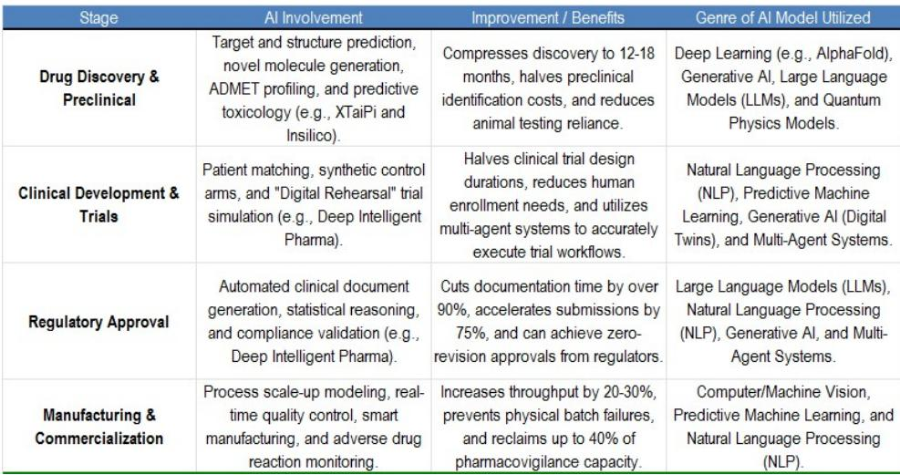
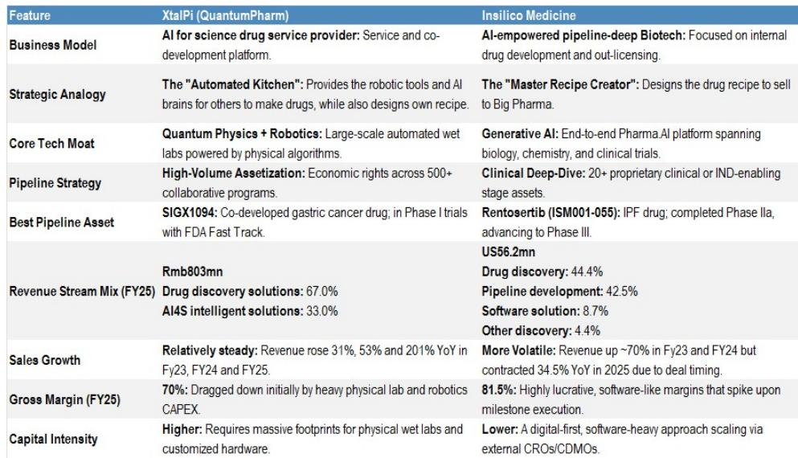
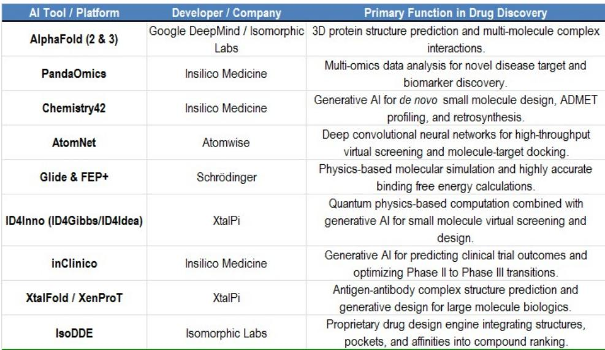

# 中国AI药物发现领域已迎来转折点：早期商业化前景清晰可见

中国AI驱动的药物发现（AIDD）领域已不再是实验室中的假设。它已从业务探索阶段进入早期商业化阶段，这得益于药物研发生产力的可量化提升、与全球制药公司达成的里程碑式合作，以及不断增长的临床催化剂管线。对于一直关注AI生物技术领域发展的观察者而言，相关证据已不再是理论性的：结合干实验室人工智能与自动化湿实验室的闭环平台，已将药物发现周期从数年压缩至数月，命中率提升四倍以上，并将临床前候选药物的生成成本降至300万至500万美元。这些并非行业演示中的理想目标，而是来自运营公司的实际绩效指标。

两家中国AIDD公司——英矽智能（Insilico Medicine）和晶泰科技（XtalPi）——为该主题提供了互补性的观察视角。英矽智能拥有完全自主开发的药物管线。晶泰科技则提供集成服务平台和多元化的收入来源。对两者的研究框架均基于三大支柱：AIDD平台的结构性生产力优势、放大该优势的中国独特成本与监管生态，以及一系列将烧钱型生物技术公司转变为非稀释性收入创造者的商业化事件。

时机之所以重要，是因为该行业的定价仍低于其海外同行。英矽智能和晶泰科技基于2027年预估销售额的隐含市销率分别为19倍和25倍，而海外AIDD公司的平均水平约为63倍。这一差距反映了市场对AIDD能否大规模兑现其承诺的持续疑虑。现有数据表明，它能够做到。

## AIDD平台从根本上重塑药物研发的单位经济性，而不仅仅是速度

AIDD最令人信服的观点并非它使药物发现更快（尽管确实如此），而是它改变了药物研发的基本单位经济性。传统药物发现是一个线性的试错过程。每次实验都会产生数据，但这些数据很少以系统化、机器可读的方式反馈到下一次实验的设计中。AIDD的闭环平台打破了这一循环。当AI模型预测出一个分子结构，自动化湿实验室进行合成和测试，结果反馈回模型时，一个专有的数据飞轮便开始转动。每一次迭代都会优化下一次预测，随着时间的推移不断积累平台的智能。

两家被研究公司的数据说明了这一转变的规模。晶泰科技已证明，其AI驱动的方法可将先导化合物发现从约2.5年压缩至不到2个月。其寻找活性靶点化合物的命中率已从传统环境下的8.5%提升至36%。晶体结构预测（小分子开发中的关键步骤）现已实现100%的成功率，且仅需两到三周而非两个月。对于英矽智能而言，生成临床前候选药物的时间已从4.5年缩短至12至18个月，一期临床成功率已从行业基准的40%至65%提升至估计的80%至90%。

这些效率提升并非边际改善。它们代表了早期药物开发成本和风险状况的结构性转变。英矽智能每个临床前候选药物的平均成本估计为300万至500万美元，仅为传统成本结构的一小部分。更重要的是，从一期到获批的总体成功概率预计将弹性较高，从行业范围的5%至10%提升至9%至18%。仅这一改善就将从根本上改变药物研发组合的回报特征。

对观察者而言重要的是，这些指标并非静态的。随着平台积累更多数据，它们正在持续改善。专有数据飞轮意味着领先AIDD公司的竞争护城河会随时间加宽。后来者无法快速复制这种数据优势，因为它建立在数千次迭代实验之上，没有相同的闭环基础设施，任何单一竞争者都无法复制。

## 中国的结构性成本优势与监管环境为AIDD创造独特沃土

AIDD的研究框架并非与地点无关，而是具有地域特异性。中国AIDD参与者在结构上比许多海外同行更具优势，这一优势根植于中国生命科学生态系统的三个结构性特征。

首先，中国密集的研发基础设施使得AIDD预测能够更快、更廉价地转化为经过验证的资产。该国的合同研究组织、合同开发与生产组织以及学术医疗中心网络，为AI平台生成的预测提供了现成的执行层。当AIDD模型识别出有前景的化合物时，通往合成、测试和临床前验证的路径比在基础设施更分散或成本更高的市场中更短、更便宜。

其次，中国的监管环境正在加速而非阻碍AIDD的执行。国家药品监督管理局已缩短审评时间线，并正在积极构建AI专用框架，以降低将候选药物推进人体测试的摩擦。这并非被动姿态，而是将中国定位为AI驱动药物开发全球中心的明确政策选择。对AIDD公司而言，这转化为更快的临床试验启动和更低的监管不确定性。

第三，或许也是最重要的，是数据获取。中国AIDD公司可以利用来自全国公立医院、覆盖大规模遗传多样性人群的高质量生物学、药学和临床数据。由于隐私法规、数据碎片化或成本问题，这种规模和广度的真实世界临床数据在其他市场难以整合。对于随着每个数据点而改进的AI模型而言，这是一种随时间累积的结构性优势。

其含义是明确的：最能捕捉价值的AIDD公司是那些在中国建立平台并能利用这些结构性优势的公司。海外AIDD公司可能拥有可比的AI能力，但它们在更昂贵、更分散、监管更严格的环境中运营。中国AIDD的单位经济性在结构上更优，且这一优势很可能持续。

## 商业化已到来：里程碑交易、临床催化剂与可预测的收入流

认为AIDD值得研究的论点基于这样一个事实：商业化已不再是承诺，而是正在发生。证据以三种形式呈现：与全球制药公司的里程碑式业务开发交易、验证平台方法的临床催化剂浪潮，以及可预测的服务驱动型收入流的出现。

业务开发数据是最直观的验证。英矽智能已与礼来（Eli Lilly）和SK Pharma签署合作协议，每项协议的总潜在价值约为25亿至27.5亿美元。晶泰科技的合作管线包括多个共同开发项目，在超过500个合作项目中拥有经济权益。这些并非小型探索性交易，而是大型制药公司在完成自身尽职调查后做出的实质性承诺。对于观察者而言，大型药企愿意开出大额支票，是可获得的较强外部验证。

临床催化剂提供了第二层验证。英矽智能的领先资产Rentosertib（一种用于特发性肺纤维化的TNIK抑制剂）是全球最先进的AI发现和AI设计药物，已完成二期a阶段，并在《自然·医学》上发表了阳性数据。它正推进至三期，预计2026年首次患者入组，2029年左右获得顶线数据。第二项资产Garutadustat（一种用于炎症性肠病的肠道限制性PHD抑制剂）已进入二期a阶段。晶泰科技通过其孵化实体Signet，正在推进SIGX2649（一种潜在的首创泛TEAD抑制剂，用于实体瘤），预计将在2026年美国癌症研究协会（AACR）会议上公布临床前数据，并于2026年第三季度进入二期。

这些催化剂不仅对拥有它们的公司重要，对整个行业也意义重大。每一次积极的临床读数都会减少对AIDD估值的疑虑。每一次成功的交易都表明，这些平台能够生成制药公司愿意付费的资产。

第三个商业化渠道是服务驱动型收入。英矽智能和晶泰科技都通过平台许可、订阅费和按服务收费安排建立了可预测的收入流。晶泰科技尤其展示了该模式的稳定性，其2023、2024和2025财年收入同比分别增长31%、53%和201%。毛利率较高，晶泰科技约为70%，英矽智能为81.5%。它们并非烧钱的生物技术公司，而是拥有真实收入、真实利润和盈利路径的企业。

## 基础设施与管线配置的决策框架

对于接受AIDD研究框架的观察者而言，问题变成了组合构建。英矽智能和晶泰科技代表了两种不同的研究画像，在两者之间进行配置的决策框架应基于风险承受能力、时间跨度以及对催化剂弹性和基础设施稳定性的期望平衡。

英矽智能是管线型选择。其业务模式以内部药物开发和对外授权为中心。公司大部分收入来自药物发现合作和管线开发，药物发现占2025财年收入的44.4%，管线开发贡献42.5%。其利润率类似软件公司，并在里程碑达成时飙升。风险状况是二元化的：Rentosertib成功的三期读数将是变革性的，但临床试验失败仍是真实风险。英矽智能对AIDD催化剂具有高贝塔值。

晶泰科技是基础设施型选择。其业务模式更加多元化，结合了药物发现解决方案（占2025财年收入的67%）和AI for Science智能解决方案（33%），后者以其机器人驱动的湿实验室平台为支撑。收入增长更稳定，公司已实现盈利。风险状况较低，但任何单一催化剂带来的上行弹性也较小。晶泰科技提供稳定性：可预测的收入、跨越数百个合作项目的多元化敞口，以及比任何单一药物资产更难复制的平台。

战略类比很有用。英矽智能是配方创造者，设计药物配方并授权给大型药企。晶泰科技是自动化厨房，为他人提供机器人工具和AI大脑来制造药物，同时也在开发自己的配方。它们是互补而非竞争关系。希望接触AIDD主题的观察者应考虑同时持有两者，倾向于英矽智能以获取催化剂驱动的上行空间，倾向于晶泰科技以获取组合稳定性。

估值框架支持这一方法。在分部加总分析中，两家公司都被赋予了传统行业倍数之上的AI溢价。晶泰科技的化学合成服务基于2027年预估的企业价值/销售额约为21倍，相对于中国合同研究组织行业5倍的倍数，代表了约4倍的AI溢价。英矽智能的药物发现合作业务约为19倍，相对于中国生物科技行业9倍的倍数，代表了约2倍的AI溢价。这些溢价反映了已证实的研发效率提升，但仍远低于海外AIDD同行被赋予的倍数。重新评级的机会是真实的。

风险不可忽视。临床试验失败、业务开发收入低于预期、中美药物授权摩擦，以及AIDD模型可能无法跨治疗领域泛化，都是真实存在的担忧。但该行业的结构性理由比以往任何时候都更充分。平台有效，数据证明了这一点，商业化正在发生。与海外同行的折价是显著的。对于一直在等待证据再投入关注的观察者而言，证据现已摆在面前。

*仅供参考。部分内容可能基于源材料通过AI辅助生成、翻译、总结或编辑，可能存在遗漏或错误。请独立核实。这不构成研究、法律、税务、会计或其他专业建议。*

仅供参考。部分内容可能基于源材料通过AI辅助生成、翻译、总结或编辑，可能存在遗漏或错误。请独立核实。这不构成研究、法律、税务、会计或其他专业建议。

