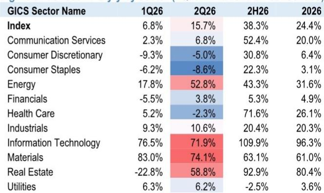
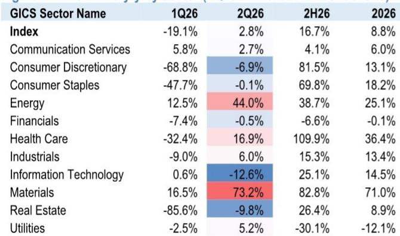
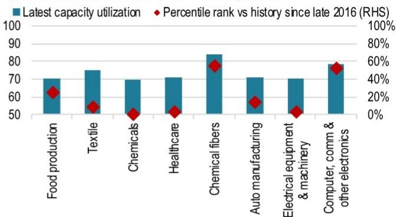

# 行业规则与主题变化观察

AI驱动的科技公司报价调整之后，中国权益市场迎来政策回应。相关机构在最新中国权益市场研究报告中指出，中国诚通和国新控股在上周末宣布合计600亿元人民币的场内公司与ETF购买计划，且科技公司被明确纳入购买范围，与央企公司和ETF并列。该机构ETF流量追踪数据显示，过去一周基准ETF以及科创50、科创芯片等AI/科技主题产品均出现资金快速逆转。相关市场每日回购规模也升至年内高点。报告认为，二季度业绩期将成为检验板块真实盈利动能的关键窗口，而非AI和国内需求板块的基本面支撑目前仍有限。

## 1. 二季度盈利预期处于可实现区间，但板块间分化明显

相关机构测算，MSCI中国指数和沪深300指数二季度每股盈利同比增速的共识预期分别为2.8%和15.7%。该机构认为这一预期在没有大幅下修的情况下可以实现。上游大宗商品、信息技术、工业和非银行资金板块的韧性表现，应能部分抵消消费、地产、传统基建及相关上游板块的持续不确定性。但板块内部的分化同样显著——以互联网平台为例，AI云服务收入质量在改善，但高资本开支和再研究周期仍在压缩底线利润共识。

> **观察：** 报告强调二季度盈利预期并非高不可攀，但“可实现”不等于“全面好转”。真正需要关注的是板块间盈利趋势的裂口：IT和工业在扩张，消费和地产在调整，这种分化可能比整体数字更重要。

## 2. 互联网板块呈现收入增长但盈利持平的动态

报告将互联网板块的现状概括为“收入向上、盈利持平”。核心业务运营动能与AI加速研究对利润的稀释效应之间存在拉锯。以某公司为例，相关机构预计其二季度收入同比增长约9%，其中增值服务增长5-6%，游戏增长9-10%，营销服务增长18-19%，资金科技增长约5%；但全年资本开支预估上调至2000亿元人民币后，调整后每股盈利被下调5%。另一家公司方面，云业务盈利大幅上修预计将被核心电商客户管理收入持续调整所抵消。某公司广告收入预计二季度同比下降约23%，全年下降约21%，尽管AI云收入同比增长87%。

该机构认为，互联网板块并非经历传统盈利下修周期，而是处于一个主动再研究周期——压缩近期利润以换取长期期权价值，市场仍在重新定价这一过程。

## 3. 信息技术与工业板块盈利动能领先

报告识别出三个可能表现较好的板块。信息技术与AI供应链方面，全球AI资本开支仍是国内科技硬件生态系统的核心结构性驱动力。国内AI基础设施建设和海外超大规模云服务商需求构成的“双循环”持续推动出口和电子供应链盈利。半导体设备板块正面盈利预警比例达70%，沪深300中IT板块二季度EPS同比增长72%，全年共识为96%。材料板块中与先进制造相关的特种化学品和新材料也在受益。

工业与先进制造方面，规模以上工业企业营业利润增速持续超过收入增速，表明净利率在持续改善。机械、高端装备和国防承包商订单转化明显，汽车制造和化纤产能利用率处于历史高位。沪深300工业板块二季度EPS同比增长10.6%，全年共识为20.3%。机械和电气设备板块正面盈利预警比例分别达85.7%和69.8%，显示改善具有广泛基础而非个别现象。

资金板块受益于资本市场复苏，日均相关市场成交额同比增长一倍，机构是主要受益者。保险公司的股权研究浮动收益也在明显恢复。

## 4. 消费与地产板块仍构成主要影响

报告指出两个可能表现相对一般的板块。地产及后周期链条仍是整体盈利的最大影响因素。30城商品房销售继续同比调整，未见拐点。建材、家电和家具面临持续收入不确定性，叠加树脂等原材料成本上涨。家具行业前五个月营业利润同比下降59%，房地产开发商和管理公司中发布盈利预警的企业首亏比例达18.7%。

消费板块正面临去年以旧换新补贴政策带来的高基数效应。汽车和家电销售增速在二季度明显节奏变化。汽车行业前五个月营业利润同比下降20%，汽车零部件首亏比例14.1%。MSCI中国消费可选板块二季度EPS共识为同比下降6.9%。即便必需消费也在承压，食品和饮料板块盈利下降比例较高。

报告维持对MSCI中国指数和沪深300指数2026年底的基础情景目标，并认为如果6月宏观环境数据和三季度动能持续偏弱，7月政治局会议后可能推出额外政策支持。

For informational purposes only. Portions may be generated,translated,summarized,or edited with AI assistance based on source materials and may contain omissions or errors. Please verify independently. This is not investment,legal,tax,accounting,or other professional advice.

