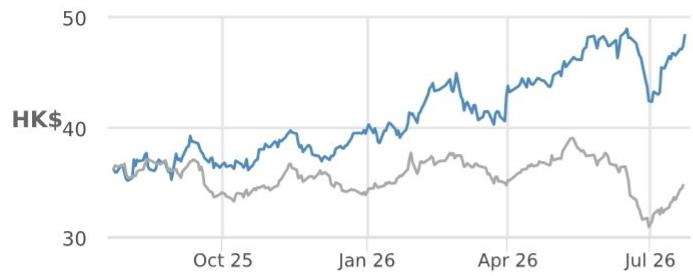
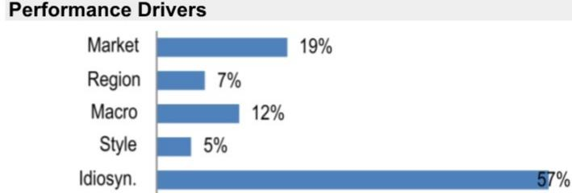

# 中银香港（2388）

## 股东总回报表现优异，有望持续跑赢，上调至增持

我们将中银香港评级从中性上调至增持，新的2027年12月目标价为53.3港元。我们上调2026/2027财年盈利预测8%/9%，并预计在估值仍属合理且股东总回报表现优异的背景下，未来6-12个月股价有望持续跑赢。

- **净息差走势稳健，支撑净利息收入。** 考虑到美联储利率会议偏鹰派基调，以及未来12-18个月SOFR和HIBOR远期回报表现曲线上升，我们预计中银香港在2026和2027财年净息差将维持在约1.6%的水平（经调整口径，含掉期收入），而此前我们预计未来两年将逐年同比下降3-4个基点。这将使2026财年净利息收入实现高个位数增长。

- **香港商业地产敞口担忧缓解。** 行业数据及与管理层的沟通均显示，2026年上半年香港商业地产组合未出现重大新增不良贷款，因此我们预计2026年上半年及全年信用成本将同比下降。信用成本的逐年下降将成为2026-2028财年的盈利支撑因素。

- **股东回报计划或成为股价催化剂。** 市场已对股东总回报提升措施有所预期，包括股份回购或特别股息，相当于在普通股息之外增加1.0-1.5%的回报表现。我们的分析显示，中银香港有能力在2026-2028财年每年向股东提供最高3%的回报，同时保持核心一级资本充足率高于行业平均水平。我们的基准情景是每年派发特别股息0.95港元，为股东总回报再增加2个百分点。

- **上调至增持。** 我们的新目标价基于1.4倍市净率，并将估值基准向前推至2027年12月；该估值倍数基于我们对2026和2027财年13%的净资产回报表现预测。年初至今股价已跑赢恒生指数29%，但当前水平仍意味着相对我们的公允价值存在上行空间，且股东总回报接近8%，因此我们预计未来6-12个月股价将持续跑赢。下行风险包括与万科相关贷款可能被下调评级导致成本显著上升，或更不利的境外直接投资规则变化影响市场情绪。

## ▲ 增持

此前：中性

2388.HK, 2388 HK
价格（2026年7月23日）：48.36港元

▲ 目标价（2027年12月）：53.30港元
此前（2026年12月）：43.30港元

## 香港亚洲金融板块

Jemmy S Huang AC  
(886-2) 2725-9870  
jemmy.s.huang@JPM.com  
摩根证券（台湾）有限公司/摩根证券（亚太）有限公司/摩根经纪（香港）有限公司

## Amanda Chang

(886-2) 2725-9861
amanda.chang@JPM.com
摩根证券（台湾）有限公司

## Haomin Chen

(86-21) 6106 6347  
haomin.chen@JPM.com  
SAC注册编号：S1730524080002  
摩根证券（中国）有限公司

Katherine Lei  
(852) 2800-8552  
katherine.lei@JPM.com  
摩根证券（亚太）有限公司/摩根经纪（香港）有限公司

来源：风格暴露——摩根全球市场策略；其他表格均为公司数据和摩根估计。

主要变动（财年截至12月）

<table><tr><td></td><td>此前</td><td>当前</td><td>变动</td></tr><tr><td>调整后每股收益 - 2026财年（港元）</td><td>4.16</td><td>4.49</td><td>7.8%</td></tr><tr><td>调整后每股收益 - 2027财年（港元）</td><td>4.49</td><td>4.90</td><td>9.1%</td></tr></table>

风格暴露

<table><tr><td rowspan="2">量化因子</td><td rowspan="2">当前百分位排名</td><td colspan="4">历史百分位排名（1=最高）</td></tr><tr><td>6个月</td><td>1年</td><td>3年</td><td>5年</td></tr><tr><td>价值</td><td>60</td><td>49</td><td>49</td><td>35</td><td>55</td></tr><tr><td>成长</td><td>28</td><td>32</td><td>63</td><td>34</td><td>32</td></tr><tr><td>动量</td><td>25</td><td>42</td><td>16</td><td>79</td><td>68</td></tr><tr><td>质量</td><td>13</td><td>9</td><td>36</td><td>13</td><td>11</td></tr><tr><td>低波动</td><td>15</td><td>12</td><td>13</td><td>15</td><td>9</td></tr><tr><td>ESGQ</td><td>24</td><td>20</td><td>91</td><td>86</td><td>18</td></tr></table>

## 参见第5页分析师认证和重要披露，包括非美国分析师披露。

JPM从事并寻求与其研究报告所覆盖的公司开展业务。因此，读者应注意，该公司可能存在影响本报告客观性的利益冲突。读者应将本报告视为做出投资决策的单一因素。

价格表现  

— 2388.HK 价格（港元） R-CHIP（重设基准）

<table><tr><td></td><td>年初至今</td><td>1个月</td><td>3个月</td><td>12个月</td></tr><tr><td>相对</td><td>22.7%</td><td>2.9%</td><td>9.4%</td><td>33.6%</td></tr><tr><td>相对</td><td>20.1%</td><td>-3.1%</td><td>15.0%</td><td>37.6%</td></tr></table>

<table><tr><td colspan="2">公司数据</td></tr><tr><td>流通股数（百万）</td><td>10,573</td></tr><tr><td>52周区间（港元）</td><td>49.36-34.80</td></tr><tr><td>市值（百万美元）</td><td>65,209</td></tr><tr><td>汇率</td><td>7.84</td></tr><tr><td>自由流通比例（%）</td><td>33.9%</td></tr><tr><td>3个月日均成交量（百万股）</td><td>13.12</td></tr><tr><td>3个月日均成交额（百万美元）</td><td>77.3</td></tr><tr><td>波动率（90天）</td><td>24</td></tr><tr><td>指数</td><td>HSCCI</td></tr><tr><td>彭博分析师评级（买入|持有|卖出）</td><td>13|4|1</td></tr></table>

<table><tr><td colspan="5">关键指标（财年截至12月）</td></tr><tr><td>百万港元</td><td>2025财年</td><td>2026财年预测</td><td>2027财年预测</td><td>2028财年预测</td></tr><tr><td>财务估计</td><td></td><td></td><td></td><td></td></tr><tr><td>净利息收入</td><td>52,911</td><td>58,021</td><td>61,860</td><td>68,438</td></tr><tr><td>非利息收入</td><td>24,108</td><td>25,226</td><td>26,694</td><td>28,168</td></tr><tr><td>营业支出</td><td>(18,193)</td><td>(19,019)</td><td>(20,116)</td><td>(21,286)</td></tr><tr><td>调整后拨备前营业利润</td><td>58,826</td><td>64,228</td><td>68,438</td><td>75,321</td></tr><tr><td>贷款损失拨备</td><td>(8,294)</td><td>(6,185)</td><td>(5,627)</td><td>(5,054)</td></tr><tr><td>调整后税前利润</td><td>48,574</td><td>57,551</td><td>62,822</td><td>70,284</td></tr><tr><td>调整后净利润</td><td>40,121</td><td>47,455</td><td>51,793</td><td>57,969</td></tr><tr><td>调整后每股收益</td><td>3.79</td><td>4.49</td><td>4.90</td><td>5.48</td></tr><tr><td>彭博每股收益</td><td>3.72</td><td>3.98</td><td>4.24</td><td>4.52</td></tr><tr><td>每股股息</td><td>2.12</td><td>2.56</td><td>2.84</td><td>3.23</td></tr><tr><td>贷款</td><td>1,697,030</td><td>1,782,918</td><td>1,890,330</td><td>2,004,769</td></tr><tr><td>存款</td><td>2,933,502</td><td>3,168,182</td><td>3,389,955</td><td>3,627,252</td></tr><tr><td>总资产</td><td>4,489,809</td><td>4,795,763</td><td>5,090,592</td><td>5,405,018</td></tr><tr><td>利润率与增长</td><td></td><td></td><td></td><td></td></tr><tr><td>净息差</td><td>1.4%</td><td>1.4%</td><td>1.4%</td><td>1.5%</td></tr><tr><td>比率</td><td></td><td></td><td></td><td></td></tr><tr><td>贷存比</td><td>58.5%</td><td>56.9%</td><td>56.3%</td><td>55.8%</td></tr><tr><td>不良贷款率</td><td>1.1%</td><td>1.1%</td><td>1.0%</td><td>0.9%</td></tr><tr><td>拨备覆盖率</td><td>95.9%</td><td>99.0%</td><td>105.9%</td><td>113.7%</td></tr><tr><td>核心一级资本充足率</td><td>-</td><td>-</td><td>-</td><td>-</td></tr><tr><td>非利息收入占比</td><td>31.3%</td><td>30.3%</td><td>30.1%</td><td>29.2%</td></tr><tr><td>成本收入比</td><td>23.6%</td><td>22.8%</td><td>22.7%</td><td>22.0%</td></tr><tr><td>贷款损失拨备率</td><td>(0.5%)</td><td>(0.4%)</td><td>(0.3%)</td><td>(0.3%)</td></tr><tr><td>总资产回报表现</td><td>0.9%</td><td>1.0%</td><td>1.0%</td><td>1.1%</td></tr><tr><td>净资产回报表现</td><td>11.5%</td><td>12.9%</td><td>13.2%</td><td>14.0%</td></tr><tr><td>估值</td><td></td><td></td><td></td><td></td></tr><tr><td>股息率</td><td>4.4%</td><td>5.3%</td><td>5.9%</td><td>6.7%</td></tr><tr><td>调整后市盈率</td><td>12.7</td><td>10.8</td><td>9.9</td><td>8.8</td></tr><tr><td>市净率</td><td>1.4</td><td>1.3</td><td>1.3</td><td>1.2</td></tr></table>

## 投资主题与估值总结

我们对中银香港持增持评级。考虑到更有利的净息差走势以及较低的信用成本和非经营性损失，我们认为2026和2027财年盈利存在上行空间。由于资产质量担忧缓解以及股东总回报提升措施预期升温，股价已跑赢恒生指数，但当前股价水平仍意味着相对我们的公允价值存在上行空间，且股东总回报接近8%，因此我们预计未来6-12个月股价将持续跑赢。

我们的2027年12月目标价53.3港元基于2027财年预测市净率1.4倍。我们认为该倍数在13%的净资产回报表现展望下是合理的。目标价隐含2027财年预测市盈率10.9倍。

表现驱动因素  

<table><tr><td>因素</td><td>6个月相关性</td><td>1年相关性</td></tr><tr><td>市场：MSCI亚太（除日本）</td><td>0.50</td><td>0.43</td></tr><tr><td>区域：香港</td><td>0.36</td><td>0.29</td></tr><tr><td colspan="3">宏观：</td></tr><tr><td>新兴经济体CPI（同比）</td><td>0.41</td><td>0.29</td></tr><tr><td>摩根全球市场情绪指数</td><td>-0.33</td><td>-0.23</td></tr><tr><td>Markit新兴市场综合PMI（季调）</td><td>-0.39</td><td>-0.23</td></tr><tr><td colspan="3">量化风格：</td></tr><tr><td>低波动</td><td>0.18</td><td>0.23</td></tr><tr><td>股息率</td><td>0.22</td><td>0.23</td></tr><tr><td>质量</td><td>0.01</td><td>0.21</td></tr></table>

## 投资主题、估值与风险

中银香港（增持；目标价：53.30港元）

## 投资主题

我们对中银香港持增持评级。考虑到更有利的净息差走势以及较低的信用成本和非经营性损失，我们认为2026和2027财年盈利存在上行空间。由于资产质量担忧缓解以及股东总回报提升措施预期升温，股价已跑赢恒生指数，但当前股价水平仍意味着相对我们的公允价值存在上行空间，且股东总回报接近8%，因此我们预计未来6-12个月股价将持续跑赢。

## 估值

我们的2027年12月目标价53.3港元基于2027财年预测市净率1.4倍。我们认为1.4倍的倍数在13%的净资产回报表现展望下是合理的。目标价隐含2027财年预测市盈率10.9倍。

## 评级与目标价风险

下调风险包括：

- 与万科相关贷款被下调评级导致信用成本更显著上升。
- 更不利的境外直接投资规则变化影响市场情绪。
- HIBOR走势弱于预期导致净息差进一步收窄。

上行催化剂包括：

- 潜在股份回购/特别股息以提升股东总回报。
- 净息差扩张好于预期以及HIBOR大幅上升。
- 银团贷款/财富管理业务流量增强支撑手续费收入增长。

中银香港（2388）：财务摘要

<table><tr><td>利润表</td><td>2024财年</td><td>2025财年</td><td>2026财年预测</td><td>2027财年预测</td><td>2028财年预测</td></tr><tr><td>利息收入</td><td>139,439</td><td>120,355</td><td>116,990</td><td>124,724</td><td>137,136</td></tr><tr><td>利息支出</td><td>(87,105)</td><td>(67,444)</td><td>(58,969)</td><td>(62,864)</td><td>(68,697)</td></tr><tr><td>净利息收入</td><td>52,334</td><td>52,911</td><td>58,021</td><td>61,860</td><td>68,438</td></tr><tr><td>非利息收入</td><td>18,919</td><td>24,108</td><td>25,226</td><td>26,694</td><td>28,168</td></tr><tr><td>其中：手续费收入</td><td>9,893</td><td>11,269</td><td>12,160</td><td>13,402</td><td>14,666</td></tr><tr><td>其中：交易收入</td><td>10,483</td><td>15,095</td><td>15,707</td><td>16,221</td><td>16,752</td></tr><tr><td>净收入</td><td>71,253</td><td>77,019</td><td>83,247</td><td>88,553</td><td>96,607</td></tr><tr><td>非利息支出</td><td>(17,494)</td><td>(18,193)</td><td>(19,019)</td><td>(20,116)</td><td>(21,286)</td></tr><tr><td>其中：员工成本</td><td>(11,470)</td><td>(12,066)</td><td>(12,769)</td><td>(13,532)</td><td>(14,347)</td></tr><tr><td>拨备前利润</td><td>53,759</td><td>58,826</td><td>64,228</td><td>68,438</td><td>75,321</td></tr><tr><td>拨备</td><td>(5,082)</td><td>(8,294)</td><td>(6,185)</td><td>(5,627)</td><td>(5,054)</td></tr><tr><td>调整后税前利润</td><td>46,754</td><td>48,574</td><td>57,551</td><td>62,822</td><td>70,284</td></tr><tr><td>所得税</td><td>(7,636)</td><td>(7,385)</td><td>(8,920)</td><td>(9,737)</td><td>(10,894)</td></tr><tr><td>少数股东权益</td><td>(885)</td><td>(1,068)</td><td>(1,175)</td><td>(1,292)</td><td>(1,422)</td></tr><tr><td>调整后净利润</td><td>38,233</td><td>40,121</td><td>47,455</td><td>51,793</td><td>57,969</td></tr><tr><td>每股拨备前利润</td><td>5.08</td><td>5.56</td><td>6.07</td><td>6.47</td><td>7.12</td></tr><tr><td>报告每股收益</td><td>3.62</td><td>3.79</td><td>4.49</td><td>4.90</td><td>5.48</td></tr><tr><td>调整后每股收益</td><td>3.62</td><td>3.79</td><td>4.49</td><td>4.90</td><td>5.48</td></tr></table>

<table><tr><td>每股股息</td><td>1.99</td><td>2.12</td><td>2.56</td><td>2.84</td><td>3.23</td></tr><tr><td>稀释后流通股数</td><td>10,573</td><td>10,573</td><td>10,573</td><td>10,573</td><td>10,573</td></tr><tr><td>资产负债表杠杆</td><td>2024财年</td><td>2025财年</td><td>2026财年预测</td><td>2027财年预测</td><td>2028财年预测</td></tr><tr><td>贷存比</td><td>61.8%</td><td>58.5%</td><td>56.9%</td><td>56.3%</td><td>55.8%</td></tr><tr><td>投资/资产</td><td>36.4%</td><td>38.3%</td><td>40.9%</td><td>41.8%</td><td>42.0%</td></tr><tr><td>贷款/资产</td><td>41.9%</td><td>39.1%</td><td>37.9%</td><td>37.5%</td><td>37.5%</td></tr><tr><td>客户存款/负债</td><td>70.4%</td><td>71.1%</td><td>71.8%</td><td>72.4%</td><td>73.0%</td></tr><tr><td>长期债务/负债</td><td>17.7%</td><td>16.5%</td><td>15.9%</td><td>15.3%</td><td>14.8%</td></tr></table>

<table><tr><td>比率分析（%）</td><td>2024财年</td><td>2025财年</td><td>2026财年预测</td><td>2027财年预测</td><td>2028财年预测</td></tr><tr><td>净息差</td><td>1.5%</td><td>1.4%</td><td>1.4%</td><td>1.4%</td><td>1.5%</td></tr><tr><td>非利息收入/净收入</td><td>26.6%</td><td>31.3%</td><td>30.3%</td><td>30.1%</td><td>29.2%</td></tr><tr><td>非利息收入/平均资产</td><td>0.5%</td><td>0.6%</td><td>0.5%</td><td>0.5%</td><td>0.5%</td></tr><tr><td>效率比率</td><td>24.6%</td><td>23.6%</td><td>22.8%</td><td>22.7%</td><td>22.0%</td></tr><tr><td>杠杆比率</td><td>6.4%</td><td>6.3%</td><td>6.3%</td><td>6.3%</td><td>6.3%</td></tr><tr><td>收入/资产</td><td>1.8%</td><td>1.8%</td><td>1.8%</td><td>1.8%</td><td>1.8%</td></tr><tr><td>风险加权资产回报表现</td><td>2.9%</td><td>3.1%</td><td>3.7%</td><td>3.8%</td><td>4.0%</td></tr><tr><td>风险加权资产</td><td>1,331,828</td><td>1,231,680</td><td>1,315,612</td><td>1,396,492</td><td>1,482,747</td></tr><tr><td>平均风险加权资产</td><td>1,315,392</td><td>1,281,754</td><td>1,273,646</td><td>1,356,052</td><td>1,439,619</td></tr><tr><td>平均生息资产</td><td>3,577,886</td><td>3,770,340</td><td>4,034,150</td><td>4,300,827</td><td>4,571,188</td></tr><tr><td>贷款总额</td><td>1,676,886</td><td>1,715,787</td><td>1,802,286</td><td>1,910,016</td><td>2,024,837</td></tr><tr><td>平均计息负债</td><td>3,262,316</td><td>3,481,442</td><td>3,728,159</td><td>3,974,432</td><td>4,222,555</td></tr><tr><td>贷款损失准备</td><td>(14,960)</td><td>(18,757)</td><td>(19,368)</td><td>(19,685)</td><td>(20,068)</td></tr><tr><td>不良贷款</td><td>17,652</td><td>19,558</td><td>19,558</td><td>18,580</td><td>17,651</td></tr><tr><td>市净率（倍）</td><td>1.5</td><td>1.4</td><td>1.3</td><td>1.3</td><td>1.2</td></tr><tr><td>调整后市盈率（倍）</td><td>13.4</td><td>12.7</td><td>10.8</td><td>9.9</td><td>8.8</td></tr><tr><td>股息率</td><td>4.1%</td><td>4.4%</td><td>5.3%</td><td>5.9%</td><td>6.7%</td></tr><tr><td>股息支付率</td><td>55.0%</td><td>56.0%</td><td>57.0%</td><td>58.0%</td><td>59.0%</td></tr></table>

来源：公司报告和摩根估计。
注：百万港元（除每股数据外）。财年截至12月。

<table><tr><td>资产负债表</td><td>2024财年</td><td>2025财年</td><td>2026财年预测</td><td>2027财年预测</td><td>2028财年预测</td></tr><tr><td>现金及现金等价物</td><td>0</td><td>0</td><td>0</td><td>0</td><td>0</td></tr><tr><td>存放同业</td><td>734,766</td><td>634,525</td><td>634,525</td><td>666,251</td><td>699,564</td></tr><tr><td>贷款净额</td><td>1,661,926</td><td>1,697,030</td><td>1,782,918</td><td>1,890,330</td><td>2,004,769</td></tr><tr><td>物业、厂房及设备</td><td>38,242</td><td>33,770</td><td>34,783</td><td>35,827</td><td>36,901</td></tr><tr><td>无形资产净额</td><td>0</td><td>0</td><td>0</td><td>0</td><td>0</td></tr><tr><td>长期投资</td><td>1,530,192</td><td>1,797,224</td><td>1,997,938</td><td>2,132,995</td><td>2,277,655</td></tr><tr><td>其他资产</td><td>229,282</td><td>327,260</td><td>345,598</td><td>365,190</td><td>386,129</td></tr><tr><td>总资产</td><td>4,194,408</td><td>4,489,809</td><td>4,795,763</td><td>5,090,592</td><td>5,405,018</td></tr><tr><td>生息资产</td><td>4,029,939</td><td>4,313,004</td><td>4,613,693</td><td>4,903,101</td><td>5,211,944</td></tr><tr><td>存款</td><td>2,713,410</td><td>2,933,502</td><td>3,168,182</td><td>3,389,955</td><td>3,627,252</td></tr><tr><td>借款</td><td>647,544</td><td>668,427</td><td>686,207</td><td>704,521</td><td>723,384</td></tr><tr><td>其他负债</td><td>491,224</td><td>524,405</td><td>555,633</td><td>586,538</td><td>619,280</td></tr><tr><td>总负债</td><td>3,852,178</td><td>4,126,334</td><td>4,410,022</td><td>4,681,013</td><td>4,969,916</td></tr><tr><td>股东权益</td><td>338,716</td><td>358,528</td><td>379,619</td><td>402,165</td><td>426,267</td></tr><tr><td>少数股东权益</td><td>3,514</td><td>4,947</td><td>6,122</td><td>7,414</td><td>8,836</td></tr><tr><td>总负债及股东权益</td><td>4,194,408</td><td>4,489,809</td><td>4,795,763</td><td>5,090,592</td><td>5,405,018</td></tr><tr><td>计息负债</td><td>3,360,954</td><td>3,601,929</td><td>3,854,389</td><td>4,094,476</td><td>4,350,635</td></tr><tr><td>每股账面价值</td><td>32.04</td><td>33.91</td><td>35.91</td><td>38.04</td><td>40.32</td></tr><tr><td>每股有形账面价值</td><td>32.37</td><td>34.38</td><td>36.48</td><td>38.74</td><td>41.15</td></tr><tr><td>资产质量/资本</td><td>2024财年</td><td>2025财年</td><td>2026财年预测</td><td>2027财年预测</td><td>2028财年预测</td></tr><tr><td>贷款损失准备/贷款</td><td>(0.9%)</td><td>(1.1%)</td><td>(1.1%)</td><td>(1.0%)</td><td>(1.0%)</td></tr><tr><td>不良贷款率</td><td>1.1%</td><td>1.1%</td><td>1.1%</td><td>1.0%</td><td>0.9%</td></tr><tr><td>贷款损失准备/不良贷款</td><td>83.7%</td><td>90.6%</td><td>97.5%</td><td>102.4%</td><td>109.7%</td></tr><tr><td>不良贷款同比增长</td><td>(0.8%)</td><td>10.8%</td><td>0.0%</td><td>(5.0%)</td><td>(5.0%)</td></tr><tr><td>一级资本充足率</td><td>19.3%</td><td>22.2%</td><td>22.2%</td><td>22.2%</td><td>22.3%</td></tr><tr><td>资本充足率</td><td>22.0%</td><td>26.0%</td><td>24.6%</td><td>24.6%</td><td>24.5%</td></tr><tr><td>比率分析（%）</td><td>2024财年</td><td>2025财年</td><td>2026财年预测</td><td>2027财年预测</td><td>2028财年预测</td></tr><tr><td>净资产回报表现</td><td>11.6%</td><td>11.5%</td><td>12.9%</td><td>13.2%</td><td>14.0%</td></tr><tr><td>总资产回报表现</td><td>0.9%</td><td>0.9%</td><td>1.0%</td><td>1.0%</td><td>1.1%</td></tr><tr><td>营业资产回报表现</td><td>1.2%</td><td>1.2%</td><
