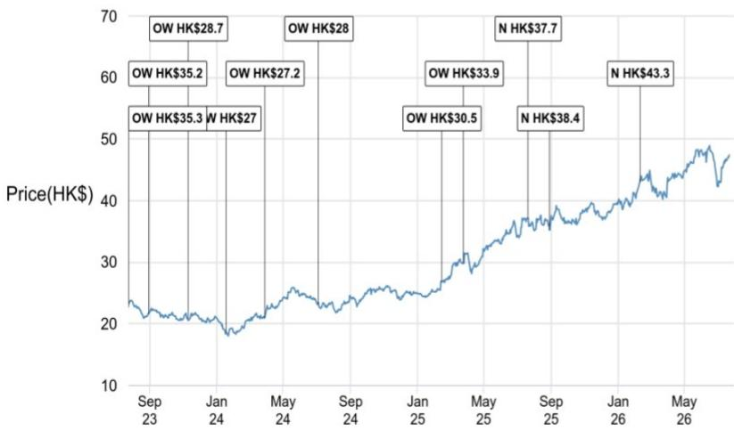
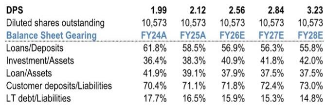
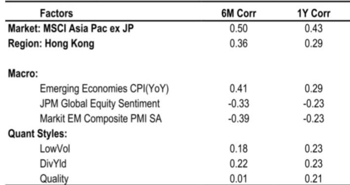

# JPM：中银香港，净息差预期与股东回报关注焦点

JPM近期调整了对中银香港（2388.HK）的观察框架，核心变化在于对净息差走势的重新判断。该机构此前预计中银香港未来两年净息差将逐年收窄3至4个基点，但基于美联储利率会议偏鹰的表态以及SOFR和HIBOR远期回报表现曲线的上升，现在认为其净息差（含掉期收入调整后）在FY26和FY27两个财年均可维持在约1.6%的水平。这一修正直接带动了FY26和FY27盈利预测分别上调8%和9%。

净息差预期的改变，意味着中银香港的净利息收入在FY26有望实现高个位数增长。这与此前市场普遍认为香港银行息差已见顶的判断形成差异。报告同时指出，香港商业地产贷款组合在2026年上半年未出现新的实质性违约形成，行业数据和管理层沟通均支持这一观察。如果信用成本按年下降的趋势在FY26和FY27延续，将构成额外的盈利支撑。

> **KC评论：** 净息差预期从“逐年收窄”转为“持稳”，是这份报告最关键的判断变化。读者需要留意的是，这一结论高度依赖美联储后续利率路径和HIBOR走势，并非银行自身经营可以完全控制。

股东回报是另一个被重点讨论的维度。市场已经部分定价了中银香港可能推出的股东回报增强措施，包括股份回购或特别股息，预期这部分相当于在普通股息之外额外提供1.0至1.5个百分点的回报表现。JPM的分析显示，中银香港在FY26至FY28期间，有能力在保持核心一级资本充足率高于行业平均水平的前提下，每年向股东提供最高约3个百分点的额外回报表现。其基准情景是每年派发特别股息每股0.95港元，相当于为总股东回报再增加约2个百分点。

从估值角度看，对应FY27预期市净率1.4倍。这一倍数基于其对FY26和FY27净资产回报表现约13%的预测。报告认为，尽管中银香港相关市场价年初至今已跑赢恒生指数约29个百分点，但当前价位相对于其公允价值仍有空间，且隐含的总股东回报接近8%。

## 1. 净息差预期从收窄转为持稳，支撑利息收入增长

报告对净息差判断的修正，是此次调整评级和盈利预测的核心依据。此前市场普遍预期香港银行净息差已接近周期高点，未来将逐步回落。但JPM认为，美联储利率会议释放的偏鹰信号，以及SOFR和HIBOR远期回报表现曲线在接下来12至18个月的上升趋势，将帮助中银香港维持净息差稳定。具体而言，含掉期收入调整后的净息差在FY26和FY27均可保持在约1.6%，而非此前预测的逐年下降。

这一判断意味着中银香港的净利息收入在FY26有望实现高个位数增长。从财务数据看，该行FY25净利息收入为529亿港元，报告预测FY26将增至580亿港元，FY27进一步升至619亿港元。利息收入的稳定增长，为整体盈利提供了基础支撑。

## 2. 香港商业地产信用不确定性未出现新的实质变化

香港商业地产贷款的质量，一直是市场对中银香港的主要关注点之一。报告指出，行业数据和管理层沟通均显示，2026年上半年该组合未出现新的实质性违约形成。这意味着中银香港在FY26和FY27的信用成本有望按年下降。

从数据看，该行FY25贷款损失拨备为83亿港元，报告预测FY26将降至62亿港元，FY27进一步降至56亿港元。信用成本的下降，在净息差稳定的背景下，将直接转化为盈利增长。报告同时提示，与万科相关的贷款如果出现评级下调，可能导致信用成本显著上升，这是需要持续跟踪的不确定性因素。

## 3. 股东回报增强措施可能成为短期关注点

市场已经部分反映了对中银香港推出股东回报增强措施的预期。报告认为，无论是股份回购还是特别股息，都有可能成为报价的短期催化剂。其分析显示，中银香港在FY26至FY28期间，有能力在维持核心一级资本充足率高于行业平均水平的前提下，每年向股东提供最高约3个百分点的额外回报表现。

基准情景是每年派发特别股息每股0.95港元。如果实现，加上普通股息，中银香港FY26的股息回报表现将从5.3%进一步提升。报告也指出，更强的银团贷款和财富管理业务流量，可能为手续费收入提供额外支撑，从而增强整体股东回报能力。

> **KC评论：** 股东回报能力的关键在于资本充足率是否允许。报告认为中银香港有空间，但这一判断需要持续验证，尤其是在信用成本或监管环境发生变化时。

## 4. 估值框架与不确定性因素

基于FY27预期市净率1.4倍，对应FY27预期市盈率约10.9倍。这一估值倍数建立在对FY26和FY27净资产回报表现约13%的预测之上。报告认为，尽管报价年初至今已有明显表现，但当前价位相对于其公允价值仍有空间，且隐含的总股东回报接近8%。

不确定性方面，报告列出了几个需要关注的因素：与万科相关的贷款如果出现评级下调，可能导致信用成本显著上升；更不利的境外直接研究规则变化可能影响市场情绪；HIBOR走势弱于预期则可能导致净息差进一步收窄。这些因素都可能对中银香港的盈利和估值产生影响。

For informational purposes only. Portions may be generated,translated,summarized,or edited with AI assistance based on source materials and may contain omissions or errors. Please verify independently. This is not investment,legal,tax,accounting,or other professional advice.

For informational purposes only. Portions may be generated,translated,summarized,or edited with AI assistance based on source materials and may contain omissions or errors. Please verify independently. This is not investment,legal,tax,accounting,or other professional advice.

