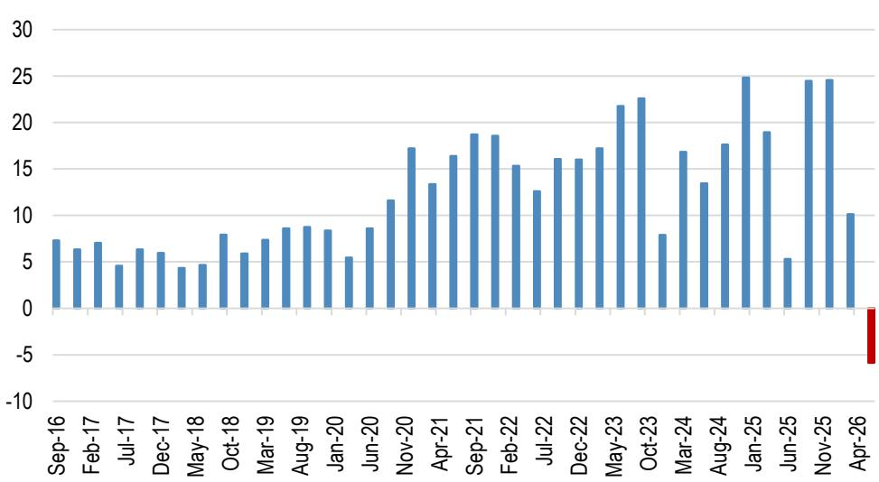
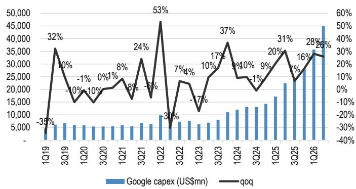
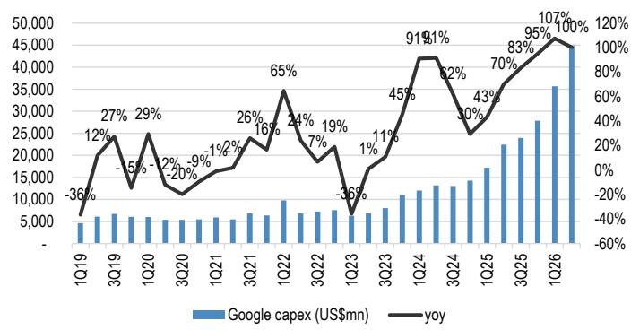

# Google's $200 Billion Capex Signal: The Server Supply Chain Is Entering a Structural Demand Regime, Not a Cyclical One

Google’s June-quarter earnings release on July 26 delivered a number that should reframe how the market thinks about hyperscaler capital expenditure. The company spent $45 billion on capex in the quarter, a figure that was in line with expectations. The forward-looking signal, however, was anything but routine. Google raised its full-year 2026 capex guidance to $195-205 billion, up from $180-190 billion just three months ago. This is the second consecutive upward revision, and it implies approximately 50% half-on-half growth in the second half of the year. For the Asian server supply chain, this is not a demand acceleration to be modeled as a temporary up-cycle. It is a structural regime shift driven by a fundamental undersupply of computing power that the company itself acknowledges will persist into next year.

The implications cascade through three layers: the composition of capex, the revenue trajectory of Google Cloud, and the pricing power of the server ecosystem. Each layer supports the thesis that the server supply chain is entering a multiyear expansion, not a peak. The critical nuance is that server spending now accounts for 60% of total capex, up from a lower mix in prior quarters, as component cost hikes have forced cloud service providers to allocate more of their raised budgets toward servers rather than data center construction. This shift directly benefits server ODMs, component vendors, and brand players that serve both hyperscaler and enterprise demand. The report identifies specific beneficiaries across the Taiwan ODM supply chain, server component vendors, and server brands, but the strategic takeaway is broader: the entire food chain is being repriced upward.

## Google's Second Consecutive Capex Raise Reveals a Structural Undersupply of Computing Power, Not a Demand Pullback

The most important data point in the release is not the $45 billion quarterly spend but the fact that Google raised its full-year guidance for the second time in a row. A single upward revision can be dismissed as catch-up. Two consecutive raises, combined with management's explicit statement that computing power remains undersupplied, signal that demand is outstripping the industry's ability to build capacity. The company expects a significant capex uptick next year despite the high base in 2026. This is the language of structural scarcity, not cyclical peaking.

The composition of capex reinforces the point. Server spending now consumes 60% of total capex, while data center build-out and networking equipment account for the remaining 40%. As component costs rise, hyperscalers are prioritizing server procurement over infrastructure expansion. This means that for every dollar of incremental capex, a larger share flows directly to server manufacturers and component suppliers. The supply chain vendors that produce AI ASIC servers, GPU servers, and general servers are the direct beneficiaries. The report specifically highlights Hon Hai, EMC, Unimicron, ASPEED, Delta, and Inventec as key potential beneficiaries, but the logic applies to the broader ecosystem of suppliers that can scale production to meet hyperscaler demand.

The second-half trajectory matters. With 50% half-on-half growth implied for the remainder of 2026, the supply chain must ramp production sharply in the third and fourth quarters. This creates a favorable revenue momentum for Google's server vendors that will be visible in their own earnings reports over the next two quarters. The risk is not demand destruction but execution capacity. Can the supply chain deliver at the required scale and speed? The report's answer is implicitly affirmative, given the identification of specific beneficiaries and the expectation of continued supply constraints that benefit pricing.

## Google Cloud's Revenue Acceleration and Backlog Growth Confirm That Enterprise AI Demand Is Monetizing at Scale

Cloud revenue grew 24% quarter-on-quarter and 82% year-on-year in the June quarter, accelerating from 63% year-on-year growth in the prior quarter. The revenue figure was 10% above Street estimates. This is not a one-quarter anomaly. Google Cloud's backlog increased by more than $50 billion quarter-on-quarter to $514 billion, driven by strong demand for enterprise AI products. The majority of the backlog is related to traditional GCP contracts, but the growth rate is being propelled by AI solutions and AI infrastructure, which are outgrowing core product revenue.

The backlog provides a multiyear revenue visibility that most enterprise software companies cannot match. Management expects to recognize 50% of the total backlog as revenue over the next two years. This implies a quarterly run rate for Google Cloud revenue that will rise from the current level of approximately $25 billion to over $30 billion. For the server supply chain, this is a demand signal that extends well beyond the current capex cycle. Cloud revenue at this scale requires continuous server procurement to support both training and inference workloads.

The enterprise AI demand is not abstract. Google Gemini's daily active users tripled year-on-year, and token consumption increased 38% quarter-on-quarter in the second quarter. Token consumption is a direct proxy for inference computing demand. As enterprises deploy AI applications at scale, the compute requirements for inference will eventually rival or exceed those for training. This bodes well for pricing dynamics across the server ecosystem. NeoCloud vendors and server brands that serve enterprise and neocloud customers will benefit from favorable pricing as demand continues to outstrip supply.

## The TPU Systems Rollout Will Create a Second Revenue Wave for the Supply Chain in 2027, Extending Beyond the Current GPU Cycle

Google began delivering TPU systems to customer data centers in the second quarter of 2026, but management expects muted revenue contribution from this business this year. The significant ramp-up is targeted for the end of 2026, with the majority of TPU revenues from existing customer agreements expected to flow in the next year. This is a clear signal that the supply chain should prepare for a second wave of demand that extends beyond the current GPU-driven cycle.

The TPU business is structurally different from GPU server procurement. TPUs are custom ASICs designed by Google for its own workloads, and their deployment in customer data centers represents a new revenue stream for Google and a new production stream for its supply chain partners. For component vendors and ODMs that have invested in ASIC server production capacity, the TPU ramp provides revenue diversification and reduces dependence on the GPU supply chain, which has been subject to allocation constraints and lead-time volatility.

The timing is strategic. As GPU supply begins to catch up with demand over the next 12 to 18 months, the TPU ramp will provide a second growth engine for the supply chain. Vendors that can serve both GPU and ASIC server demand will be best positioned. The report's identification of ASPEED, Delta, Unimicron, and EMC as preferred component vendors reflects this dual-demand thesis. These companies supply components that are used across server architectures, making them less exposed to the risk of a single-vendor slowdown.

## A Decision Framework for Positioning in the Server Supply Chain: Three Demand Layers, Three Time Horizons

The report's data points can be synthesized into a decision framework that maps demand layers to time horizons. This framework allows investors and supply chain strategists to position across the curve rather than chasing a single narrative.

The first demand layer is the immediate GPU server cycle, driven by Google's second-half 2026 capex acceleration. This is a six- to nine-month opportunity for ODMs and component vendors that can ramp production quickly. The beneficiaries are those with existing GPU server production lines and strong relationships with hyperscaler procurement teams. Wiwynn, identified as the top pick in the Taiwan ODM supply chain, fits this profile. The key risk is execution: can vendors deliver at the implied 50% half-on-half growth rate without margin compression?

The second demand layer is the enterprise AI cloud revenue stream, which extends over a two- to three-year horizon. Google Cloud's backlog of $514 billion, with 50% expected to be recognized as revenue over the next two years, provides a demand floor that is independent of quarterly capex fluctuations. This layer benefits server brands and NeoCloud vendors that serve enterprise customers, including Lenovo and ASUSTek. The pricing dynamics are favorable because enterprise demand is less price-sensitive than hyperscaler demand, and supply constraints persist.

The third demand layer is the TPU and custom ASIC ramp, which will materialize in 2027 and beyond. This is a longer-duration opportunity for component vendors that supply across server architectures. ASPEED, Delta, Unimicron, and EMC are positioned here. The TPU ramp also reduces the concentration risk of the supply chain being overly dependent on GPU vendors. For supply chain strategists, the optimal positioning is to build a portfolio of vendors that are exposed to all three layers, with overweight positions in those that have the most asymmetric upside from the TPU ramp.

The framework also implies a risk management principle. The most dangerous position in this market is to assume that the current demand surge is a peak and to reduce exposure. The structural undersupply of computing power, the multiyear cloud backlog, and the upcoming TPU ramp all argue against a near-term peak. The risk is not demand destruction but supply chain execution and component availability. Vendors that can manage these operational risks will generate outsized returns.

## The Supply Chain's Pricing Power Is Strengthening as Third-Party Capacity Becomes a Structural Buffer, Not a Temporary Fix

Google continues to see supply constraints and expects to increase its use of third-party capacity in the third quarter of 2026 to support strong demand. This is a critical detail. When a hyperscaler with Google's scale turns to third-party capacity, it signals that internal supply is insufficient and that external vendors have pricing leverage. The report explicitly states that this bodes well for the pricing dynamics of NeoCloud vendors and server brands.

The use of third-party capacity is not a temporary stopgap. It reflects a structural shift in how hyperscalers are sourcing compute. As demand grows faster than internal capacity can be built, hyperscalers will increasingly rely on external partners for both server procurement and data center capacity. This creates a durable revenue stream for server brands and ODMs that serve the neocloud and enterprise segments. The pricing dynamics are favorable because hyperscalers are competing for limited supply, and vendors can command higher margins.

For the supply chain, the implication is clear. Vendors that have invested in scalable production capacity and have strong relationships with multiple hyperscalers will benefit from both volume growth and margin expansion. The report's identification of server brands such as Lenovo and ASUSTek as beneficiaries of strong neocloud demand with favorable pricing dynamics confirms this thesis. The market may be underestimating the duration of this pricing power. As long as computing power remains undersupplied, vendors will have the upper hand in negotiations.

The structural nature of the supply constraint is reinforced by Google's expectation of a significant capex uptick next year despite the high base this year. This is not a company that sees demand moderating. It is a company that sees demand accelerating and is preparing for it. The supply chain should do the same.

*For informational purposes only. Portions may be generated, translated, summarized, or edited with AI assistance based on source materials and may contain omissions or errors. Please verify independently. This is not investment, legal, tax, accounting, or other professional advice.*

For informational purposes only. Portions may be generated, translated, summarized, or edited with AI assistance based on source materials and may contain omissions or errors. Please verify independently. This is not investment, legal, tax, accounting, or other professional advice.

