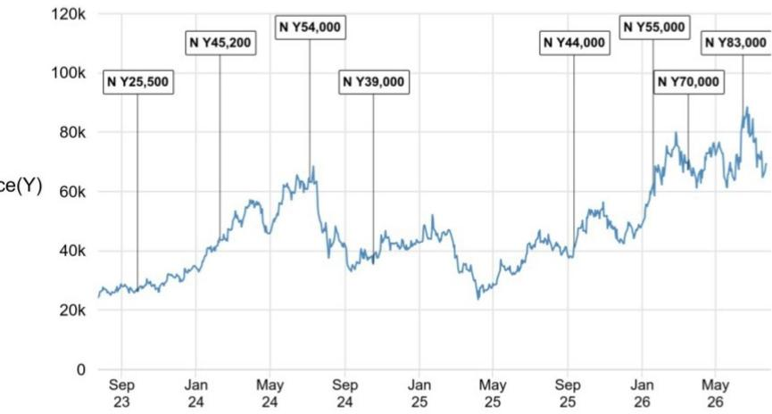
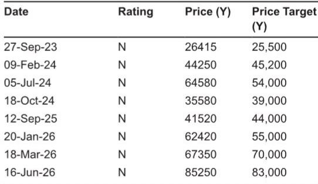

# JPM：Disco业务与季度数据观察

Disco 刚刚交出了一份平稳的一季度成绩单。JPM在最新报告中确认，这家日本半导体设备商一季度营业利润 490 亿日元，与市场共识的 486 亿日元和JPM自己的 490 亿日元预估基本吻合。出货额 1359 亿日元，环比增长 12%，同比增 22%。报告认为，真正值得关注的不是数字本身，而是公司决定维持总部到工厂的生产支援项目——约 100 名员工——至少暂时不会撤回。

这个细节透露了一个信号：需求仍然稳健，但产能瓶颈的缓解速度可能没有市场期待的那么快。Disco 此前预计该项目运行至 7-9 月，现在管理层表示将继续维持一段时间。对于一家以精密加工设备为核心、长期依赖工程师现场支持的公司来说，这 100 人的去留，比单季度营收数字更能反映供需关系的真实状态。

## 1. 一季度出货结构：内存占比继续上升，先进封装研发工具延迟确认

从产品结构看，切割机出货额环比增 16%，磨床增 15%，精密加工工具增 6%。JPM指出，设备出货中面向非内存客户的部分略低于预期，但被约 25 亿日元的汇率因素和其他项目（维护与服务）的上升所弥补。

一个值得注意的细节是，约 30 亿日元的先进封装相关研发工具原本预计在一季度确认，现在推迟到了后续季度。这不是需求消失，而是客户研发节奏的调整。内存客户在出货中的占比从 4 季度到 1 季度继续扩大，JPM认为这反映了当季向多个客户重叠交货的情况。

> **KC评论：** 先进封装研发工具延迟确认，并不代表订单取消。对于关注 Disco 在先进封装领域布局的读者，这个时间差意味着二、三季度的出货数据可能包含这部分递延收入，环比增速的数字需要拆开看。

## 2. 二季度指引：出货额 1410 亿日元，逻辑保持强劲，OSAT 出现回落

市场最关注的二季度出货额指引为 1410 亿日元，环比增 4%，同比增 46%，与市场此前预期的 1400 亿日元左右基本一致。JPM认为这个数字没有超出预期，但也没有低于预期。

管理层对二季度各细分市场的判断值得拆解：内存相关出货预计维持高位，大致持平；逻辑出货保持强劲；OSAT（外包封测）出货则预计下降，主要来自中国客户的调整。光学半导体出货虽然目前规模仍远小于生成式 AI 相关需求，但管理层表示将逐步增加。

工厂利用率仍然较高，这也是生产支援项目无法撤回的直接原因。JPM报告没有给出明确的产能扩张时间表，但 100 人支援团队的存在本身就是一个观察指标——当 Disco 开始缩减这个项目时，才意味着供需关系开始出现变化。

## 3. 估值框架：41 倍 PE 对应改善的后道设备市场前景

基于 FY2027 每股收益预估和约 41 倍 PE。这个倍数比公司 10 年历史平均的 28 倍高出一个标准差，溢价来自后道工艺设备市场增长前景的改善。

报告同时列出了上行与节奏变化情景。上行方面包括生成式 AI 需求进一步扩张、功率半导体 SPE 市场增长快于预期、OSAT 客户研究恢复早于预期。节奏变化方面则包括生成式 AI 需求减速、量产需求占比上升导致利润率稀释、半导体市场进入节奏变化周期。

> **KC评论：** 41 倍 PE 的估值溢价建立在一个关键假设上——后道设备市场的结构性增长。如果 OSAT 客户研究恢复或先进封装需求出现任何节奏变化，这个估值框架的支撑力就会受到考验。报告没有给出具体的时间节点，但读者可以关注 Disco 每个季度的出货结构变化，尤其是内存与逻辑的占比关系。

## 4. 可复用的观察框架：从三个维度跟踪 Disco 的供需平衡

基于这份报告，可以建立一个简单的跟踪框架。第一个维度是生产支援项目的人员规模变化，这是最直接的产能瓶颈信号。第二个维度是出货结构中的内存占比与 OSAT 占比的此消彼长，这反映了不同下游客户的资本开支节奏。第三个维度是先进封装研发工具的确认进度，这关系到市场对 Disco 在 AI 产业链中定位的判断。

这三个维度都不需要复杂的财务模型，但每个季度都能从 Disco 的业绩说明中找到线索。JPM报告的价值在于，它把市场注意力从单季度数字引向了这些结构性指标。

For informational purposes only. Portions may be generated,translated,summarized,or edited with AI assistance based on source materials and may contain omissions or errors. Please verify independently. This is not investment,legal,tax,accounting,or other professional advice.

For informational purposes only. Portions may be generated,translated,summarized,or edited with AI assistance based on source materials and may contain omissions or errors. Please verify independently. This is not investment,legal,tax,accounting,or other professional advice.

