July 23, 2026 09:00 PM GMT

China Equity Strategy | Asia Pacific

# A-share Sentiment Observes Moderate Activity Amid Policy Pause and IPO Attention

MSASI softened ahead of July Politburo meeting and the upcoming CXMT IPO. We stay constructive on Hong Kong and continue to see late July and August as a sustainable recovery window. Earnings preview reveals accelerating earnings growth in tech, warranting recovery once global volatility calms down.

A-share investor sentiment decreased vs. the previous cycle: Weighted MSASI decreased by 7ppt vs. the prior cutoff date (July 15) to 37%. Weighted MSASI 1MMA also decreased 2ppt over the same period at 57%. Turnover for ChiNext, A-share and margin transaction outstanding declined by 6% (to Rmb667bn), 7% (to Rmb2,677bn) and 6% (to Rmb2,729bn), respectively, vs. the previous cycle, while equity futures turnover increased by 8% (to Rmb734bn). The 30-day RSI was stable over the same period (July 15-22). Consensus earnings estimate revision breadth remained negative although it did improve marginally vs. last week.

Southbound net inflows – US\$1.6bn over July 16-22: MTD net inflows were US \$11.1bn and YTD net inflows were US\$46.6bn (46% of same period last year).

Note: As announced on July 26, 2024, by HKEX, Shanghai Stock Exchange and Shenzhen Stock Exchange, the publication of Northbound daily purchase and sales data was terminated as of August 19, 2024. Northbound daily buying and selling data were last made available on August 16, 2024.

Investors remained cautious ahead of the July Politburo meeting and the anticipated IPO of CXMT, despite continued market stabilization efforts from "national team" in recent weeks. The key focus is whether policymakers will respond to the softer-than-expected 2Q GDP print and persistent domestic demand weakness. Our China Macro team expects the policy response to be about "speed, not scale." Policymakers are likely to accelerate the rollout of the remaining \~Rmb2trn in-budget fiscal quota, rather than introduce a supplementary budget, while continuing to prioritize technology self-sufficiency, advanced manufacturing and energy security over broad-based consumption support. Meanwhile, June property data remained weak, with primary home sales falling 7% YoY (vs. +1% in May), alongside weaker secondary sales and continued home price declines, suggesting the property sector will remain a headwind to domestic demand in 3Q.

<table><tr><td colspan="2">MS ASIA LIMITED+</td></tr><tr><td colspan="2">Laura Wang</td></tr><tr><td colspan="2">Equity Strategist</td></tr><tr><td>Laura.Wang@morganstanley.com</td><td>+852 2848-6853</td></tr><tr><td colspan="2">Chloe Liu</td></tr><tr><td colspan="2">Equity Strategist</td></tr><tr><td>Chloe.Liu1@morganstanley.com</td><td>+852 2848-5497</td></tr><tr><td colspan="2">Vicky Wu</td></tr><tr><td colspan="2">Equity Strategist</td></tr><tr><td>Vicky.Wu@morganstanley.com</td><td>+852 3963-3928</td></tr></table>

Exhibit 1: MS A-share Sentiment Indicator: MSASI weighted and MSASI weighted 1MMA  
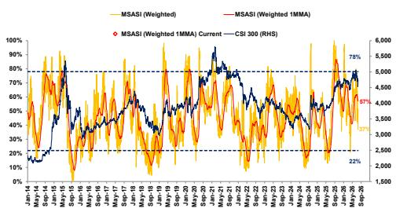  
Source: CEIC, Bloomberg, Wind, RIMES, MS. Data as of July 22, 2026.

Exhibit 2 : MSASI trajectory since January 1, 2019  
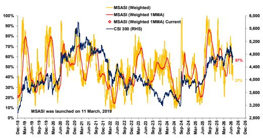  
Source: CEIC, Bloomberg, Wind, RIMES, MS Research. Data as of July 22, 2026.

MS does and seeks to do business with companies covered in MS. As a result, investors should be aware that the firm may have a conflict of interest that could affect the objectivity of MS. Investors should consider MS as only a single factor in making their investment decision.

## For analyst certification and other important disclosures, refer to the Disclosure Section, located at the end of this report.

+= Analysts employed by non-U.S. affiliates are not registered with FINRA, may not be associated persons of the member and may not be subject to FINRA restrictions on communications with a subject company, public appearances and trading securities held by a research analyst account.

## Overview (continued)

We remain constructive on Hong Kong equities and continue to view current levels as an attractive entry point to add exposure. Late July and August remain a critical window for a more sustainable China equity recovery, as key catalysts include: 1) signs that the earnings drag from e-commerce price competition is nearing an end; 2) continued progress in AI commercialization by hyperscalers; and 3) gradual digestion of July's sizeable IPO overhang. Recent positives include Tencent's Hunyuan AI agent launch, encouraging updates on Alibaba's cloud business and EBITDA outlook, and easing volatility following Zhipu's and Minimax's share unlock. We continue to believe that near-term Hong Kong's market dynamics look more favorable (given aforementioned reasons) compared to the A-share market (uncertainty around AI related sectors given global volatility, concerns over IPO liquidity cannibalization, etc.). However, on a longer-term basis, we are strongly convinced that the A-share market tech and innovation opportunities will recover and break new highs as earnings growth keeps accelerating (2Q26 Pre-Announcements: A-share Earnings Pressure Eased, While MSCI China Signals Strengthened).

While near-term volatility may persist, we believe the risk-reward is becoming increasingly favorable as these catalysts continue to materialize. A more durable market recovery would likely require further stabilization in earnings revisions, continued progress in AI monetization, greater visibility on the Fed's easing path and global rates, evidence of accelerating AI-related capex by major US technology companies, and a further easing of global deleveraging pressures.

## Read more:

China Market-Wise: Global Marketing Feedback – Rising Interest with Uncertain Timing (1 Jul 2026);

China Market-Wise: China Outperforming in a Volatile Market – What's Next? (9 Jul 2026)

## MSASI Methodology

Related report: China Equity Strategy: Relaunching MSASI: A New Take on A-share Market Sentiment and Technical Signals (27 Oct 2025)

## Step 1: Normalizing sentiment metrics

The new MSASI is based on 12 individual indicators, each designed to capture a different dimension of investor sentiment and market activity.

To make these metrics comparable, each is re-scaled using a 100-day moving min-max normalization. This approach helps reduce noise from high-frequency movements and better reflects whether sentiment is improving or deteriorating over the medium term.

## Normalization Formula:

Normalized Value = (Latest Value - Min (Last 100 Days)) /

(Max (Last 100 Days)–Min (Last 100 Days))

Each normalized series is expressed on a 0-100 scale, where higher values indicate stronger or more active sentiment conditions.

## The 12 metrics included are:

1. ChiNext Turnover: Daily trading turnover on ChiNext, normalized using the 100-day moving min-max method (available daily; weekly closing values used for analysis).

2. A-share Turnover: Daily turnover of all A-shares, normalized using the 100-day moving min-max method (available daily; weekly closing values used for analysis).

3. Equity Index Futures Turnover: Daily turnover of equity index futures, normalized using the 100-day moving min-max method (available daily; weekly closing values used for analysis).

4. Northbound Turnover: Daily Stock Connect northbound trading turnover, normalized using the 100-day moving min-max method (available daily; weekly closing values used for analysis).

5. Margin Financing Outstanding: Total margin transaction balances, normalized using the 100-day moving min-max method (available daily; weekly closing values used for analysis).

6. New Accounts Registered with the Shanghai Stock Exchange: Monthly number of new retail accounts registered with the Shanghai Exchange, normalized using the 100-day moving min-max method (available monthly).

7. 30-Day RSI (CSI 300): Relative Strength Index over a 30-day period for CSI 300 (available daily; weekly closing values used).

8. Number of Limit-Up A-shares: Daily count of stocks hitting the 10% upper price limit, normalized using the 100-day moving min-max method (available daily; weekly closing values used for analysis).

9. CSI 300 Futures Backwardation: The percentage difference between CSI 300 futures and spot prices, calculated as (Futures Price – Spot Price)/Spot Price, normalized using the 100-day moving min-max method (available daily; weekly closing values used for analysis).

10. CSI 300 Call-Put Ratio: Ratio of open interest in call options to put options, normalized using the 100-day moving min-max method (available daily; weekly closing values used for analysis).

11. Foreign Passive Fund Flows to CSI 300 (1MMA): One-month moving average of daily flows from foreign-domiciled passive funds to CSI 300, normalized using the 100-day moving min-max method (available daily; weekly closing values used for analysis).

12. Earnings Estimate Revision Breadth (3MMA): Three-month moving average of the net proportion of upward earnings estimate revisions vs. downward earnings estimate revisions, based on the Shanghai A Index, normalized using the 100-day moving min-max method (available weekly).

This normalization process ensures that each indicator contributes proportionally, regardless of scale or data frequency, while highlighting directional shifts in sentiment over time.

## Step 2: Constructing the Weighted Sentiment Indicator

Once normalized, each of the 12 series is assigned a weight based on its historical explanatory power relative to the CSI 300 Index.

Weights are determined by the R-squared values from a single-factor regression between the metric (relative to its 100-day moving min max) and the CSI 300 (relative to 100MA) performance.

This weighting method gives greater emphasis to indicators that have historically demonstrated stronger correlations with market movements, ensuring that the overall index reflects sentiment components most relevant to A-share performance.

## Step 3: Constructing the MSASI (Weighted)

Using the weighted sentiment indicator derived in Step 2, we construct the MSASI (Weighted) as the composite measure of overall market sentiment.

This index is then re-scaled to a 0-100 range, based on its distance from historical high and low values since January 2024.

This scaling allows the indicator to reflect relative sentiment strength over time – where higher readings indicate stronger investor enthusiasm, and lower readings reflect weaker sentiment or risk aversion.

## Step 4: Constructing the MSASI (Weighted 1MMA)

To highlight underlying trends and reduce short-term volatility, we apply a one-month moving average to the MSASI (Weighted). The resulting MSASI (Weighted 1MMA) smooths out high-frequency fluctuations, providing a clearer picture of medium-term sentiment dynamics and improving interpretability for tactical or strategic analysis.

Exhibit 3: Weighting of 12 indicators of MSASI, and R-squared of indicators vs. CSI 300 (relative to 100MA)

<table><tr><td>Indicator</td><td>R-sq vs. CSI 300 (relative to 100MA)</td><td>Weighting</td></tr><tr><td>ChiNext Turnover</td><td>12.6%</td><td>10%</td></tr><tr><td>A-share Turnover</td><td>19.7%</td><td>15%</td></tr><tr><td>Equity Futures Turnover</td><td>8.1%</td><td>6%</td></tr><tr><td>Northbound Turnover</td><td>7.6%</td><td>8%</td></tr><tr><td>Margin Transaction Outstanding</td><td>34.3%</td><td>15%</td></tr><tr><td>SHSE New accounts Registered</td><td>14.3%</td><td>3%</td></tr><tr><td>Earnings Revision Breadth (3MMA)</td><td>6.6%</td><td>8%</td></tr><tr><td>RSI-30D</td><td>49.0%</td><td>15%</td></tr><tr><td>No. of Limit Up A-share</td><td>4.6%</td><td>6%</td></tr><tr><td>CSI300 backwardation</td><td>3.9%</td><td>4%</td></tr><tr><td>CSI300 call put ratio</td><td>14.0%</td><td>6%</td></tr><tr><td>Foreign domiciled passive funds flows to CSI300 (1MMA)</td><td>0.5%</td><td>4%</td></tr></table>

Note: For SHSE new account registrations, although the R-squared with the CSI 300 is high, the data is available only on a monthly basis rather than daily or weekly, so we assign it a relatively lower weight. Similarly, for the CSI 300 call-put ratio, despite its high R-squared with the CSI 300, the data is only available from late 2019 onward, so we also assign it a relatively lower weight.
Source: CEIC, Wind, Rimes, EPFR, Bloomberg, MS.

## Other items to keep in mind

\- The charts below show the scaled version of all these metrics as they are used in our MSASI compilation analysis.

\- We use data from January 2014 to the present because some of the market-influencing factors were not fully developed before that, i.e., Stock Connect Northbound (program only launched in November 2014).

\- Some metrics have gone through regime shifts owing to regulatory changes, i.e., index futures trading, which became heavily regulated as part of market stabilization measures during the 2015 correction. We try to accommodate/ normalize, such shifts by looking at relative level to moving 100 days min-max level rather than absolute volume/value.

Exhibit 4: ChiNext turnover adjusted by moving 100D min-max (scaled to 0-100% based on the percentage away from its 100-day high and low levels) vs. CSI 300 relative to 100D MA  
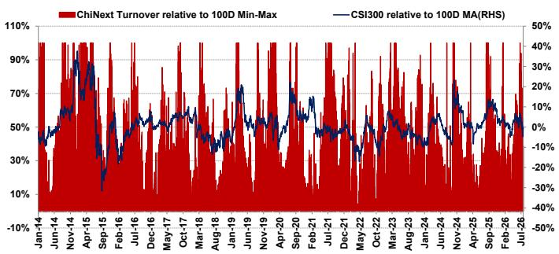  
Source: CEIC, MS. Data as of July 22, 2026.

Exhibit 5: A-share turnover adjusted by moving 100D min-max (scaled to 0-100% based on the percentage away from its 100-day high and low levels) vs. CSI 300 relative to 100D MA  
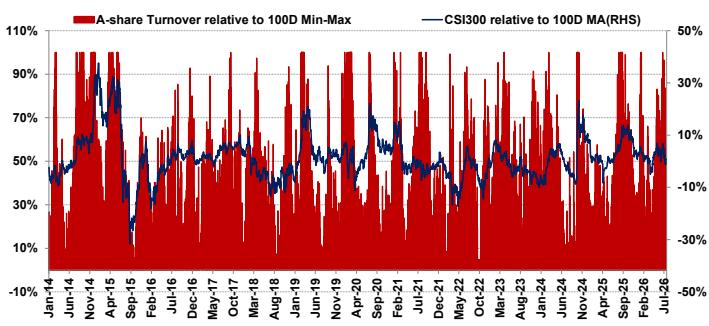  
Source: CEIC, Bloomberg, MS. Data as of July 22, 2026.

Exhibit 6: Equity futures turnover adjusted by moving 100D min-max (scaled to 0-100% based on the percentage away from its 100-day high and low levels) vs. CSI 300 relative to 100D MA  
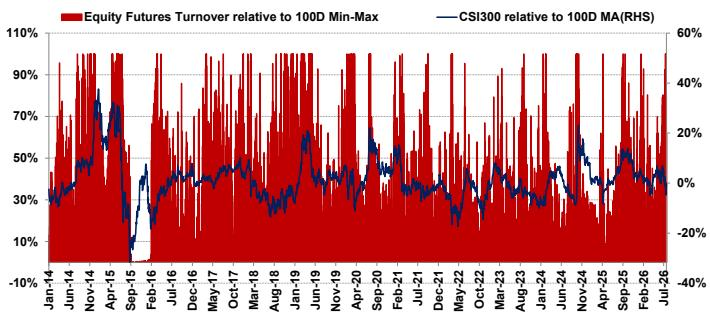  
Source: CEIC, MS. Data as of July 22, 2026.

Exhibit 7: Northbound turnover adjusted by moving 100D min-max (scaled to 0-100% based on the percentage away from its 100-day high and low levels) vs. CSI 300 relative to 100D MA  
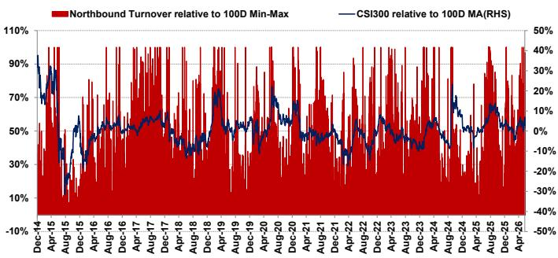  
Source: CEIC, MS. Data as of July 22, 2026.

Exhibit 8: Margin transactions adjusted by moving 100D min-max (scaled to 0-100% based on the percentage away from its 100-day high and low levels) vs. CSI 300 relative to 100D MA  
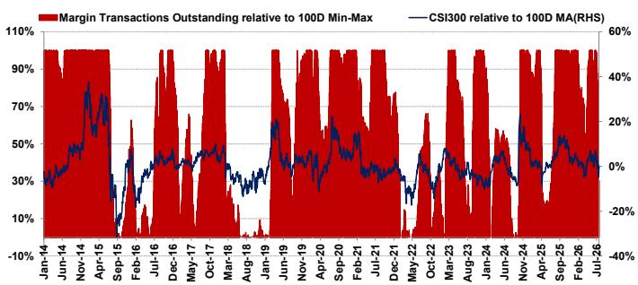  
Source: CEIC, MS. Data as of July 22, 2026.

Exhibit 9: SSE new accounts adjusted by moving 100D min-max (scaled to 0-100% based on the percentage away from its 100-day high and low levels) vs. CSI 300 relative to 100D MA  
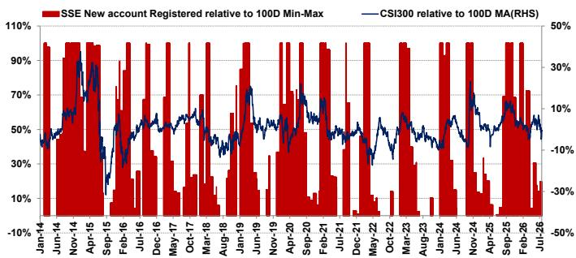  
Source: CEIC, Bloomberg, MS. Data as of July 22, 2026.

Exhibit 10: RSI-30D since January 2014 vs. CSI 300 relative to 100D MA  
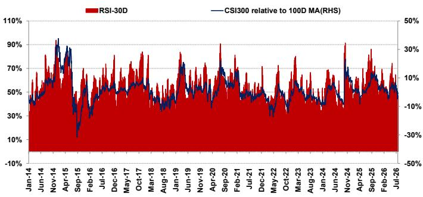  
Source: CEIC, Bloomberg, MS. Data as of July 22, 2026.

Exhibit 11: Number of limit-up A-shares adjusted by moving 100D min-max (scaled to 0-100% based on the percentage away from its 100-day high and low levels) vs. CSI 300 relative to 100D MA  
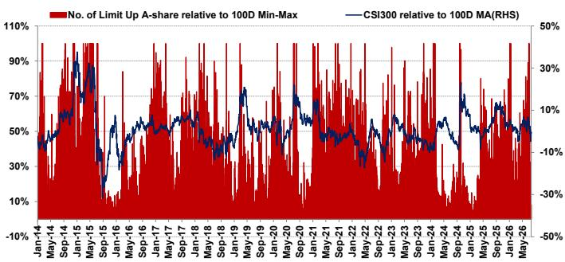  
Source: CEIC, Wind, Bloomberg, MS. Data as of July 22, 2026.

Exhibit 12: CSI 300 future backwardation adjusted by moving 100D min-max (scaled to 0-100% based on the percentage away from its 100-day high and low levels) vs. CSI 300 relative to 100D MA  
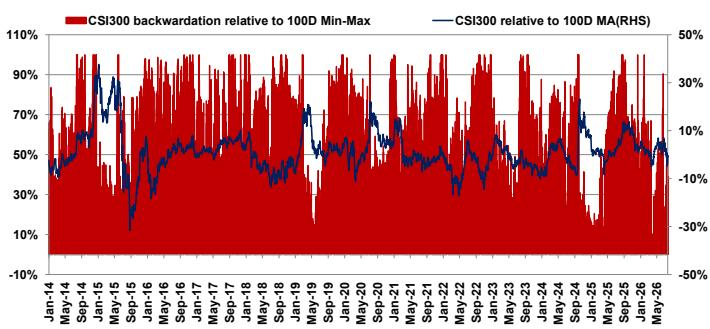  
Source: CEIC, Wind, MS. Data as of July 22, 2026.

Exhibit 13: CSI 300 put-call ratio adjusted by moving 100D min-max (scaled to 0-100% based on the percentage away from its 100-day high and low levels) vs. CSI 300 relative to 100D MA  
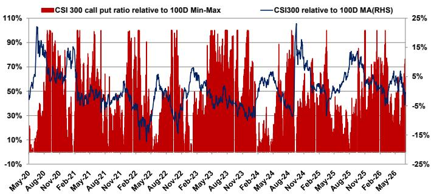  
Source: CEIC, Wind, MS. Data as of July 22, 2026.

Exhibit 14: Foreign domiciled passive funds flows to CSI 300 (1mma) adjusted by moving 100D min-max (scaled to 0-100% based on the percentage away from its 100-day high and low levels) vs. CSI 300 relative to 100D MA  
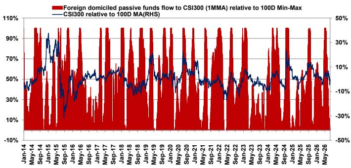  
Source: CEIC, Wind, MS. Data as of July 22, 2026.

Exhibit 15: Shanghai A-share earnings estimate revision breadth (3mma) adjusted by moving 100D min-max (scaled to 0-100% based on the percentage away from its 100-day high and low levels) vs. CSI 300 relative to 100D MA  
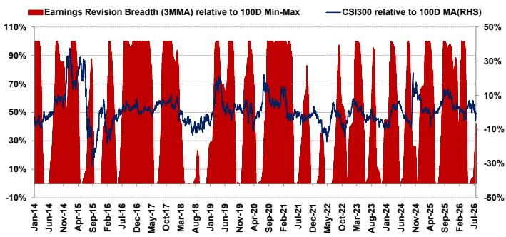  
Source: CEIC, MS. Data as of July 22, 2026.

## Appendix: A-share Market Data

Exhibit 16: ChiNext daily turnover (RMB bn) trend vs. CSI 300  
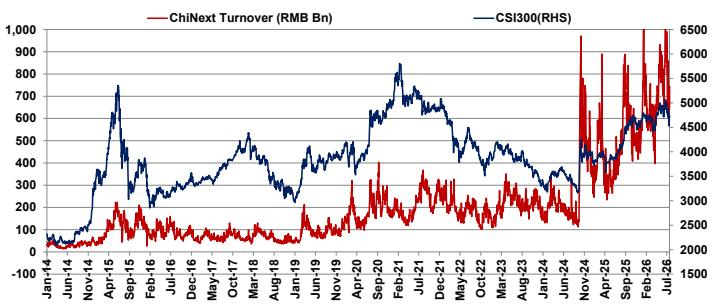  
Source: CEIC, MS. Data as of July 22, 2026.

Exhibit 17: A-share daily turnover (RMB bn) trend vs. CSI 300  
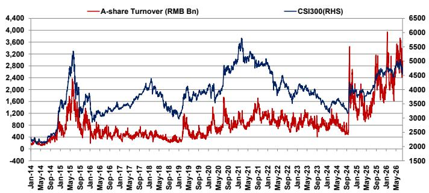  
Source: CEIC, MS. Data as of July 22, 2026.

Exhibit 18: A-share equity futures turnover (RMB bn) trend vs. CSI 300  
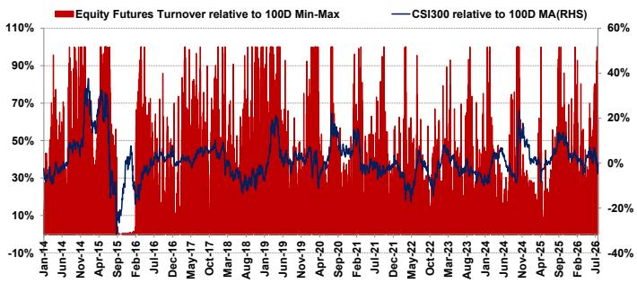  
Source: CEIC, MS. Data as of July 22, 2026.

Exhibit 19: Northbound daily turnover (RMB bn) trend vs. CSI 300  
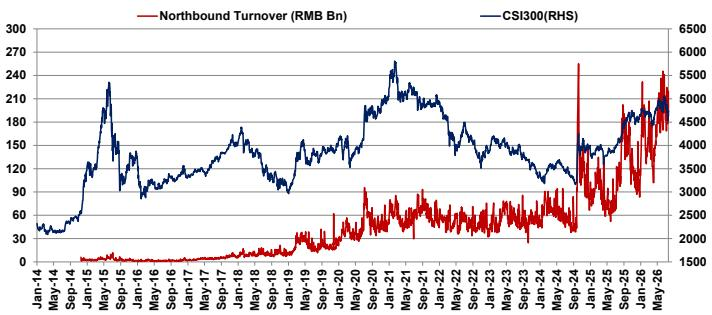  
Source: CEIC, MS. Data as of July 22, 2026.

Exhibit 20: A-share margin financing vs. CSI 300  
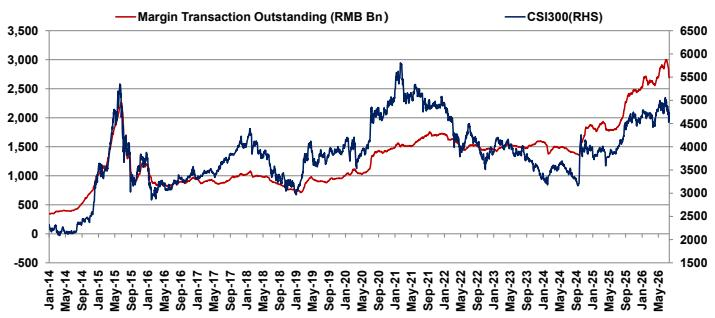  
Source: CEIC, MS. Data as of July 22, 2026.

Exhibit 21: SSE new accounts registered (unit thousand) vs. CSI 300  
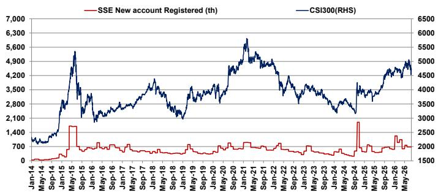  
Source: CEIC, MS. Data as of July 22, 2026.

Exhibit 22: RSI (30 days) vs. CSI 300  
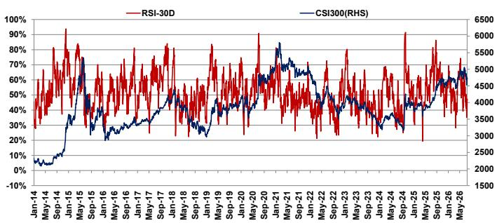  
Source: Bloomberg, MS. Data as of July 22, 2026.

Exhibit 23: Number of A-shares trading at limit up vs. CSI 300  
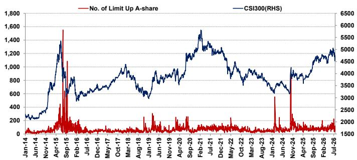  
Source: Wind, MS. Data as of July 22, 2026.

Exhibit 24: CSI 300 future backwardation vs. CSI 300  
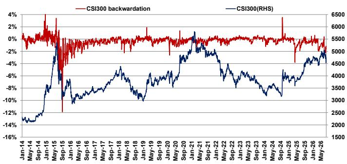  
Source: CEIC, Wind, MS. Data as of July 22, 2026.

Exhibit 25: CSI 300 call put ratio vs. CSI 300  
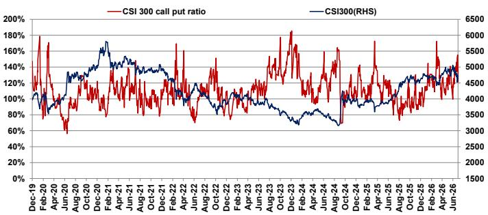  
Source: CEIC, Wind, MS. Data as of July 22, 2026.

Exhibit 26: Foreign domiciled passive funds flows (1mma, USDmn) to CSI 300 vs. CSI 300  
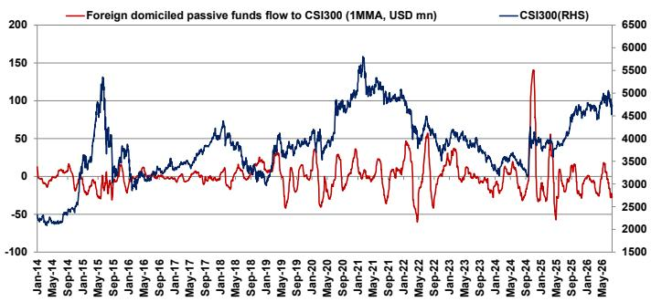  
Source: CEIC, Wind, MS. Data as of July 22, 2026.

Exhibit 27: Shanghai A-share earnings estimate revision breadth (3mma) vs. CSI 300  
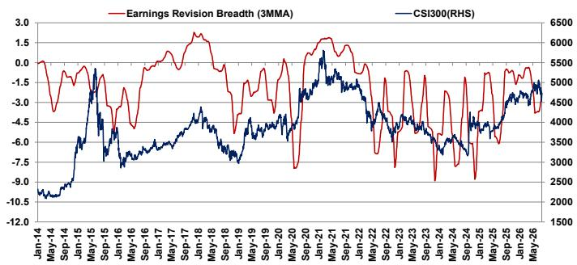  
Source: CEIC, Wind, MS. Data as of July 22, 2026.

Exhibit 28: A-share margin financing (USD mn)  
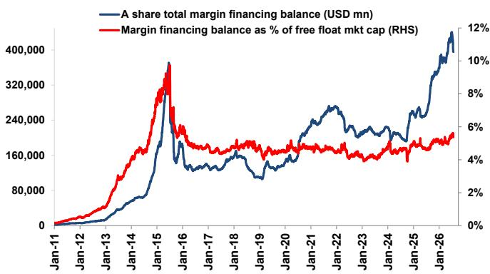  
Source: CEIC, MS. Note: Data as of July 22, 2026.

## Disclosure Section

The information and opinions in MS were prepared or are disseminated by MS Asia Limited (which accepts the responsibility for its contents) and/or MS Asia (Singapore) Pte. (Registration number 199206298Z) and/or MS Asia (Singapore) Securities Pte Ltd (Registration number 200008434H), regulated by the Monetary Authority of Singapore (which accepts legal responsibility for its contents and should be contacted with respect to any matters arising from, or in connection with, MS), and/or MS Taiwan Limited and/or MS & Co International plc, Seoul Branch, and/or MS Australia Limited (A.B.N. 67 003 734 576, holder of Australian financial services license No. 233742, which accepts responsibility for its contents), and/or MS Wealth Management Australia Pty Ltd (A.B.N. 19 009 145 555, holder of Australian financial services license No. 240813, which accepts responsibility for its contents), and/or MS India Company Private Limited having Corporate Identification No (CIN) U22990MH1998PTC115305, regulated by the Securities and Exchange Board of India ("SEBI") and holder of licenses as a Research Analyst (SEBI Registration No. INH000001105); Stock Broker (SEBI Stock Broker Registration No. INZ000244438), Merchant Banker (SEBI Registration No. INM000011203), and depository participant with National Securities Depository Limited (SEBI Registration No. IN-DP-NSDL-567-2021) having registered office at Altimus, Level 39 & 40, Pandurang Budhkar Marg, Worli, Mumbai 400018, India; Telephone no. +91-22-61181000; Compliance Officer Details: Mr. Tejarshi Hardas, Tel. No.: +91-22-61181000 or Email: tejarshi.hardas@morganstanley.com; Grievance officer details: Mr. Tejarshi Hardas, Tel. No.: +91-22-61181000 or Email: msic-compliance@morganstanley.com which accepts the responsibility for its contents and should be contacted with respect to any matters arising from, or in connection with, MS, and their affiliates (collectively, "MS"). MS India Company Private Limited (MSICPL) may use AI tools in providing research services. All recommendations contained herein are made by the duly qualified research analysts.

For important disclosures, stock price charts and equity rating histories regarding companies that are the subject of this report, please see the MS Disclosure Website at www.morganstanley.com/eqr/disclosures/webapp/generalresearch, or contact your investment representative or MS at 1585 Broadway, (Attention: Research Management), New York, NY, 10036 USA.

For valuation methodology and risks associated with any recommendation, rating or price target referenced in this research report, please contact the Client Support Team as follows: US/Canada +1 800 303-2495; Hong Kong +852 2848-5999; Latin America +1 718 754-5444 (U.S.); London +44 (0)20-7425-8169; Singapore +65 6834-6860; Sydney +61 (0)2-9770-1505; Tokyo +81 (0)3-6836-9000. Alternatively you may contact your investment representative or MS at 1585 Broadway, (Attention: Research Management), New York, NY 10036 USA.

## Analyst Certification

The following analysts hereby certify that their views about the companies and their securities discussed in this report are accurately expressed and that they have not received and will not receive direct or indirect compensation in exchange for expressing specific recommendations or views in this report: Chloe Liu; Laura Wang; Vicky Wu.

## Global Research Conflict Management Policy

MS has been published in accordance with our conflict management policy, which is available at www.morganstanley.com/institutional/research/conflictpolicies. A Portuguese version of the policy can be found at www.morganstanley.com.br

## Important Regulatory Disclosures on Subject Companies

The equity research analysts or strategists principally responsible for the preparation of MS have received compensation based upon various factors, including quality of research, investor client feedback, stock picking, competitive factors, firm revenues and overall investment banking revenues. Equity Research analysts' or strategists' compensation is not linked to investment banking or capital markets transactions performed by MS or the profitability or revenues of particular trading desks.

MS and its affiliates do business that relates to companies/instruments covered in MS, including market making, providing liquidity, fund management, commercial banking, extension of credit, investment services and investment banking. MS sells to and buys from customers the securities/instruments of companies covered in MS on a principal basis. MS may have a position in the debt of the Company or instruments discussed in this report. MS trades or may trade as principal in the debt securities (or in related derivatives) that are the subject of the debt research report.

Certain disclosures listed above are also for compliance with applicable regulations in non-US jurisdictions.

## STOCK RATINGS

MS uses a relative rating system using terms such as Overweight, Equal-weight, Not-Rated or Underweight (see definitions below). MS does not assign ratings of Buy, Hold or Sell to the stocks we cover. Overweight, Equal-weight, Not-Rated and Underweight are not the equivalent of buy, hold and sell. Investors should carefully read the definitions of all ratings used in MS. In addition, since MS contains more complete information concerning the analyst's views, investors should carefully read MS, in its entirety, and not infer the contents from the rating alone. In any case, ratings (or research) should not be used or relied upon as investment advice. An investor's decision to buy or sell a stock should depend on individual circumstances (such as the investor's existing holdings) and other considerations.

## Global Stock Ratings Distribution

## (as of June 30, 2026)

The Stock Ratings described below apply to MS's Fundamental Equity Research and do not apply to Debt Research produced by the Firm.

For disclosure purposes only (in accordance with FINRA requirements), we include the category headings of Buy, Hold, and Sell alongside our ratings of Overweight, Equal-weight, Not-Rated and Underweight. MS does not assign ratings of Buy, Hold or Sell to the stocks we cover. Overweight, Equal-weight, Not-Rated and Underweight are not the equivalent of buy, hold, and sell but represent recommended relative weightings (see definitions below). To satisfy regulatory requirements, we correspond Overweight, our most positive stock rating, with a buy recommendation; we correspond Equal-weight and Not-Rated to hold and Underweight to sell recommendations, respectively.

<table><tr><td></td><td colspan="2">Coverage Universe</td><td colspan="3">Investment Banking Clients (IBC)</td><td colspan="2">Other Material Investment ServicesClients (MISC)</td></tr><tr><td>Stock RatingCategory</td><td>Count</td><td>% of Total</td><td>Count</td><td>% of Total IBC</td><td>% of RatingCategory</td><td>Count</td><td>% of Total OtherMISC</td></tr><tr><td>Overweight/Buy</td><td>1544</td><td>42%</td><td>453</td><td>49%</td><td>29%</td><td>757</td><td>44%</td></tr><tr><td>Equal-weight/Hold</td><td>1577</td><td>43%</td><td>390</td><td>42%</td><td>25%</td><td>769</td><td>44%</td></tr><tr><td>Not-Rated/Hold</td><td>3</td><td>0%</td><td>1</td><td>0%</td><td>33%</td><td>1</td><td>0%</td></tr><tr><td>Underweight/Sell</td><td>544</td><td>15%</td><td>89</td><td>10%</td><td>16%</td><td>204</td><td>12%</td></tr><tr><td>Total</td><td>3,668</td><td></td><td>933</td><td></td><td></td><td>1731</td><td></td></tr></table>

Data include common stock and ADRs currently assigned ratings. Investment Banking Clients are companies from whom MS received investment banking compensation in the last 12 months. Due to rounding off of decimals, the percentages provided in the "% of total" column may not add up to exactly 100 percent.

## Analyst Stock Ratings

Overweight (O). The stock's total return is expected to exceed the average total return of the analyst's industry (or industry team's) coverage universe, on a risk-adjusted basis, over the next 12-18 months.

Equal-weight (E). The stock's total return is expected to be in line with the average total return of the analyst's industry (or industry team's) coverage universe, on a risk-adjusted basis, over the next 12-18 months.

Not-Rated (NR). Currently the analyst does not have adequate conviction about the stock's total return relative to the average total return of the analyst's industry (or industry team's) coverage universe, on a risk-adjusted basis, over the next 12-18 months.

Underweight (U). The stock's total return is expected to be below the average total return of the analyst's industry (or industry team's) coverage universe, on a risk-adjusted basis, over the next 12-18 months.

Unless otherwise specified, the time frame for price targets included in MS is 12 to 18 months.

## Analyst Industry Views

Attractive (A): The analyst expects the performance of his or her industry coverage universe over the next 12-18 months to be attractive vs. the relevant broad market benchmark, as indicated below.

In-Line (I): The analyst expects the performance of his or her industry coverage universe over the next 12-18 months to be in line with the relevant broad market benchmark, as indicated below. Cautious (C): The analyst views the performance of his or her industry coverage universe over the next 12-18 months with caution vs. the relevant broad market benchmark, as indicated below. Benchmarks for each region are as follows: North America - S&P 500; Latin America - relevant MSCI country index or MSCI Latin America Index; Europe - MSCI Europe; Japan - TOPIX; Asia - relevant MSCI country index or MSCI sub-regional index or MSCI AC Asia Pacific ex Japan Index.

## Important Disclosures for MS Smith Barney LLC Customers

Important disclosures regarding any material conflict of interest that can reasonably be expected to have influenced MS Smith Barney LLC's choice of a third-party research provider or the subject company of a third-party research report, are available on the MS Wealth Management disclosure website at www.morganstanley.com/online/researchdisclosures. For MS specific disclosures, you may refer to https://www.morganstanley.com/eqr/disclosures/webapp/generalresearch.

Each MS report is reviewed and approved on behalf of MS Smith Barney LLC. This review and approval is conducted by the same person who reviews the research report on behalf of MS. This could create a conflict of interest.

## Other Important Disclosures

MS policy is to update research reports as and when the Research Analyst and Research Management deem appropriate, based on developments with the issuer, the sector, or the market that may have a material impact on the research views or opinions stated therein. In addition, certain Research publications are intended to be updated on a regular periodic basis (weekly/monthly/quarterly/annual) and will ordinarily be updated with that frequency, unless the Research Analyst and Research Management determine that a different publication schedule is appropriate based on current conditions.

MS is not acting as a municipal
