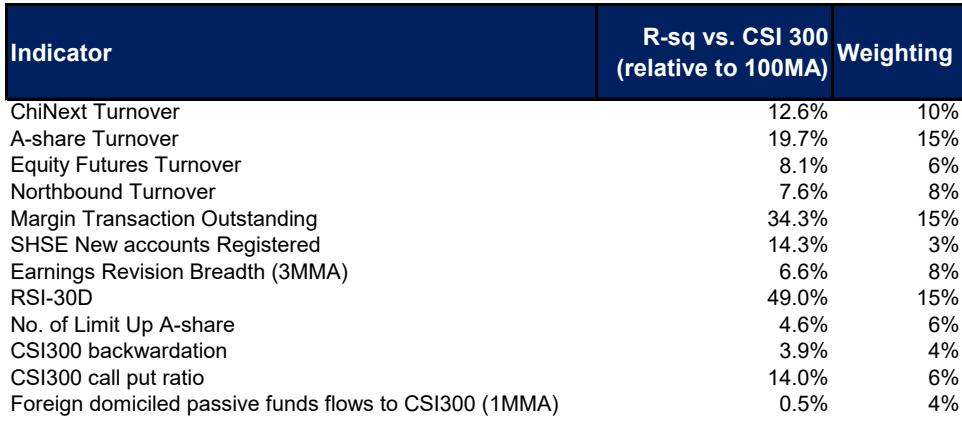

# 中国A股市场情绪观察：阶段性调整而非趋势逆转

截至2026年7月22日当周，加权MS A股市场情绪指标（MSASI）下降7个百分点至37%，一个月移动平均值回落2点至57%。这并非信心层面的转折，而是由三个可识别因素驱动的战术性调整：即将召开的7月政治局会议、CXMT预期中的上市进程，以及市场对IPO资金分流效应的持续关注。参与者行为正在适应政策真空期，而非基本面恶化。

然而，表层数据之下蕴含着更丰富的信号。创业板成交额下降6%至6670亿元，融资余额下降6%至27290亿元，但股指期货成交额实际上升8%至7340亿元。这一分化值得关注，表明机构持仓正在调整而非撤退。30日RSI保持稳定，盈利修正广度虽仍为负值，但已出现边际改善。市场正在屏息等待，而非失去方向。

对于观察者而言，关键洞察在于：当前A股市场情绪的短期走弱是时点与事件风险共同作用的结果，而非结构性缺陷。真正的机会在于认识到，复苏的催化剂已在地平线上显现。7月下旬至8月构成一个可持续的修复窗口，但不同市场的入场时机并不一致。港股市场在近期风险回报比上优于A股，而A股科技与创新板块正在为下半年的更强劲表现奠定基础。

以下分析将最新的情绪数据、政策背景与盈利信号转化为未来六至八周的配置决策框架。

## MSASI下降是政策驱动的阶段性调整，而非情绪反转

加权MSASI为37%，低于50%的中位水平，但一个月移动平均值57%确认了中期趋势仍具建设性。两者之间的差距本身具有信息价值：短期情绪相对于潜在轨迹已出现超调，从历史经验看，这往往预示着均值回归。下降集中在受事件不确定性影响最大的成分指标上。成交额相关指标走弱，但RSI和期货相关指标保持稳定。这与市场正在等待催化剂而非清仓离场的状态一致。

此次调整的主要驱动因素是7月政治局会议。参与者正在对二季度GDP数据低于预期后的政策应对进行不确定性定价。宏观团队评估认为，政策应对将强调“速度而非规模”，这一点至关重要。预计政策制定者将加速推进剩余约2万亿元预算内财政额度的落地，而非推出补充预算。这意味着政策脉冲将是真实但聚焦的，而非全面铺开。重点仍将放在技术自主、先进制造和能源安全领域，而非一般性消费刺激。

对于观察者而言，含义是明确的。政策真空期很可能在数周内而非数月内得到解决。一旦政治局会议结束，不确定性的主要来源将消散。随着政策方向变得具体，MSASI应会回升。问题不在于情绪是否会改善，而在于哪些板块和市场将率先受益于重新获得的清晰度。

## 港股近期风险回报比优于A股

报告明确表达了偏好：对港股保持建设性看法。这不是一个随意的判断，而是由三个在港股市场比A股市场更为成熟的特定催化剂支撑。首先，越来越多的迹象表明，电商价格竞争带来的盈利拖累正接近尾声。这直接惠及主导港股市场的主要互联网和平台公司。其次，超大规模企业在AI商业化方面持续取得进展，近期腾讯的产品发布以及阿里云业务和EBITDA前景的积极更新均体现了这一点。第三，7月IPO的供给压力正在逐步消化，AI相关公司近期股份解禁后波动性已有所缓解。

数据支持这一偏好。7月16日至22日期间，南向资金净流入达16亿美元，使本月至今流入额达到111亿美元，年初至今流入额达到466亿美元。内地参与者持续买入港股，是对其相对价值主张的信心投票。年初至今的流入额虽为去年同期的46%，但仍代表着一项体现坚定信念的实质性配置。

与A股的对比具有启发性。A股市场面临AI相关板块的不确定性，源于全球波动以及对IPO资金分流效应的担忧。特别是CXMT的上市，可能对零售和机构资金形成潜在分流。相比之下，港股已消化了大部分IPO供给压力，并以较低的事件风险提供了对相同科技和AI主题的敞口。近期动态有利于港股，观察者应据此进行配置。

## A股科技板块复苏推迟而非中断，盈利增长正在加速

报告中最重要的长期信号是盈利预览。报告指出，A股盈利压力已有所缓解，而MSCI中国信号则有所增强。这是相信A股科技和创新机会将复苏并创出新高的基础。关键限定词是时机。复苏很可能在全球波动平息之后发生，而非在此之前。

盈利数据支持这一观点。二季度业绩预告显示，科技板块盈利增长正在加速。这不是一个投机性叙事，而是一个已在公司披露中出现的可衡量趋势。这一加速发生在政府持续支持先进制造和技术自主的背景下。对这些领域的政策关注提供了结构性顺风，一旦近期波动消退，将放大盈利复苏。

观察者应将其解读为战略性布局机会。当前A股情绪的短期走弱，恰恰在那些将从盈利加速中受益的板块创造了入场时机。关键在于区分那些具有真实盈利动力的公司与那些仅仅追随主题趋势的公司。盈利修正广度虽仍为负值，但已出现边际改善，表明分析人士开始认识到基本面的改善。随着更多公司发布报告以及数据积累，修正周期应会转为正值，为估值扩张提供催化剂。

## 7-8月修复窗口的决策框架

以下框架将报告分析转化为可操作的配置决策。逻辑基于三个变量：市场敞口、板块偏好和时机。

首先，配置港股以获得近期敞口。南向资金流入、IPO供给压力缓解以及AI商业化加速，共同创造了有利的风险回报比。报告将7月下旬至8月确定为可持续的中国市场修复的关键窗口，而港股是近期的首要受益者。当前水平的入场时机具有吸引力，催化剂具体且可衡量。

其次，为下半年复苏建立A股科技和创新板块的头寸。盈利加速是真实的，政策支持是结构性的。当前情绪的短期走弱是事件风险和流动性担忧的结果，而非基本面恶化。观察者应利用政策真空期，在那些具有明确盈利动力且受益于政府优先领域（技术自主、先进制造和能源安全）的公司中积累头寸。

第三，关注以下催化剂以把握时机。更持久的市场修复需要以下条件：盈利修正的稳定、AI货币化的持续进展、美联储宽松路径的更大可见性、美国主要科技公司AI相关资本支出加速的证据，以及全球去杠杆压力的进一步缓解。这些是将战术性调整转化为可持续上升趋势的条件。

第四，在出现明确的政策转向证据之前，避免全面配置消费板块。强调“速度而非规模”以及聚焦科技和制造而非消费支持，意味着可选消费和必需消费板块不太可能从近期政策脉冲中受益。房地产板块仍构成逆风，6月新房销售同比下降7%，而5月为增长1%，二手房销售和房价继续走弱。这是一个将持续至三季度的结构性拖累。

该框架并非静态配置。它要求积极监测催化剂，并愿意随着政策方向变得更加清晰而进行调整。但战略方向是明确的：修复窗口已经打开，入场时机就在当下。

*仅供参考。部分内容可能基于源材料通过AI辅助生成、翻译、总结或编辑，可能存在遗漏或错误。请独立核实。本文不构成任何专业建议。*
