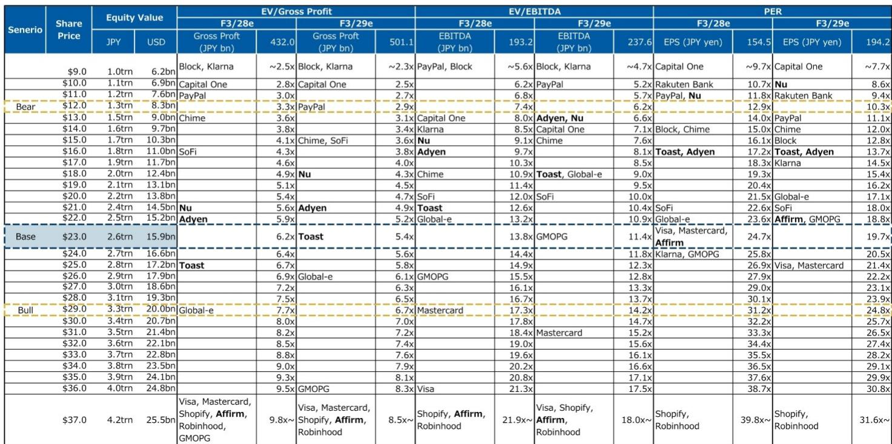
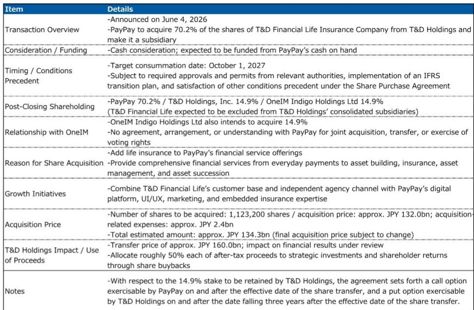
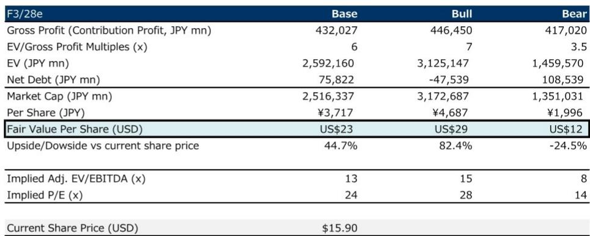

# MS：研究主题与行业变化观察

MS在7月23日发布的一份报告中，将PayPay的评级从等权重上调至超配。这一看似矛盾的调整背后，是一个清晰的判断：PayPay的核心业务增长轨迹并未改变，而市场对寿险研究的担忧已经过度反映在报价中。报告认为，即便在估值中施加了更大的折让，当前报价仍具吸引力，上行潜力大于节奏变化不确定性。

报告的核心逻辑建立在两个层次上。第一，PayPay的中期增长引擎——GMV扩张、高变现率维持、资金服务交叉销售——依然完好。第二，寿险研究虽然带来不确定性，但这份不确定性已经在估值折价中得到体现。对于一家仍处于高增长阶段的公司，市场可能低估了其核心业务的盈利韧性，也低估了寿险研究在长期构建资金生态中的潜在价值。

## 1. 核心业务增长预期未变，1季度业绩有望接近指引上限

报告对PayPay未来三年的收入复合年增长率预测为18.9%，贡献利润复合年增长率为19.1%。在F3/27财年，MS预计调整后EBITDA为1409亿日元，同比增长26.8%，高于公司指引中值。1季度（截至7月31日）的业绩预计将接近公司指引的上限——调整后EBITDA预测为322.5亿日元，而公司指引区间为305亿至325亿日元。

这一判断的支撑来自两个业务板块。支付业务方面，报告认为PayPay能够在维持GMV增长的同时扩大变现率与成本率之间的利差，驱动力包括线上支付占比提升、BNPL和循环支付产品带来的利息收入增长，以及高附加值支付服务的扩张。资金服务业务方面，PayPay银行的贷款和研究余额增长，加上利率正常化带来的净息差改善，将在中长期成为盈利增长的正面因素。报告特别指出，管理层假设中已包含2026年7月和2027年1月的进一步加息情景。

> **KC评论：** 这里容易被忽略的一点是，报告认为1季度业绩本身可能不足以推动估值重估——市场对短期盈利趋势已有预期。真正能驱动估值修复的，是公司能否展示支付业务之外的新增长点，尤其是资金服务和寿险业务的增量利润贡献。

## 2. 寿险研究：不确定性已折价，但协同效应仍需验证

PayPay对T&D Financial的寿险研究是市场关注的焦点。MS将估值中的折让幅度扩大，并将EV/GP倍数从之前的5-7倍区间调整为6倍。报告坦承，在与全球读者的交流中，一个普遍的观察是PayPay此前并未将寿险列为战略重点，这笔交易被部分读者视为偏离了美国上市成长型公司通常的研究策略。

但报告同时指出，这笔研究不应被简单视为保险分销渠道的扩展。从更长的视角看，它可能指向一个更广泛的战略：同时强化保险业务的分销和资产管理两端。寿险产品的竞争力不仅取决于销售能力，还取决于保费收入的回报表现——更高的回报表现可以增强定价灵活性和预定利率，从而改善产品吸引力和定价竞争力。OneIM在研究管理、再保险和不确定性管理方面的专业能力，可能成为提升标的公司盈利能力的关键。

不过，报告也列出了需要关注的不确定性点。T&D Financial在整个寿险市场的份额并不大，且由于更依赖趸缴储蓄型产品，新保单利润率可能相对有限。寿险行业受到严格的监管框架约束，PayPay并不能自由支配保险资产。在2027年10月研究完成之前，读者可能保持谨慎，直到管理层提供更清晰的关于价值创造策略、预期协同效应和变现路径的说明。

## 3. 估值修复的关键：证明支付之外的增长能力

报告通过情景分析展示了不同假设下的估值区间。在基准情景下，基于F3/28年贡献利润和6倍EV/GP倍数，公允价值为每股23美元，较当前报价有约45%的上行空间。在乐观情景下（7倍倍数），公允价值为29美元；在悲观情景下（3.5倍倍数），公允价值为12美元。

但报告明确指出，支付业务本身的增长前景已经被市场充分理解，并基本反映在当前报价中。要支撑更高的估值，公司需要证明资金服务乃至寿险等新业务领域能够产生有意义的增量利润，并进一步提升长期增长曲线。清晰的协同效应实现、变现路径和更广泛的价值创造证据，是收窄当前估值折价的关键。

对于关注日本资金科技和数字支付领域的观察者来说，这份报告提供了一个有价值的分析框架：如何区分一家高增长公司的核心业务价值与战略研究带来的估值折价，以及如何评估非传统研究对长期生态构建的潜在价值。PayPay的案例也提醒市场，当一家公司做出超出读者预期的战略动作时，估值折价可能短期持续，但核心业务的盈利韧性才是决定长期回报的基础。

For informational purposes only. Portions may be generated,translated,summarized,or edited with AI assistance based on source materials and may contain omissions or errors. Please verify independently. This is not investment,legal,tax,accounting,or other professional advice.

For informational purposes only. Portions may be generated,translated,summarized,or edited with AI assistance based on source materials and may contain omissions or errors. Please verify independently. This is not investment,legal,tax,accounting,or other professional advice.

