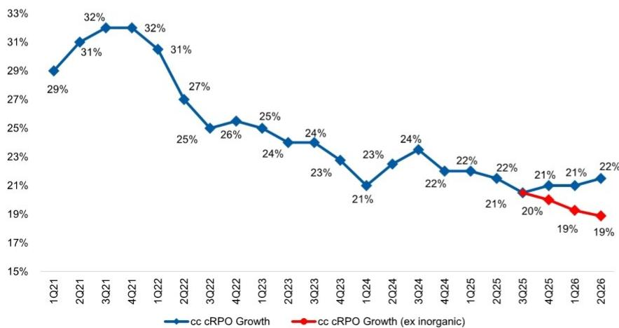
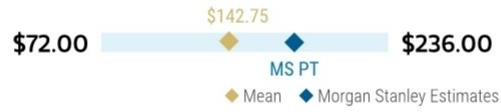
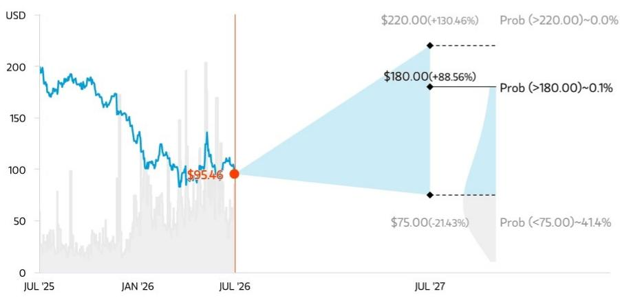
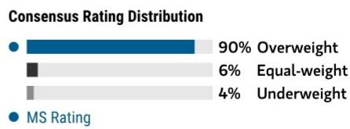
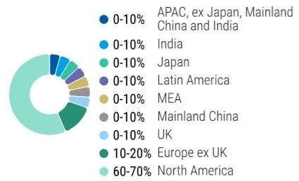
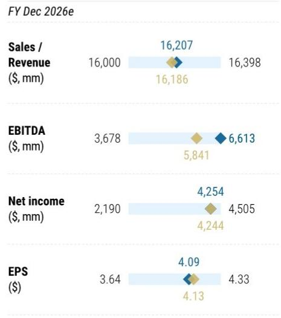

Software | United States of America

<table><tr><td colspan="2">MS & CO. LLC</td></tr><tr><td colspan="2">Adam Wood</td></tr><tr><td colspan="2">Equity Analyst</td></tr><tr><td>Adam.Wood@morganstanley.com</td><td>+1 212 761-3656</td></tr><tr><td colspan="2">Sanjit K Singh</td></tr><tr><td colspan="2">Equity Analyst</td></tr><tr><td>Sanjit.Singh@morganstanley.com</td><td>+1 415 576-2060</td></tr><tr><td colspan="2">Ryan Lountzis</td></tr><tr><td colspan="2">Research Associate</td></tr><tr><td>Ryan.Lountzis@morganstanley.com</td><td>+1 212 761-3189</td></tr></table>

July 23, 2026 04:01 AM GMT

ServiceNow Inc | North America

# 2Q26 Results - Building Confidence into the Second Half

AlphaSignals Earnings Reaction

Strengthens our thesis Impact to our thesis

↑ Modest upside
Financial results versus consensus — Largely unchanged
Direction of next 12-month
consensus EPS

Source: Company data, MS

A cleaner and larger beat on 2Q cRPO and subs rev should reassure on the potential for acceleration in the business through 2H26 and beyond. The 3Q guide is noisier on Fed pull forward into 2Q, but the FY guide was raised. Overall, we see our OW thesis intact heading into an attractive 2H.

## Key Takeaways

2Q cRPO grew 21.5% cc, 2pp above street / guide returning to a greater magnitude of beat. We estimate org. subs growth accelerated in 2Q from c. 18% to c. 20%.

\- AI ACV remained strong with the company highlighting acceleration in the quarter to "well north" of \$1B.

Some noise around the 3Q guide commentary takes a small amount of the shine off the strong 2Q but our checks suggest more on caution than on pipeline weakness.

The improved 2Q results reinforce our thesis that NOW should be one of the earlier apps names to see revenue inflection.

At c. 2027 34x GAAP P/E or 27x EV/FCF (post-SBC) for high teens topline and margin expansion we remain OW.

Greater evidence of the turn - remain OW, more conviction in AI monetization driving an accel to a still solid core: 2Q was a much cleaner print for NOW, with cRPO growth of 21.5% cc beating Street and guidance by \~2pts, a stronger beat than 1Q, supporting the view that growth can reaccelerate. Subscription revenue was also well ahead at +23% cc, and we estimate organic growth accelerated from \~18% in 1Q to \~20% in 2Q. AI is becoming more tangible, with ServiceNow AI crossing \$1bn in ACV, agentic deployments up ninefold in nine months, and large-deal/customer metrics strong. The only real friction was 3Q guidance, as stronger Federal business pulled forward into 2Q and pressured the 3Q revenue/margin setup, but FY subscription guidance was still modestly raised and FY operating income / FCF guidance held unchanged on flat headcount. Given our 2Q checks, especially on the 3Q Fed pipe (see ServiceNow Inc: 2Q26 Preview – Time to Push Through The Noise

## ServiceNow Inc (NOW.N, NOW UN)

<table><tr><td>Stock Rating</td><td>Overweight</td></tr><tr><td>Industry View</td><td>Attractive</td></tr><tr><td>Price target</td><td>$180.00</td></tr><tr><td>Shr price, close (Jul 22, 2026)</td><td>$95.46</td></tr><tr><td>Mkt cap, curr (mm)</td><td>$98,706</td></tr><tr><td>52-Week Range</td><td>$210.00-81.25</td></tr></table>

<table><tr><td>Fiscal Year Ending</td><td>12/25</td><td>12/26e</td><td>12/27e</td><td>12/28e</td></tr><tr><td>EPS ($)**</td><td>3.51</td><td>4.09</td><td>5.06</td><td>6.05</td></tr><tr><td>Prior EPS ($)**</td><td>-</td><td>4.20</td><td>4.98</td><td>6.00</td></tr><tr><td>P/E</td><td>75.7</td><td>39.7</td><td>32.3</td><td>25.2</td></tr><tr><td>EPS ($)§</td><td>3.47</td><td>4.13</td><td>5.03</td><td>6.11</td></tr><tr><td>Div yld (%)</td><td>-</td><td>-</td><td>-</td><td>-</td></tr></table>

Unless otherwise noted, all metrics are based on MS ModelWare framework  
\*\* = Based on consensus methodology  
§ = Consensus data is provided by Refinitiv Estimates  
e = MS estimates

<table><tr><td>Quarter</td><td>2025</td><td>2026e Prior</td><td>2026e Current</td><td>2027e Prior</td><td>2027e Current</td></tr><tr><td>Q1</td><td>0.81</td><td>-</td><td>0.97a</td><td>1.16</td><td>1.16</td></tr><tr><td>Q2</td><td>0.82</td><td>-</td><td>0.90a</td><td>1.03</td><td>1.15</td></tr><tr><td>Q3</td><td>0.96</td><td>1.15</td><td>1.02</td><td>1.37</td><td>1.29</td></tr><tr><td>Q4</td><td>0.92</td><td>1.21</td><td>1.20</td><td>1.42</td><td>1.45</td></tr></table>

e = MS estimates, a = Actual Company reported data

For analyst certification and other important disclosures, refer to the Disclosure Section, located at the end of this report.

(17 Jul 2026)), and a confident conference call, we're on the side that 3Q is more about caution than any sign of slowdown in business / pipeline. At 34x 2027 GAAP P/E / 27x EV/FCF (post-SBC) we think ServiceNow remains very attractive for high teens topline growth combined with room for margin expansion. Not at least regaining the ground the shares lost during normal hours during the aftermarket seems harsh and we remain OW.

Exhibit 1: Q2 cc cRPO Growth of +21.5% YoY Came in Ahead of Consensus. Organic Growth Remains The Key Focus  
  
Source: Company data, MS

## What We Liked in Q2:

\- Beat magnitude improved QoQ. NOW returned a more meaningful beat in the quarter on cc subs revenue and cRPO. We also saw org subs growth accelerate in 2Q. The conference call suggested the noise around 2Q pull forward of Fed deals driving weaker 3Q business was more predicated on general caution in the environment than anything they see in the Fed pipe which was seen as strong.

\- Healthy demand backdrop. CEO Bill McDermott said the company had not seen any dislocation of software spend from hardware in the quarter, unlike some other enterprise software companies, with NOW rather seeing an acceleration.

\- Reaffirmed margins an encouraging sign as the company digests recent acquisitions. Discipline on costs, but still investing for growth – we think it's important that growth companies can invest to drive that growth – but equally important a balance is struck, especially after a period of M&A investment. It strikes us that the reconfirmed aim of flat headcount (more 4Q weighted as 1H saw M&A heads come in) is reasonable as it allows for quota carrying sales and AI talent while margins can still expand.

\- Strong AI metrics. AI deal momentum remains strong with the company noting the move to >\$1bn in AI ACV was an acceleration in the Q. This reinforces our view that NOW should be earlier to see an AI driven inflection relative to other application software vendors.

## Areas to Monitor:

\- Gross margin trends an area to watch. Gross margin pressure as the margin guide came down for the FY, offset by operating efficiencies to drive a retained op margin guide. The pressure came from AI consumption and higher hyperscaler costs. The company reassured a reasonable gross margin floor would be c. 80% and sees room for gross margins to tick back up as it optimizes hyperscaler spend and sees ongoing improvements around AI costs as token costs come down and consumption revenues increase over time.

\- 3Q guidance an area to potentially scrutinize. The noise around the 3Q guide offsets some of the shine from the strong 2Q. Our channel checks also suggest the 3Q Fed pipe is strong suggesting the outlook is indeed more based on caution than any core slowdown – but to be confirmed.

Exhibit 2: ServiceNow Variance Table

<table><tr><td rowspan="2">($ in millions, except EPS)</td><td colspan="5">Actuals</td><td rowspan="2">MSe</td><td rowspan="2">Consensus</td><td rowspan="2">Actual vs Consensus</td></tr><tr><td>2Q25</td><td>3Q25</td><td>4Q25</td><td>1Q26</td><td>2Q26</td></tr><tr><td>Subscription Revenue</td><td>3,113.0</td><td>3,299.0</td><td>3,466.0</td><td>3,671.0</td><td>3,877.0</td><td>3,817.5</td><td>3,817.3</td><td>1.6%</td></tr><tr><td>YoY - Reported</td><td>22.5%</td><td>21.5%</td><td>20.9%</td><td>22.2%</td><td>24.5%</td><td>22.6%</td><td>22.6%</td><td></td></tr><tr><td>YoY - Constant Currency</td><td>21.5%</td><td>20.5%</td><td>19.5%</td><td>19.0%</td><td>23.0%</td><td>21.3%</td><td>21.4%</td><td>160bps</td></tr><tr><td>Current Remaining Performance Obligations (cRPO)</td><td>10,920.0</td><td>11,350.0</td><td>12,850.0</td><td>12,640.0</td><td>13,200.0</td><td>12,989.5</td><td>12,995.9</td><td>1.6%</td></tr><tr><td>YoY - Reported</td><td>24.4%</td><td>21.3%</td><td>25.1%</td><td>22.6%</td><td>20.9%</td><td>19.0%</td><td>19.0%</td><td></td></tr><tr><td>YoY - Constant Currency</td><td>21.5%</td><td>20.5%</td><td>21.0%</td><td>21.0%</td><td>21.5%</td><td>19.5%</td><td>19.5%</td><td>196bps</td></tr><tr><td>Total Revenue</td><td>3,215.0</td><td>3,407.0</td><td>3,568.0</td><td>3,770.0</td><td>3,987.0</td><td>3,917.7</td><td>3,925.8</td><td>1.6%</td></tr><tr><td>YoY</td><td>22.4%</td><td>21.8%</td><td>20.7%</td><td>22.1%</td><td>24.0%</td><td>21.9%</td><td>22.1%</td><td></td></tr><tr><td>Non-GAAP Operating Income</td><td>955.0</td><td>1,140.0</td><td>1,101.0</td><td>1,199.0</td><td>1,173.0</td><td>1,038.0</td><td>1,044.8</td><td>12.3%</td></tr><tr><td>Operating Margin (%)</td><td>29.7%</td><td>33.5%</td><td>30.9%</td><td>31.8%</td><td>29.4%</td><td>26.5%</td><td>26.6%</td><td>281bps</td></tr><tr><td>YoY Change (bps)</td><td>230</td><td>228</td><td>137</td><td>94</td><td>-28</td><td>-321</td><td>-309</td><td></td></tr><tr><td>Non-GAAP EPS</td><td>0.82</td><td>0.96</td><td>0.92</td><td>0.97</td><td>0.90</td><td>0.87</td><td>0.86</td><td>$0.04</td></tr><tr><td>Free Cash Flow</td><td>535.0</td><td>592.0</td><td>2,032.0</td><td>1,665.0</td><td>634.0</td><td>550.4</td><td>647.6</td><td>-2.1%</td></tr><tr><td>FCF Margin (%)</td><td>16.6%</td><td>17.4%</td><td>57.0%</td><td>44.2%</td><td>15.9%</td><td>14.0%</td><td>16.5%</td><td>(59)bps</td></tr></table>

<table><tr><td colspan="7">Next Quarter</td></tr><tr><td></td><td colspan="3">3Q26 Guidance</td><td rowspan="2">MSe</td><td rowspan="2">Consensus</td><td rowspan="2">Guide vs Consensus</td></tr><tr><td>($ in millions, except EPS)</td><td>Low</td><td>High</td><td>Midpoint</td></tr><tr><td>Subscription Revenue</td><td>3,975.0</td><td>3,980.0</td><td>3,977.5</td><td>4,008.6</td><td>4,005.1</td><td>-0.7%</td></tr><tr><td>YoY - Reported</td><td></td><td></td><td>20.5%</td><td>21.5%</td><td>21.4%</td><td></td></tr><tr><td>YoY - Constant Currency</td><td></td><td></td><td>20.0%</td><td>21.1%</td><td>20.9%</td><td>(85)bps</td></tr><tr><td>Current Remaining Performance Obligations (cRPO)</td><td></td><td></td><td>13,563</td><td>13,509.7</td><td>13,513.7</td><td>0.4%</td></tr><tr><td>YoY - Reported</td><td></td><td></td><td>19.5%</td><td>19.0%</td><td>19.1%</td><td>44bps</td></tr><tr><td>YoY - Constant Currency</td><td></td><td></td><td>20.0%</td><td>19.5%</td><td>19.4%</td><td>58bps</td></tr><tr><td>Non-GAAP Operating Margin</td><td></td><td></td><td>31.0%</td><td>33.8%</td><td>32.6%</td><td>(160)bps</td></tr><tr><td>YoY Change (bps)</td><td></td><td></td><td>-246</td><td>29</td><td>-86</td><td></td></tr></table>

<table><tr><td colspan="7">Forward Annual Guidance</td></tr><tr><td></td><td rowspan="2">FY26Guidance</td><td rowspan="2">MSe</td><td rowspan="2">Consensus</td><td rowspan="2">Guide vsConsensus</td><td rowspan="2">PriorGuidance</td><td rowspan="2">GuidanceChange</td></tr><tr><td>($ in millions, except EPS)</td></tr><tr><td>Subscription Revenue</td><td>15,770.0</td><td>15,755.0</td><td>15,761.0</td><td>0.1%</td><td>15,755.0</td><td>$15</td></tr><tr><td>YoY - Reported</td><td>22.5%</td><td>22.3%</td><td>22.3%</td><td>16bps</td><td>22.3%</td><td>5bps</td></tr><tr><td>YoY - Constant Currency</td><td>21.0%</td><td>20.6%</td><td>20.9%</td><td>15bps</td><td>20.8%</td><td>10bps</td></tr><tr><td>Non-GAAP Operating Margin</td><td>31.5%</td><td>31.5%</td><td>31.5%</td><td>0bps</td><td>31.5%</td><td>0bps</td></tr><tr><td>YoY Change (bps)</td><td></td><td>24</td><td>25</td><td></td><td></td><td></td></tr><tr><td>Free Cash Flow Margin</td><td>35.0%</td><td>35.0%</td><td>35.0%</td><td>0bps</td><td>35.0%</td><td>0bps</td></tr></table>

Source: Company data, MS

## Risk Reward – ServiceNow Inc (NOW.N)

Seeing the Forest For the Trees

## PRICE TARGET \$180.00

Discount of 21x Base Case CY30e FCF of \~\$11.8B, discounted back at 11.9% WACC, plus \$7 in CY26 net cash per share. 21x multiple supported by 19% 2-yr FCF CAGR in CY28-CY30.

Consensus Price Target Distribution

Source: Refinitiv, MS

## RISK REWARD CHART AND OPTIONS IMPLIED PROBABILITIES (12M)

  
Key: — Historical Stock Performance ● Current Stock Price ◆ Price Target  
Source: Refinitiv, MS, MS Institutional Equities Division. The probabilities of our Bull, Base, and Bear case scenarios playing out were estimated with implied volatility data from the options market as of 22 Jul 2026. All figures are approximate risk-neutral probabilities of the stock reaching beyond the scenario price in either three-months' or one-years' time. View explanation of Options Probabilities methodology here

## OVERWEIGHT THESIS

ServiceNow's strong network of system integrations and cohesive data fabric position the company well to serve as the go-to workflow automation and agentic orchestration platform. The company has generated $20\%+$ subscription revenue and free cash flow growth and believe it is well-positioned to achieve a similar growth profile supported by expansion into new workflows and Now Assist/new product adoption.

  
Source: Refinitiv, MS

## Risk Reward Themes

New Data Era: Positive View descriptions of Risk Rewards Themes here

## BULL CASE

\$220.00

## Discount of \~23x Bull Case CY30e FCF of \~\$13.7B

New Markets Take Off. Demand for NOW's core ITSM offering holds strong, demand for non-core IT workflows takes off. Sub Revenue grows '25-'30 at a 21% CAGR, while margins expand to 36% in FY30 from 10% in FY15. NOW trades at 23x our CY30 FCFe of \$13.7B discounted back at 11.9% WACC + \$9 in CY26 net cash/share.

## BASE CASE

## \$180.00 BEAR CASE

## Discount of \~21x Base Case CY30e FCF of \~\$11.8B

Steady Investment in Expanding Market Oppty With Premier Unit Economics Drives Durable FCF CAGR. NOW delivers solid growth through a combination of success in core ITSM and an increasing revenue contribution from new product areas like Now Assist. Sub Revenue grows '25-'30 at a 20% CAGR, while margins expand to 35% in FY30 from 10% in FY15. NOW trades at 21x our CY30 FCFe of \$11.8B discounted back at 11.9% WACC + \$7 in CY26 net cash/share.

\$75.00

## Discount of \~9x Bear Case CY30e FCF of \~\$11.2B

TAM Expansion Stalls. NOW continues to see adoption in ITSM, but the revenue generated from new product areas is less than hoped, weighing on forward revenue growth. Sub Revenue grows '25-'30 at a 19% CAGR, while margins expand to 35% in FY30 from 10% in FY15. NOW trades at 9x our CY30 FCFe of \$11.2B discounted back at 11.9% WACC + \$7 in CY26 net cash/share.

◆ Mean ◆ MS Estimates
Source: Refinitiv, MS

## Risk Reward – ServiceNow Inc (NOW.N)

## KEY EARNINGS INPUTS

<table><tr><td>Drivers</td><td>Dec 2025</td><td>Dec 2026e</td><td>Dec 2027e</td><td>Dec 2028e</td></tr><tr><td>Con. Duration, CC Subscription Billings YoY Growth (%)</td><td>0.0</td><td>0.0</td><td>0.0</td><td>0.0</td></tr><tr><td>Subscription Revenue YoY Growth (%)</td><td>21.0</td><td>22.4</td><td>19.8</td><td>19.0</td></tr><tr><td>Total Revenue YoY Growth (%)</td><td>20.9</td><td>22.1</td><td>19.5</td><td>18.9</td></tr><tr><td>Operating Margin % (%)</td><td>31.2</td><td>31.5</td><td>32.5</td><td>33.5</td></tr><tr><td>FCF YoY Growth (%)</td><td>34.2</td><td>22.2</td><td>21.3</td><td>20.7</td></tr></table>

## INVESTMENT DRIVERS

\- Stable levels of sales productivity with sales headcount growing \~30% annually.

\- Growth in ACV in enterprise customers from seat growth + adoption of new use cases.

\- Growing share in \$6B TAM for ITSM plus \$54B of additional TAM with newer products.

## GLOBAL REVENUE EXPOSURE

  
Source: MS Estimate View explanation of regional hierarchies here

## MS ALPHA MODELS

<table><tr><td>2/5BEST</td><td>24 MonthHorizon</td><td>3/5MOST</td><td>3 MonthHorizon</td></tr></table>

Source: Refinitiv, FactSet, MS; 1 is the highest favored Quintile and 5 is the least favored Quintile

## RISKS TO PT/RATING

## RISKS TO UPSIDE

\- Greater than expected share gains in new markets as upsell and cross-sell motion takes hold;

\- Superior unit economics drive faster than expected FCF growth;

\- Improving traction with Federal Government

## RISKS TO DOWNSIDE

\- Tougher competition from low-end vendors and SaaS peers;

• Sales productivity may decline as with growth if new markets prove challenging;

\- Seat-based pricing proves more difficult amidst GenAI disruption

## OWNERSHIP POSITIONING

<table><tr><td>Inst. Owners, % Active</td><td>54.5%</td></tr><tr><td>HF Sector Long/Short Ratio</td><td>2.1x</td></tr><tr><td>HF Sector Net Exposure</td><td>29.5%</td></tr></table>

Refinitiv; MSPB Content. Includes certain hedge fund exposures held with MSPB. Information may be inconsistent with or may not reflect broader market trends. Long/Short Ratio = Long Exposure / Short exposure. Sector % of Total Net Exposure = (For a particular sector: Long Exposure - Short Exposure) / (Across all sectors: Long Exposure – Short Exposure).

MS ESTIMATES VS. CONSENSUS  

Analysis

Exhibit 3: NOW Model Changes

<table><tr><td>Model Changes</td><td>FY24</td><td>FY25</td><td>3/26</td><td>6/26</td><td>9/26E</td><td>12/26E</td><td>FY26E</td><td>FY27E</td><td>FY28E</td></tr><tr><td>New Subscription Rev</td><td>10646.0</td><td>12883.0</td><td>3671.0</td><td>3877.0</td><td>3977.5</td><td>4244.4</td><td>15770.0</td><td>18886.8</td><td>22479.0</td></tr><tr><td>YoY Growth</td><td>22.6%</td><td>21.0%</td><td>22.2%</td><td>24.5%</td><td>20.6%</td><td>22.5%</td><td>22.4%</td><td>19.8%</td><td>19.0%</td></tr><tr><td>Old Subscription Rev</td><td>10646.0</td><td>12883.0</td><td>3671.0</td><td>3817.5</td><td>4008.6</td><td>4257.9</td><td>15755.0</td><td>18752.9</td><td>22284.0</td></tr><tr><td>YoY Growth</td><td>22.6%</td><td>21.0%</td><td>22.2%</td><td>22.6%</td><td>21.5%</td><td>22.8%</td><td>22.3%</td><td>19.0%</td><td>18.8%</td></tr><tr><td>% Change</td><td>0.0%</td><td>0.0%</td><td>0.0%</td><td>1.6%</td><td>-0.8%</td><td>-0.3%</td><td>0.1%</td><td>0.7%</td><td>0.9%</td></tr><tr><td>New Total Revenue</td><td>10984.0</td><td>13278.0</td><td>3770.0</td><td>3987.0</td><td>4091.8</td><td>4357.9</td><td>16206.7</td><td>19369.5</td><td>23029.7</td></tr><tr><td>YoY Growth</td><td>22.4%</td><td>20.9%</td><td>22.1%</td><td>24.0%</td><td>20.1%</td><td>22.1%</td><td>22.1%</td><td>19.5%</td><td>18.9%</td></tr><tr><td>Old Total Revenue</td><td>10984.0</td><td>13278.0</td><td>3770.0</td><td>3917.7</td><td>4123.8</td><td>4371.7</td><td>16183.3</td><td>19222.6</td><td>22818.7</td></tr><tr><td>YoY Growth</td><td>22.4%</td><td>20.9%</td><td>22.1%</td><td>21.9%</td><td>21.0%</td><td>22.5%</td><td>21.9%</td><td>18.8%</td><td>18.7%</td></tr><tr><td>% Change</td><td>0.0%</td><td>0.0%</td><td>0.0%</td><td>1.8%</td><td>-0.8%</td><td>-0.3%</td><td>0.1%</td><td>0.8%</td><td>0.9%</td></tr><tr><td>New Operating Income</td><td>3255.0</td><td>4149.0</td><td>1199.0</td><td>1173.0</td><td>1268.1</td><td>1458.9</td><td>5098.9</td><td>6288.0</td><td>7708.5</td></tr><tr><td>New Operating Margin</td><td>29.6%</td><td>31.2%</td><td>31.8%</td><td>29.4%</td><td>31.0%</td><td>33.5%</td><td>31.5%</td><td>32.5%</td><td>33.5%</td></tr><tr><td>Old Operating Income</td><td>3255.0</td><td>4149.0</td><td>1199.0</td><td>1038.0</td><td>1391.8</td><td>1466.2</td><td>5095.0</td><td>6238.3</td><td>7653.2</td></tr><tr><td>Old Operating Margin</td><td>29.6%</td><td>31.2%</td><td>31.8%</td><td>26.5%</td><td>33.8%</td><td>33.5%</td><td>31.5%</td><td>32.5%</td><td>33.5%</td></tr><tr><td>% Change</td><td>0.0%</td><td>0.0%</td><td>0.0%</td><td>13.0%</td><td>-8.9%</td><td>-0.5%</td><td>0.1%</td><td>0.8%</td><td>0.7%</td></tr><tr><td>New Non-GAAP EPS</td><td>2.78</td><td>3.51</td><td>0.97</td><td>0.90</td><td>1.02</td><td>1.20</td><td>4.09</td><td>5.06</td><td>6.05</td></tr><tr><td>Old Non-GAAP EPS</td><td>2.78</td><td>3.51</td><td>0.97</td><td>0.87</td><td>1.15</td><td>1.21</td><td>4.20</td><td>4.98</td><td>6.00</td></tr><tr><td>% Change</td><td>0.0%</td><td>0.0%</td><td>0.0%</td><td>3.8%</td><td>-11.0%</td><td>-1.2%</td><td>-2.6%</td><td>1.4%</td><td>0.8%</td></tr><tr><td>cRPO</td><td>10270.0</td><td>12850.0</td><td>12640.0</td><td>13200.0</td><td>13562.5</td><td>15293.2</td><td>15293.2</td><td>18107.3</td><td>21368.9</td></tr><tr><td>YoY Growth</td><td>19.4%</td><td>25.1%</td><td>22.6%</td><td>20.9%</td><td>19.5%</td><td>19.0%</td><td>19.0%</td><td>18.4%</td><td>18.0%</td></tr><tr><td>Old cRPO</td><td>10270.0</td><td>12850.0</td><td>12640.0</td
