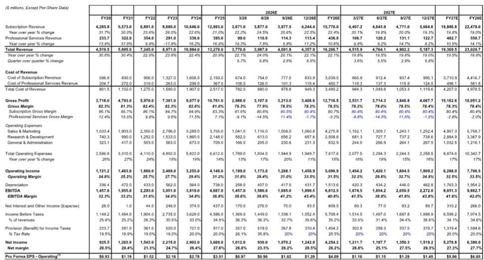
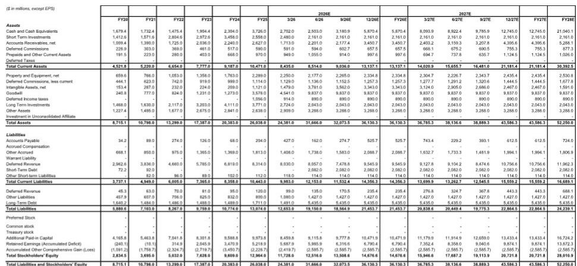
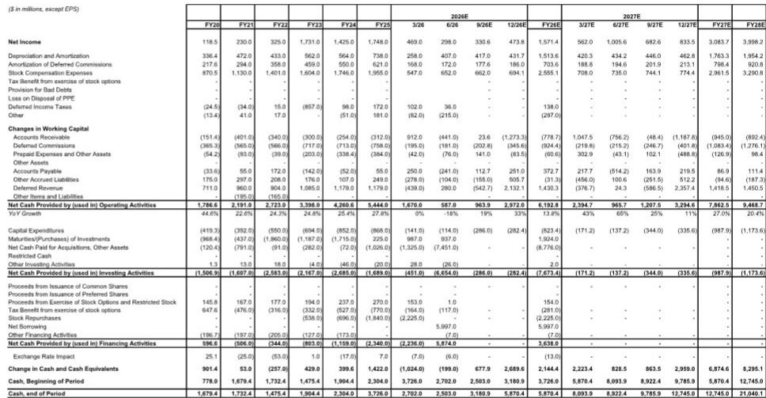

# MS：1.AI与AI及近期数据观察

ServiceNow 在 2026 年第二季度交出了一份更干净的业绩。当期 cRPO（当前剩余履约义务）按固定汇率计算同比增长 21.5%，超出市场预期约 2 个百分点，也优于第一季度 21% 的增速。订阅收入同比增长 23%，同样高于预期。这份财报最值得关注的判断是：ServiceNow 正在成为应用软件领域最早看到 AI 驱动收入拐点的公司之一，而第二季度的数据为这一判断提供了更扎实的证据。

报告认为，第二季度的 beat 幅度环比改善，cRPO 和订阅收入均实现超预期增长，且有机订阅增速从第一季度的约 18% 提升至约 20%。这些信号共同指向业务在下半年可能进一步加速。

## 1. AI 业务年化合同价值突破 10 亿美元，代理部署量九个月增长九倍

AI 正在从概念走向可量化的收入贡献。ServiceNow 在第二季度确认 AI 相关年化合同价值（ACV）已“远高于”10 亿美元，且公司明确表示这一数字在季度内呈现加速趋势。代理（agentic）部署量在九个月内增长了九倍，大型交易和客户指标保持强劲。

> **KC评论：** 10 亿美元 ACV 本身是一个里程碑，但更值得关注的是“加速”这个定性描述。这意味着 AI 收入并非一次性脉冲，而是正在形成持续增长曲线。对于跟踪 SaaS 公司 AI 变现进度的读者，ServiceNow 提供了一个可参考的早期样本。

## 2. 第三季度指引存在噪音，但全年指引小幅上调

第三季度指引是本次财报相对少见的摩擦点。由于联邦业务部分交易从第三季度提前到第二季度确认，第三季度的收入和利润率基数受到挤压。但全年订阅收入指引仍从 157.55 亿美元小幅上调至 157.70 亿美元，全年经营利润率和自由现金流利润率指引保持不变。

报告通过渠道调研认为，第三季度的谨慎更多源于对宏观环境的保守判断，而非管道本身走弱。联邦业务管道在第三季度依然强劲，这一点有待后续季度验证。

## 3. 毛利率承压但存在修复路径，费用控制保持纪律

毛利率是另一个需要关注的指标。全年毛利率指引有所下调，原因是 AI 消费增加和超大规模云服务商成本上升。但公司给出了一个明确的毛利率底线：约 80%，并认为随着超大规模云成本优化和 AI token 成本下降，毛利率有望回升。

与此同时，公司重申了全年员工人数持平的目标，这意味着在消化近期并购带来的人员增长后，公司仍能通过费用纪律维持利润率扩张空间。报告认为，对于一家处于增长期的公司，能够在研究与利润之间取得平衡是重要的信号。

## 4. 估值与增长组合提供观察框架

报告提供了一个可复用的观察框架：在 2027 年 GAAP 市盈率约 34 倍、EV/FCF（扣除股权激励后）约 27 倍的估值水平下，ServiceNow 同时具备高十几位数的收入增长和利润率扩张空间。核心假设是订阅收入在 2025-2030 年间实现约 20% 的年复合增长率，利润率从当前水平逐步提升至 35% 左右。

这一框架的关键变量在于：AI 产品能否持续推动新工作流采用，以及联邦业务能否成为新的增长引擎。报告认为，第二季度的数据正在朝有利方向演进。

For informational purposes only. Portions may be generated,translated,summarized,or edited with AI assistance based on source materials and may contain omissions or errors. Please verify independently. This is not investment,legal,tax,accounting,or other professional advice.

For informational purposes only. Portions may be generated,translated,summarized,or edited with AI assistance based on source materials and may contain omissions or errors. Please verify independently. This is not investment,legal,tax,accounting,or other professional advice.

