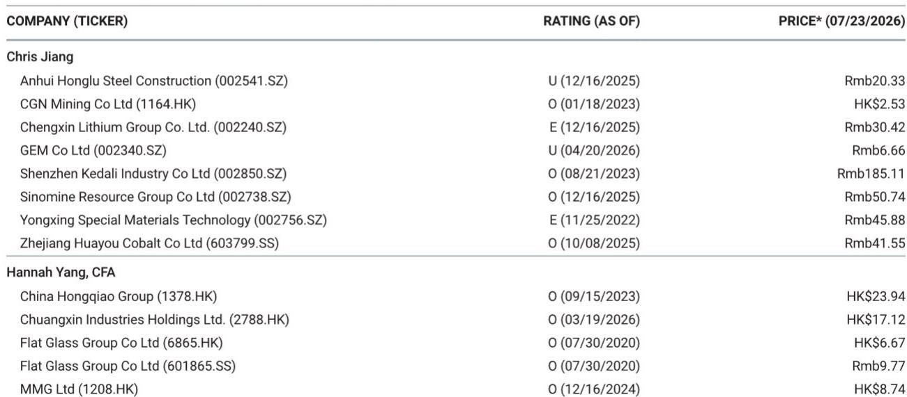
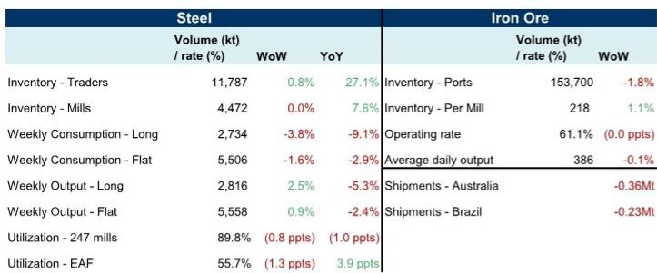
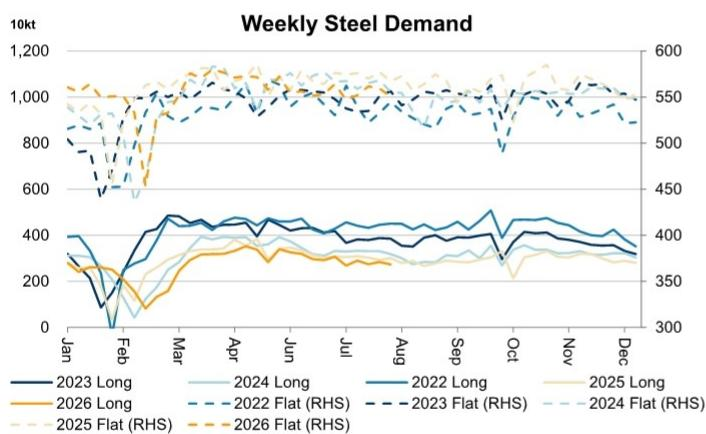

# 中国钢铁市场观察：产量与需求的分化及其对原料市场的影响

中国钢铁行业近期出现了一个值得关注的信号：产量在加速增长，而消费却在放缓。截至7月19日当周，长材周产量环比增长2.5%，板材产量环比增长0.9%，但同期长材表观消费量环比下降3.8%，板材下降1.6%。这种分化并非统计上的偶然现象。它反映了钢厂在前期库存消耗后主动增产，但当前产量已超出实际需求。其结果是：钢厂在需求趋弱的环境下增加供应，贸易商以不断上升的库存水平吸收过剩部分，而作为整个体系原料的铁矿石，尽管短期受到澳大利亚和巴西供应中断的影响，其基本面前景仍在转弱。

这一时间节点之所以重要，是因为数据捕捉到了一个转折点。同比数据显示，长材和板材的消费量均已出现明显下降——分别下降9.1%和2.9%——而产量虽然同比也为负值，但下降速度要慢得多。这意味着供需缺口同比正在扩大，而非收窄。对于关注材料领域的研究者而言，关键问题不在于钢价是否会走软——这已经发生——而在于当前正在形成的库存积累是否会触发一轮被迫减产，从而反过来验证此前谨慎的需求信号。

铁矿石市场正处于这一机制的核心。钢厂端铁矿石库存环比上升1.1%，即便开工率略有下降、日均产量环比微降0.1%。这是一个典型的领先指标：钢厂在减少钢铁产量的同时却在增加矿石库存，这意味着它们要么是在建立预防性库存，要么是被锁定在不再匹配生产计划的合同交付中。无论哪种解释，都指向未来矿石采购量的下调。港口库存环比下降1.8%——这似乎是矿石多头相对少见的亮点——但仅仅反映了矿石存储地点的转移，而非整个系统需求的变化。

## 周度钢铁产量在需求收缩中上升，形成库存累积压力

周度数据中最突出的矛盾是产量增加与消费减少同时发生。长材产量环比增长2.5%至281.6万吨，而表观消费量环比下降3.8%至273.4万吨。简单计算：钢厂在一周内生产了比市场消费多8.2万吨的产品。板材的情况类似，产量555.8万吨超过消费550.6万吨，多出5.2万吨。这并非正常的季节性模式。在一个健康的市场中，产量应紧密跟随消费，库存波动仅吸收微小偏差。

过剩的产量正直接流入贸易商库存，后者环比上升0.8%至1178.7万吨。更重要的是，贸易商库存目前比去年同期高出27.1%。相比之下，钢厂库存持平于447.2万吨，同比上升7.6%。这种分布模式揭示了一个策略：钢厂正将产品向下游转移，而非自己承担库存风险。贸易商之所以吸收这些库存，要么是预期未来价格上涨，要么是受合同约束必须接货。在消费下降的背景下，这两种假设都不稳固。

开工率数据证实，钢厂尚未对需求信号做出反应。247家综合钢厂的开工率为89.8%，环比仅下降0.8个百分点，同比下降1.0个百分点。电炉开工率下降更为明显，环比下降1.3个百分点至55.7%，但仍比去年同期高出3.9个百分点。电炉开工率的下降表明，以废钢为原料的生产商——通常对利润压力更为敏感——已开始减产。但决定铁矿石大部分需求的综合钢厂开工率仍居高不下。

这意味着：除非未来几周消费出现强劲反弹——考虑到长材和板材同比分别下降9.1%和2.9%，这种可能性不大——否则库存过剩将迫使钢厂减产。问题在于时机和幅度。如果钢厂等到贸易商库存达到容量极限才行动，最终的减产将更深、更具破坏性。如果它们现在主动减少产量，调整会更温和，但对铁矿石市场的信号将是即时的。

## 铁矿石需求趋弱，供应中断造成紧平衡假象

铁矿石数据呈现出一个需要仔细解读的悖论。供应方面，7月13日至19日当周，澳大利亚和巴西的合计发运量环比下降59万吨，其中澳大利亚发运量下降36万吨，巴西下降23万吨。这是一个有意义的下降，通常会对矿石价格形成支撑。然而，需求端指标也在同步恶化，且需求信号比供应中断更具结构性。

钢厂端铁矿石库存上升至每厂21.8万吨，环比增长1.1%，而开工率持平于61.1%，日均产量环比微降0.1%至38.6万吨。库存上升与产量持平或下降的组合，是市场处于钢厂订单超出实际生产需求的典型特征。这不是由乐观需求预期驱动的补库周期，而是一种物流错配，将在后续几周通过减少采购来修正。

港口库存环比下降1.8%至1.537亿吨，表面上看似乎表明需求强劲。但港口库存的下降必须与钢厂库存的上升结合起来看。矿石正从港口转移到钢厂，但钢厂并未以足以证明这种转移合理性的速度消耗矿石。因此，港口库存下降是一种再分配效应，而非消费效应。一旦钢厂达到其舒适的库存水平——开工率持平表明它们已接近这一水平——港口库存可能会随着采购放缓而企稳或上升。

来自澳大利亚和巴西的供应中断是真实但暂时的。澳大利亚发运量环比下降36万吨，这属于天气和维修相关波动的正常范围。巴西发运量下降23万吨，同样不例外。这些并非结构性供应削减，而是运营上的小插曲，将在后续几周内逆转——报告仅覆盖一周数据的事实也证明了这一点。当发运量恢复正常时，潜在的需求疲弱将成为主导价格的因素。

对铁矿石的战略含义是明确的：市场正经历短期供应约束与需求趋势恶化之间的拉锯。供应中断制造了噪音，可能掩盖需求信号数周。但需求信号——钢铁消费下降、钢厂库存上升、开工率持平——更为持久，最终将占据主导。将当前港口库存下降解读为看涨信号的研究者，是在将物流误认为基本面。

## 长材与板材的分化揭示需求放缓的双速特征

并非所有钢铁需求都以相同速度放缓，长材与板材之间的差异对更广泛的经济具有重要含义。长材——主要用于建筑、基础设施和房地产——表观消费量环比下降3.8%，同比下降9.1%。板材——用于制造业、汽车、家电和造船——环比下降1.6%，同比下降2.9%。差距正在扩大：长材的恶化速度约为板材的三倍（环比）和三倍以上（同比）。

这种分化讲述了一个超越钢铁本身的故事。长材消费的急剧下降指向房地产领域的持续调整，后者仍是建筑用钢需求的最大单一驱动力。尽管有旨在稳定住房市场的政策措施，但数据表明，实际建筑活动——而非政策公告——仍在收缩。长材消费同比下降9.1%，与尚未见底的房地产市场表现一致。

板材消费虽然也为负值，但下降速度要温和得多。这表明制造业虽未繁荣，但表现优于建筑业。同比下降2.9%与一个正在减速但未崩溃的工业经济相符。特别是出口导向型制造业，可能为板材需求提供了底部支撑，因为含钢产品继续流向全球市场。

双速需求特征直接影响哪些钢厂和哪些铁矿石品位将受到最大冲击。专注于长材的钢厂——通常是规模较小、废钢密集型运营或高螺纹钢敞口的综合钢厂——将面临最严重的利润压力。这些是最可能首先减产的钢厂，电炉开工率数据已暗示了这一点。专注于板材的钢厂，特别是那些供应汽车和家电行业的钢厂，有更多喘息空间，但并非免疫。

对于铁矿石而言，产品组合之所以重要，是因为不同的钢铁产品需要不同的矿石品位和加工路线。长材生产更依赖电炉中的废钢，每吨钢的铁矿石强度较低。板材生产由综合转炉钢厂主导，铁矿石强度较高。板材需求相对较好为铁矿石需求提供了一定支撑，但钢铁消费的总体下降将压倒这种组合效应。

## 钢铁-铁矿石周期观察框架

周度数据提供了足够的信息来构建一个简单但稳健的观察框架。该框架包含三个层次：需求信号、库存信号和生产响应信号。每一层都输入到下一层，综合信号决定了钢铁和铁矿石价格的方向。

需求信号是最具前瞻性的指标。长材和板材的周度消费量均在环比和同比基础上下降，长材下降更快。这对钢铁和铁矿石都是负面信号。相对少见的注意事项是，周度数据可能因天气、假期或临时项目停工而波动。但当下降在两个产品类别和两个时间维度上一致时，它就成为一个可靠的方向性指标。

库存信号确认了需求信号。贸易商库存上升，钢厂库存持平，贸易商库存同比增幅最为极端，达到27.1%。这是一个典型的警示信号，表明供应链正在吸收过剩材料。在正常周期中，贸易商库存上升导致去库存，进而导致钢厂订单减少，最终导致产量下降。相对少见的问题是这一传导的速度。

生产响应信号是确认周期已转向的滞后指标。目前，综合钢厂开工率仍高达89.8%，但电炉开工率已下降1.3个百分点。下一步将是综合钢厂跟进，如果需求和库存信号持续，很可能在2至4周内发生。当综合钢厂开工率降至88%以下时，铁矿石需求将出现实质性下降。

该框架产生了三个可观察的要点。首先，当前环境倾向于对铁矿石保持谨慎，因为需求恶化尚未在价格中得到充分反映，供应中断的噪音掩盖了这一点。其次，长材敞口高、废钢使用量大的钢厂将首先减产，使其在短期内最为脆弱。第三，铁矿石价格从供应中断中获得支撑的窗口正在收窄；一旦澳大利亚和巴西的发运量恢复正常，需求疲弱的全部影响将显现。

## 铁矿石供需平衡正从偏紧转向宽松，库存动态加速了这一转变

铁矿石的传统叙事一直是结构性偏紧，由受限的海运供应和韧性的中国钢铁产量驱动。周度数据在微观层面挑战了这一叙事。虽然来自澳大利亚和巴西的供应中断是真实的，但它们发生在需求已经趋弱的背景下，这一点在钢铁消费和钢厂库存数据中已清晰可见。

需要关注的关键指标不是孤立的周度发运量或港口库存，而是钢厂库存水平与钢厂开工率之间的关系。当钢厂库存上升而开工率持平或下降时，表明钢厂库存相对于其生产需求已过高。这正是数据所显示的：每单位产能的钢厂库存正在增加，即使开工率持平。正常的反应是钢厂减少现货采购并消耗库存，这将压力转移回港口，最终转移到海运供应商。

港口库存环比下降1.8%具有误导性，因为它反映的是向钢厂的一次性转移，而非可持续的需求增长。一旦钢厂完成这一库存建立，港口库存将随着采购放缓而企稳或上升。整个系统库存——港口和钢厂库存之和——的净变化才是相关衡量指标，而这一指标很可能持平或略有上升。

供应侧不会拯救市场。澳大利亚和巴西的发运量在一周内下降，但海运供应的长期趋势是逐步增长，因为新矿山投产和现有运营优化吞吐量。铁矿石价格面临的真正风险不是突然的供应激增，而是逐渐的需求侵蚀，这种侵蚀因周度发运量和港口数据的波动而被掩盖。

战略结论是，铁矿石市场正从供应约束型转向需求约束型。在供应约束型市场中，中断支撑价格，需求疲弱是暂时的。在需求约束型市场中，中断造成短暂的价格飙升，但很快消退，潜在趋势是向下的。周度数据表明，这一转变已经在进行中。相对少见的争论是市场需要多久才能认识到这一点。

*仅供参考。部分内容可能基于源材料通过AI辅助生成、翻译、总结或编辑，可能存在遗漏或错误。请独立核实。本文不构成专业建议。*

仅供参考。部分内容可能基于源材料通过AI辅助生成、翻译、总结或编辑，可能存在遗漏或错误。请独立核实。本文不构成专业建议。

