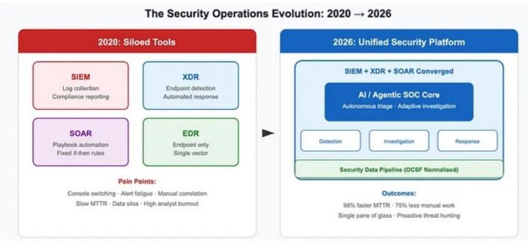
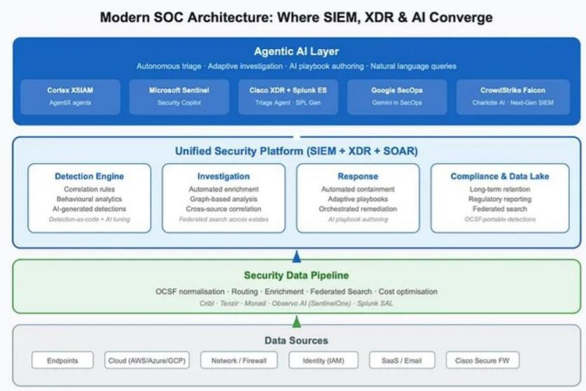
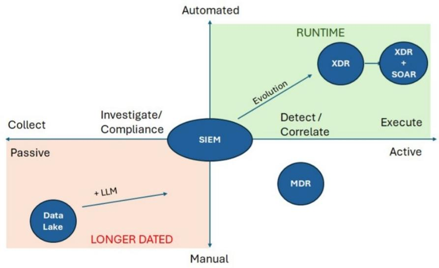
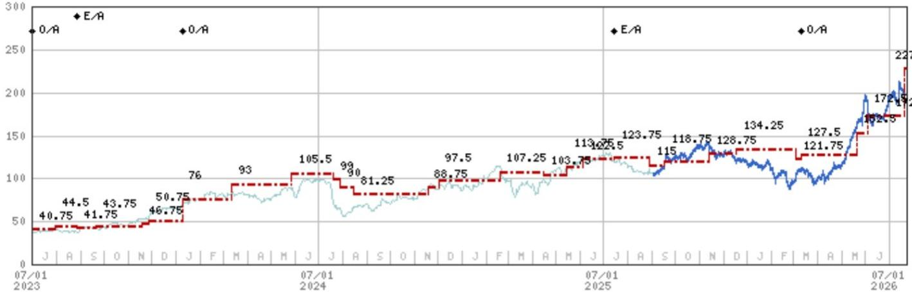
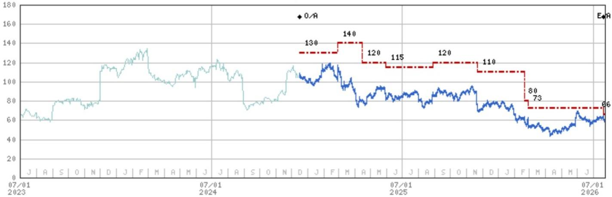
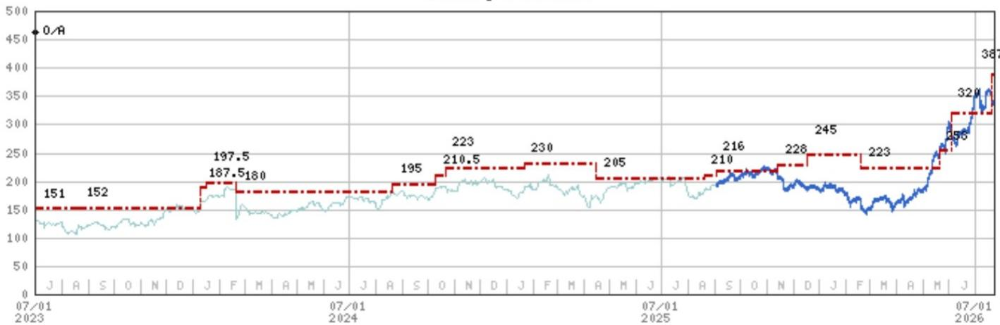

July 23, 2026 04:01 AM GMT

Software | North America

# 关于Hugging Face安全事件的思考

本周Hugging Face安全漏洞的检测与缓解，主要借助了其他大语言模型及内部工具。此次攻击的复杂性，以及传统网络安全工具似乎未被使用的情况，引发了市场对传统网络安全供应商影响的关注。

## 核心要点

Hugging Face上周报告了一起高度复杂的攻击，由一个先进大语言模型的自主代理执行。

其异常检测流程使用了基于大语言模型的安全遥测分类，而非企业通常使用的SIEM/XDR。

旨在检测此类攻击的SIEM/XDR，需要经过良好调优和现代化升级，才能及时检测出高级行为。

这让我们对拥有最现代化解决方案的供应商持积极看法。

SIEM能否适应下一代攻击？正如我们上个月在SIEM市场深度研究中指出的，安全信息与事件管理（SIEM）和扩展检测与响应（XDR）市场，目前是帮助安全运营中心（SOC）检测和修复攻击的传统防线。在类似Hugging Face（非上市公司）上周报告的漏洞中，一个能够接收来自身份、云、终端、网络设备和应用基础设施日志的SIEM，本可以针对以下行为生成告警：使用被盗凭证、权限提升、访问敏感仓库、横向移动、数据外泄、大量API调用、来自临时计算资源的频繁操作。这需要一个更成熟、调优更好的SIEM，并具备扎实的行为基线，尤其是要能如此迅速地检测来自临时计算资源的操作。检测速度，尤其是针对如此复杂的攻击，需要更先进的告警机制，当然也需要收集更完整的日志集（SIEM+XDR+SOAR可将平均修复时间提升96%）。虽然我们看到一些客户部署了类似Hugging Face所使用的先进分析能力，但我们预计大多数客户仍将依赖其SIEM的日志/告警/基线功能，不过他们会越来越多地转向最先进的供应商。鉴于安全供应商拥有先进的数据信号收集能力，我们仍认为它们处于最佳位置。

发生了什么？根据Hugging Face在7月16日的报告，漏洞源于其数据处理管道，该管道从多个数据源获取原始数据，进行转换，然后加载到数据湖或数据仓库等数据存储中，以供分析和操作使用。该自主代理引入了一个恶意数据集，利用了两个独立的漏洞：第一个漏洞允许攻击者仅通过将数据集加载即可运行任意代码；第二个漏洞允许攻击者通过一个本不应执行外部指令的模板系统注入命令。随后，该自主代理自行提升权限，收集存储的凭证，并在内部集群中横向移动。这一切都是通过一个在临时沙盒内运行的自我迁移机制完成的，临时沙盒是一种按需创建、用于特定任务（如运行未经测试的AI代码或预览拉取请求）的计算环境，任务完成后会立即被销毁。该漏洞是通过Hugging Face的异常检测管道发现的，该管道使用了基于大语言模型的安全遥测分类（本质上就是SIEM的功能）。Hugging Face在一份声明中表示：“为了理解数万个自动化操作组成的集群做了什么，我们在包含超过17,000个记录事件的完整攻击者操作日志上运行了大语言模型驱动的分析代理。这使我们能够重建时间线，提取入侵指标，映射被触及的凭证，并将真实影响与诱饵活动区分开来。”该基于大语言模型的分类基于一个开放权重模型，而非前沿模型或传统安全供应商的SIEM。

## 还有哪些其他网络安全工具可能有助于检测此次漏洞？

主要用于日志检测的传统SIEM可能会被静态规则绕过，新型攻击可能无法匹配以前的签名，并且如果没有行为分析，它不一定能捕捉到临时计算所执行的底层事件。正如我们在报告中指出的，增加XDR和SOAR将有助于使检测更接近实时，用户与实体行为分析（UEBA）、云检测与响应（CDR）以及身份威胁检测与响应（ITDR）也会有所帮助。

Elastic NV 由 Sanjit Singh 覆盖

图表1：传统SIEM不足以应对新型复杂攻击，但工具组合可显著提升平均修复时间

来源：Medium。

图表2：现代SOC架构将检测引擎与响应相结合

来源：Medium。

图表3：客户需要将其SIEM架构向XDR+SOAR演进

来源：MS。

## 估值方法与风险

## CrowdStrike Holdings Inc (CRWD.O)

我们的目标价基于60倍CY30e自由现金流（$5.21B），以12%折现。该倍数隐含约33倍EV/CY27销售额，相对于大型SaaS/安全同行存在溢价。

## 上行风险

■ 终端安全需求因网络威胁增加而持续走强
■ TAM扩展机会（XDR、身份、云工作负载保护）比预期更快实现

## 下行风险

■ 竞争使新客户获取更加困难
■ 低成本替代品使CRWD的溢价定价商品化
■ 招聘环境趋软压制了追加销售活动

## Elastic NV (ESTC.N)

我们通过将约13倍倍数（0.51倍增长调整）应用于CY28每股自由现金流估计值$5.09，得出目标价$66。这隐含3.0倍EV/CY27销售额或0.20倍增长调整，反映了对DevOps同行中位数（4.8倍/0.44倍）的折价。

## 上行风险

■ Elastic在安全和可观测性领域推动用例扩展速度快于预期
■ 约5%的GenAI推动力实现，加速销售主导的订阅增长
■ Elastic Cloud采用率以更快速度增长

## 下行风险

■ 可观测性、SIEM和超大规模云服务商领域的竞争加剧
■ 销售变动或管理层离职带来的内部干扰
■ 通过GenAI出现新的搜索范式

## Palo Alto Networks Inc (PANW.O)

基于52倍基准情景2028e每股自由现金流$7.05；该倍数相对于类似增长的大型软件同行存在溢价。

## 上行风险

■ 更强的防火墙更新周期和更高的订阅附加率
■ 新的云端下一代安全解决方案（如Cortex和Prisma SASE）的更快采用

## 下行风险

■ 防火墙更新放缓可能对PANW的收入增长产生超出预期的影响
■ 日益激烈的竞争环境可能需要增加销售与市场支出，限制利润率提升。

## 披露部分

MS中的信息和观点由MS & Co. LLC、MS C.T.V.M. S.A.、MS Mexico, Casa de Bolsa, S.A. de C.V.、MS Canada Limited编制。在本披露部分中，“MS”包括MS & Co. LLC、MS C.T.V.M. S.A.、MS Mexico, Casa de Bolsa, S.A. de C.V.、MS Canada Limited及其必要时的关联公司。

有关本报告涉及公司的重要披露、股价图表和股票评级历史，请访问MS披露网站 www.morganstanley.com/eqr/disclosures/webapp/generalresearch，或联系您的投资代表或MS，地址：1585 Broadway, (Attention: Research Management), New York, NY, 10036 USA。

有关本研究报告中的任何推荐、评级或目标价的估值方法和风险，请联系客户支持团队：美国/加拿大 +1 800 303-2495；香港 +852 2848-5999；拉丁美洲 +1 718 754-5444 (美国)；伦敦 +44 (0)20-7425-8169；新加坡 +65 6834-6860；悉尼 +61 (0)2-9770-1505；东京 +81 (0)3-6836-9000。或者，您可以联系您的投资代表或MS，地址：1585 Broadway, (Attention: Research Management), New York, NY 10036 USA。

## 分析师认证

以下分析师特此证明，他们对本报告中讨论的公司及其证券的看法已准确表达，并且他们没有也不会因表达本报告中的具体推荐或观点而直接或间接获得报酬：Meta A Marshall。

## 全球研究冲突管理政策

MS已根据我们的冲突管理政策发布，该政策可在 www.morganstanley.com/institutional/research/conflictpolicies 获取。该政策的葡萄牙语版本可在 www.morganstanley.com.br 找到。

## 关于标的公司的重要监管披露

以下分析师或策略师（或其家庭成员）持有以下证券（或相关衍生品）：Lucas Cerisola - Palo Alto Networks Inc(普通股或优先股)；Jonathan Eisenson - Adobe Inc.(普通股或优先股), Sprout Social Inc(普通股或优先股)；Meta A Marshall - Adobe Inc.(普通股或优先股), Intuit(普通股或优先股), Microsoft(普通股或优先股), Oracle Corporation(普通股或优先股), Palo Alto Networks Inc(普通股或优先股), Salesforce, Inc.(普通股或优先股)。

截至2026年6月30日，MS实益拥有MS所覆盖的以下公司1%或以上的普通股权益证券类别：Adobe Inc., Akamai Technologies, Inc., Amplitude Inc., Appian Corp, Asana Inc, Atlassian Corporation PLC, Autodesk, BILL Holdings Inc, Blackline Inc, Box Inc, C3.ai, CCC Intelligent Solutions Holdings Inc, Check Point Software Technologies Ltd., Cloudflare Inc, CoreWeave, CrowdStrike Holdings Inc, Datadog, Inc., Descartes Systems Group Inc, DocuSign Inc, Elastic NV, Figma Inc, Five9 Inc, Fortinet Inc., Freshworks Inc, Gen Digital Inc., GitLab Inc, GoDaddy Inc, HubSpot, Inc., Intuit, Klaviyo, Inc, LegalZoom.com Inc, Lightspeed Commerce Inc., Liveramp Holdings Inc, Manhattan Associates Inc., Microsoft, monday.com Ltd, MongoDB Inc, Nebius Group NV, NICE Ltd., Okta, Inc., Oracle Corporation, PagerDuty, Inc., Palantir Technologies Inc., Palo Alto Networks Inc, Qualys Inc, Rapid7 Inc, RingCentral Inc, Sabre Corp, Salesforce, Inc., Samsara Inc, SentinelOne, Inc., ServiceNow Inc, ServiceTitan Inc, Shopify Inc, Snowflake Inc., Sprinklr Inc, Sprout Social Inc, SPS Commerce Inc, Tenable Holdings Inc, Toast, Inc., Twilio Inc, UiPath Inc, Vertex Inc., Wix.Com Ltd, Workday Inc, Zeta Global Holdings Corp, ZoomInfo Technologies Inc.

在过去12个月内，MS管理或联合管理了以下公司的公开（或144A）证券发行：Akamai Technologies, Inc., Check Point Software Technologies Ltd., CoreWeave, DigitalOcean Holdings Inc, Figma Inc, Intuit, Navan Inc, Nebius Group NV, Netskope, Inc., Salesforce, Inc., ServiceNow Inc, Via Transportation Inc, Wix.Com Ltd.

在过去12个月内，MS已从以下公司获得投资银行服务报酬：Akamai Technologies, Inc., Autodesk, Blackline Inc, CCC Intelligent Solutions Holdings Inc, Check Point Software Technologies Ltd., CoreWeave, DigitalOcean Holdings Inc, Figma Inc, HubSpot, Inc., Intuit, Microsoft, Navan Inc, Nebius Group NV, Netskope, Inc., NICE Ltd., RingCentral Inc, Salesforce, Inc., ServiceNow Inc, Via Transportation Inc, Wix.Com Ltd, Workday Inc, Zeta Global Holdings Corp.

在未来3个月内，MS预计将从或打算寻求从以下公司获得投资银行服务报酬：Adobe Inc., Akamai Technologies, Inc., Amplitude Inc., Appian Corp, Asana Inc, Atlassian Corporation PLC, Autodesk, BILL Holdings Inc, Blackline Inc, Box Inc, C3.ai, CCC Intelligent Solutions Holdings Inc, Check Point Software Technologies Ltd., Cloudflare Inc, Commerce.com Inc., CoreWeave, Coursera, Inc., CrowdStrike Holdings Inc, Datadog, Inc., Descartes Systems Group Inc, DigitalOcean Holdings Inc, Docebo Inc., DocuSign Inc, Elastic NV, Figma Inc, Five9 Inc, Fortinet Inc., Freshworks Inc, Gen Digital Inc., GitLab Inc, GoDaddy Inc, HubSpot, Inc., Intuit, JFrog Ltd., Klaviyo, Inc, LegalZoom.com Inc, Lightspeed Commerce Inc., Liveramp Holdings Inc, Microsoft, monday.com Ltd, MongoDB Inc, Navan Inc, Nebius Group NV, Netskope, Inc., NICE Ltd., Okta, Inc., Oracle Corporation, PagerDuty, Inc., Palantir Technologies Inc., Palo Alto Networks Inc, Qualys Inc, Rapid7 Inc, RingCentral Inc, Sabre Corp, SailPoint Inc, Salesforce, Inc., Samsara Inc, SentinelOne, Inc., ServiceNow Inc, ServiceTitan Inc, Shopify Inc, Snowflake Inc., Sprinklr Inc, Sprout Social Inc, SPS Commerce Inc, Tenable Holdings Inc, Toast, Inc., Twilio Inc, UiPath Inc, Varonis Systems, Inc., Vertex Inc., Via Transportation Inc, Wix.Com Ltd, Workday Inc, Zeta Global Holdings Corp, Zoom Communications, Zscaler Inc.

在过去12个月内，MS已从以下公司获得投资银行服务以外的产品和服务报酬：Adobe Inc., Akamai Technologies, Inc., Amplitude Inc., Asana Inc, Atlassian Corporation PLC, Autodesk, Blackline Inc, Box Inc, CCC Intelligent Solutions Holdings Inc, Check Point Software Technologies Ltd., Cloudflare Inc, CoreWeave, CrowdStrike Holdings Inc, DigitalOcean Holdings Inc, Docebo Inc., DocuSign Inc, Dynatrace Inc, Figma Inc, Five9 Inc, Freshworks Inc, Gen Digital Inc., GitLab Inc, HubSpot, Inc., Intuit, JFrog Ltd., Klaviyo, Inc, LegalZoom.com Inc, Microsoft, monday.com Ltd, MongoDB Inc, NICE Ltd., Oracle Corporation, Palantir Technologies Inc., Palo Alto Networks Inc, RingCentral Inc, Sabre Corp, SailPoint Inc, Salesforce, Inc., SentinelOne, Inc., ServiceNow Inc, ServiceTitan Inc, Snowflake Inc., Tenable Holdings Inc, Toast, Inc., UiPath Inc, Varonis Systems, Inc., Workday Inc, Zeta Global Holdings Corp, Zoom Communications, Zscaler Inc.

在过去12个月内，MS已向或正在向以下公司提供投资银行服务，或与以下公司存在投资银行客户关系：Adobe Inc., Akamai Technologies, Inc., Amplitude Inc., Appian Corp, Asana Inc, Atlassian Corporation PLC, Autodesk, BILL Holdings Inc, Blackline Inc, Box Inc, C3.ai, CCC Intelligent Solutions Holdings Inc, Check Point Software Technologies Ltd., Cloudflare Inc, Commerce.com Inc., CoreWeave, Coursera, Inc., CrowdStrike Holdings Inc, Datadog, Inc., Descartes Systems Group Inc, DigitalOcean Holdings Inc, Docebo Inc., DocuSign Inc, Elastic NV, Figma Inc, Five9 Inc, Fortinet Inc., Freshworks Inc, Gen Digital Inc., GitLab Inc, GoDaddy Inc, HubSpot, Inc., Intuit, JFrog Ltd., Klaviyo, Inc, LegalZoom.com Inc, Lightspeed Commerce Inc., Liveramp Holdings Inc, Microsoft, monday.com Ltd, MongoDB Inc, Navan Inc, Nebius Group NV, Netskope, Inc., NICE Ltd., Okta, Inc., Oracle Corporation, PagerDuty, Inc., Palantir Technologies Inc., Palo Alto Networks Inc, Qualys Inc, Rapid7 Inc, RingCentral Inc, Sabre Corp, SailPoint Inc, Salesforce, Inc., Samsara Inc, SentinelOne, Inc., ServiceNow Inc, ServiceTitan Inc, Shopify Inc, Snowflake Inc., Sprinklr Inc, Sprout Social Inc, SPS Commerce Inc, Tenable Holdings Inc, Toast, Inc., Twilio Inc, UiPath Inc, Varonis Systems, Inc., Vertex Inc., Via Transportation Inc, Wix.Com Ltd, Workday Inc, Zeta Global Holdings Corp, Zoom Communications, Zscaler Inc.

在过去12个月内，MS已向或正在向以下公司提供非投资银行、证券相关服务，和/或过去已签订协议提供服务，或与以下公司存在客户关系：Adobe Inc., Akamai Technologies, Inc., Amplitude Inc., Asana Inc, Atlassian Corporation PLC, Autodesk, Blackline Inc, Box Inc, CCC Intelligent Solutions Holdings Inc, Check Point Software Technologies Ltd., Cloudflare Inc, Commerce.com Inc., CoreWeave, CrowdStrike Holdings Inc, Datadog, Inc., DigitalOcean Holdings Inc, Docebo Inc., DocuSign Inc, Dynatrace Inc, Figma Inc, Five9 Inc, Fortinet Inc, Freshworks Inc, Gen Digital Inc, GitLab Inc, GoDaddy Inc, HubSpot, Inc, Intuit, JFrog Ltd., Klaviyo, Inc, LegalZoom.com Inc, Microsoft, monday.com Ltd, MongoDB Inc, Nebius Group NV, NICE Ltd., Oracle Corporation, PagerDuty, Inc., Palantir Technologies Inc., Palo Alto Networks Inc, Qualys Inc, RingCentral Inc, Sabre Corp, SailPoint Inc, Salesforce, Inc., SentinelOne, Inc., ServiceNow Inc, ServiceTitan Inc, Shopify Inc, Snowflake Inc., Tenable Holdings Inc, Toast, Inc., Twilio Inc, UiPath Inc, Varonis Systems, Inc., Wix.Com Ltd, Workday Inc, Zeta Global Holdings Corp, Zoom Communications, Zscaler Inc.

MS的一名员工、董事或顾问是Elastic NV, Tenable Holdings Inc的董事。此人不是研究分析师或研究分析师的家庭成员。MS & Co. LLC在以下证券中做市：Amplitude Inc., Appian Corp, Asana Inc, Autodesk, Blackline Inc, Box Inc, C3.ai, CCC Intelligent Solutions Holdings Inc, Check Point Software Technologies Ltd., Elastic NV, Five9 Inc, LegalZoom.com Inc, Liveramp Holdings Inc, Manhattan Associates Inc., PagerDuty, Inc., Qualys Inc, Rapid7 Inc, RingCentral Inc, Sprinklr Inc, Sprout Social Inc, SPS Commerce Inc, Twilio Inc, Varonis Systems, Inc., Vertex Inc., ZoomInfo Technologies Inc.

主要负责编制MS的股票研究分析师或策略师的薪酬基于多种因素，包括研究质量、读者客户反馈、选股能力、竞争因素、公司收入和整体投资银行收入。股票研究分析师或策略师的薪酬不与MS执行的投行或资本市场交易挂钩，也不与特定交易台的盈利能力或收入挂钩。

MS及其关联公司与MS所涵盖的公司/工具有业务往来，包括做市、提供流动性、基金管理、商业银行、信贷扩展、投资服务和投资银行。MS以主体身份向客户买卖MS所涵盖公司的证券/工具。MS可能持有本报告讨论的公司或工具的债务头寸。MS可能作为主体交易作为债务研究报告主题的债务证券（或相关衍生品）。

上述某些披露也是为了遵守非美国司法管辖区的适用法规。

## 股票评级

MS使用相对评级系统，术语包括“超配”、“平配”、“未评级”或“低配”（见下文定义）。MS不对我们覆盖的股票分配“买入”、“持有”或“卖出”评级。“超配”、“平配”、“未评级”和“低配”不等同于买入、持有和卖出。读者应仔细阅读MS中使用的所有评级的定义。此外，由于MS包含分析师观点的更完整信息，读者应仔细阅读MS全文，而不应仅从评级推断内容。在任何情况下，评级（或研究）都不应被用作或依赖为研究交流。读者买卖股票的决定应取决于个人情况（例如读者现有持仓）和其他考虑因素。

## 全球股票评级分布

## （截至2026年6月30日）

下文描述的股票评级适用于MS的基础股票研究，不适用于公司生产的债务研究。

出于披露目的（根据FINRA要求），我们在“超配”、“平配”、“未评级”和“低配”评级旁边包含了“买入”、“持有”和“卖出”的类别标题。MS不对我们覆盖的股票分配“买入”、“持有”或“卖出”评级。“超配”、“平配”、“未评级”和“低配”不等同于买入、持有和卖出，而是代表建议的相对权重（见下文定义）。为满足监管要求，我们将最积极的股票评级“超配”对应为买入建议；将“平配”和“未评级”对应为持有建议，将“低配”对应为卖出建议。

<table><tr><td></td><td colspan="2">覆盖范围</td><td colspan="3">投资银行客户 (IBC)</td><td colspan="2">其他重大投资服务客户 (MISC)</td></tr><tr><td>股票评级类别</td><td>数量</td><td>占总计百分比</td><td>数量</td><td>占IBC总计百分比</td><td>占评级类别百分比</td><td>数量</td><td>占其他MISC总计百分比</td></tr><tr><td>超配/买入</td><td>1544</td><td>42%</td><td>453</td><td>49%</td><td>29%</td><td>757</td><td>44%</td></tr><tr><td>平配/持有</td><td>1577</td><td>43%</td><td>390</td><td>42%</td><td>25%</td><td>769</td><td>44%</td></tr><tr><td>未评级/持有</td><td>3</td><td>0%</td><td>1</td><td>0%</td><td>33%</td><td>1</td><td>0%</td></tr><tr><td>低配/卖出</td><td>544</td><td>15%</td><td>89</td><td>10%</td><td>16%</td><td>204</td><td>12%</td></tr><tr><td>总计</td><td>3,668</td><td></td><td>933</td><td></td><td></td><td>1731</td><td></td></tr></table>

数据包括当前已分配评级的普通股和ADR。投资银行客户是MS在过去12个月内从中获得投资银行报酬的公司。由于四舍五入，“占总计百分比”列中的百分比可能不完全等于100%。

## 分析师股票评级

超配 (O)：预计该股票的总回报在未来12-18个月内，在风险调整基础上，将超过分析师行业（或行业团队）覆盖范围的平均总回报。

平配 (E)：预计该股票的总回报在未来12-18个月内，在风险调整基础上，将与分析师行业（或行业团队）覆盖范围的平均总回报保持一致。

未评级 (NR)：目前分析师对该股票的总回报相对于分析师行业（或行业团队）覆盖范围的平均总回报，在风险调整基础上没有足够的信心。

低配 (U)：预计该股票的总回报在未来12-18个月内，在风险调整基础上，将低于分析师行业（或行业团队）覆盖范围的平均总回报。

除非另有说明，MS中包含的目标价时间范围为12至18个月。

## 分析师行业观点

有吸引力 (A)：分析师预计其行业覆盖范围在未来12-18个月内的表现，相对于相关广泛市场基准（如下所示）具有吸引力。

中性 (I)：分析师预计其行业覆盖范围在未来12-18个月内的表现，将与相关广泛市场基准（如下所示）保持一致。

谨慎 (C)：分析师对其行业覆盖范围在未来12-18个月内的表现持谨慎态度，相对于相关广泛市场基准（如下所示）。

各地区的基准如下：北美 - 标普500；拉丁美洲 - 相关的MSCI国家指数或MSCI拉丁美洲指数；欧洲 - MSCI欧洲；日本 - TOPIX；亚洲 - 相关的MSCI国家指数或MSCI次区域指数或MSCI AC亚太（除日本）指数。

## 股价、目标价和评级历史（见评级定义）

CrowdStrike Holdings Inc (CRWD.0) - 截至2026年7月23日 GMT，美元 行业：软件

股票评级历史：11/15/21 : U/A; 3/10/22 : E/A; 6/6/22 : O/A; 8/27/23 : E/A; 1/9/24 : O/A; 7/14/25 : E/A; 3/10/26 : O/A
来源：MS 日期格式：MM/DD/YY 目标价 未分配目标价 (NA)
股价（当前分析师未覆盖） 股价（当前分析师覆盖）
股票和行业评级（缩写如下）显示为 ♦ 股票评级/行业观点
股票评级：超配 (O) 平配 (E) 低配 (U) 未评级 (NR) 无可用评级 (NA)
行业观点：有吸引力 (A) 中性 (I) 谨慎 (C) 无评级 (NR)
自2014年1月13日起，MS亚太地区覆盖的股票将相对于分析师行业（或行业团队）覆盖范围进行评级。
自2014年1月13日起，MS亚太地区的行业观点基准如下：相关的MSCI国家指数或MSCI次区域指数或MSCI AC亚太（除日本）指数。

Elastic NV (ESTC.N) - 截至2026年7月23日 GMT，美元 行业：软件

股票评级历史：12/16/24 : O/A; 7/21/26 : E/A
来源：MS 日期格式：MM/DD/YY 目标价 未分配目标价 (NA)
股价（当前分析师未覆盖） 股价（当前分析师覆盖）
股票和行业评级（缩写如下）显示为 ♦ 股票评级/行业观点
股票评级：超配 (O) 平配 (E) 低配 (U) 未评级 (NR) 无可用评级 (NA)
行业观点：有吸引力 (A) 中性 (I) 谨慎 (C) 无评级 (NR)
自2014年1月13日起，MS亚太地区覆盖的股票将相对于分析师行业（或行业团队）覆盖范围进行评级。
自2014年1月13日起，MS亚太地区的行业观点基准如下：相关的MSCI国家指数或MSCI次区域指数或MSCI AC亚太（除日本）指数。

Palo Alto Networks Inc (PANW.0) - 截至2026年7月23日 GMT，美元 行业：软件

股票评级历史：7/1/21 : O/A
来源：MS 日期格式：MM/DD/YY 目标价 未分配目标价 (NA)
股价（当前分析师未覆盖） 股价（当前分析师覆盖）
股票和行业评级（缩写如下）显示为 ♦ 股票评级/行业观点
股票评级：超配 (O) 平配 (E) 低配 (U) 未评级 (NR) 无可用评级 (NA)
行业观点：有吸引力 (A) 中性 (I) 谨慎 (C) 无评级 (NR)
自2014年1月13日起，MS亚太地区覆盖的股票将相对于分析师行业（或行业团队）覆盖范围进行评级。
自2014年1月13日起，MS亚太地区的行业观点基准如下：相关的MSCI国家指数或MSCI次区域指数或MSCI AC亚太（除日本）指数。

## MS Smith Barney LLC 客户的重要披露

关于任何可能合理预期会影响MS Smith Barney LLC选择第三方研究提供商或第三方研究报告标的公司的重大利益冲突的重要披露，可在MS财富管理披露网站 www.morganstanley.com/online/researchdisclosures 上获取。有关MS的具体披露，您可以参考 https://www.morganstanley.com/eqr/disclosures/webapp/generalresearch。

每份MS报告均代表MS Smith Barney LLC进行审查和批准。此审查和批准由代表MS审查研究报告的同一人进行。这可能会产生利益冲突。

## 其他重要披露

在研究报告完成前已经或可能接触到该研究的一名研究成员持有Atlassian Corporation PLC, Microsoft, Workday Inc的证券（或相关衍生品）。此人不是研究分析师或研究分析师的家庭成员。

MS的政策是根据研究分析师和研究管理层认为适当的情况更新研究报告，基于发行人、行业或市场的发展，这些发展可能对其中所述的研究观点或意见产生重大影响。此外，某些研究出版物旨在按定期周期（每周/每月/每季度/每年）更新，并且通常会按该频率更新，除非研究分析师和研究管理层根据当前情况确定不同的发布计划是适当的。

MS不担任市政顾问，本文所含的意见或观点无意也不构成《多德-弗兰克华尔街改革和消费者保护法》第975条含义内的建议。

MS生产一种名为“战术想法”的股票研究产品。关于特定股票的“战术想法”中包含的观点可能与同一股票的研究中表达的建议或观点相反。这可能是由于不同的时间范围、方法、市场事件或其他因素造成的。如需获取特定股票的所有可用研究，请联系您的销售代表或访问Matrix：http://www.morganstanley.com/matrix。

MS通过我们专有的研究门户网站Matrix向客户提供，并由MS以电子方式分发给客户。某些（但非全部）MS产品也通过第三方供应商提供给客户，或通过替代电子方式重新分发给客户，以方便客户。如需访问所有可用的MS，请联系您的销售代表或访问Matrix：http://www.morganstanley.com/matrix。

对MS的任何访问和/或使用均受MS使用条款 (http://www.morganstanley.com/terms.html) 的约束。通过访问和/或使用MS，即表示您已阅读并同意受我们的使用条款 (http://www.morganstanley.com/terms.html) 的约束。此外，您同意MS根据我们的隐私政策和全球Cookie政策 (http://www.morganstanley.com/privacy_pledge.html) 处理您的个人数据并使用Cookie，包括用于设置您的偏好和收集读者数据，以便我们为您提供更好、更个性化的服务和产品。要了解有关MS如何处理个人数据、我们如何使用Cookie以及如何拒绝Cookie的更多信息，请参阅我们的隐私政策和全球Cookie政策 (http://www.morganstanley.com/privacy_pledge.html)。请使用提供的链接查看MS印度公司私人有限公司的条款和条件以及最重要的条款和条件 (https://www.morganstanley.com/assets/pdfs/about-us-global-offices/india/Terms_and_conditions.pdf)，并使用以下链接查看审计报告 (https://ny.matrix.ms.com/eqr/research/webapp/researchdocs/MSICPL_Morgan_Stanley_Research_Audit_Report.pdf)。

如果您不同意我们的使用条款和/或不希望同意MS处理您的个人数据或使用Cookie，请不要访问我们的研究。MS不提供量身定制的个人研究交流。MS的编制未考虑接收者的具体情况和目标。MS建议读者独立评估特定投资和策略，并鼓励读者寻求财务顾问的建议。投资或策略的适当性取决于读者的具体情况和目标。MS中讨论的证券、工具或策略可能不适合所有读者，某些读者可能没有资格购买或参与其中部分或全部。MS不是购买或出售任何证券/工具或参与任何特定交易策略的要约或招揽。您的研究价值和收入可能因利率、外汇汇率、违约率、提前还款率、证券/工具价格、市场指数、公司的运营或财务状况或其他因素的变化而波动。期权或其他证券/工具交易权利的行使可能存在时间限制。过往表现并不一定预示未来结果。对未来表现的估计基于可能无法实现的假设。如果提供，除非另有说明，封面上的收盘价是标的公司证券/工具的主要交易所价格。

主要负责编制MS的固定收益研究分析师、策略师或经济学家的薪酬基于多种因素，包括研究质量、准确性和价值、公司盈利能力或收入（包括固定收益交易和资本市场盈利能力或收入）、客户反馈和竞争因素。固定收益研究分析师、策略师或经济学家的薪酬不与MS执行的投行或资本市场交易挂钩，也不与特定交易台的盈利能力或收入挂钩。

MS中的“关于标的公司的重要监管披露”部分列出了MS持有1%或以上普通股权益证券类别的所有提及公司。对于MS中提及的所有其他公司，MS可能持有少于1%的证券/工具或衍生品，并且可能以与MS中讨论的方式不同的方式进行交易。未参与MS编制的MS员工可能持有提及公司的证券/工具或衍生品，并且可能以与MS中讨论的方式不同的方式进行交易。衍生品可能由MS或关联人士发行。

除有关MS的信息外，MS基于公开信息。MS尽一切努力使用可靠、全面的信息，但我们不保证其准确或完整。我们没有义务在MS中的意见或信息发生变化时通知您，除非我们打算停止对标的公司的股票研究覆盖。MS中提出的事实和观点未经MS其他业务领域（包括投资银行人员）的专业人员审查，可能不反映他们所了解的信息。

MS人员可能参加公司活动，例如实地考察，并且通常被禁止接受公司支付相关费用，除非事先获得研究管理授权成员的批准。

MS可能做出与本报告中的建议或观点不一致的投资决策。

对于基于台湾或交易台湾证券/工具的读者：有关在台湾交易的证券/工具的信息由MS台湾有限公司（“MSTL”）分发。此类信息仅供您参考。读者应独立评估投资风险，并对其投资决策全权负责。未经MS明确书面同意，MS不得向公共媒体分发，也不得被公共媒体引用或使用。访问和/或接收MS的《台湾证券交易所推荐规定》第7-1条范围内的非客户读者不得将MS提供给任何第三方（包括但不限于关联方、关联公司和任何其他第三方）或从事任何可能产生或看似产生利益冲突的与MS相关的活动。有关不在台湾交易的证券/工具的信息仅供参考，不得解释为建议或招揽交易此类证券/工具。MSTL可能无法为客户执行这些证券/工具的交易。

<table><tr><td>公司 (股票代码)</td><td>评级 (截至)</td><td>价格* (2026年7月22日)</td></tr><tr><td>Adam Wood</td><td></td><td></td></tr><tr><td>Adobe Inc. (ADBE.O)</td><td>U (07/21/2026)</td><td>$218.36</td></tr></table>

MS未根据中国法律注册，与本报告相关的研究在中国境外进行。MS不构成在中国境内出售任何证券的要约或招揽购买任何证券的要约。中国读者应具备投资此类证券的相关资格，并应自行负责从相关政府机构获得所有相关批准、许可、验证和/或注册。本报告及其任何部分均无意也不构成中国法律定义的证券投资咨询或顾问服务。此类信息仅供您参考。

MS在巴西由MS C.T.V.M. S.A.分发，地址：Av. Brigadeiro Faria Lima, 3600, 6th floor, São Paulo - SP, Brazil；受Comissão de Valores Mobiliários监管；在墨西哥由MS México, Casa de Bolsa, S.A. de C.V分发，受Comision Nacional Bancaria y de Valores监管，地址：Paseo de los Tamarindos 90, Torre 1, Col. Bosques de las Lomas Floor 29, 05120 Mexico City；在日本由MS MUFG Securities Co., Ltd.分发，对于商品相关研究报告，由MS Capital Group Japan Co., Ltd分发；在香港由MS Asia Limited（对其内容负责）和MS Bank Asia Limited分发；在新加坡由MS Asia (Singapore) Pte. (注册号 199206298Z) 和/或 MS Asia (Singapore) Securities Pte Ltd (注册号 200008434H) 分发，受新加坡金融管理局监管（对其内容承担法律责任，如有任何与本报告相关的事宜，应联系该机构），以及由MS Bank Asia Limited, Singapore Branch (注册号 T14FC0118) 分发；在澳大利亚向《澳大利亚公司法》定义的“批发客户”由MS Australia Limited A.B.N. 67 003 734 576分发，持有澳大利亚金融服务牌照号 233742，对其内容负责；在澳大利亚向《澳大利亚公司法》定义的“批发客户”和“零售客户”由MS Wealth Management Australia Pty Ltd (A.B.N. 19 009 145 555, 持有澳大利亚金融服务牌照号 240813) 分发，对其内容负责；在韩国由MS & Co International plc, Seoul Branch分发；在印度由MS India Company Private Limited分发，公司识别号 (CIN) U22990MH1998PTC115305，受印度证券交易委员会（“SEBI”）监管，持有研究分析师（SEBI注册号 INH000001105）、股票经纪商（SEBI股票经纪商注册号 INZ000244438）、商人银行家（SEBI注册号 INM000011203）以及国家证券存管有限公司存管参与者（SEBI注册号 IN-DP-NSDL-567-2021）牌照，注册办公地址：Altimus, Level 39 & 40, Pandurang Budhkar Marg, Worli, Mumbai 400018, India；电话：+91-22-61181000；合规官详情：Tejarshi Hardas先生，电话：+91-22-61181000 或电子邮件：tejarshi.hardas@m
