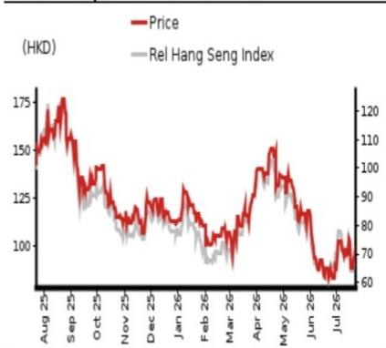

# 行业研究：医疗健康与制药

## 2026年上半年业绩预览及2026财年预测调整

### 2026年上半年药品销售增长与合作收入有望推动业绩改善

我们预计2026年上半年公司总收入为24亿元人民币（同比增长68%），净利润为4600万元人民币。我们预计公司2026年上半年收入为24亿元人民币（同比增长68%），其中药品销售贡献22亿元人民币（同比增长55%，较2025年下半年增长33%），主要得益于卡度尼利单抗和依沃西单抗的持续销售增长。

我们还预计合作收入为2亿元人民币，来自2026年2月将伊布诺西单抗授权给JumpCan（600566 CH，未评级）的交易。

我们预计毛利率将同比提升2.3个百分点至81.7%，同时2026年上半年运营费用温和增长至17.1亿元人民币（同比增长11%），据此我们预计净利润为4600万元人民币（对比2025年上半年/2025年下半年的亏损5.7亿元/5.43亿元）。

对于2026年下半年，我们预计公司收入为27亿元人民币，得益于药品销售同比增长53%至25亿元人民币，净利润为1.03亿元人民币。

我们认为HARMONI-3数据读出和PDUFA决定（参见我们的报告：快评 - 康方生物（9926 HK）- HARMONi积极的总生存期更新）是2026年下半年该公司的关键催化剂。

维持评级并微调目标价至138.29港元（此前为142.50港元）
我们将2026财年收入/盈利预测下调5.9%/79.4%，以反映我们上调的卡度尼利单抗销售预测、下调的合作收入预测以及更高的运营费用预测。

我们将基于DCF的目标价从142.50港元下调至138.29港元（假设WACC为10.5%，终值增长率为4.0%不变），并维持评级。当前报价对应2025财年销售额223亿元人民币的3.7倍市销率。

来源：公司数据，NOM预测

<table><tr><td>截至12月31日</td><td colspan="2">FY25</td><td colspan="2">FY26F</td><td colspan="2">FY27F</td><td colspan="2">FY28F</td></tr><tr><td>货币（人民币）</td><td>实际</td><td>旧</td><td>新</td><td>旧</td><td>新</td><td>旧</td><td>新</td><td></td></tr><tr><td>收入（百万元）</td><td>3,056</td><td>5,404</td><td>5,083</td><td>7,491</td><td>7,214</td><td>9,998</td><td>9,762</td><td></td></tr><tr><td>报告净利润（百万元）</td><td>-1,113</td><td>723</td><td>149</td><td>1,942</td><td>1,249</td><td>3,530</td><td>3,092</td><td></td></tr><tr><td>标准化净利润（百万元）</td><td>-1,113</td><td>723</td><td>149</td><td>1,942</td><td>1,249</td><td>3,530</td><td>3,092</td><td></td></tr><tr><td>完全摊薄标准化每股收益</td><td>-1.28</td><td>83.29分</td><td>17.14分</td><td>2.24</td><td>1.44</td><td>4.07</td><td>3.56</td><td></td></tr><tr><td>完全摊薄标准化每股收益增长率（%）</td><td>-</td><td>-</td><td>-</td><td>168.7</td><td>739.4</td><td>81.7</td><td>147.7</td><td></td></tr><tr><td>完全摊薄标准化市盈率（倍）</td><td>-</td><td>-</td><td>550.1</td><td>-</td><td>65.5</td><td>-</td><td>26.5</td><td></td></tr><tr><td>企业价值/EBITDA（倍）</td><td>-</td><td>-</td><td>109.0</td><td>-</td><td>38.0</td><td>-</td><td>18.0</td><td></td></tr><tr><td>市净率（倍）</td><td>9.0</td><td>-</td><td>8.9</td><td>-</td><td>7.8</td><td>-</td><td>6.0</td><td></td></tr><tr><td>股息率（%）</td><td>-</td><td>-</td><td>-</td><td>-</td><td>-</td><td>-</td><td>-</td><td></td></tr><tr><td>净资产回报表现（%）</td><td>-14.0</td><td>7.7</td><td>1.6</td><td>18.1</td><td>12.7</td><td>26.2</td><td>25.8</td><td></td></tr><tr><td>净债务/权益（%）</td><td>净现金</td><td>净现金</td><td>净现金</td><td>净现金</td><td>净现金</td><td>净现金</td><td>净现金</td><td></td></tr></table>

评级维持

目标价
从142.50港元下调
至138.29港元

收盘价
2026年7月23日
102.80港元

<table><tr><td>隐含上行空间</td><td>+34.5%</td></tr></table>

<table><tr><td>市值（百万美元）</td><td>12,077.0</td></tr><tr><td>日均交易量（百万美元）</td><td>183.2</td></tr></table>

## 相对表现图

  
来源：LSEG，NOM

## 研究分析师

中国医疗健康与制药

张嘉琳，CFA，CPA - NIHK  
jialin.zhang@NOM.com  
+852 2252 6134

## 康方生物关键数据

<table><tr><td>表现（%）</td><td>1个月</td><td>3个月</td><td>12个月</td><td></td><td></td></tr><tr><td>相对（港元）</td><td>20.2</td><td>-21.2</td><td>-28.3</td><td>市值（百万美元）</td><td>12,077.0</td></tr><tr><td>相对（美元）</td><td>20.2</td><td>-21.3</td><td>-28.2</td><td>自由流通比例（%）</td><td>43.6</td></tr><tr><td>相对恒生指数</td><td>13.6</td><td>-17.2</td><td>-25.8</td><td>3个月日均交易量（百万美元）</td><td>183.2</td></tr></table>

<table><tr><td colspan="6">利润表（百万元人民币）</td></tr><tr><td>截至12月31日</td><td>FY24</td><td>FY25</td><td>FY26F</td><td>FY27F</td><td>FY28F</td></tr><tr><td>收入</td><td>2,124</td><td>3,056</td><td>5,083</td><td>7,214</td><td>9,762</td></tr><tr><td>销售成本</td><td>-289</td><td>-652</td><td>-891</td><td>-1,059</td><td>-1,161</td></tr><tr><td>毛利润</td><td>1,835</td><td>2,404</td><td>4,191</td><td>6,155</td><td>8,601</td></tr><tr><td>销售、一般及行政费用</td><td>-2,393</td><td>-3,308</td><td>-3,660</td><td>-4,234</td><td>-4,432</td></tr><tr><td>员工股份支出</td><td></td><td></td><td></td><td></td><td></td></tr><tr><td>营业利润</td><td>-558</td><td>-904</td><td>532</td><td>1,921</td><td>4,169</td></tr><tr><td>EBITDA</td><td>-370</td><td>-642</td><td>758</td><td>2,160</td><td>4,427</td></tr><tr><td>折旧</td><td>-186</td><td>-259</td><td>-217</td><td>-227</td><td>-241</td></tr><tr><td>摊销</td><td>-2</td><td>-3</td><td>-9</td><td>-13</td><td>-17</td></tr><tr><td>息税前利润</td><td>-558</td><td>-904</td><td>532</td><td>1,921</td><td>4,169</td></tr><tr><td>净利息支出</td><td>-68</td><td>-131</td><td>-173</td><td>-173</td><td>-164</td></tr><tr><td>联营及合营企业</td><td></td><td></td><td></td><td></td><td></td></tr><tr><td>其他收入</td><td>125</td><td>-106</td><td>-182</td><td>-272</td><td>-388</td></tr><tr><td>税前利润</td><td>-501</td><td>-1,141</td><td>178</td><td>1,475</td><td>3,618</td></tr><tr><td>所得税</td><td>0</td><td>0</td><td>-27</td><td>-221</td><td>-543</td></tr><tr><td>税后净利润</td><td>-501</td><td>-1,141</td><td>151</td><td>1,254</td><td>3,075</td></tr><tr><td>少数股东权益</td><td>-13</td><td>28</td><td>-2</td><td>-5</td><td>17</td></tr><tr><td>其他项目</td><td></td><td></td><td></td><td></td><td></td></tr><tr><td>优先股股息</td><td></td><td></td><td></td><td></td><td></td></tr><tr><td>标准化净利润</td><td>-515</td><td>-1,113</td><td>149</td><td>1,249</td><td>3,092</td></tr><tr><td>特殊项目</td><td></td><td></td><td></td><td></td><td></td></tr><tr><td>报告净利润</td><td>-515</td><td>-1,113</td><td>149</td><td>1,249</td><td>3,092</td></tr><tr><td>股息</td><td></td><td></td><td></td><td></td><td></td></tr><tr><td>转入储备</td><td>-515</td><td>-1,113</td><td>149</td><td>1,249</td><td>3,092</td></tr><tr><td>估值及比率</td><td></td><td></td><td></td><td></td><td></td></tr><tr><td>报告市盈率（倍）</td><td>-</td><td>-</td><td>550.1</td><td>65.5</td><td>26.5</td></tr><tr><td>标准化市盈率（倍）</td><td>-158.7</td><td>-73.4</td><td>550.1</td><td>65.5</td><td>26.5</td></tr><tr><td>完全摊薄标准化市盈率（倍）</td><td>-</td><td>-</td><td>550.1</td><td>65.5</td><td>26.5</td></tr><tr><td>股息率（%）</td><td>-</td><td>-</td><td>-</td><td>-</td><td>-</td></tr><tr><td>市现率（倍）</td><td>-</td><td>-</td><td>340.1</td><td>73.7</td><td>27.8</td></tr><tr><td>市净率（倍）</td><td>12.0</td><td>9.0</td><td>8.9</td><td>7.8</td><td>6.0</td></tr><tr><td>企业价值/EBITDA（倍）</td><td>-</td><td>-</td><td>109.0</td><td>38.0</td><td>18.0</td></tr><tr><td>企业价值/息税前利润（倍）</td><td>-</td><td>-</td><td>155.4</td><td>42.7</td><td>19.1</td></tr><tr><td>毛利率（%）</td><td>86.4</td><td>78.7</td><td>82.5</td><td>85.3</td><td>88.1</td></tr><tr><td>EBITDA利润率（%）</td><td>-17.4</td><td>-21.0</td><td>14.9</td><td>29.9</td><td>45.4</td></tr><tr><td>息税前利润率（%）</td><td>-26.3</td><td>-29.6</td><td>10.5</td><td>26.6</td><td>42.7</td></tr><tr><td>净利润率（%）</td><td>-24.2</td><td>-36.4</td><td>2.9</td><td>17.3</td><td>31.7</td></tr><tr><td>有效税率（%）</td><td>-</td><td>-</td><td>15.0</td><td>15.0</td><td>15.0</td></tr><tr><td>股息支付率（%）</td><td>-</td><td>-</td><td>0.0</td><td>0.0</td><td>0.0</td></tr><tr><td>净资产回报表现（%）</td><td>-8.9</td><td>-14.0</td><td>1.6</td><td>12.7</td><td>25.8</td></tr><tr><td>总资产回报表现（税前%）</td><td>-8.3</td><td>-13.9</td><td>7.2</td><td>24.1</td><td>47.9</td></tr><tr><td>增长率（%）</td><td></td><td></td><td></td><td></td><td></td></tr><tr><td>收入</td><td>-53.1</td><td>43.9</td><td>66.3</td><td>41.9</td><td>35.3</td></tr><tr><td>EBITDA</td><td>-116.9</td><td>-</td><td>-</td><td>185.0</td><td>104.9</td></tr><tr><td>标准化每股收益</td><td>-124.5</td><td>-</td><td>-</td><td>739.4</td><td>147.7</td></tr><tr><td>标准化完全摊薄每股收益</td><td>-125.4</td><td>-</td><td>-</td><td>739.4</td><td>147.7</td></tr></table>

来源：公司数据，NOM预测

<table><tr><td colspan="6">现金流量表（百万元人民币）</td></tr><tr><td>截至12月31日</td><td>FY24</td><td>FY25</td><td>FY26F</td><td>FY27F</td><td>FY28F</td></tr><tr><td>EBITDA</td><td>-370</td><td>-642</td><td>758</td><td>2,160</td><td>4,427</td></tr><tr><td>营运资金变动</td><td>2,698</td><td>-223</td><td>-143</td><td>-390</td><td>-396</td></tr><tr><td>其他经营活动现金流</td><td>-2,856</td><td>-83</td><td>-374</td><td>-660</td><td>-1,088</td></tr><tr><td>经营活动现金流</td><td>-528</td><td>-948</td><td>241</td><td>1,111</td><td>2,943</td></tr><tr><td>资本支出</td><td>-586</td><td>-787</td><td>-280</td><td>-361</td><td>-439</td></tr><tr><td>自由现金流</td><td>-1,113</td><td>-1,735</td><td>-39</td><td>750</td><td>2,504</td></tr><tr><td>投资减少</td><td>0</td><td>0</td><td>0</td><td>0</td><td></td></tr><tr><td>净收购</td><td></td><td></td><td></td><td></td><td></td></tr><tr><td>其他长期资产减少</td><td>-147</td><td>-3</td><td>-12</td><td>-21</td><td>-30</td></tr><tr><td>其他长期负债增加</td><td>28</td><td>-4</td><td>-89</td><td>-80</td><td>-72</td></tr><tr><td>调整项</td><td>-818</td><td>-3,319</td><td>69</td><td>67</td><td>67</td></tr><tr><td>投资活动后现金流</td><td>-2,050</td><td>-5,061</td><td>-71</td><td>717</td><td>2,469</td></tr><tr><td>现金股息</td><td></td><td></td><td></td><td></td><td></td></tr><tr><td>股权发行</td><td>2,823</td><td>3,179</td><td>0</td><td>0</td><td>0</td></tr><tr><td>债务发行</td><td>962</td><td>655</td><td>-447</td><td>91</td><td>92</td></tr><tr><td>可转换债务发行</td><td></td><td></td><td></td><td></td><td></td></tr><tr><td>其他</td><td>3,641</td><td>5,999</td><td>-89</td><td>-80</td><td>-72</td></tr><tr><td>融资活动现金流</td><td>7,426</td><td>9,832</td><td>-535</td><td>11</td><td>21</td></tr><tr><td>净现金流</td><td>5,375</td><td>4,771</td><td>-607</td><td>727</td><td>2,489</td></tr><tr><td>期初现金</td><td>1,542</td><td>6,918</td><td>8,822</td><td>8,216</td><td>8,943</td></tr><tr><td>期末现金</td><td>6,918</td><td>11,689</td><td>8,216</td><td>8,943</td><td>11,433</td></tr><tr><td>期末净债务</td><td>-2,976</td><td>-4,282</td><td>-4,122</td><td>-4,759</td><td>-7,156</td></tr><tr><td colspan="6">资产负债表（百万元人民币）</td></tr><tr><td>截至12月31日</td><td>FY24</td><td>FY25</td><td>FY26F</td><td>FY27F</td><td>FY28F</td></tr><tr><td>现金及等价物</td><td>6,918</td><td>8,822</td><td>8,216</td><td>8,943</td><td>11,433</td></tr><tr><td>有价证券</td><td>0</td><td>0</td><td>0</td><td>0</td><td>0</td></tr><tr><td>应收账款</td><td>525</td><td>1,022</td><td>1,244</td><td>1,707</td><td>2,229</td></tr><tr><td>存货</td><td>707</td><td>932</td><td>1,070</td><td>1,184</td><td>1,203</td></tr><tr><td>其他流动资产</td><td>542</td><td>502</td><td>493</td><td>487</td><td>482</td></tr><tr><td>流动资产合计</td><td>8,692</td><td>11,277</td><td>11,024</td><td>12,321</td><td>15,347</td></tr><tr><td>长期投资</td><td></td><td></td><td></td><td></td><td></td></tr><tr><td>固定资产</td><td>3,231</td><td>3,880</td><td>3,946</td><td>4,071</td><td>4,248</td></tr><tr><td>商誉</td><td></td><td></td><td></td><td></td><td></td></tr><tr><td>其他无形资产</td><td>12</td><td>19</td><td>20</td><td>22</td><td>24</td></tr><tr><td>其他长期资产</td><td>821</td><td>824</td><td>836</td><td>856</td><td>886</td></tr><tr><td>资产总计</td><td>12,755</td><td>16,000</td><td>15,826</td><td>17,270</td><td>20,505</td></tr><tr><td>短期债务</td><td>535</td><td>586</td><td>60</td><td>70</td><td>80</td></tr><tr><td>应付账款</td><td>425</td><td>452</td><td>604</td><td>723</td><td>799</td></tr><tr><td>其他流动负债</td><td>726</td><td>1,158</td><td>1,215</td><td>1,276</td><td>1,340</td></tr><tr><td>流动负债合计</td><td>1,687</td><td>2,195</td><td>1,880</td><td>2,069</td><td>2,219</td></tr><tr><td>长期债务</td><td>3,406</td><td>3,955</td><td>4,034</td><td>4,115</td><td>4,197</td></tr><tr><td>可转换债务</td><td></td><td></td><td></td><td></td><td></td></tr><tr><td>其他长期负债</td><td>909</td><td>905</td><td>815</td><td>735</td><td>663</td></tr><tr><td>负债合计</td><td>6,001</td><td>7,054</td><td>6,729</td><td>6,919</td><td>7,080</td></tr><tr><td>少数股东权益</td><td>-60</td><td>-102</td><td>-100</td><td>-94</td><td>-112</td></tr><tr><td>优先股</td><td></td><td></td><td></td><td></td><td></td></tr><tr><td>普通股</td><td>0</td><td>0</td><td>0</td><td>0</td><td>0</td></tr><tr><td>留存收益</td><td></td><td></td><td></td><td></td><td></td></tr><tr><td>拟派股息</td><td></td><td></td><td></td><td></td><td></td></tr><tr><td>其他权益及储备</td><td>6,814</td><td>9,048</td><td>9,197</td><td>10,445</td><td>13,538</td></tr><tr><td>股东权益合计</td><td>6,814</td><td>9,048</td><td>9,197</td><td>10,445</td><td>13,538</td></tr><tr><td>权益及负债总计</td><td>12,755</td><td>16,001</td><td>15,826</td><td>17,270</td><td>20,505</td></tr><tr><td>流动性（倍）</td><td></td><td></td><td></td><td></td><td></td></tr><tr><td>流动比率</td><td>5.15</td><td>5.14</td><td>5.86</td><td>5.95</td><td>6.91</td></tr><tr><td>利息覆盖倍数</td><td>-8.2</td><td>-6.9</td><td>3.1</td><td>11.1</td><td>25.4</td></tr><tr><td>杠杆率</td><td></td><td></td><td></td><td></td><td></td></tr><tr><td>净债务/EBITDA（倍）</td><td>-</td><td>-</td><td>净现金</td><td>净现金</td><td>净现金</td></tr><tr><td>净债务/权益（%）</td><td>净现金</td><td>净现金</td><td>净现金</td><td>净现金</td><td>净现金</td></tr><tr><td>每股数据</td><td></td><td></td><td></td><td></td><td></td></tr><tr><td>报告每股收益（人民币）</td><td>-59.42分</td><td>-1.28</td><td>17.14分</td><td>1.44</td><td>3.56</td></tr><tr><td>标准化每股收益（人民币）</td><td>-59.42分</td><td>-1.28</td><td>17.14分</td><td>1.44</td><td>3.56</td></tr><tr><td>完全摊薄标准化每股收益（人民币）</td><td>-63.06分</td><td>-1.28</td><td>17.14分</td><td>1.44</td><td>3.56</td></tr><tr><td>每股净资产（人民币）</td><td>7.87</td><td>10.44</td><td>10.60</td><td>12.04</td><td>15.60</td></tr><tr><td>每股股息（人民币）</td><td>0.00</td><td>0.00</td><td>0.00</td><td>0.00</td><td>0.00</td></tr><tr><td>运营效率（天）</td><td></td><td></td><td></td><td></td><td></td></tr><tr><td>应收账款周转天数</td><td>70.5</td><td>92.4</td><td>81.4</td><td>74.7</td><td>73.8</td></tr><tr><td>存货周转天数</td><td>693.5</td><td>458.3</td><td>409.9</td><td>388.7</td><td>376.4</td></tr><tr><td>应付账款周转天数</td><td>492.5</td><td>245.4</td><td>216.2</td><td>228.8</td><td>240.1</td></tr><tr><td>现金循环周期</td><td>271.5</td><td>305.3</td><td>275.1</td><td>234.5</td><td>210.1</td></tr></table>

来源：公司数据，NOM预测

## 公司简介

康方生物是一家已进入商业化阶段的生物科技公司，在双特异性抗体领域处于领先地位。公司致力于自主研发、开发和商业化首创及同类最佳疗法。公司专注于解决肿瘤学、免疫学及其他治疗领域的全球未满足医疗需求。康方生物的愿景是成为全球领先的创新、下一代及可负担治疗性抗体的开发、制造和商业化企业，服务于全球患者。

## 估值方法

我们基于DCF模型得出目标价138.29港元，WACC为10.8%，终值增长率为4%。该公司的基准指数为恒生指数。

可能阻碍目标价实现的风险因素：
（1）HARMONi 3数据不及预期；（2）销售增长慢于预期；（3）其他资产的临床进展受挫。

## ESG

秉承"成为全球领先的创新、下一代及可负担治疗性抗体的开发、制造和商业化企业，服务于全球患者"的愿景，康方生物建立了内部药物开发平台（ACE平台），涵盖完全整合的药物发现和开发功能。截至2023年，公司拥有超过50种针对重大疾病的创新在研药物管线，其中19种（包括4种对外授权和3种已上市产品）已进入临床阶段，包括6种潜在的首创或同类最佳双特异性抗体。

图1：2026年上半年利润表预测

<table><tr><td>百万元人民币</td><td>1H25</td><td>1H26F</td><td>同比</td></tr><tr><td>收入</td><td>1,412</td><td>2,373</td><td>68%</td></tr><tr><td>销售成本</td><td>(291)</td><td>(435)</td><td>49%</td></tr><tr><td>毛利润</td><td>1,121</td><td>1,938</td><td>73%</td></tr><tr><td>毛利率（%）</td><td>79.4%</td><td>81.7%</td><td></td></tr><tr><td>研发费用</td><td>(731)</td><td>(854)</td><td>17%</td></tr><tr><td>一般及行政费用</td><td>(134)</td><td>(142)</td><td>6%</td></tr><tr><td>销售费用</td><td>(670)</td><td>(712)</td><td>6%</td></tr><tr><td>营业利润</td><td>(414)</td><td>230</td><td>-155%</td></tr><tr><td>营业利润率（%）</td><td>-29.4%</td><td>9.7%</td><td></td></tr><tr><td>其他收入及支出</td><td>(110)</td><td>(95)</td><td>-14%</td></tr><tr><td>利息支出</td><td>(63)</td><td>(80)</td><td>26%</td></tr><tr><td>税前利润</td><td>(588)</td><td>55</td><td>-109%</td></tr><tr><td>所得税</td><td>0</td><td>8</td><td>2039%</td></tr><tr><td>税后利润</td><td>(588)</td><td>47</td><td>-108%</td></tr><tr><td>净利润率（%）</td><td>-41.7%</td><td>2.0%</td><td></td></tr><tr><td>少数股东权益</td><td>(18)</td><td>0</td><td>-103%</td></tr><tr><td>归属股东净利润</td><td>(570)</td><td>46</td><td>-108%</td></tr></table>

来源：公司数据，NOM

## 附录A-1

本报告由NOM International (Hong Kong) Ltd. (NIHK) 编制。详见NOM集团实体免责声明。

## 分析师认证

本人张嘉琳特此证明：（1）本研究报告所表达的观点准确反映了我对相关标的证券或发行人的个人看法；（2）我的薪酬中没有任何部分直接或间接与本研究报告中的具体推荐或观点相关；（3）我的薪酬中没有任何部分与NOM Securities International, Inc.、NOM International plc或任何其他NOM集团公司进行的特定投资银行业务交易挂钩。

## 发行人特定监管披露

本文中使用的"NOM"和"NOM集团"指NOM Holdings, Inc.及其关联公司和子公司，包括NOM Securities International, Inc. ('NSI') 和Instinet, LLC ('ILLC')，均为美国注册经纪交易商及SIPC成员。

## 实质性提及的发行人

<table><tr><td>发行人</td><td>代码</td><td>价格</td><td>价格日期</td><td>评级</td><td>行业评级</td><td>披露</td></tr><tr><td>康方生物</td><td>9926 HK</td><td>102.80港元</td><td>2026年
