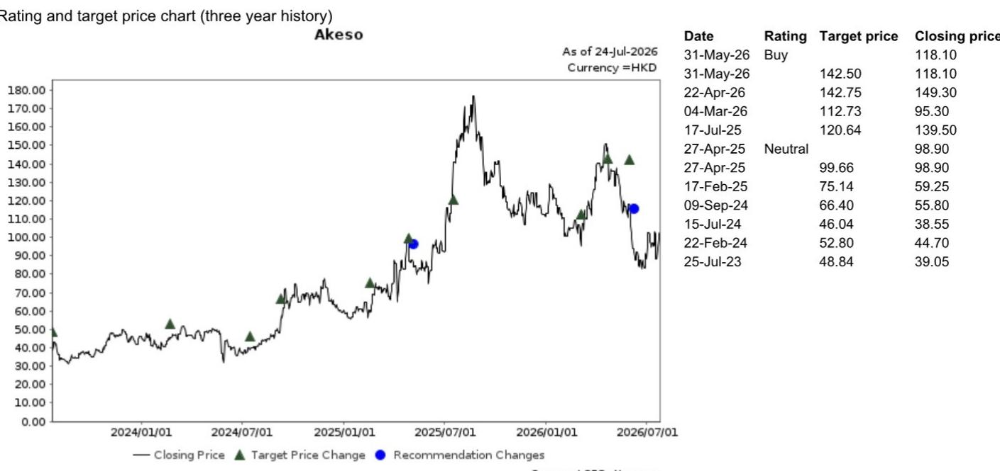
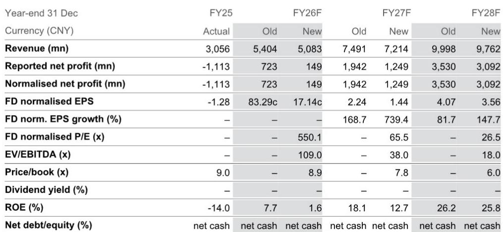
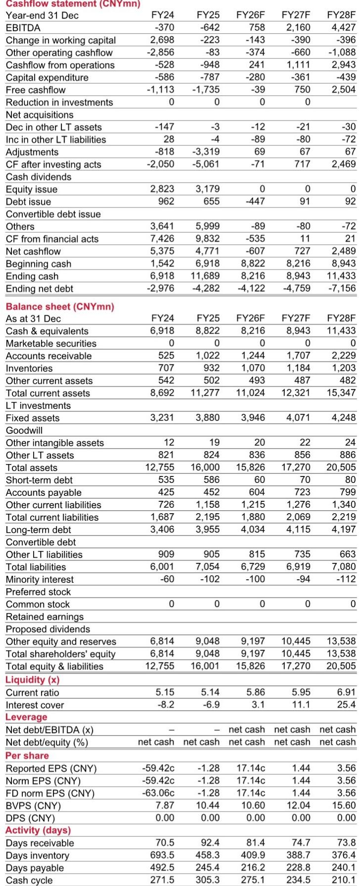

# Akeso’s Inflection Point Arrives in 1H26: Two Blockbuster Drugs, One Profitability Milestone, and a Narrowing Path to Revaluation

Akeso is on track to report its first-ever net profit in 1H26, driven by a 55% year-on-year surge in drug sales to CNY2.2 billion and the addition of CNY200 million in collaboration revenue from an out-licensing deal. The company, which burned through CNY570 million in the same period last year, is now projecting a net profit of CNY46 million for the first half of fiscal 2026. This is not a marginal improvement. It is a structural shift in the company’s financial profile, moving from deep operating losses to sustained profitability over the next three years.

The catalyst for this transformation is commercial execution on two bispecific antibodies: cadonilimab and ivonescimab. These two drugs are not only driving a 68% year-on-year revenue increase in 1H26 to CNY2.4 billion, but they are also the reason gross margin is expanding by 2.3 percentage points to 81.7%. The company is demonstrating that its platform can generate both top-line growth and operating leverage simultaneously, a combination that has historically been elusive for Chinese biotech companies.

Yet the market is pricing Akeso at a 34.5% discount to the analyst’s discounted cash flow (DCF) valuation of HKD157.00 per share, based on FY35 sales of CNY22.3 billion. That multiple is low for a company whose revenue is expected to compound at over 40% annually through FY28. The gap between financial reality and market perception is the central tension in this name. The next six months will determine whether that gap closes or widens.

## Drug Sales Growth Is Accelerating, Not Decelerating, as Both Cadonilimab and Ivonescimab Scale

The most important number in the 1H26 forecast is not the headline revenue figure. It is the sequential growth in drug sales. Akeso’s product revenue in 1H26 is projected at CNY2.2 billion, which represents a 33% increase over the CNY1.65 billion recorded in 2H25. This is not a one-time step-up from a low base. It is a genuine acceleration from a period that already included significant commercial momentum.

Cadonilimab, a PD-1/CTLA-4 bispecific antibody approved for cervical cancer, continues to expand its prescriber base and hospital coverage in China. Ivonescimab, a PD-1/VEGF bispecific antibody for non-small cell lung cancer, is now entering its most critical period of commercial uptake. The combination of these two assets gives Akeso a differentiated position in the Chinese immuno-oncology market, where most competitors rely on single-target PD-1 inhibitors. The bispecific mechanism allows Akeso to claim an efficacy advantage in certain indications, which translates into pricing power and physician preference.

The revenue trajectory also matters for the company’s cost structure. As drug sales grow, fixed manufacturing costs are spread over a larger base, which is why gross margin is forecast to rise from 79.4% in 1H25 to 81.7% in 1H26. This margin expansion is modest but directional. If drug sales continue to compound at 50%-plus annually through FY28, gross margin should approach 88%, as the income statement projections indicate. The operating leverage is real and is already visible in the 1H26 numbers.

## The Profitability Inflection Is Real, But the Magnitude Is Modest and Depends on Expense Discipline

A net profit of CNY46 million on CNY2.4 billion in revenue implies a net margin of just 1.9%. That is not a high-quality profit by any conventional standard. It is, however, a watershed moment for a company that has been loss-making since inception. The transition from negative to positive net income changes the narrative from one of cash burn to one of self-sustaining growth.

The path to profitability is not driven by a single factor. It is the result of three simultaneous improvements: revenue growth that outpaces cost of goods sold, a deceleration in operating expense growth, and the addition of high-margin collaboration revenue. Operating expenses in 1H26 are forecast at CNY1.71 billion, up just 11% year-on-year, while revenue is growing at 68%. This divergence is the core of the operating leverage story. Selling expenses are increasing only 6% year-on-year, suggesting that the commercial infrastructure is already in place and incremental sales require less marginal investment.

The collaboration revenue of CNY200 million from the ebronucimab out-licensing to JumpCan is a pure-profit contribution. It carries minimal associated cost and provides a buffer that allows the company to absorb higher R&D spending without slipping back into loss. This is a deliberate strategy: use licensing income to fund pipeline development while the core business achieves self-sufficiency.

However, the analyst has revised FY26 net profit downward by 79.4% from the prior estimate, to just CNY149 million. The revision reflects a mix of higher cadonilimab sales assumptions offset by lower collaboration revenue and higher OPEX. This is a reminder that the profitability inflection is fragile. If R&D expenses accelerate due to clinical trial costs, or if collaboration revenue disappoints, the net profit could remain negligible for another year.

## HARMONi-3 Data and the PDUFA Decision Are the Two Most Consequential Binary Events in 2H26

The report identifies two catalysts for the second half of 2026: the HARMONi-3 data readout and the PDUFA decision for ivonescimab. These are not routine milestones. They are the events that will determine whether Akeso remains a China-focused commercial-stage biotech or transitions into a global oncology player.

HARMONi-3 is a pivotal trial for ivonescimab in first-line non-small cell lung cancer. The data readout will either confirm the efficacy signal seen in earlier studies or introduce uncertainty. The analyst explicitly lists "inferior HARMONi-3 data" as a key risk. If the data are positive, the drug’s addressable market expands dramatically and the probability of global partnership increases. If the data are negative, the stock could re-rate downward by a significant margin, as the entire valuation depends on ivonescimab’s eventual peak sales.

The PDUFA decision, which is the FDA’s target action date for a new drug application, is the second catalyst. An approval in the United States would open a market that is an order of magnitude larger than China for a PD-1/VEGF bispecific. It would also validate Akeso’s platform technology on a global stage, potentially triggering milestone payments and royalty streams from future partnerships. The timing of these two events in the same half-year creates a concentrated period of information flow that will either vindicate the current valuation or expose its fragility.

## A Decision Framework for Positioning Ahead of the Catalysts

The structure of the opportunity in Akeso can be thought of as a three-stage decision tree. Each stage has a different risk-reward profile and requires a different investment horizon.

Stage one is the commercial execution in China. This is the most predictable component. The drug sales trajectory through 1H26 is already visible based on prescription trends, hospital formulary additions, and reimbursement dynamics. An investor who believes that cadonilimab and ivonescimab will continue to gain share in their respective indications can take a position based on this thesis alone, with a time horizon of 12 to 18 months. The downside protection comes from the fact that the stock trades at 3.7x FY35 sales, which is not demanding for a company growing revenue at 40% annually.

Stage two is the HARMONi-3 data readout. This is a binary event with a defined timeline. An investor who wants to capture the upside of a positive readout without bearing the full downside of a negative result could consider waiting until after the data release. Alternatively, an investor with a higher risk tolerance could build a position before the readout, accepting the volatility in exchange for the potential of a 50%-plus revaluation if the data are strong.

Stage three is the PDUFA decision. This is the longest-duration catalyst and the one with the greatest upside. An FDA approval would fundamentally change the valuation framework for Akeso, shifting it from a China biotech multiple to a global biotech multiple. The analyst’s DCF assumes a terminal growth rate of 3% and a weighted average cost of capital of 9.5%, which are reasonable assumptions for a company that is still in its early growth phase. If ivonescimab receives FDA approval, the terminal growth rate assumption could increase, pushing the DCF value higher.

The key risk across all three stages is that the market is already pricing in some probability of success for these catalysts. The stock trades at HKD102.80 as of the report date, implying that the market is assigning a non-zero probability that the catalysts will succeed. If they fail, the downside could be substantial, as the analyst’s risk list explicitly states.

## The Valuation Multiple Is Low for a Reason, But the Reason Is Changing

Akeso trades at 8.9x price-to-book and 550x forward P/E on FY26 normalized earnings. Those multiples are difficult to justify on a static basis. The P/E is astronomical because FY26 earnings are still negligible. The price-to-book is elevated because the company has raised significant equity, diluting book value per share.

The more relevant multiple is the EV/EBITDA, which stands at 109x for FY26 and falls to 38x for FY27 and 18x for FY28. This trajectory tells the real story. The market is not pricing Akeso based on FY26 earnings. It is pricing the company based on FY28 earnings, when EBITDA is projected to reach CNY4.4 billion and the EV/EBITDA multiple compresses to 18x. At that point, the stock would be trading at a discount to global biotech peers with similar growth profiles.

The question is whether the market will wait that long. The answer depends on the catalyst sequence. If HARMONi-3 data are positive and the PDUFA decision is favorable, the market will re-rate the stock well before FY28 earnings are realized. The multiple expansion will happen in 2H26, not in FY28. That is the opportunity for investors who can look through the current earnings trough.

Conversely, if the catalysts disappoint, the stock could remain range-bound for another 12 to 18 months, trading at low single-digit price-to-sales multiples until the next set of milestones emerges. The asymmetry is clear: the upside from a positive catalyst sequence is substantially larger than the downside from a negative one, because the stock is already trading at a discount to its intrinsic value based on the analyst’s DCF.

The critical insight is that Akeso has reached a point where its commercial execution in China is strong enough to generate positive net income, but its future valuation depends on global regulatory and clinical outcomes. This dual nature makes it a high-conviction, high-volatility name. For investors who can tolerate the binary risk in 2H26, the reward is a potential revaluation that could deliver returns well above the 34.5% discount to DCF currently implied by the stock price.

*For informational purposes only. Portions may be generated, translated, summarized, or edited with AI assistance based on source materials and may contain omissions or errors. Please verify independently. This is not investment, legal, tax, accounting, or other professional advice.*

For informational purposes only. Portions may be generated, translated, summarized, or edited with AI assistance based on source materials and may contain omissions or errors. Please verify independently. This is not investment, legal, tax, accounting, or other professional advice.

