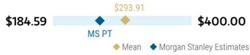
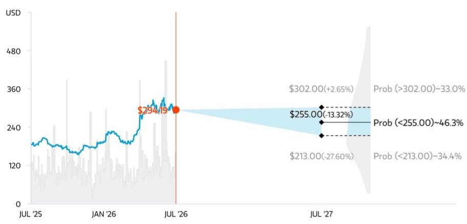
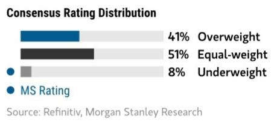
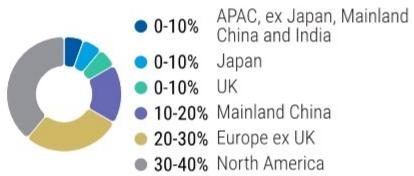
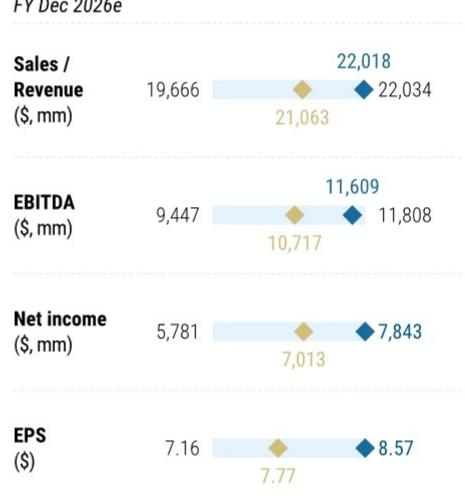

## Holding Up

<table><tr><td colspan="3">WHAT'S CHANGED</td></tr>
<tr><td>Texas Instruments (TXN.O)</td><td>From</td><td>To</td></tr>
<tr><td>Price Target</td><td>$230.00</td><td>$255.00</td></tr>
</table>

Source: Company data, MS

TI reported a strong quarter and seasonal outlook, basically meeting elevated expectations; comments about automotive positive sustainability were notable. It's a positive cycle but relative valuation keeps us UW.

## Key Takeaways

■ Consensus beat and raise driven by strength across all end markets.

GM% upside (61.4% JunQ vs 60%) driven by increasing loadings; guided up q/q in SepQ.

CY26 capex guide biased above midpoint ( $2bn-$ 3bn); MSe moves from $2.6bn$ to $2.8bn$ .

TI reported a solid quarter, but was up against heightened expectations going into the print. We had expected TI to have a strong quarter, and raised our JunQ/SepQ estimates to above-seasonality earlier this week, primarily based on positive read-throughs from our Distributor Survey. While the company reported above seasonal q/q growth for both qtrs and above cons GM% – prior to the quarter we believe investors were looking for DD+ sequential revenue growth or confidence in meaningful GM% expansion. We view the quarter as broadly in line with elevated expectations given the GM% print and modest guide-up, but with the bar already high, the slight stock pullback was not surprising.

That said, we acknowledge the recent strength for TI, and our CY26/27 ests come up by 9%/11% primarily on the stronger JunQ print, as we had already given above-seasonal credit to SepQ. Our view is that this time appears to be proving different – recall last JunQ the recovery was narrow and expectations missed after a false start. This quarter, automotive inflected hard (mid-teens YoY, +HSD (q/q) and mgmt characterized demand as "everywhere." The broadening seems to be holding up, but durability post-restocking (particularly in auto) and the GM% ceiling given the depreciation overhang remain the key debates heading into SepQ.

We remain UW. The core bull case still rests on a post-build FCF inflection in 2027, with FCF moving above reported earnings, but comments on the call appear to point to another year of capex at or above depreciation in 2027, unless revenues slow. We

<table><tr><td colspan="2">MS & CO. LLC</td></tr>
<tr><td colspan="2">Joseph Moore</td></tr>
<tr><td colspan="2">Equity Analyst</td></tr>
<tr><td>Joseph.Moore@morganstanley.com</td><td>+1 212 761-7516</td></tr>
<tr><td colspan="2">Nicole Kozhukhov</td></tr>
<tr><td colspan="2">Research Associate</td></tr>
<tr><td>Nicole.Kozhukhov@morganstanley.com</td><td>+1 212 761-1636</td></tr>
<tr><td colspan="2">Shane Brett</td></tr>
<tr><td colspan="2">Equity Analyst</td></tr>
<tr><td>Shane.Brett@morganstanley.com</td><td>+1 212 761-1022</td></tr>
<tr><td colspan="2">Mason Wayne</td></tr>
<tr><td colspan="2">Research Associate</td></tr>
<tr><td>Mason.Wayne@morganstanley.com</td><td>+1 212 761-6012</td></tr>
<tr><td colspan="2">Ella Tulchinsky</td></tr>
<tr><td colspan="2">Research Associate</td></tr>
<tr><td>Ella.Tulchinsky@morganstanley.com</td><td>+1 212 761-2222</td></tr>
</table>

<table><tr><td>Stock Rating</td><td>Underweight</td></tr>
<tr><td>Industry View</td><td>Attractive</td></tr>
<tr><td>Price target</td><td>$255.00</td></tr>
<tr><td>Shr price, close (Jul 22, 2026)</td><td>$294.19</td></tr>
<tr><td>Mkt cap, curr (mm)</td><td>$273,029</td></tr>
<tr><td>52-Week Range</td><td>$334.03-152.73</td></tr>
</table>

<table><tr><td>Fiscal Year Ending</td><td>12/25</td><td>12/26e</td><td>12/27e</td><td>12/28e</td></tr>
<tr><td>EPS ($)**</td><td>5.45</td><td>8.57</td><td>9.80</td><td>10.73</td></tr>
<tr><td>Prior EPS ($)**</td><td>-</td><td>7.90</td><td>8.86</td><td>9.79</td></tr>
<tr><td>P/E</td><td>31.5</td><td>34.4</td><td>29.4</td><td>26.7</td></tr>
<tr><td>EPS ($)§</td><td>5.48</td><td>7.77</td><td>9.25</td><td>10.72</td></tr>
<tr><td>Div yld (%)</td><td>3.2</td><td>1.9</td><td>2.1</td><td>2.2</td></tr>
</table>

Unless otherwise noted, all metrics are based on MS ModelWare framework
\*\* = Based on consensus methodology
§ = Consensus data is provided by Refinitiv Estimates
e = MS estimates

<table><tr><td colspan="6">QUARTERLY EPS ($)</td></tr>
<tr><td>Quarter</td><td>2025</td><td>2026e Prior</td><td>2026e Current</td><td>2027e Prior</td><td>2027e Current</td></tr>
<tr><td>Q1</td><td>1.28</td><td>-</td><td>1.68a</td><td>2.09</td><td>2.31</td></tr>
<tr><td>Q2</td><td>1.41</td><td>-</td><td>2.14a</td><td>2.11</td><td>2.36</td></tr>
<tr><td>Q3</td><td>1.48</td><td>2.18</td><td>2.43</td><td>2.40</td><td>2.66</td></tr>
<tr><td>Q4</td><td>1.27</td><td>2.10</td><td>2.31</td><td>2.26</td><td>2.48</td></tr>
</table>

e = MS estimates, a = Actual Company reported data

MS does and seeks to do business with companies covered in MS. As a result, investors should be aware that the firm may have a conflict of interest that could affect the objectivity of MS. Investors should consider MS as only a single factor in making their investment decision.

For analyst certification and other important disclosures, refer to the Disclosure Section, located at the end of this report.

also continue to think the SLAB acquisition could weigh on the multiple, given how central cash return is to the story. We continue to respect TI mgmt, but against that backdrop still view Analog Devices as the stronger long-term compounder, with TI's much more capital-intensive business model giving it much lower ROIC. That said, we are starting to see higher capacity utilization across the industry, which could mean we have underestimated some of the merits of TI's strategy in a more robust environment.

## What we learned from the call/callback/release:

1.) (+) Cyclical broadening seems durable, with bright spots appearing in Auto. The cycle has been relatively uneven, but last quarter we saw Industrial accelerate meaningfully and demand broaden across end markets. This print showed that strength holding up, with Auto joining the recovery in both units and mix - +mid-teens y/y, +HSD q/q, led by China EVs/hybrids and replenishment from unsustainably low customer inventory levels. Industrial also remained strong at \~30% y/y and \~10% q/q, still 5-6 points below the 2022 peak, with customers "early and not yet building inventory" – a setup that is positive for the broader analog group if demand holds. PE was flat y/y and +HSD q/q, while Comms grew both y/y and q/q despite some supply pressure on PE customers; DC doubled y/y and grew \~20% q/q, with demand remaining strong.

2.) (+) Pricing and supply tightness create \~incremental upside, but the current growth remains primarily demand-driven. TI's pricing increases should phase in through SepQ, DecQ and potentially flow into 2027, and while this is certainly a positive development, the company had already been guiding to stronger 2H pricing since last quarter. At the same time, pricing has been firmer across the analog group more broadly, and TI's pricing actions have been known since last year, limiting how differentiated the upside is for TI over the NT-MT. Mgmt described the pricing contribution to the \~8% q/q SepQ guide as almost insignificant, with the vast majority coming from units. That leaves supply availability as the more tangible NT share opportunity, though it does not come without trade-offs: TI highlighted its competitive lead times, but that availability is supported by \$4.6bn of inventory/196 DOI and therefore comes with a meaningful balance sheet/capital-intensity trade-off. So while we agree TI is positioned to gain some share, the company lost share for several years before stabilizing in 2025, and we expect further gains to remain competitive.

3.) (=) The capacity advantage is increasingly visible, but capex/FCF remains the central LT debate. Loadings increased from MarQ into JunQ and continued to rise throughout the quarter, while inventory allowed TI to respond to demand that developed faster than customer forecasts. TI does not appear close to a structural capacity ceiling: the company has several years of clean room availability and can add tools incrementally across Richardson, Sherman and Lehi. That said, the offset is that stronger demand requires additional equipment and backend capacity, with CY26 capex biased above the midpoint of current guidance (\$2-\$3bn CY26) and a greater proportion of spending moving toward assembly/test, where there are no ITC benefits. We acknowledge that higher revenue, improving loadings and 300mm production support strong incremental fall-through and FCF growth, but the current setup also suggests that capital intensity may remain higher for longer than the

cleanest version of the bull case assumes – and we raise our CY26 capex from \$2.6bn to \$2.8bn for CY26.

## Result Details:

\- JunQ (strong beat MSe & cons). \$5,463mn (up 13.2% q/q and 22.8% y/y) was above MSe and consensus at \$5,264mn/\$5,258mn. Analog sales were up 11.2% q/q and 26.4% y/y, while Embedded Processing was up 9.0% q/q and 16.1% y/y. Gross margin was 61.4%, above MSe and consensus at 60.0%/59.4%. EPS of \$2.14 was above MSe and consensus, both at \$1.94.

\- SepQ (strong beat MSe & cons). Revenue guide of \$5,900mn at the midpoint was above MSe at \$5,706mn and consensus at \$5,626mn. EPS was guided to \$2.40, above MSe and consensus, both at \$2.18.

\- Changes to our estimates: We revise our FY26 revenue/gross margin/EPS estimates to \$22.018bn/60.9%/\$8.57, from \$21.035bn/60.1%/\$7.82 prior, and our FY27 estimates to \$23.832bn/62.7%/\$9.80, from \$22.310bn/62.2%/\$8.50 prior.

\- We leave our multiple unchanged at 26x a slight discount to ADI (28x) and reflects mid-cycle positioning. Based on our new CY27 EPS of \$9.80, our PT moves up from \$230 to \$255.

## Risk Reward – Texas Instruments (TXN.O)

Underweight on limited upside given premium valuation & margin contraction

## PRICE TARGET \$255.00

Represents 26x our CY27e EPS of \$9.80, reflecting mid-cycle positioning, a slight premium to its long-term average of 24x and \~in-line with large-cap analog peers.

Consensus Price Target Distribution

Source: Refinitiv, MS

## RISK REWARD CHART AND OPTIONS IMPLIED PROBABILITIES (12M)

  
Key: — Historical Stock Performance ● Current Stock Price ◆ Price Target

Source: Refinitiv, MS, MS Institutional Equities Division. The probabilities of our Bull, Base, and Bear case scenarios playing out were estimated with implied volatility data from the options market as of 22 Jul 2026. All figures are approximate risk-neutral probabilities of the stock reaching beyond the scenario price in either three-months' or one-years' time. View explanation of Options Probabilities methodology here

## UNDERWEIGHT THESIS

\- TI is looking to ramp capex over the next few years to help bring more manufacturing in-house, but this will act as a near-term headwind to earnings and FCF growth. The company has also seen pricing and market share pressure in personal electronics and enterprise, as customers move to multisource components, and face competition with local Chinese supply.
- The company trades at a premium valuation for its solid governance track record, and we admire the company's long-term direction, but we see this dynamic as limiting upside in the near-term as margin should come under pressure from the capex ramp.

## Risk Reward Themes

Pricing Power: Negative View descriptions of Risk Rewards Themes here

## BULL CASE

## \$302.00

## 28x Bull Case 2027e EPS of \$10.78

Rebound in macroeconomic environment drives analog and embedded snapback, and end markets grow more than expected in 2026 & 2027.

\- Revenue growth 14.7% in 2027

-Gross margin expands to $64.2\%$ in 2027

\- EPS of \$10.78 in 2027

## BASE CASE

## \$255.00 BEAR CASE

## 26x Base case 2027e EPS of \$9.80

Assumes a moderate analog and embedded recovery through 2026 & 2027.

\- 24.5% revenue growth in 2026 and 8.2% revenue growth in 2027

\- TXN achieves 60.9% GMs in 2026 and 62.7% in 2027

\- EPS of \$8.57 in CY26 and \$9.80 in CY27

\$213.00

## 24x Bear Case 2027e EPS of \$8.86

Global macroeconomic weakness slows down the recovery in analog and embedded, and end markets remain weak.

\- 1.7% revenue growth in 2027

\- Gross margin of $61.2\%$ in 2027

\- EPS of \$8.86 in 2027

◆ Mean ◆ MS Estimates

## Risk Reward – Texas Instruments (TXN.O)

## KEY EARNINGS INPUTS

<table><tr><td>Drivers</td><td>Dec 2025</td><td>Dec 2026e</td><td>Dec 2027e</td><td>Dec 2028e</td></tr>
<tr><td>GAAP Revenue ($, mm)</td><td>17,682</td><td>22,018</td><td>23,832</td><td>25,137</td></tr>
<tr><td>MW Gross Margin (%)</td><td>57.0</td><td>60.9</td><td>62.7</td><td>63.6</td></tr>
<tr><td>GAAP EPS ($)</td><td>5.45</td><td>8.57</td><td>9.80</td><td>10.73</td></tr>
<tr><td>Inventory ($, mm)</td><td>4,804</td><td>4,499</td><td>4,222</td><td>3,983</td></tr>
<tr><td>DOI</td><td>227.6</td><td>188.3</td><td>171.1</td><td>156.8</td></tr>
</table>

## INVESTMENT DRIVERS

STM/Infineon/Renesas/NXP/MCHP for embedded).

\- How increased capex will impact revenue growth and market share as well as depreciation burden on gross margin.

## GLOBAL REVENUE EXPOSURE

  
Source: MS Estimate View explanation of regional hierarchies here

## MS ALPHA MODELS

<table><tr><td>5/5BEST</td><td>24 MonthHorizon</td><td>5/5MOST</td><td>3 MonthHorizon</td></tr>
</table>

Source: Refinitiv, FactSet, MS; 1 is the highest favored Quintile and 5 is the least favored Quintile

## RISKS TO PT/RATING

## RISKS TO UPSIDE

\- Increasing domestic capacity leads to outsized market share gains.

\- Recovery in consumer markets (personal electronics and embedded).

\- Continued content gains in Auto and Industrial end-markets.

## RISKS TO DOWNSIDE

\- Continued market share loss in the embedded business.

\- Pricing and market share pressure from China local capacity.

• Market share loss to ADI in the analog business.

## OWNERSHIP POSITIONING

<table><tr><td>Inst. Owners, % Active</td><td>49.7%</td><td></td></tr>
<tr><td>HF Sector Long/Short Ratio</td><td>2.1x</td><td></td></tr>
<tr><td>HF Sector Net Exposure</td><td>29.5%</td><td></td></tr>
</table>

Refinitiv; MSPB Content. Includes certain hedge fund exposures held with MSPB. Information may be inconsistent with or may not reflect broader market trends. Long/Short Ratio = Long Exposure / Short exposure. Sector % of Total Net Exposure = (For a particular sector: Long Exposure - Short Exposure) / (Across all sectors: Long Exposure – Short Exposure).

MS ESTIMATES VS. CONSENSUS
FY Dec 2026e  
  
Source: Refinitiv, MS

## Financial Summary

Exhibit 1: Income Statement Summary  
TXN-US: Snapshot for the quarter ended June 2026

<table><tr><td colspan="10">Income Statement</td></tr>
<tr><td>Qtr Results:</td><td colspan="3">Actual</td><td>Lst Qtr</td><td>QoQ</td><td>Lst Yr</td><td>YoY</td><td>Cons.</td><td>MSe</td></tr>
<tr><td>Revenue</td><td colspan="3">$5,463.0</td><td>$4,825.0</td><td>13.2%</td><td>$4,448.0</td><td>22.8%</td><td>$5,258.0</td><td>$5,263.8</td></tr>
<tr><td>Gross Margin</td><td colspan="3">61.4%</td><td>58.0%</td><td>335 bps</td><td>57.9%</td><td>347 bps</td><td>59.4%</td><td>60.0%</td></tr>
<tr><td>EPS</td><td colspan="3">$2.14</td><td>$1.68</td><td>$0.46</td><td>$1.41</td><td>$0.73</td><td>$1.94</td><td>$1.94</td></tr>
<tr><td>Nxt Qtr Outlook:</td><td>Low</td><td>High</td><td>Midpoint</td><td rowspan="4"></td><td></td><td></td><td></td><td></td><td></td></tr>
<tr><td>Revenue</td><td>$5,650</td><td>$6,150</td><td>$5,900</td><td>8.0%</td><td>$4,742.0</td><td>24.4%</td><td>$5,625.8</td><td>$5,705.5</td></tr>
<tr><td>Gross Margin</td><td></td><td></td><td></td><td></td><td>57.4%</td><td></td><td>60.1%</td><td>60.1%</td></tr>
<tr><td>EPS</td><td>$2.23</td><td>$2.57</td><td>$2.40</td><td>$0.26</td><td>$1.48</td><td>$0.92</td><td>$2.18</td><td>$2.18</td></tr>
</table>

Source: Company data, MS estimates

Exhibit 2: Income Statement Variance

<table><tr><td colspan="5">GAAP financials (excl 1x items), $ in Millions except per share</td></tr>
<tr><td></td><td>Reported FQ226</td><td>MS Est FQ226</td><td>Difference Act. vs. Est.</td><td>Per share Difference</td></tr>
<tr><td>Total Revenue</td><td>5,463.0</td><td>5,263.8</td><td>199.2</td><td>0.22</td></tr>
<tr><td>Cost of Sales</td><td>2,111.0</td><td>2,105.4</td><td>5.6</td><td>NM</td></tr>
<tr><td>Gross Profit</td><td>3,352.0</td><td>3,158.4</td><td>193.6</td><td>0.21</td></tr>
<tr><td>Gross Margin</td><td>61.4%</td><td>60.0%</td><td>1.4%</td><td></td></tr>
<tr><td>R&amp;D</td><td>535.0</td><td>525.0</td><td>10.0</td><td>(0.01)</td></tr>
<tr><td>SG&amp;A</td><td>490.0</td><td>475.0</td><td>15.0</td><td>(0.02)</td></tr>
<tr><td>Other Opex (inc)</td><td>17.0</td><td>20.0</td><td>(3.0)</td><td>NM</td></tr>
<tr><td>Total Op Expenses</td><td>1,042.0</td><td>1,020.0</td><td>22.0</td><td>(0.03)</td></tr>
<tr><td>Operating Income</td><td>2,310.0</td><td>2,138.4</td><td>171.6</td><td>0.19</td></tr>
<tr><td>Operating Margin</td><td>42.3%</td><td>40.6%</td><td>1.7%</td><td></td></tr>
<tr><td>Income tax provision</td><td>260.0</td><td>268.4</td><td>(8.4)</td><td>NM</td></tr>
<tr><td>Net Income</td><td>1,980.0</td><td>1,778.6</td><td>201.4</td><td>0.22</td></tr>
<tr><td>EPS</td><td>$2.14</td><td>$1.94</td><td>$0.20</td><td>0.20</td></tr>
<tr><td>Diluted Shares Out.</td><td>920.0</td><td>913.0</td><td>913.0</td><td></td></tr>
</table>

Source: Company data, MS estimates

## Projected Financial Statements

Exhibit 3: TXN: Projected Income Statement

<table><tr><td colspan="19">Texas Instruments Inc. GAAP Income Statement($ in millions; fiscal year ends in December)</td></tr>
<tr><td rowspan="2"></td><td>Mar-24</td><td>Sep-24</td><td>Dec-24</td><td>Mar-25</td><td>Jun-25</td><td>Sep-25</td><td>Dec-25</td><td>Mar-26</td><td>Jun-26</td><td>Sep-26</td><td>Dec-26</td><td>Mar-27</td><td>Jun-27</td><td>Sep-27</td><td>Dec-27</td><td></td><td></td><td></td></tr>
<tr><td>F1Q24A</td><td>F3Q24A</td><td>F4Q24A</td><td>F1Q25A</td><td>F2Q25A</td><td>F3Q25A</td><td>F4Q25A</td><td>F1Q26A</td><td>F2Q26A</td><td>F3Q26E</td><td>F4Q26E</td><td>F1Q27E</td><td>F2Q27E</td><td>F3Q27E</td><td>F4Q27E</td><td>2023FY</td><td>2024FY</td><td>2025FYE</td></tr>
<tr><td>Revenues</td><td>$ 3,661</td><td>$ 4,151</td><td>$ 4,007</td><td>$ 4,069</td><td>$ 4,448</td><td>$ 4,742</td><td>$ 4,423</td><td>$ 4,825</td><td>$ 5,463</td><td>$ 5,962</td><td>$ 5,768</td><td>$ 5,680</td><td>$ 5,885</td><td>$ 6,238</td><td>$ 6,029</td><td>$ 17,519</td><td>$ 15,641</td><td>$ 17,682</td></tr>
<tr><td>Consensus revs</td><td></td><td></td><td></td><td></td><td></td><td></td><td></td><td></td><td></td><td>$ 5,602</td><td>$ 5,422</td><td>$ 5,460</td><td>$ 5,806</td><td>$ 6,184</td><td>$ 5,975</td><td></td><td></td><td>$ 21,096</td></tr>
<tr><td>Extraordinary</td><td>-</td><td>-</td><td>-</td><td>-</td><td>-</td><td>-</td><td>-</td><td>-</td><td>-</td><td>-</td><td>-</td><td>-</td><td>-</td><td>-</td><td>-</td><td>-</td><td>-</td><td>-</td></tr>
<tr><td>Revenues - MW</td><td>3,661</td><td>4,151</td><td>4,007</td><td>4,069</td><td>4,448</td><td>4,742</td><td>4,423</td><td>4,825</td><td>5,463</td><td>5,962</td><td>5,768</td><td>5,680</td><td>5,885</td><td>6,238</td><td>6,029</td><td>17,519</td><td>15,641</td><td>17,682</td></tr>
<tr><td>Q/Q Change</td><td>-10.2%</td><td>8.6%</td><td>-3.5%</td><td>1.5%</td><td>9.3%</td><td>6.6%</td><td>-6.7%</td><td>9.1%</td><td>13.2%</td><td>9.1%</td><td>-3.3%</td><td>-1.5%</td><td>3.6%</td><td>6.0%</td><td>-3.4%</td><td></td><td></td><td></td></tr>
<tr><td>Y/Y Change</td><td>-16.4%</td><td>-8.4%</td><td>-1.7%</td><td>11.1%</td><td>16.4%</td><td>14.2%</td><td>10.4%</td><td>18.6%</td><td>22.8%</td><td>25.7%</td><td>30.4%</td><td>17.7%</td><td>7.7%</td><td>4.6%</td><td>4.5%</td><td>-12.5%</td><td>-10.7%</td><td>13.0%</td></tr>
<tr><td>COGS</td><td>1,566.0</td><td>1,677.0</td><td>1,693.0</td><td>1,756.0</td><td>1,873.0</td><td>2,019.0</td><td>1,951.0</td><td>2,026.0</td><td>2,111.0</td><td>2,262.7</td><td>2,203.1</td><td>2,147.8</td><td>2,213.6</td><td>2,270.8</td><td>2,248.4</td><td>6,500.0</td><td>6,547.0</td><td>7,599.0</td></tr>
<tr><td>One-time Items</td><td>-</td><td>-</td><td>-</td><td>-</td><td>-</td><td>-</td><td>-</td><td>-</td><td>-</td><td>-</td><td>-</td><td>-</td><td>-</td><td>-</td><td>-</td><td>-</td><td>-</td><td>-</td></tr>
<tr><td>COGS - MW</td><td>1,566.0</td><td>1,677.0</td><td>1,693.0</td><td>1,756.0</td><td>1,873.0</td><td>2,019.0</td><td>1,951.0</td><td>2,026.0</td><td>2,111.0</td><td>2,262.7</td><td>2,203.1</td><td>2,147.8</td><td>2, 213.6</td><td>2,270.8</td><td>2,248.4</td><td>6,500.0</td><td>6,547.0</td><td>7,599.0</td></tr>
<tr><td>Gross Profit</td><td>2,095.0</td><td>2,474.0</td><td>2,314.0</td><td>2,313.0</td><td>2,575.0</td><td>2,723.0</td><td>2,472.0</td><td>2,799.0</td><td>3,352.0</td><td>3,699.6</td><td>3,565.0</td><td>3,532.0</td><td>3,671.6</td><td>3,967.3</td><td>3,780.7</td><td>11,019.0</td><td>9,094.0</td><td>10,083.0</td></tr>
<tr><td>Gross Margin</td><td>57.2%</td><td>59.6%</td><td>57.7%</td><td>56.8%</td><td>57.9%</td><td>57.4%</td><td>55.9%</td><td>58.0%</td><td>61.4%</td><td>62.1%</td><td>61.8%</td><td>62.2%</td><td>62.4%</td><td>63.6%</td><td>62.7%</td><td>62.9%</td><td>58.1%</td><td>57.0%</td></tr>
<tr><td>Gross Profit - MW</td><td>2,095.0</td><td>2,474.0</td><td>2,314.0</td><td>2,313.0</td><td>2,575.0</td><td>2,723.0</td><td>2,472.0</td><td>2,799.0</td><td>3,352.0</td><td>3,699.6</td><td>3,565.0</td><td>3,532.0</td><td>3, 671.6</td><td>3,967.3</td><td>3,780.7</td><td>11,019.0</td><td>9,094.0</td><td>10,083.0</td></tr>
<tr><td>Gross Margin - MW</td><td>57.2%</td><td>59.6%</td><td>57.7%</td><td>56.8%</td><td>57.9%</td><td>57.4%</td><td>55.9%</td><td>58.0%</td><td>61.4%</td><td>62.1%</td><td>61.8%</td><td>62.2%</td><td>62.4%
