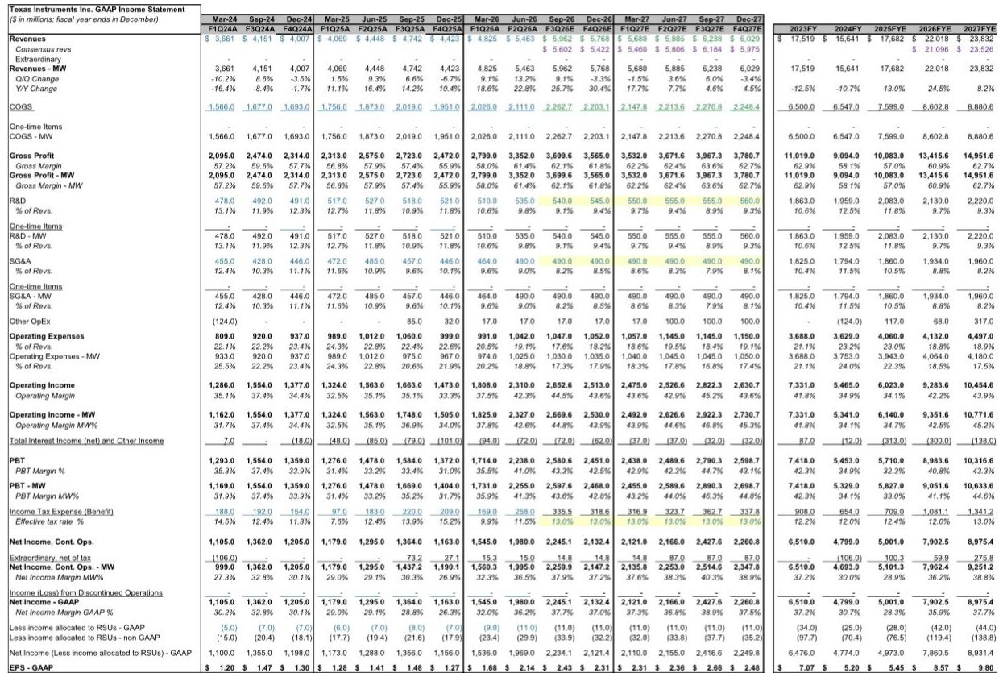
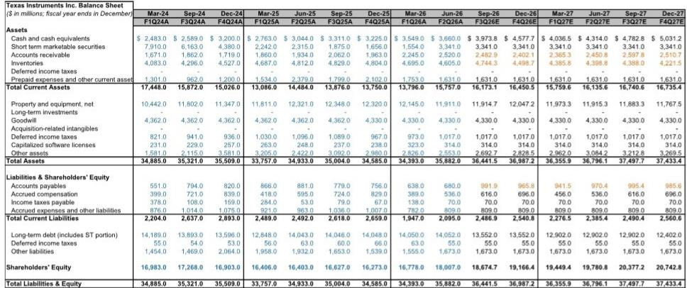
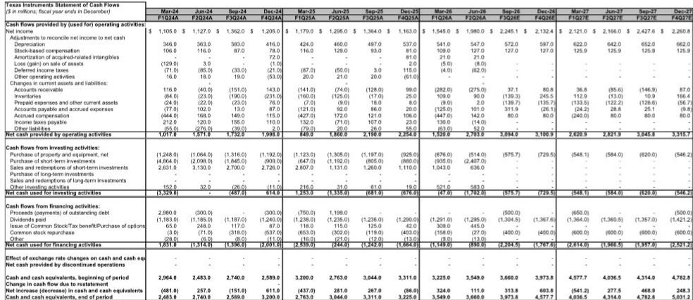

# Texas Instruments’ Recovery Is Broadening, but the Bull Case Still Depends on a Free Cash Flow Inflection That Keeps Sliding

Texas Instruments delivered a strong second-quarter beat and a September-quarter outlook that exceeded consensus estimates, with revenue of $5.463 billion versus the $5.258 billion expected and gross margin of 61.4 percent against a consensus forecast of 59.4 percent. The company guided September-quarter revenue to $5.9 billion at the midpoint, well above the $5.626 billion consensus, and raised EPS guidance to $2.40 versus the $2.18 the market anticipated. Yet the stock pulled back slightly after the print, and the reason is instructive: the bar had been raised materially heading into the quarter, and the results met rather than exceeded those elevated expectations. The tension at the heart of the Texas Instruments investment case is now clearer than ever. The cyclical recovery is broadening in a way that has not been true for the past two years, and the company's capacity advantage is becoming more visible. But the same capital-intensive strategy that underpins that advantage also postpones the free cash flow inflection that the bull case depends on, while the company's premium valuation leaves limited room for error. For investors weighing whether to own Texas Instruments at current levels, the question is not whether the cycle is real. It is whether the cycle is durable enough, and the free cash flow payoff near enough, to justify a stock trading at 34 times forward earnings.

The recovery that began in industrial end markets last quarter has now spread to automotive, and the breadth of demand is the most important positive signal in this report. Automotive revenue grew in the mid-teens year over year and high single digits quarter over quarter, led by Chinese electric vehicles and hybrids as well as replenishment from customer inventory levels that management described as unsustainably low. Industrial revenue remained strong at roughly 30 percent year-over-year growth and approximately 10 percent sequential growth, still running 5 to 6 percentage points below the 2022 peak. Management characterized demand as coming from "everywhere," a notable shift from the narrow, uneven recovery that defined the past several quarters. The broadening is real. But the durability question is equally real, particularly in automotive, where the restocking cycle may have a finite duration. The September-quarter guide of 8 percent sequential growth at the midpoint is above seasonal norms but not dramatically so, and management attributed the vast majority of that growth to unit volumes rather than pricing. The pricing contribution was described as almost insignificant. That matters because pricing power has been a secondary debate in the analog semiconductor space. If the volume growth is genuine and demand-driven rather than inventory-driven, the cycle has more room to run. If the restocking impulse fades, the sequential growth rate could decelerate meaningfully in the December quarter.

## The Gross Margin Improvement Is Real but Has a Ceiling Given the Depreciation Overhang

Gross margin of 61.4 percent in the June quarter exceeded both the analyst's estimate of 60.0 percent and consensus of 59.4 percent, and the company guided September-quarter gross margin to approximately 60.1 percent at the midpoint. The sequential improvement was driven by increasing factory loadings, a direct consequence of higher revenue and better capacity utilization. That is the mechanical benefit of the capital-intensive strategy: when demand rises, fixed costs are spread over a larger revenue base, and the incremental margin on each additional dollar of revenue is high. The analyst raised full-year 2026 gross margin estimates to 60.9 percent from 60.1 percent and 2027 estimates to 62.7 percent from 62.2 percent, reflecting the stronger starting point and the expectation that loadings will continue to improve. But the gross margin ceiling is a structural constraint that no amount of cyclical demand can fully remove. Texas Instruments has been investing heavily in internal manufacturing capacity, building out wafer fabs in Richardson, Sherman, and Lehi. Those investments generate depreciation that flows through cost of goods sold, and that depreciation burden creates a persistent drag on gross margin. The analyst estimates that depreciation will remain elevated through at least 2027, and management commentary on the call suggested that capital expenditure may stay at or above depreciation levels for another year unless revenue growth slows. The gross margin recovery is therefore capped relative to prior cycles, and the path to 65 percent or higher gross margin requires not just strong demand but a multiyear period of depreciation amortization. Investors should model gross margin improving gradually but not returning to pre-capital-expenditure-cycle peaks in the forecast horizon.

## The Capacity Advantage Is Becoming Visible, but It Comes with a Balance Sheet Trade-Off

Texas Instruments entered this cycle with elevated inventory of $4.6 billion and 196 days of inventory on hand, a level that many investors viewed as excessive during the downturn. That inventory is now proving to be a competitive weapon. The company was able to respond to demand that developed faster than customer forecasts, offering competitive lead times while some peers faced supply constraints. Management noted that loadings increased from the March quarter into the June quarter and continued to rise throughout the period, and the company has several years of clean room availability that can be equipped incrementally as demand requires. The capacity advantage is increasingly visible, and it supports the argument that Texas Instruments can gain share in a supply-constrained environment. But the trade-off is material. That $4.6 billion of inventory represents a meaningful balance sheet commitment, and the inventory level will need to normalize over time. The analyst projects inventory declining to $4.5 billion in 2026 and $4.2 billion in 2027, with days of inventory on hand falling from 228 to 188 to 171. That inventory destocking, if it occurs, will consume cash that could otherwise be returned to shareholders. Furthermore, the capacity build requires ongoing capital expenditure. The analyst raised the 2026 capex estimate to $2.8 billion from $2.6 billion, biased above the midpoint of the company's $2 billion to $3 billion guidance range. A greater proportion of that spending is moving toward assembly and test, where there are no investment tax credit benefits. The capacity advantage is real, but it is financed by a balance sheet that will constrain free cash flow generation for at least the next two years.

## The Free Cash Flow Inflection That Justifies the Bull Case Keeps Getting Pushed Out

The core bull case for Texas Instruments has always rested on a post-build free cash flow inflection, a moment when capital expenditure declines and depreciation stabilizes, allowing free cash flow to rise above reported earnings. That inflection was originally expected in 2026, then shifted to 2027, and now management commentary suggests that capital expenditure may remain at or above depreciation levels in 2027 unless revenue growth slows. The analyst estimates that free cash flow will improve as revenue grows and loadings increase, and the company's 300-millimeter production does support strong incremental fall-through. But the inflection point is not yet in sight, and every quarter of elevated capex pushes the payoff further into the future. The analyst maintains a 报告观点 rating, representing a slight premium to the stock's long-term average of 24 times and roughly in line with large-cap analog peers, but it is a discount to the stock's current trading level of approximately 34 times forward earnings. The analyst explicitly states that the relative valuation keeps the rating at 报告观点, and the risk-reward ch$294.19. The bull case of $302, based on 28 times bull-case EPS of $10.78, offers only 3 percent upside. The bear case of $213, based on 24 times bear-case EPS of $8.86, implies 28 percent downside. The asymmetry is unfavorable, and it reflects the fundamental challenge: the stock already prices in a successful recovery and a free cash flow inflection that has not yet materialized.

## A Decision Framework for Evaluating Texas Instruments at Current Levels

For investors considering a position in Texas Instruments, the decision framework must weigh three competing forces. The first is the cyclical recovery, which is broadening and durable by the evidence of this quarter. Automotive has inflected, industrial is running strong, and the company has competitive lead times that support market share gains. The second is the capital intensity of the business model, which depresses returns on invested capital relative to peers such as Analog Devices and pushes the free cash flow inflection into the future. The third is valuation, which at 34 times forward earnings leaves no margin of safety even in a successful recovery scenario. The framework suggests that the stock is most attractive when the cycle is troughing and expectations are low, and most vulnerable when the cycle is mid-cycle and the market has already discounted a full recovery. That is where the stock sits today. The analyst notes that the company's capital-intensive business model gives it much lower return on invested capital than Analog Devices, and the Silicon Labs acquisition could weigh on the multiple given how central cash return is to the Texas Instruments investment narrative. The analyst also acknowledges that higher capacity utilization across the industry could mean the market has underestimated some of the merits of the Texas Instruments strategy in a more robust environment. But that acknowledgment is conditional, and the base case remains that the stock is fully priced.

The September-quarter guide and the commentary around automotive demand are genuinely positive data points. The recovery is broader than it was three months ago, and the company is executing well operationally. But the investment case requires a free cash flow catalyst that may not arrive until 2028, and the stock's current valuation offers limited compensation for the wait. For long-term investors who believe the capital expenditure cycle will ultimately deliver superior unit economics and that the current valuation will prove conservative, the stock may be worth owning through the volatility. For investors who require a clearer catalyst or a wider margin of safety, the risk-reward remains unfavorable. The cycle is real, but the payoff is distant, and the market is already paying for a future that has not yet arrived.

*For informational purposes only. Portions may be generated, translated, summarized, or edited with AI assistance based on source materials and may contain omissions or errors. Please verify independently. This is not investment, legal, tax, accounting, or other professional advice.*

For informational purposes only. Portions may be generated, translated, summarized, or edited with AI assistance based on source materials and may contain omissions or errors. Please verify independently. This is not investment, legal, tax, accounting, or other professional advice.

