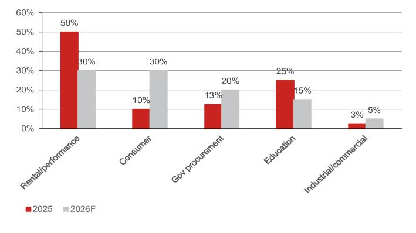
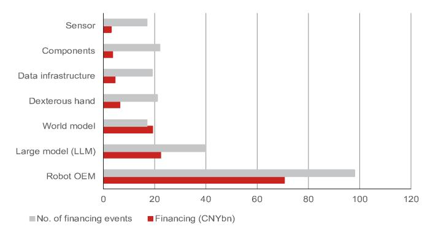
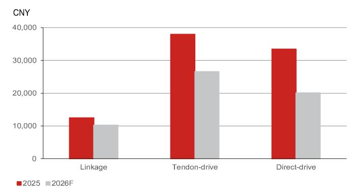
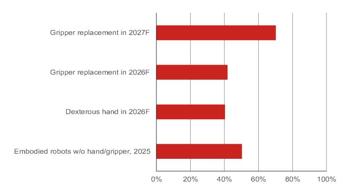
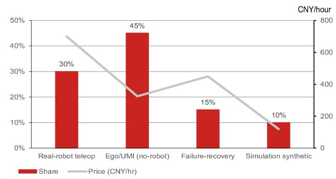

# 2026上海世界人工智能大会观察

## 中国机器人领域的三个转变：本体规模化、大脑发展滞后、数据瓶颈制约

从舞台演示到实际部署：2026年世界人工智能大会（WAIC）展示了更少的花哨表演，而更多机器人正在从事实际工作。近60台人形机器人在拥有1100多家参展商的场馆中提供实际服务，几乎所有主要厂商都将部署能力、数据资产和“机器人大脑”置于硬件参数之前进行推介。

## 量产拐点已至，需求仍待验证

WAIC 2026确认，具身智能已跨越量产拐点，叙事从总可寻址市场转向出货量、平均售价、利润率及实际部署。例如，智元机器人（未上市）报告累计生产15000台；现场近60台人形机器人在1100多家参展商中执行实际服务，管理层将可靠制造、交付和整合视为新标准。我们看到制造端重现2019-2020年电动汽车的发展路径，主题性观察进入订单验证阶段。但当前人形机器人出货量验证的是可制造性，而非需求的可持续性。根据行业调研，2026年预计需求仍偏向娱乐/表演（约30%）、消费（约30%）、政府采购（约20%）和教育（约15%），工业/商业领域仅约5%。我们关注订单构成（付费客户组合、对政府/关联方比例）和单机经济性作为下一个观察节点，这可能决定规模故事能否转化为实际回报。

## 人形机器人面临工厂测试：平均故障间隔时间、节拍时间和回收期挑战

技术路线图已聚焦于工业和物流场景——可预测、可重复的环境——而非开放式应用场景：智元机器人的G2 Max和OmniHand 3、魔法原子（未上市）的轮式MagicBot D1，以及灵巧手公司大多瞄准工厂，而消费级产品——傅利叶（未上市）的陪伴型GR Nano和宇树科技（未上市）的GD01可骑乘机甲——仍属边缘产品。轮式形态成为工业主力本身就是一个信号：厂商正在用拟人化换取可靠性和成本，推迟双足形态。然而，“劳动力替代”和“工业机械臂替代”的经济性尚未得到验证：工业买家根据投资回报率、平均故障间隔时间和节拍时间进行采购，在当前人形机器人平均售价与劳动力成本对比下，大多数工位的回收期尚未达到采用门槛，而夹爪在结构化工位已足够，五指灵巧手存在过度设计。当前真实需求来自数据采集和训练场地、原始设备制造商补贴的试点项目以及对政府展示——由机器人制造商资本支出和政策资金支持，而非工厂劳动力预算——这解释了强劲出货量与未经验证的经济性之间的矛盾；我们认为这是供给侧而非需求侧的拐点。信号转变的标志：来自非关联工业客户的首次重复订单，且由运营预算而非试点预算支付。

## 数据是具身智能的关键约束

我们注意到竞争焦点正从本体转向大脑：视觉-语言-动作模型与世界模型之间的争论已走向融合——星海图（未上市）的v1.6已运行融合架构，而蚂蚁集团（未上市）的LingBot-VLA 2.0覆盖17家原始设备制造商和20多种配置。行业调研显示，关键约束是高质量的真实物理交互数据，而非架构或算力：2026年预计需求约1000万小时，而全球高质量存量约50万小时，存在20倍缺口，每项可交付技能需要2000-5000小时数据。对于数据采集，我们假设2026年中国市场规模约40-50亿元，20多个城市级数据工厂正在建设，加上海外众包；预计单价将在12-24个月内下降。然而，更便宜的数据仅降低采集成本——既不能弥合数据缺口，也无法打通采集-训练-部署-反馈循环——我们预计机器人大脑成熟需要数年时间：领先机器人公司的估计指向具身智能的“ChatGPT时刻”在2-3年后，规模化采用更晚，因为当前部署机群的有效数据反馈仍然较低。

## 研究分析师

中国科技
范博钧 - NIHK
frank.fan@NOM.com
+852 2252 2195

邓宇轩 - NIHK
donnie.teng@NOM.com
+852 2252 1439

## 整体出货量掩盖了以非生产性用途为主的需求基础

在整体出货量数据之下，我们的调研工作指向一个仍以非生产性用途为主的需求基础。我们预测2026年行业出货量为4.5-5万台——低于媒体约10万台的叙事——受政府采购加速和低价产品发布推动的消费需求拐点驱动（Optimus加速；中国随着成本曲线下降而扩大规模，2026年6月28日发布）。根据行业调研，2026年预计需求仍偏向娱乐/表演（约30%）、消费（约30%）、政府采购（约20%）和教育（约15%），创新场景（工业/商业）仅约5%——从2025年以租赁为主的组合（45-50%）转变，但尚未转向生产性用途。租赁经济性揭示了脆弱性：人形机器人日租金4000-20000元，同比下降50-60%，仅因原始设备制造商售价已下降而企稳；市场仍本地化且分散——据专家称，规模太小无法支持平台式租赁业务——而每场活动机器人数量增加（2025年1台，2026年4台，偶尔20-30台）推动数量增长但缺乏经常性收入。政府支持的数据采集工厂约占2026年预计需求的20%，回收期3-5年，我们预计2027年人形机器人数据采集采购将趋软，因为无本体采集方式正在扩大。与此同时，资本形成远远领先于这一需求现实：根据高工机器人数据，2026年上半年人形机器人原始设备制造商在98笔交易中融资705亿元（占行业总融资的53%），具身基础模型（223亿元/40笔交易）、世界模型（191亿元/17笔交易）和数据基础设施（44亿元/19笔交易）吸收了大部分剩余资金。融资结构实际上在支撑一个模型驱动的能力拐点，而这一拐点尚未得到出货量结构的验证。因此，我们将来自非关联工业客户的重复订单视为公司实现回报的必要条件。

图1：终端市场需求结构

来源：公司数据，NOM

图2：2026年上半年各细分领域融资情况

来源：高工机器人，NOM

## 灵巧手：三条路线趋同，硬件迭代快于需求

灵巧手正汇聚于三条技术路线。连杆手——低自由度（≤12自由度），平均售价12000-13000元，占行业出货量80%以上——构成商品化的传统基础，由因时机器人（未上市）引领，傲意科技（未上市）和兆威机电（003021 CH，未评级）跟随；低于10000元的定价已经出现。高自由度战场是腱驱动与直驱之争。腱设计（15-19自由度，平均售价约38000元）最接近模拟人手——支持者认为这便于利用人类采集数据进行训练——由灵巧智能（未上市）和Dexterous Intelligence（未上市）倡导，但面临腱蠕变和约2个月寿命问题。直驱（20+自由度，33000-34000元，2026年第四季度起量）受算法团队青睐，因其关节级力控和强化学习友好性——若贝特（未上市）领先，Sudo（未上市）的22自由度/840克手和Kinetix AI（未上市）的37自由度掌内电机设计在WAIC展出——但电机发热是约束：厂商面临热-力-尺寸三角，只能优化其中两项，因此混合架构正在增多。触觉传感共识仅在指尖；全掌方案仍存在分歧。随着智元机器人等原始设备制造商迭代自研手（OmniHand 3），且行业出货量2026年预计增长80-100%，手是链条中迭代最快的环节——尽管供给仍领先于终端需求。

图3：不同技术路线平均售价

来源：公司数据，NOM估计

图4：灵巧手夹爪在人形机器人中的渗透率

来源：公司数据，NOM估计

图5：灵巧手技术路线图

| 项目 | 连杆（螺杆+连杆） | 腱（电机在前臂） | 直驱（电机在手内） | 混合（直驱主导+腱） |
|------|------------------|------------------|-------------------|-------------------|
| 自由度 | 低自由度（≤12） | 高自由度（主动≥16） | 高自由度 | 高自由度方案 |
| 2025年出货份额 | >80%（全部低自由度） | 小；灵巧智能约80% | 2025年第四季度起量 | 2026年新兴 |
| 寿命 | 成熟 | 约30天→2个月以上 | 约4个月 | 待定；热管理已改善 |
| 关键瓶颈 | 自由度上限 | 腱寿命/蠕变/脱轨 | 热/重量 | 寿命+成本 |
| 力控与训练 | 容易 | 需蠕变补偿 | 关节级力控 | 比纯腱更容易 |
| 成本/平均售价 | 12000-13000元；低于10000元型号出现 | 约38000元 | 33000-34000元 | 比纯直驱溢价<10%；性能提升30-40% |
| 主要参与者 | 因时/傲意/兆威/强脑科技（低自由度） | 灵巧智能/DexRobot | 若贝特/无极/Sudo/强脑科技Revo3 | Xynova Flex2/AgiLink |

来源：公司数据，NOM

图6：灵巧手及零部件公司市场调研

| 公司 | 机器人公司2026年2月 | 机器人公司2026年4月 | 灵巧手2026年5月 | 零部件公司2026年6月 | 机器人公司2026年6月 | 灵巧手2026年7月 | 媒体2026年7月 |
|------|-------------------|-------------------|-----------------|-------------------|-------------------|-----------------|---------------|
| 因时机器人 | + | ++ | + | | ○ | + | ○ |
| 强脑科技 | | ++ | + | | | + | + |
| Xynova | | ++ | + | ○ | | ++ | ○ |
| 无极科技 | + | + | + | ++ | ++ | ++ | + |
| 若贝特 | + | ○ | + | + | ○ | ++ | + |
| Dexterous Intelligence | | + | | | | ○ | ○ |
| 灵巧智能 | ++ | | | ○ | | | ○ |
| AgiLink | | | | | | + | ○ |
| PaXini | + | ○ | ++ | | + | + | |
| ++ 强烈正面 | + 正面 | ○ 中性/混合 | 未提及 |

来源：公司数据，NOM

## 大脑竞赛通过数据展开：因反馈稀缺，大脑成熟可能需数年

WAIC使数据瓶颈在展台上变得可见，数据工具本身已成为一个产品类别（数据成为机器人领域关键部分，2026年7月5日发布）。参展商超越机器人本体，展示完整采集方案——PsiBot（未上市）的SynCap系统同步视觉、语言、触觉和运动流，强脑科技（未上市）的训练平台加采集解决方案，以及一批外骨骼手套和遥操作设备——而DexForce（未上市）开源了人类仿真真实对齐数据集，京东（JD US，买入）据报道正在建设大型采集中心，表明平台资本进入该领域。标准化采集-仿真-评估-部署流程成为共同推介——呼应我们偏好的闭环模型——并正在获得监管框架支持：人形数据集质量评估国家标准于2026年7月正式启动（在中国机器人标准委员会TC591下），同时工信部关于训练数据管理的行业标准正在公开征求意见——尽管厂商保护自有标准可能减缓采纳。我们预计，自2025年第四季度以来被承认的视觉-语言-动作模型的泛化和长时域限制，核心是数据问题，推动厂商走向世界模型融合——预训练语料库中真实与合成比例已接近1:9，降低但未消除真实数据需求——而美国以仿真为主的路线与中国以真实机器遥操作为主的路线形成对比。

图7：数据采集市场规模

来源：公司数据，NOM估计

图8：不同数据采集类型的份额和平均售价

来源：公司数据，NOM估计

## 附录A-1

本报告由NOM国际（香港）有限公司（NIHK）编制。关于NOM集团实体详情，请参阅免责声明。

## 分析师认证

我们，范博钧和邓宇轩，特此证明（1）本研究报告中所表达的观点准确反映我们个人对相关证券或发行人的看法；（2）我们的薪酬中没有任何部分直接或间接与本研究报告中具体建议或观点相关；（3）我们的薪酬中没有任何部分与NOM国际有限公司、NOM国际有限公司或任何其他NOM集团公司执行的任何特定投行业务挂钩。

## 重要披露

## 研究报告在线获取及利益冲突披露

NOM集团研究报告可在www.NOMnow.com/research、彭博、Capital IQ、Factset、LSEG获取。

重要披露可访问http://go.NOMnow.com/research/m/Disclosures阅读，或向NOM国际有限公司索取。如网站访问遇到问题，请发送邮件至grpsupport@NOM.com寻求帮助。

负责编制本报告的分析师薪酬基于多种因素，包括公司总收入，其中一部分来自投行业务。除非另有说明，本报告首页列出的非美国分析师未在FINRA规则下注册/具备研究分析师资格，可能不是NSI的关联人员，且可能不受FINRA规则2241关于与所覆盖公司沟通、公开露面及交易研究分析师账户持有证券的限制。

NOM全球金融产品公司（NGFP）、NOM衍生品公司（NDP）和NOM国际有限公司（NIplc）已在美国商品期货交易委员会和美国期货业协会注册为掉期交易商。NGFP、NDPI和NIplc通常从事掉期及其他衍生品交易，其中部分可能为本报告涉及的产品。

## 评级分布（NOM集团）

NOM集团全球股票研究发布的全部评级分布如下：

58%被授予报告评级，根据强制性披露要求，该评级被归类为报告评级；其中33%的公司是NOM集团*的投行客户。0%的公司（在欧盟受监管市场上市交易）被NOM集团提供实质性服务**。

39%被授予中性评级，根据强制性披露要求，该评级被归类为持有评级；其中57%的公司是NOM集团*的投行客户。0%的公司（在欧盟受监管市场上市交易）被NOM集团提供实质性服务。

3%被授予减持评级，根据强制性披露要求，该评级被归类为报告评级；其中15%的公司是NOM集团*的投行客户。0%的公司（在欧盟受监管市场上市交易）被NOM集团提供实质性服务。

截至2026年6月30日。

*NOM集团定义见本报告末尾免责声明部分。
**根据欧盟市场滥用监管定义。

## NOM集团股票研究评级体系及行业分类定义

评级体系为相对体系，表示相对于每只股票特定基准的预期表现，受有限管理裁量权约束。分析师的目标价是基于适当估值方法对股票当前内在公允价值的评估。估值方法包括但不限于现金流折现分析、预期股本回报率和倍数分析。分析师也可能表明相对于所述目标价的预期相对上涨/下跌空间，定义为（目标价-当前价）/当前价。

## 股票

“买入”评级表示分析师预期该股票在未来12个月内将跑赢基准。“中性”评级表示分析师预期该股票在未来12个月内将与基准表现一致。“减持”评级表示分析师预期该股票在未来12个月内将跑输基准。“暂停”评级表示评级、目标价和估计已暂时暂停，以遵守适用法规和/或公司政策。标记为“未评级”或显示为“无评级”的证券和/或公司不在常规研究覆盖范围内。读者不应期望NOM就此类证券和/或公司提供持续或额外信息。基准如下：美国/欧洲/亚洲（除日本）：请参阅估值方法了解股票相关基准的解释，可访问：http://go.NOMnow.com/research/m/Disclosures；全球新兴市场（除亚洲）：MSCI新兴市场除亚洲指数，除非估值方法中另有说明；日本：Russell/NOM大盘指数。

## 行业

“看多”立场表示分析师预期该行业在未来12个月内将跑赢基准。“中性”立场表示分析师预期该行业在未来12个月内将与基准表现一致。“看空”立场表示分析师预期该行业在未来12个月内将跑输基准。标记为“未评级”或显示为“N/A”的行业不分配评级。基准如下：美国：标普500指数；欧洲：道琼斯STOXX 600指数；全球新兴市场（除亚洲）：MSCI新兴市场除亚洲指数。日本/亚洲（除日本）：不分配行业评级。

## 目标价

目标价（如有讨论）表示分析师对12个月时间范围内股价的预测，部分反映分析师对公司盈利的估计。目标价的实现可能受到总体市场和宏观经济趋势、与公司或市场相关的其他风险的阻碍，如果公司盈利与估计不符，则可能无法实现。

## 免责声明

本出版物包含由第1页确定的NOM集团实体编制的材料，并可能包含一个或多个NOM集团实体的贡献，其员工及其各自隶属关系在第1页或本出版物其他地方指定。本文中使用的“NOM集团”一词指NOM控股有限公司及其关联公司和子公司，包括：（a）NOM株式会社（NSC）日本东京，（b）NOM金融产品欧洲有限公司（NFPE）德国，（c）NOM国际有限公司（NIplc）英国，（d）NOM国际有限公司（NSI）美国纽约，（e）NOM国际（香港）有限公司（NIHK）香港，（f）NOM金融投资（韩国）有限公司（NFIK）韩国（关于在韩国金融投资协会注册的NOM分析师信息可在KOFIA内网http://dis.kofia.or.kr查询），（g）NOM新加坡有限公司（NSL）新加坡（注册号197201440E，受新加坡金融管理局监管），（h）NOM澳大利亚有限公司（NAL）澳大利亚（ABN 48 003 032 513），受澳大利亚证券和投资委员会监管，持有澳大利亚金融服务牌照号246412，（i）NOM马来西亚有限公司（NSM）马来西亚，（j）NIHK台北分公司（NITB）台湾，（k）NOM金融咨询与证券（印度）私人有限公司（NFASL）印度孟买（注册地址：Ceejay House, Level 11, Plot F, Shivsagar Estate, Dr. Annie Besant Road, Worli, Mumbai- 400 018, India；电话：91 22 4037 4037，传真：91 22 4037 4111；CIN No: U74140MH2007PTC169116，SEBI股票经纪业务注册号：INZ000255633；SEBI投资银行业务注册号：INM000011419；SEBI研究业务注册号：INH000001014 - 合规官：Ms. Pratiksha Tondwalkar，91 22 40374904，投诉邮箱：investorgrievancesra@NOM.com 网页：链接

对于涉及印度上市公司或由印度NFASL研究分析师撰写的报告：（i）证券市场投资存在市场风险。投资前请仔细阅读所有相关文件。（ii）SEBI注册和NISM认证不保证中介机构的表现或向读者提供任何回报保证。（iii）NFASL提供研究服务的条款和条件在NFASL网页上披露。

（l）NOM信托研究与咨询有限公司（NFRC）日本东京。（m）NOM东方国际证券有限公司（NOI）是NOM集团、东方国际（集团）有限公司和上海黄浦投资控股（集团）有限公司共同控股的合资企业。根据中华人民共和国法律（为本文件目的，不包括香港、澳门和台湾），NOI在中国境内获得提供证券研究和研究交流的许可，并独立于NOM集团其他成员运营；特别是，NOI在中国证券中的利益不向任何其他NOM集团实体披露或与其持仓合并，其他NOM集团实体在中国证券中的利益也不向NOI披露或与其持仓合并。研究报告首页NOI旁边打印的个人姓名表示该个人受雇于NOI，根据研究合作协议为NIHK提供研究协助。研究报告首页员工姓名旁边的“NSFSPL”表示该个人受雇于NOM结构化融资服务私人有限公司，根据公司间协议为某些NOM实体提供协助。“Verdhana”出现在研究报告首页个人姓名旁边表示该个人受雇于PT Verdhana Sekuritas Indonesia（“Verdhana”），根据研究合作协议为NIHK提供研究协助，Verdhana及其个人均未在印度尼西亚境外获得许可。

本材料：（I）仅供您个人参考，我们不基于此材料征求任何行动；（II）不应被解释为在任何司法管辖区出售或征求购买任何证券的要约，如果此类要约或征求在该司法管辖区将是非法的；（III）除与NOM集团相关的披露外，基于我们认为可靠的来源信息，但未经NOM集团独立验证。

除与NOM集团相关的披露外，NOM集团不保证、陈述或承诺（明示或暗示）本文件公平、准确、完整、正确、可靠或适合任何特定目的或适销性，并且在适用法律/法规允许的最大范围内，不承担因使用本文件及相关数据而产生的任何行为（或决定不采取行动）的责任（无论是过失或其他，以及全部或部分）。在适用法律/法规允许的最大范围内，NOM集团的所有保证和其他承诺特此排除，NOM集团不承担因使用、误用或分发本材料或其中包含的信息或以其他方式与之相关的任何损失的责任（无论是过失或其他，以及全部或部分）。

所表达的意见或估计是截至原始出版日期的当前意见，本材料中的信息（包括其中包含的意见和估计）如有变更，恕不另行通知。然而，NOM集团明确否认任何义务，因此没有责任更新或修订本文件。本文中的任何评论或陈述均为作者的观点，可能与NOM集团内部其他方持有的观点不同。客户应考虑本报告中的任何建议或推荐是否适合其特定情况，并在适当时寻求专业建议，包括税务建议。NOM集团不提供税务建议。

在适用法律/法规允许的范围内，NOM集团及其高级职员、董事、员工和关联方可能作为委托人、代理人或其他身份进行交易，或持有本文提及的发行人或证券的多头或空头头寸，或买入或卖出其证券、商品或工具，或基于其的期权或其他衍生工具。NOM集团公司也可能在发行人的金融工具中担任做市商或流动性提供者（根据英国适用法规的定义）。如果做市商活动按照美国或其他司法管辖区特定法律法规的定义进行，将在特定发行人披露中单独披露。

本文件可能包含从第三方获得的信息，包括但不限于信用评级机构的评级，如标准普尔。NOM集团特此明确否认对从第三方获得的任何信息在本材料中或与之相关的原创性、公平性、准确性、完整性、正确性、适销性或特定目的适用性的所有陈述、保证或承诺，并且不承担因使用或误用从第三方获得的任何信息在本材料中或与之相关的任何直接、间接、附带、示范性、补偿性、惩罚性、特殊或后果性损害、成本、费用、法律费用或损失（包括收入或利润损失和机会成本）的责任（无论是过失或其他，以及全部或部分）。未经相关第三方事先书面许可，禁止以任何形式复制和分发第三方内容。第三方内容提供者不（明示或暗示）保证信息的公平性、准确性、完整性、正确性、及时性或可用性（包括评级），并且不对因使用或误用此类内容而产生的任何错误或遗漏（无论是过失或其他）或结果负责，无论原因如何。第三方内容提供者不提供明示或暗示的保证，包括但不限于任何适销性或特定目的或用途适用性的保证。第三方内容提供者不承担因使用或误用其内容（包括评级）而产生的任何直接、间接、附带、示范性、补偿性、惩罚性、特殊或后果性损害、成本、费用、法律费用或损失（包括收入或利润损失和机会成本）的责任（无论是过失或其他，以及全部或部分）。信用评级是意见陈述，而非事实陈述或购买、持有或卖出证券的建议。它们不涉及证券的适合性或证券的投资目的适合性，不应作为研究交流依赖。本文件中的任何MSCI来源信息均为MSCI Inc.（“MSCI”）的专有财产。未经MSCI事先书面许可，不得为任何目的（包括创建任何金融产品和任何指数）复制、再传播、重新分发或使用（全部或部分）此信息及任何其他MSCI知识产权。此信息按“现状”提供。用户承担使用此信息的全部风险。MSCI、其关联方及任何参与或相关计算或编译信息的第三方特此明确否认对本材料或其中包含的信息或与之相关的任何原创性、公平性、准确性、完整性、正确性、适销性或特定目的适用性的所有陈述、保证或承诺。在不限制前述规定的情况下，MSCI、其任何关联方或任何参与或相关计算或编译信息的第三方在任何情况下均不承担任何类型的任何损害责任（无论是过失或其他，以及全部或部分）。MSCI和MSCI指数是MSCI及其关联方的服务标志。

Russell/NOM日本股票指数的知识产权属于NOM信托研究与咨询有限公司（“NFRC”）和FTSE Russell（“Russell”）。NFRC和Russell不保证指数的公平性、准确性、完整性、正确性、可靠性、有用性、适销性、适销性或适合性，并且不对任何指数用户和/或其关联方使用指数进行的商业活动或服务负责。

读者应将本文件视为做出投资决策的单一因素，因此，本报告不应被视为识别或暗示与任何投资决策相关的所有风险（直接或间接）。NOM集团制作多种不同类型的研究产品，包括但不限于基础分析和定量分析；一种研究产品中包含的建议可能与其他类型研究产品中的建议不同，无论是由于不同的时间范围、方法或其他原因。NOM集团以多种不同方式发布研究产品，包括在NOM集团门户网站上发布和/或直接分发给客户。不同客户群体可能根据其个人需求从研究部门获得不同的产品和服务。

本文中呈现的数字可能涉及过去表现或基于过去表现的模拟，这些不是未来或可能表现的可靠指标。如果信息包含对未来表现和业务前景的预期、预测或指示，此类预测可能不是未来或可能表现的可靠指标。此外，模拟基于模型和简化假设，可能过度简化且不反映未来回报分布。本文件中为说明目的创建和发布的任何数字、策略或指数不旨在作为欧洲基准监管定义的“基准”使用。某些证券受汇率波动影响，可能对投资的价值、价格或收入产生不利影响。

关于固定收益研究：建议分为两类：战术性（通常持续最多三个月）或战略性（通常持续6-12个月）。然而，交易建议可能随时根据情况变化进行审查。交易建议也提供“止损”水平；如果触及，将自动关闭交易建议。建议中显示的价格和回报表现是在提交发布时获取的，基于当时彭博、LSEG或NOM的指示性价格和回报表现。显示的价格和回报表现不一定是可以执行交易建议的价格。

本文描述的证券可能未根据1933年美国证券法（“1933年法案”）注册，在这种情况下，除非已根据1933年法案注册，或符合1933年法案注册要求的豁免，否则不得在美国或向美国人士发行或出售。除非适用法律允许，任何交易应通过您所在司法管辖区的NOM实体执行。

本文件已获批准在英国作为投资研究由NIplc分发。NIplc由审慎监管局授权，受金融行为监管局和审慎监管局监管。NIplc是伦敦证券交易所成员。本文件不构成英国适用法规定义的个人建议，也不考虑个别读者的特定投资目标、财务状况或需求。本文件仅面向英国适用法规定义的“合格对手方”或“专业客户”，因此不得向“零售客户”重新分发。

本文件已获批准在欧洲经济区作为投资研究由NOM金融产品欧洲有限公司（“NFPE”）分发。NFPE是一家根据德国法律组织的有限责任公司，在法兰克福/美因法院商业登记处注册，编号HRB 110223。NFPE由德国联邦金融监管局授权和监管。

本文件已获NIHK批准在香港分发，NIHK受香港证券及期货事务监察委员会监管。本文件仅面向香港适用法规定义的“专业读者”，因此不得向非“专业读者”重新分发。

本文件已获批准在澳大利亚由NAL分发，NAL受ASIC授权和监管。

本文件也已获批准在马来西亚由NSM分发。

在新加坡，本文件由NSL分发，NSL是金融顾问法（第110章）定义的豁免金融顾问，并受新加坡金融管理局监管。NSL可根据金融顾问条例第32C条安排分发其外国关联公司制作的本文件。本文件面向证券及期货法（第289章）定义的认可读者、专家读者或机构读者。如果本文件接收者不是认可读者、专家读者或机构读者，NSL仅在法律要求的范围内对此类接收者承担本文件内容的法律责任。新加坡的接收者应就本文件引起或与之相关的事项联系NSL。本文件旨在广泛分发。它不考虑任何特定个人的具体投资目标、财务状况或特定需求。接收者应在做出购买任何证券的承诺前考虑其具体投资目标、财务状况或特定需求，包括根据其认为合适的方式，通过单独委托寻求独立财务顾问关于投资适合性的建议。除非1933年法案S条例禁止，本材料在美国由美国注册经纪交易商NSI分发，NSI根据1934年美国证券交易法规则15a-6的规定对其内容承担责任。编制本文件的实体允许NOM集团内其独立运营的关联公司向其客户提供此类文件的副本。

本文件未获批准向沙特阿拉伯王国资本市场管理局定义的“授权人士”、“豁免人士”或“机构”或阿拉伯联合酋长国迪拜金融服务管理局定义的“市场对手方”或“专业客户”或卡塔尔国卡塔尔金融中心监管局定义的“市场对手方”或“商业客户”以外的人士分发。本文件及其任何副本不得由未经授权的人士带入或传输或分发到沙特阿拉伯、阿联酋或卡塔尔，或向沙特阿拉伯的“授权人士”、“豁免人士”或“机构”或阿联酋的“市场对手方”或“专业客户”或卡塔尔的“市场对手方”或“商业客户”以外的人士分发。未能遵守这些限制可能构成违反阿联酋、沙特阿拉伯或卡塔尔法律。

对于涉及台湾上市公司或由台湾研究分析师撰写的报告：

本文件仅供参考。您应独立评估投资风险，并自行承担投资决策责任。未经NOM集团书面授权，不得复制或引用本报告的任何部分。根据台湾证券商受托买卖有价证券操作规范及/或其他适用法律法规，您不得向他人（包括但不限于关联方、关联公司及任何其他第三方）提供本报告，或从事任何可能涉及利益冲突的与本报告相关的活动。关于NOM国际（香港）有限公司台北分公司不可执行的证券/工具的信息仅供参考，不应被解释为对此类证券/工具的交易建议或招揽。

本材料不得在印度尼西亚境内分发，或传递给印度尼西亚共和国境内的人士，或印度尼西亚公民（无论其居住地或所在地）或印度尼西亚居民实体，如果这构成印度尼西亚法律下的公开发行。本文提及的证券不得在印度尼西亚向印度尼西亚公民（无论其居住地或所在地）或印度尼西亚居民实体发行或出售，如果这构成印度尼西亚法律下的公开发行。

研究报告首页NOI旁边打印的个人姓名表示本文件是NOI在中国发布的研究报告的翻译版本。在所有其他情况下，本文件由未在中国获得提供证券研究许可的NOM集团或其子公司或关联公司（统称“离岸发行人”）编制。本研究报告未获批准在中国境内分发。A股相关分析（如有）并非为位于或注册在中国的人士制作。接收者不应依赖本研究报告中包含的任何信息做出投资决策，离岸发行人不对此承担任何责任。未经NOM集团成员事先书面同意，不得（I）以任何形式复制、影印、复制或复印本材料的任何部分；或（II）重新传播、重新发布或重新分发本材料。如果本文件通过电子传输（如电子邮件）分发，则无法保证此类传输安全或无错误，因为信息可能被拦截、损坏、丢失、延迟到达或不完整，或包含病毒。因此，发送者不承担因电子传输可能导致的本文内容中的任何错误或遗漏的责任（无论是过失或其他，以及全部或部分）。如需验证，请索取纸质版本。

NOM集团通过其合规政策和程序（包括但不限于利益冲突、中国墙和保密政策）以及通过维护中国墙和员工培训来管理与研究制作相关的冲突。

关于本文件中包含的任何研究交流所使用的方法或模型的更多信息，可联系本报告首页列出的NOM研究分析师索取。披露信息可应要求提供，披露信息可在NOM披露网页获取：http://go.NOMnow.com/research/m/Disclosures

版权© 2026 NOM国际（香港）有限公司，香港。保留所有权利。
