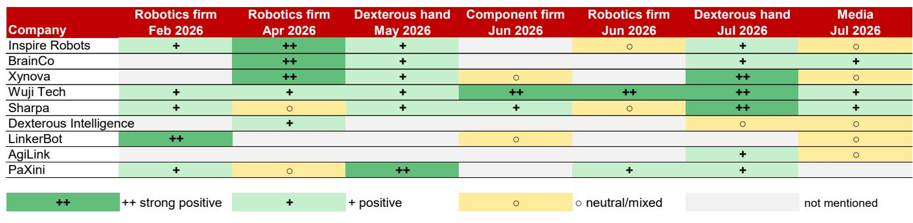
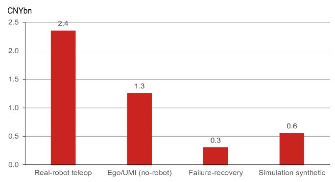

# NOM：WAIC与机器人行业技术应用观察

2026年世界人工智能大会（WAIC）上的机器人展区，不再以杂耍式演示为主。近60台人形机器人在超过1100家参展商中执行实际服务，几乎所有主要厂商都将宣传重点从硬件参数转向部署能力、数据资产和“机器人大脑”。NOM在最新研究报告中判断，具身智能已跨过生产拐点，但需求结构仍以非生产性用途为主，高质量物理交互数据成为制约“大脑”成熟的核心瓶颈。

报告基于WAIC现场调研和产业链调查，提出三个关键观察：量产验证了制造能力而非需求韧性；灵巧手硬件迭代速度超过实际需求；数据缺口达到20倍，机器人大脑成熟仍需数年。

## 1. 量产拐点已至，但需求结构仍以非生产性用途为主

WAIC 2026确认了具身智能进入量产阶段。智元机器人（未上市）累计产量已达15000台，现场近60台人形机器人执行真实服务。NOM认为，叙事正从总可寻址市场转向出货量、平均售价、利润率与实际部署，类似2019-2020年电动车制造端的逻辑重演，主题研究进入订单验证阶段。

但当前出货量验证的是可制造性，而非需求可持续性。根据NOM产业链调查，2026年预计需求仍偏向娱乐/表演（约30%）、消费（约30%）、政府采购（约20%）和教育（约15%），工业/商业场景仅占约5%。租赁市场数据进一步揭示了现状：人形机器人日租金已同比下降50-60%，市场仍分散且本地化。NOM认为，来自非关联工业客户的重复订单，才是需求侧拐点的真正信号。

> **KC评论：** 报告将当前阶段定性为供给侧拐点而非需求侧拐点。关键观察指标不是出货量本身，而是订单中付费客户构成、关联方采购占比以及单台商业模式是否跑通。

## 2. 灵巧手技术路线收敛，硬件迭代快于实际需求

灵巧手正收敛至三条技术路线。连杆手（自由度≤12，均价12000-13000元）占据超过80%的出货量，已出现低于10000元的定价。高自由度战场在腱驱动与直驱之间展开：腱驱动（15-19自由度，均价约38000元）最接近人手结构，但面临腱蠕变和约2个月的使用寿命问题；直驱（20+自由度，均价33000-34000元）受算法团队青睐，但电机发热构成热-力-尺寸三角约束。混合架构正在兴起。

NOM指出，灵巧手是整条产业链中迭代最快的环节，但供给仍跑在终端需求前面。智元等整机厂商开始自研灵巧手（如OmniHand 3），2026年行业出货量预计增长80-100%，但实际工业场景中，多数结构化工位仅需夹爪即可满足，五指灵巧手存在过度工程化不确定性。

## 3. 数据缺口达20倍，机器人大脑成熟仍需数年

WAIC上数据工具已独立成为产品品类。展商展示从数据采集到仿真、评估、部署的完整管道，PsiBot的SynCap系统同步视觉、语言、触觉与运动流，BrainCo推出训练平台加采集方案，京东被报道正在建设大规模采集中心。2026年7月，中国机器人标准化技术委员会正式启动人形机器人数据集质量评价国家标准，工信部训练数据管理行业标准进入公开征求意见阶段。

NOM产业链调查显示，高质量真实物理交互数据是当前具身智能的刚性约束：2026年预计需求约1000万小时，而全球高质量存量仅约50万小时，缺口达20倍。每个可交付技能需要2000-5000小时数据。预计2026年中国数据采集市场规模约40-50亿元，20多个城市级数据工厂正在建设，单价将在12-24个月内下降。但更便宜的数据只能降低采集成本，无法缩小数据缺口或打通采集-训练-部署-反馈闭环。头部机器人公司估计，具身智能的“ChatGPT时刻”仍需2-3年，规模化采用更晚，因为当前已部署机器人的有效数据反馈在整体数据组合中占比仍然很低。

NOM认为，VLA模型的泛化与长时序限制本质上是数据问题，推动厂商转向世界模型融合架构。美国路线偏重仿真，中国路线则侧重真实机器遥操作采集，两种路径的数据效率差异值得持续跟踪。

For informational purposes only. Portions may be generated,translated,summarized,or edited with AI assistance based on source materials and may contain omissions or errors. Please verify independently. This is not investment,legal,tax,accounting,or other professional advice.

For informational purposes only. Portions may be generated,translated,summarized,or edited with AI assistance based on source materials and may contain omissions or errors. Please verify independently. This is not investment,legal,tax,accounting,or other professional advice.

