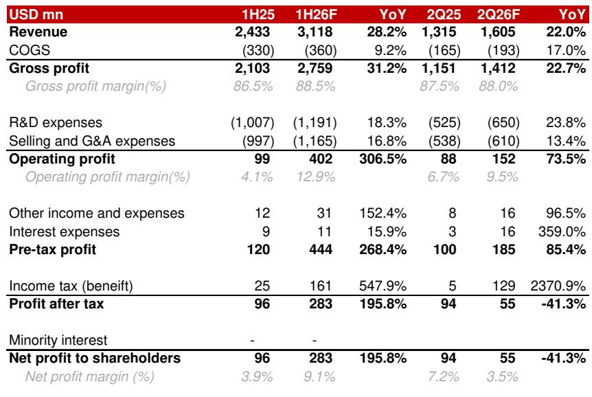
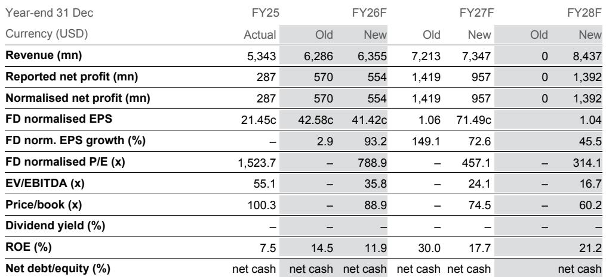
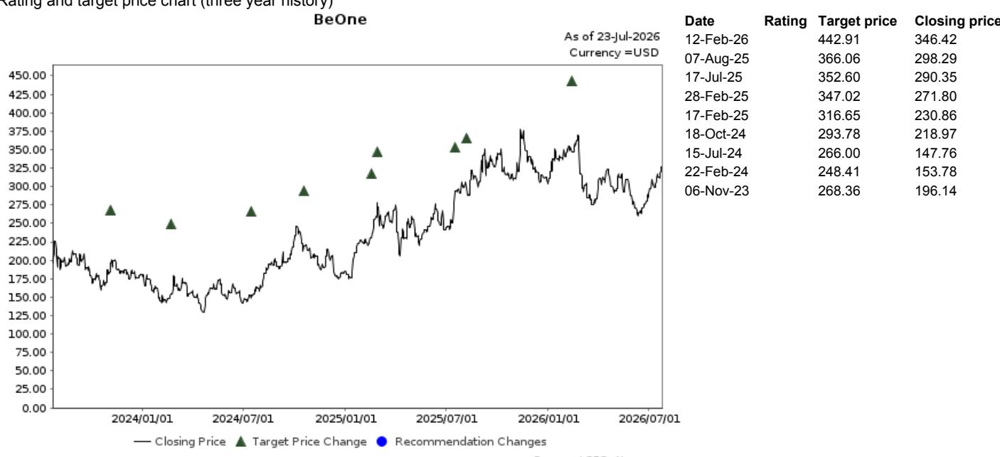

# NOM：BeOne 2Q26F预览与FY26F预测调整

这份NOM研报的核心判断是：BeOne在2Q26F的收入增长路径清晰，但一次性税款支出将使当期净利润同比下滑41%。收入与利润的背离，并非经营出现变化，而是财务节奏问题，隐含对下半年及全年经营目标的信心。

## 1. 2Q26F收入增长主要由泽布替尼驱动，中国替雷利珠单抗贡献稳定增量

NOM预计BeOne 2Q26F收入达16亿美元，同比增长22%。其中，核心产品泽布替尼贡献11亿美元，同比增长20%，与1Q26的11亿美元持平，报告认为这主要受季节性因素影响。中国市场的替雷利珠单抗预计实现2.13亿美元，同比增长10%。其他产品收入预计维持在1.5亿美元，环比持平。收入结构显示，泽布替尼仍是增长引擎，其全球商业化进展是2H26F收入能否达到32亿美元的关键。

> **KC评论：** 泽布替尼单季收入环比持平，但同比仍有20%增长，说明其全球市场份额仍在扩大。读者可以关注的是，这种增速能否在2H26F维持，尤其是在面临同类产品竞争时。

## 2. 毛利率微升与经营费用控制下，经营利润增长74%，但税款支出使净利润转降

报告预计2Q26F毛利率为88%，同比提升0.5个百分点，主要受益于产品组合变化。经营费用预计为13亿美元，同比增长19%。经营利润因此达到1.52亿美元，同比增长74%。然而，由于一笔1.29亿美元的补充税款支出（报告在另一份快报中已披露），净利润预计仅为5500万美元，同比下降41%。这笔税款是一次性支出，不影响公司核心盈利能力。

## 3. 2H26F收入与净利润预计恢复增长，全年管理层目标仍有望实现

NOM预计2H26F收入为32亿美元，同比增长11%；净利润为2.71亿美元，同比增长42%。这一预测基于泽布替尼在全球市场的稳定销售增长。报告认为，BeOne有望实现管理层设定的全年收入63-65亿美元、毛利率在80%以上、GAAP经营利润7.5-8.5亿美元的目标。2H26F的利润恢复，将验证公司经营节奏的可持续性。

## 公司情况更新，隐含约39%上行空间

NOM基于DCF模型（WACC 10.6%，终端增长率4.0%）。当前报价326.77美元，隐含约39.2%的上行空间。报告小幅调整了FY26F收入与净利润预测，收入上调1.1%，净利润下调2.7%。FY26F净利润预测比彭博一致预期低12.4%，差异主要来自对税款支出的判断。读者可以关注2H26F商业化进展及管线临床数据，以验证估值逻辑。

For informational purposes only. Portions may be generated, translated, summarized, or edited with AI assistance based on source materials and may contain omissions or errors. Please verify independently. This is not investment, legal, tax, accounting, or other professional advice.

For informational purposes only. Portions may be generated, translated, summarized, or edited with AI assistance based on source materials and may contain omissions or errors. Please verify independently. This is not investment, legal, tax, accounting, or other professional advice.

