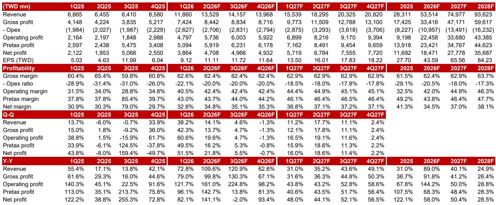
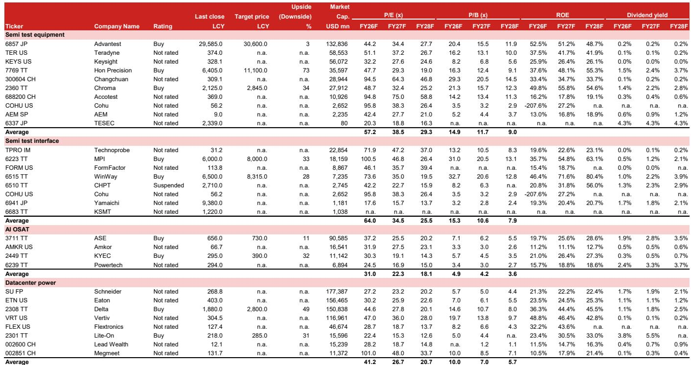
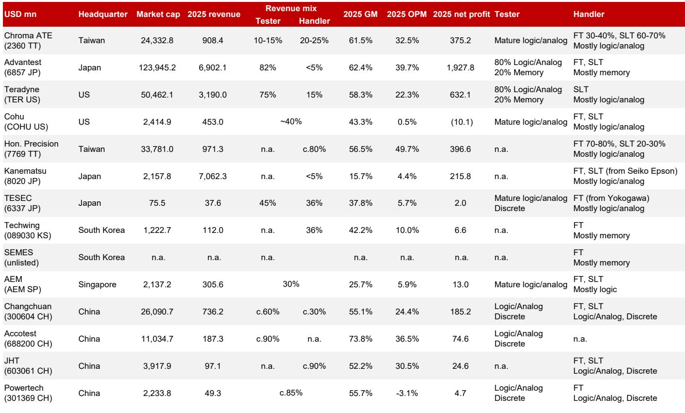

# NOM：ChromaATE，AI芯片测试与电源架构升级

这份NOM研究笔记的核心观察是：Chroma 正同时受益于 AI/HPC 芯片测试复杂度提升和 AI 服务器电源架构向高压直流（HVDC）迁移这两条结构性主线。报告认为，公司未来三年净利润复合增长率可达 39%，其系统级测试（SLT）设备将随英伟达 GPU 平台迭代进入新一轮升级周期，而 CPO 测试需求则构成更长期的增量。

## 1. SLT 设备受益于 AI 芯片平台迭代与散热要求升级

报告指出，Chroma 的 SLT 测试设备将受益于 AI/HPC 芯片的平台更新节奏。一个关键节点是英伟达计划在 2028 年采用 GPU-on-GPU 的 SoIC 封装方案，这一变化对热控制提出更严格要求，将直接推升测试设备的平均售价。NOM认为，台积电和 OSAT 厂商在 2.5D/CoWoS 产能上的持续投入，以及 AI 芯片 OSAT 在测试环节的支出增加，都是 Chroma SLT 业务的正面信号。报告测算，半导体/光子学测试业务在 2025-2028 年间的营收复合增长率可达 68%。

> **KC观察：** 这里的关键不是测试设备数量增加，而是每台设备的单价在上升。英伟达封装方案的变化意味着测试环节的技术门槛提高，设备商有更强的议价能力。报告隐含的判断是，SLT 设备正从可选支出变为必需支出。

## 2. HVDC 电源架构迁移路径保持完整，测试复杂度提升

市场近期对 HVDC 采用速度存在关注，但报告认为这一趋势并未改变。一家美国头部云服务商计划从 2026 年下半年开始采用 ±400V 直流供电，先应用于 VR200 机架，再扩展至其自研 ASIC 机架。对 Chroma 而言，更复杂的电源架构意味着测试环节的工作量增加。报告预计，其自动测试系统（ATS）业务在 2025-2028 年间的营收复合增长率可达 43%。

## 3. 营收结构变化驱动利润率持续改善

从财务数据看，Chroma 的营收结构正在发生实质性变化。2025 年营收为 283 亿新台币，NOM预计 2026 年将增至 535 亿，2028 年达到 936 亿。毛利率从 2025 年的 61.5% 逐步提升至 2028 年的 63.7%，EBITDA 利润率则从 35.5% 升至 48.5%。利润率改善的驱动力来自高毛利的半导体测试业务占比提升，以及 ATS 业务中 HVDC 相关产品的附加值更高。报告还显示，公司自 2025 年起已处于净现金状态，且自由现金流从 2025 年的 30 亿新台币增至 2028 年的 264 亿。

## 4. 估值框架：以 2027-2028 年平均 EPS 为基准

报告采用 38 倍 2027-2028 年平均每股收益作为估值基准，这一倍数处于 Chroma 历史 14-58 倍交易区间的上沿。NOM认为，考虑到公司未来三年 39% 的净利润复合增长率，这一估值合理。作为参照，半导体后端设备/测试接口厂商的 2027 年预期市盈率中位数为 37 倍，数据中心电源同行的中位数为 27 倍。报告同时列出了主要节奏变化不确定性，包括 CoWoS 和封装测试产能扩张节奏变化、AI 芯片客户产品迭代延迟，以及来自其他国际测试设备商的竞争加剧。

For informational purposes only. Portions may be generated,translated,summarized,or edited with AI assistance based on source materials and may contain omissions or errors. Please verify independently. This is not investment,legal,tax,accounting,or other professional advice.

For informational purposes only. Portions may be generated,translated,summarized,or edited with AI assistance based on source materials and may contain omissions or errors. Please verify independently. This is not investment,legal,tax,accounting,or other professional advice.

