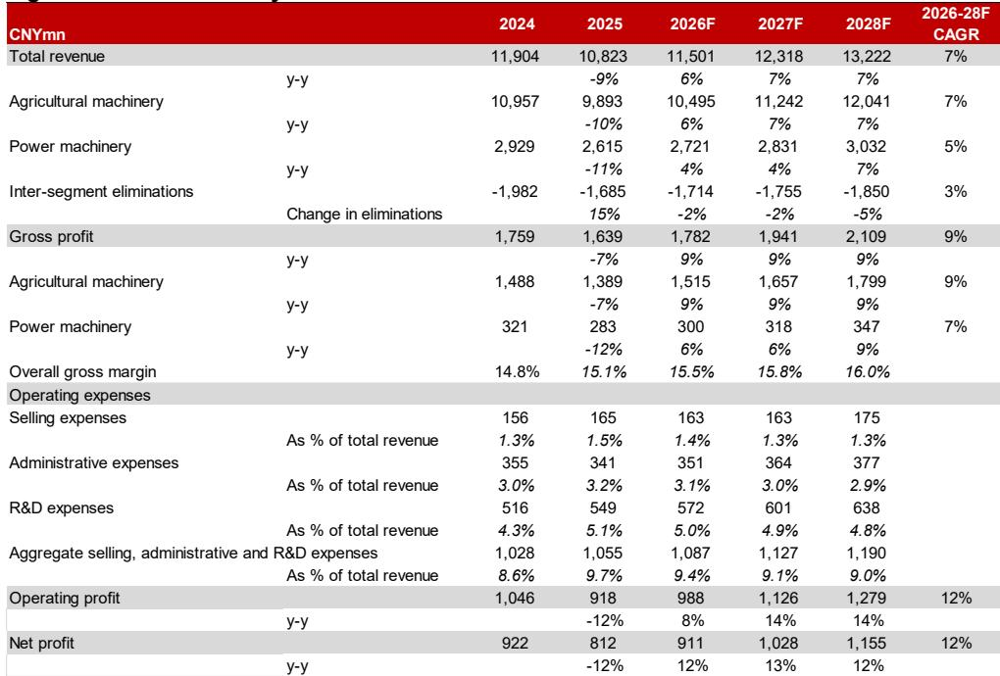
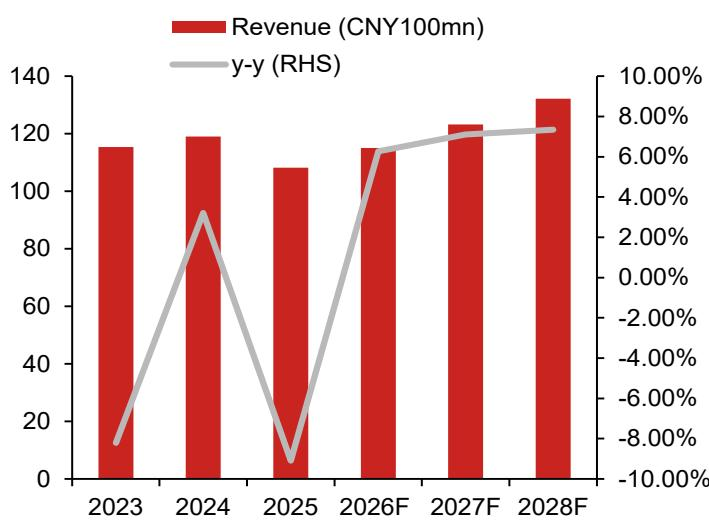
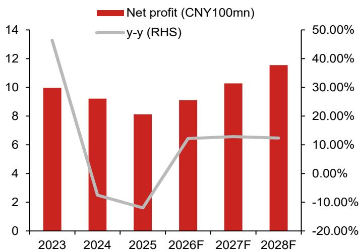

# 产品结构升级与成本控制驱动利润增长，国内农机市场平稳运行

第一拖拉机2025年拖拉机销量从2023年的72,400台降至63,700台，但同期平均售价从14.6万元升至15.52万元。销量下降而单价上升这一分化，反映了这家中国历史最悠久的农机企业正在推进的战略转型。公司并非追求销售更多拖拉机，而是致力于制造更优质的拖拉机。财务数据显示这一策略正在见效：2025年毛利率同比提升0.37个百分点至15.15%，2026年第一季度进一步上升0.63个百分点至16.54%，尽管国内中低马力拖拉机市场竞争激烈。第一拖拉机的利润增长现已结构性依赖于产品组合优化与价值链成本管控，而非销量回升。

这一区别之所以重要，是因为国内农机市场短期内不会出现大幅增长。小型拖拉机需求平稳，竞争激烈，补贴驱动的购买周期导致收入波动。然而，第一拖拉机2025年至2028年期间正常化净利润预计将以12.48%的复合年增长率增长，几乎是同期6.90%收入复合增长率的近两倍。收入增长与利润增长之间的差距是关注该公司的主要逻辑——这意味着利润率扩张而非收入加速将驱动回报表现。对于习惯将农机视为周期性销量业务的观察者而言，这代表了盈利模式的根本性变化。

截至2026年7月20日的一个月内，该公司报价表现领先市场29.3个百分点，反映出市场对2026年上半年业绩的预期改善以及向低估值领域的轮动。以2026年预期盈利16.9倍计算，估值仍低于该股五年平均20倍的市盈率，表明若利润率故事持续兑现，存在估值扩张空间。但更关键的问题是盈利轨迹本身是否可持续。

## 产品结构升级正在改变中国拖拉机制造业传统的销量-利润率权衡

数十年来，中国拖拉机制造商主要在低中马力领域进行价格竞争，这些领域利润率薄、差异化小。第一拖拉机正有意识地退出这一竞争模式。公司2025年年报显示，其已构建覆盖220至450马力的高端拖拉机产品线，涵盖多挡动力换挡、无级变速和混合动力三大技术平台。这些并非渐进式改进。无级变速和全动力换挡系统代表了技术飞跃，改变了公司相对于国内同行和国际参与者的竞争地位。

财务影响在定价数据中清晰可见。2023年至2025年间，第一拖拉机拖拉机销量下降12%，但平均售价上升6.3%。这并非一次性产品发布驱动的暂时现象，而是销售结构向高马力机型结构性转变的体现，这些机型价格更高且利润率更优。公司毛利率从2024年的14.8%升至2025年的15.1%，预计到2028年将达到16.0%。以2028年预期收入水平计算，每个百分点的利润率扩张将增加约1.08亿元毛利润，形成独立于销量增长的复合效应。

战略意图明确：第一拖拉机正在基于技术复杂性而非规模构建护城河。低马力拖拉机日益同质化，公司正在这些领域将市场份额让给愿意进行价格竞争的对手。在高马力领域，由于进入壁垒包括专有传动技术、电子控制系统和售后服务网络，第一拖拉机面临的价格压力较小，能够维持甚至改善利润率。这与历史上中国工业设备企业常见的以量取胜策略截然相反。

## 海外拓展提供第二增长引擎，周期性更弱、利润率更高

国内农机需求受政府补贴计划、农作物价格和土地整合进程影响较大，形成波动性较强、政策敏感的收入基础。相比之下，海外市场由长期结构性趋势驱动：全球粮食需求上升、农业劳动力供给趋紧、发展中经济体机械化需求增长。根据研究机构数据，全球农机设备市场预计将从2026年的1,838.7亿美元扩大至2032年的2,569.9亿美元，复合年增长率约5.70%。这是一个稳定、多年的增长轨迹，基本独立于国内政策周期。

第一拖拉机海外收入从2021年至2025年以近23%的复合年增长率增长，2025年贡献总收入的11%。公司海外分销网络在"十四五"期间经历了三个阶段：初步建设、规模扩张和当前的质量提升。借助中国机械工业集团旗下其他公司的出口协同效应，第一拖拉机获得了独立出口商需要多年才能建立的渠道、物流基础设施和客户关系。研究预测，海外收入到2028年将占总收入的14%，并在2026-2028年期间贡献约26%的总增量收入。

海外销售的利润率可能优于国内销售，原因有二：首先，出口市场较少出现压低国内低马力领域利润率的同类价格战；其次，第一拖拉机出口的产品往往是高马力机型，定价更高。随着海外占比提升，将拉高综合毛利率，强化国内市场已在进行的产品结构升级。海外扩张不仅是销量故事，更是利润率故事。

## 观察框架：三个信号判断利润率扩张逻辑是否在轨

关注第一拖拉机的核心假设是未来三年利润增长将超过收入增长。这一判断无法仅通过季度收入数据验证。观察者需要框架来追踪利润率扩张的驱动因素是否完好。三个具体信号提供了最清晰的判断依据。

第一个信号是平均售价相对于销量的走势。如果平均售价增长持续超过或至少跟上销量下降，表明产品结构向高马力机型转移按计划进行。销量和平均售价同时下降的季度将是警示信号，表明价格竞争正在蔓延至高马力领域或公司高端机型库存周转困难。相反，销量持平或下降但平均售价上升的季度，确认结构升级仍是主导动态。

第二个信号是拖拉机业务本身的毛利率趋势，而非公司综合毛利率。公司整体毛利率受零部件、服务和其他利润率不同的业务影响。拖拉机毛利率是衡量高端策略是否奏效的最纯粹指标。研究显示，2025年毛利率提升0.37个百分点，2026年第一季度提升0.63个百分点。观察者应关注随着公司扩大无级变速和动力换挡产品线，这一改善速度是加快还是放缓。

第三个信号是海外收入占比及其对毛利润的贡献。海外收入从2021年至2025年以23%的复合年增长率增长，但基数较低。关键问题是海外收入占比能否从11%加速向2028年14%的目标迈进。每个百分点的海外占比提升对利润的贡献不成比例，因为出口利润率更高。如果海外收入增长放缓至个位数，利润率扩张逻辑将失去最有力的杠杆之一。

## 盈利模式已从销量驱动转向结构驱动，估值尚未完全反映这一变化

第一拖拉机以2026年预期盈利16.9倍交易，低于其五年平均20倍。如果将其视为面临国内平稳市场的周期性拖拉机制造商，这一折价可以理解。但这种描述日益过时。第一拖拉机的盈利正变得对拖拉机销量敏感度降低，而对产品结构、成本管控和海外扩张敏感度提高。这些是结构性因素，而非周期性因素。

研究预计，正常化每股盈利将从2025年的0.63元增长至2026年的0.72元、2027年的0.82元和2028年的0.94元。这代表三年复合年增长率14.3%，而收入增长约为其一半。隐含的经营杠杆显著。息税前利润预计从2025年占收入的6.2%升至2028年的9.5%，扩张330个基点，以2028年收入水平计算相当于增加4.23亿元息税前利润。公司同时拥有净现金头寸并产生强劲自由现金流，自由现金流预计从2025年的7.28亿元升至2028年的15.4亿元。

主要下行风险真实存在但可控。国内需求变化可能加速销量下降超过结构改善的抵消能力。高马力领域更激烈的价格竞争将直接压缩利润率。海外扩张放缓将移除关键增长动力。高端产品开发延迟将削弱整个结构升级逻辑。这些风险并非假设，但已反映在当前估值中。该股相对于历史平均水平的折价，恰恰源于市场对利润率故事能否持续存在不确定性。

秋收采购季节和农机补贴政策落地将提供近期催化剂。但长期逻辑并不依赖于任何单一季度的补贴驱动需求，而是取决于第一拖拉机能否每年持续以更少销量获取更高收入，同时向利润率更高、竞争更缓和的海外市场扩张。2025年和2026年第一季度的证据表明这可以实现。未来三年将决定这一证据能否成为趋势。

*仅供参考。部分内容可能基于源材料通过AI辅助生成、翻译、总结或编辑，可能存在遗漏或错误。请独立核实。本文不构成专业建议。*

仅供参考。部分内容可能基于源材料通过AI辅助生成、翻译、总结或编辑，可能存在遗漏或错误。请独立核实。本文不构成专业建议。

