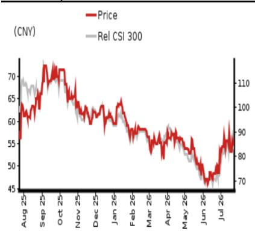

EQUITY: HEALTH CARE & PHARMACEUTICALS

## 2Q26F preview and FY26F forecast revisions

Innovative drugs sales growth offsets high collaboration revenue base in 2Q25, while investment gains help earnings register double-digit growth

## We estimate 2Q26F sales/earnings rose 1%/11% y-y

We estimate Hengrui's 2Q26F revenue rose 1% y-y to CNY8.6bn. We forecast: 1) drugs sales registered 10% y-y growth in 2Q26 to CNY7.8bn, factoring in a continued ramp-up of innovative drugs sales that offset the decline in generics drugs amid current market conditions; and 2) collaboration revenue contributed c.CNY800mn, in comparison to a high base of CNY1.4bn in 2Q25.

On the margins front, we forecast a lower gross margin at 85.9% (-1.1pp y-y), assuming c.84.5% drugs' gross margin (on par with 1Q26's) and 100% margin for out-licensing revenue, but a higher operating margin of 31.2% (0.5pp y-y) mainly on lower selling expenses. Along with non-recurring income (increase in fair value of Hengrui's overseas New-Co valuation), we expect 2Q26F net profit to shareholders to be a record CNY2.9bn (+11% y-y).

For 2H26F, we estimate Hengrui's top line will rise by 10.2% y-y to CNY17.5bn, owing to: 1) accelerated innovative drugs sales growth; and 2) our estimate of CNY1.7bn out-licensing revenue; and we estimate 2H26F net profit will book CNY4.0bn (+22% y-y).

Maintain Buy rating and lower TP to CNY67.98 from CNY72.38, implying 23.8% upside We lower FY26F revenue/earnings estimates by 7.8%/18.4%, to reflect a slower-than-expected pace of out-licensing revenue recognition. Our FY26F revenue/earnings estimates is 4.7%/1.5% lower than Bloomberg consensus.

We maintain our Buy rating and lower our DCF-based (assuming unchanged WACC of 8.7% and terminal growth rate of 5.0%) TP to CNY67.98 from CNY72.38. The stock currently trades at 38.4x FY26F fully diluted EPS of CNY1.43.

Source: Company data, NOM estimates

<table><tr><td>Year-end 31 Dec</td><td colspan="2">FY25</td><td colspan="2">FY26F</td><td colspan="2">FY27F</td><td colspan="2">FY28F</td></tr><tr><td>Currency (CNY)</td><td>Actual</td><td>Old</td><td>New</td><td>Old</td><td>New</td><td>Old</td><td>New</td><td></td></tr><tr><td>Revenue (mn)</td><td>31,629</td><td>37,169</td><td>34,252</td><td>41,432</td><td>38,699</td><td>0</td><td>44,433</td><td></td></tr><tr><td>Reported net profit (mn)</td><td>7,711</td><td>11,159</td><td>9,120</td><td>12,185</td><td>10,238</td><td>0</td><td>12,174</td><td></td></tr><tr><td>Normalised net profit (mn)</td><td>7,711</td><td>11,159</td><td>9,120</td><td>12,185</td><td>10,238</td><td>0</td><td>12,174</td><td></td></tr><tr><td>FD normalised EPS</td><td>1.21</td><td>1.75</td><td>1.43</td><td>1.91</td><td>1.60</td><td></td><td>1.91</td><td></td></tr><tr><td>FD norm. EPS growth (%)</td><td>22.1</td><td>39.3</td><td>18.3</td><td>9.2</td><td>12.2</td><td></td><td>18.9</td><td></td></tr><tr><td>FD normalised P/E (x)</td><td>45.4</td><td>-</td><td>38.4</td><td>-</td><td>34.2</td><td>-</td><td>28.8</td><td></td></tr><tr><td>EV/EBITDA (x)</td><td>34.9</td><td>-</td><td>30.5</td><td>-</td><td>25.0</td><td>-</td><td>20.3</td><td></td></tr><tr><td>Price/book (x)</td><td>5.7</td><td>-</td><td>5.0</td><td>-</td><td>4.3</td><td>-</td><td>-</td><td></td></tr><tr><td>Dividend yield (%)</td><td>-</td><td>-</td><td>-</td><td>-</td><td>-</td><td>-</td><td>-</td><td></td></tr><tr><td>ROE (%)</td><td>14.4</td><td>16.3</td><td>13.9</td><td>15.2</td><td>13.6</td><td></td><td>14.0</td><td></td></tr><tr><td>Net debt/equity (%)</td><td>net cash</td><td>net cash</td><td>net cash</td><td>net cash</td><td>net cash</td><td></td><td>net cash</td><td></td></tr></table>

Rating Remains Buy

Target price
Reduced from
CNY 72.38
CNY 67.98

Closing price
23 July 2026
CNY 54.91

<table><tr><td>Implied upside</td><td>+23.8%</td></tr></table>

<table><tr><td>Market Cap (USD mn)</td><td>51,740.2</td></tr><tr><td>ADT (USD mn)</td><td>745.5</td></tr></table>

## Relative performance chart

  
Source: LSEG, NOM

## Research Analysts

China Health Care &

Pharmaceuticals

Jialin Zhang, CFA, CPA - NIHK
jialin.zhang@NOM.com
+852 2252 6134

Cashflow statement (CNYmn)  
Key data on Hengrui

<table><tr><td>Performance(%)</td><td>1M</td><td>3M</td><td>12M</td><td></td><td></td></tr><tr><td>Absolute (CNY)</td><td>12.1</td><td>-2.6</td><td>-3.9</td><td>M cap (USDmn)</td><td>51,740.2</td></tr><tr><td>Absolute (USD)</td><td>12.3</td><td>-1.8</td><td>1.7</td><td>Free float (%)</td><td>46.2</td></tr><tr><td>Rel to CSI 300</td><td>16.0</td><td>-1.4</td><td>-18.6</td><td>3-mth ADT (USDmn)</td><td>745.5</td></tr></table>

<table><tr><td colspan="6">Income statement (CNYmn)</td></tr><tr><td>Year-end 31 Dec</td><td>FY24</td><td>FY25</td><td>FY26F</td><td>FY27F</td><td>FY28F</td></tr><tr><td>Revenue</td><td>27,985</td><td>31,629</td><td>34,252</td><td>38,699</td><td>44,433</td></tr><tr><td>Cost of goods sold</td><td>-4,106</td><td>-4,626</td><td>-5,257</td><td>-5,664</td><td>-6,512</td></tr><tr><td>Gross profit</td><td>23,879</td><td>27,003</td><td>28,995</td><td>33,035</td><td>37,921</td></tr><tr><td>SG&amp;A</td><td>-17,475</td><td>-18,874</td><td>-19,801</td><td>-22,101</td><td>-24,842</td></tr><tr><td>Employee share expense</td><td></td><td></td><td></td><td></td><td></td></tr><tr><td>Operating profit</td><td>6,404</td><td>8,129</td><td>9,194</td><td>10,934</td><td>13,079</td></tr><tr><td>EBITDA</td><td>7,046</td><td>8,883</td><td>9,945</td><td>11,755</td><td>13,979</td></tr><tr><td>Depreciation</td><td>-575</td><td>-639</td><td>-647</td><td>-687</td><td>-733</td></tr><tr><td>Amortisation</td><td>-67</td><td>-114</td><td>-104</td><td>-133</td><td>-167</td></tr><tr><td>EBIT</td><td>6,404</td><td>8,129</td><td>9,194</td><td>10,934</td><td>13,079</td></tr><tr><td>Net interest expense</td><td>573</td><td>407</td><td>419</td><td>432</td><td>445</td></tr><tr><td>Associates &amp; JCEs</td><td></td><td></td><td></td><td></td><td></td></tr><tr><td>Other income</td><td>193</td><td>171</td><td>685</td><td>193</td><td>222</td></tr><tr><td>Earnings before tax</td><td>7,170</td><td>8,708</td><td>10,298</td><td>11,560</td><td>13,746</td></tr><tr><td>Income tax</td><td>-833</td><td>-991</td><td>-1,172</td><td>-1,315</td><td>-1,564</td></tr><tr><td>Net profit after tax</td><td>6,337</td><td>7,717</td><td>9,127</td><td>10,245</td><td>12,182</td></tr><tr><td>Minority interests</td><td>0</td><td>-6</td><td>-6</td><td>-7</td><td>-8</td></tr><tr><td>Other items</td><td></td><td></td><td></td><td></td><td></td></tr><tr><td>Preferred dividends</td><td></td><td></td><td></td><td></td><td></td></tr><tr><td>Normalised NPAT</td><td>6,337</td><td>7,711</td><td>9,120</td><td>10,238</td><td>12,174</td></tr><tr><td>Extraordinary items</td><td></td><td></td><td></td><td></td><td></td></tr><tr><td>Reported NPAT</td><td>6,337</td><td>7,711</td><td>9,120</td><td>10,238</td><td>12,174</td></tr><tr><td>Dividends</td><td></td><td></td><td></td><td></td><td></td></tr><tr><td>Transfer to reserves</td><td>6,337</td><td>7,711</td><td>9,120</td><td>10,238</td><td>12,174</td></tr><tr><td>Valuations and ratios</td><td></td><td></td><td></td><td></td><td></td></tr><tr><td>Reported P/E (x)</td><td>55.4</td><td>45.4</td><td>38.4</td><td>34.2</td><td>28.8</td></tr><tr><td>Normalised P/E (x)</td><td>55.4</td><td>45.4</td><td>38.4</td><td>34.2</td><td>28.8</td></tr><tr><td>FD normalised P/E (x)</td><td>55.4</td><td>45.4</td><td>38.4</td><td>34.2</td><td>28.8</td></tr><tr><td>Dividend yield (%)</td><td>-</td><td>-</td><td>-</td><td>-</td><td>-</td></tr><tr><td>Price/cashflow (x)</td><td>47.3</td><td>31.2</td><td>41.2</td><td>33.3</td><td>28.4</td></tr><tr><td>Price/book (x)</td><td>7.7</td><td>5.7</td><td>5.0</td><td>4.3</td><td>-</td></tr><tr><td>EV/EBITDA (x)</td><td>46.3</td><td>34.9</td><td>30.5</td><td>25.0</td><td>20.3</td></tr><tr><td>EV/EBIT (x)</td><td>50.9</td><td>38.1</td><td>32.9</td><td>26.9</td><td>21.7</td></tr><tr><td>Gross margin (%)</td><td>85.3</td><td>85.4</td><td>84.7</td><td>85.4</td><td>85.3</td></tr><tr><td>EBITDA margin (%)</td><td>25.2</td><td>28.1</td><td>29.0</td><td>30.4</td><td>31.5</td></tr><tr><td>EBIT margin (%)</td><td>22.9</td><td>25.7</td><td>26.8</td><td>28.3</td><td>29.4</td></tr><tr><td>Net margin (%)</td><td>22.6</td><td>24.4</td><td>26.6</td><td>26.5</td><td>27.4</td></tr><tr><td>Effective tax rate (%)</td><td>11.6</td><td>11.4</td><td>11.4</td><td>11.4</td><td>11.4</td></tr><tr><td>Dividend payout (%)</td><td>0.0</td><td>0.0</td><td>0.0</td><td>0.0</td><td>0.0</td></tr><tr><td>ROE (%)</td><td>14.7</td><td>14.4</td><td>13.9</td><td>13.6</td><td>14.0</td></tr><tr><td>ROA (pretax %)</td><td>25.9</td><td>30.0</td><td>30.8</td><td>34.4</td><td>38.6</td></tr><tr><td>Growth (%)</td><td></td><td></td><td></td><td></td><td></td></tr><tr><td>Revenue</td><td>22.6</td><td>13.0</td><td>8.3</td><td>13.0</td><td>14.8</td></tr><tr><td>EBITDA</td><td>50.1</td><td>26.1</td><td>12.0</td><td>18.2</td><td>18.9</td></tr><tr><td>Normalised EPS</td><td>47.3</td><td>22.1</td><td>18.3</td><td>12.2</td><td>18.9</td></tr><tr><td>Normalised FDEPS</td><td>47.3</td><td>22.1</td><td>18.3</td><td>12.2</td><td>18.9</td></tr></table>

Source: Company data, NOM estimates

<table><tr><td colspan="6">Cashflow statement (CNYmn)</td></tr><tr><td>Year-end 31 Dec</td><td>FY24</td><td>FY25</td><td>FY26F</td><td>FY27F</td><td>FY28F</td></tr><tr><td>EBITDA</td><td>7,046</td><td>8,883</td><td>9,945</td><td>11,755</td><td>13,979</td></tr><tr><td>Change in working capital</td><td>1,122</td><td>2,700</td><td>-1,235</td><td>-413</td><td>-614</td></tr><tr><td>Other operating cashflow</td><td>-746</td><td>-347</td><td>-202</td><td>-828</td><td>-1,038</td></tr><tr><td>Cashflow from operations</td><td>7,423</td><td>11,235</td><td>8,508</td><td>10,515</td><td>12,327</td></tr><tr><td>Capital expenditure</td><td>-1,947</td><td>-2,943</td><td>-1,387</td><td>-1,567</td><td>-1,800</td></tr><tr><td>Free cashflow</td><td>5,475</td><td>8,292</td><td>7,121</td><td>8,947</td><td>10,528</td></tr><tr><td>Reduction in investments</td><td>-102</td><td>0</td><td>0</td><td>0</td><td>0</td></tr><tr><td>Net acquisitions</td><td></td><td></td><td></td><td></td><td></td></tr><tr><td>Dec in other LT assets</td><td>-2,335</td><td>-2,094</td><td>-435</td><td>-456</td><td>-478</td></tr><tr><td>Inc in other LT liabilities</td><td>214</td><td>1,289</td><td>85</td><td>89</td><td>94</td></tr><tr><td>Adjustments</td><td>2,258</td><td>1,007</td><td>-56</td><td>-59</td><td>-62</td></tr><tr><td>CF after investing acts</td><td>5,511</td><td>8,495</td><td>6,715</td><td>8,522</td><td>10,082</td></tr><tr><td>Cash dividends</td><td></td><td></td><td></td><td></td><td></td></tr><tr><td>Equity issue</td><td>0</td><td>0</td><td>10,352</td><td>0</td><td>0</td></tr><tr><td>Debt issue</td><td>-800</td><td>-4</td><td>0</td><td>0</td><td>0</td></tr><tr><td>Convertible debt issue</td><td></td><td></td><td></td><td></td><td></td></tr><tr><td>Others</td><td>-166</td><td>7,649</td><td>-10,144</td><td>216</td><td>224</td></tr><tr><td>CF from financial acts</td><td>-966</td><td>7,645</td><td>208</td><td>216</td><td>224</td></tr><tr><td>Net cashflow</td><td>4,545</td><td>16,139</td><td>6,923</td><td>8,738</td><td>10,307</td></tr><tr><td>Beginning cash</td><td>20,272</td><td>24,816</td><td>40,955</td><td>47,878</td><td>56,616</td></tr><tr><td>Ending cash</td><td>24,816</td><td>40,955</td><td>47,878</td><td>56,616</td><td>66,923</td></tr><tr><td>Ending net debt</td><td>-24,239</td><td>-40,955</td><td>-47,878</td><td>-56,616</td><td>-66,923</td></tr><tr><td colspan="6">Balance sheet (CNYmn)</td></tr><tr><td>As at 31 Dec</td><td>FY24</td><td>FY25</td><td>FY26F</td><td>FY27F</td><td>FY28F</td></tr><tr><td>Cash &amp; equivalents</td><td>24,816</td><td>40,955</td><td>47,878</td><td>56,616</td><td>66,923</td></tr><tr><td>Marketable securities</td><td>0</td><td>0</td><td>0</td><td>0</td><td>0</td></tr><tr><td>Accounts receivable</td><td>4,915</td><td>5,147</td><td>5,940</td><td>6,393</td><td>6,975</td></tr><tr><td>Inventories</td><td>2,417</td><td>2,878</td><td>2,877</td><td>3,038</td><td>3,421</td></tr><tr><td>Other current assets</td><td>3,167</td><td>2,510</td><td>2,570</td><td>2,632</td><td>2,696</td></tr><tr><td>Total current assets</td><td>35,315</td><td>51,490</td><td>59,266</td><td>68,679</td><td>80,015</td></tr><tr><td>LT investments</td><td></td><td></td><td></td><td></td><td></td></tr><tr><td>Fixed assets</td><td>5,132</td><td>5,830</td><td>5,869</td><td>5,956</td><td>6,112</td></tr><tr><td>Goodwill</td><td></td><td></td><td></td><td></td><td></td></tr><tr><td>Other intangible assets</td><td>1,192</td><td>1,956</td><td>2,537</td><td>3,178</td><td>3,900</td></tr><tr><td>Other LT assets</td><td>8,496</td><td>10,590</td><td>11,025</td><td>11,481</td><td>11,959</td></tr><tr><td>Total assets</td><td>50,136</td><td>69,867</td><td>78,697</td><td>89,294</td><td>101,985</td></tr><tr><td>Short-term debt</td><td>0</td><td>0</td><td>0</td><td>0</td><td>0</td></tr><tr><td>Accounts payable</td><td>1,967</td><td>2,270</td><td>1,765</td><td>1,902</td><td>2,186</td></tr><tr><td>Other current liabilities</td><td>1,666</td><td>4,099</td><td>4,222</td><td>4,348</td><td>4,479</td></tr><tr><td>Total current liabilities</td><td>3,634</td><td>6,369</td><td>5,987</td><td>6,250</td><td>6,665</td></tr><tr><td>Long-term debt</td><td>0</td><td>0</td><td>0</td><td>0</td><td>0</td></tr><tr><td>Convertible debt</td><td></td><td></td><td></td><td></td><td></td></tr><tr><td>Other LT liabilities</td><td>412</td><td>1,701</td><td>1,786</td><td>1,876</td><td>1,969</td></tr><tr><td>Total liabilities</td><td>4,045</td><td>8,070</td><td>7,773</td><td>8,126</td><td>8,635</td></tr><tr><td>Minority interest</td><td>570</td><td>525</td><td>531</td><td>538</td><td>546</td></tr><tr><td>Preferred stock</td><td></td><td></td><td></td><td></td><td></td></tr><tr><td>Common stock</td><td>6,379</td><td>6,637</td><td>6,637</td><td>6,637</td><td>6,637</td></tr><tr><td>Retained earnings</td><td></td><td></td><td></td><td></td><td></td></tr><tr><td>Proposed dividends</td><td></td><td></td><td></td><td></td><td></td></tr><tr><td>Other equity and reserves</td><td>39,141</td><td>54,635</td><td>63,755</td><td>73,993</td><td>86,167</td></tr><tr><td>Total shareholders&#x27; equity</td><td>45,520</td><td>61,272</td><td>70,393</td><td>80,630</td><td>92,804</td></tr><tr><td>Total equity &amp; liabilities</td><td>50,136</td><td>69,867</td><td>78,697</td><td>89,294</td><td>101,985</td></tr><tr><td>Liquidity (x)</td><td></td><td></td><td></td><td></td><td></td></tr><tr><td>Current ratio</td><td>9.72</td><td>8.08</td><td>9.90</td><td>10.99</td><td>12.00</td></tr><tr><td>Interest cover</td><td>-</td><td>-</td><td>-</td><td>-</td><td>-</td></tr><tr><td>Leverage</td><td></td><td></td><td></td><td></td><td></td></tr><tr><td>Net debt/EBITDA (x)</td><td>net cash</td><td>net cash</td><td>net cash</td><td>net cash</td><td>net cash</td></tr><tr><td>Net debt/equity (%)</td><td>net cash</td><td>net cash</td><td>net cash</td><td>net cash</td><td>net cash</td></tr><tr><td>Per share</td><td></td><td></td><td></td><td></td><td></td></tr><tr><td>Reported EPS (CNY)</td><td>99.03c</td><td>1.21</td><td>1.43</td><td>1.60</td><td>1.91</td></tr><tr><td>Norm EPS (CNY)</td><td>99.03c</td><td>1.21</td><td>1.43</td><td>1.60</td><td>1.91</td></tr><tr><td>FD norm EPS (CNY)</td><td>99.03c</td><td>1.21</td><td>1.43</td><td>1.60</td><td>1.91</td></tr><tr><td>BVPS (CNY)</td><td>7.14</td><td>9.61</td><td>11.04</td><td>12.64</td><td>-</td></tr><tr><td>DPS (CNY)</td><td>0.00</td><td>0.00</td><td>0.00</td><td>0.00</td><td>-</td></tr><tr><td>Activity (days)</td><td></td><td></td><td></td><td></td><td></td></tr><tr><td>Days receivable</td><td>65.9</td><td>58.1</td><td>59.1</td><td>58.2</td><td>55.1</td></tr><tr><td>Days inventory</td><td>210.3</td><td>208.9</td><td>199.8</td><td>190.6</td><td>181.5</td></tr><tr><td>Days payable</td><td>143.9</td><td>167.2</td><td>140.1</td><td>118.2</td><td>114.9</td></tr><tr><td>Cash cycle</td><td>132.3</td><td>99.8</td><td>118.8</td><td>130.6</td><td>121.7</td></tr></table>

Source: Company data, NOM estimates

## Company profile

Hengrui is a pharmaceutical company engaged in the development and commercialization of innovative and high-quality drugs. It is a well-known supplier of oncology drugs, surgical drugs, and interventional imaging solutions in China. The company spent more than USD6.35bn (c.CNY46 bn) in R&D in recent years. Multiple R&D centers were built around the globe and several subsidiaries were established in the US, EU, Australia and Japan. As of FY24, It has 19 commercialized new molecular entity drugs and 4 other innovative drugs. By end-2024, Hengrui was conducting c.400 clinical trials for more than 90 innovative drug candidates.

## Valuation Methodology

Our target price of CNY67.98 is based on a DCF model assuming WACC of 8.7% and terminal growth of 5%. The benchmark index for the stock is CSI 300.

Risks that may impede the achievement of the target price

Downside risks include: (1) price cuts in next round VBP; (2) valuation premium narrowed and (3) unsuccessful BD and clinical progress;

## ESG

Hengrui is a national pharmaceutical enterprise engaged in the research and promotion of innovative and high-quality drugs. Since its establishment more than 50 years ago, it has stressed the social responsibility of "corporate citizen". Hengrui actively leverages its own advantages and participates in public welfare undertakings, striving to make development results better benefit the people's livelihood and give back to the society. Since 2020, the group has donated c. CNY53mn to promote local medical infrastructure in China.

Fig. 1: Hengrui 1H/2Q26F income statement forecast

<table><tr><td>CNY mn</td><td>1H25</td><td>1H26F</td><td>YoY</td><td>2Q25</td><td>2Q26F</td><td>YoY</td></tr><tr><td>Revenue</td><td>15,761</td><td>16,769</td><td>6.4%</td><td>8,556</td><td>8,629</td><td>0.9%</td></tr><tr><td>COGS</td><td>(2,239)</td><td>(2,369)</td><td>5.8%</td><td>(1,110)</td><td>(1,213)</td><td>9.3%</td></tr><tr><td>Gross profit</td><td>13,522</td><td>14,401</td><td>6.5%</td><td>7,445</td><td>7,415</td><td>-0.4%</td></tr><tr><td>GP margin(%)</td><td>85.8%</td><td>85.9%</td><td></td><td>87.0%</td><td>85.9%</td><td></td></tr><tr><td>R&amp;D expenses</td><td>(3,228)</td><td>(3,376)</td><td>4.6%</td><td>(1,695)</td><td>(1,726)</td><td>1.8%</td></tr><tr><td>G&amp;A expenses</td><td>(1,285)</td><td>(1,282)</td><td>-0.2%</td><td>(699)</td><td>(664)</td><td>-4.9%</td></tr><tr><td>Selling expenses</td><td>(4,389)</td><td>(4,526)</td><td>3.1%</
