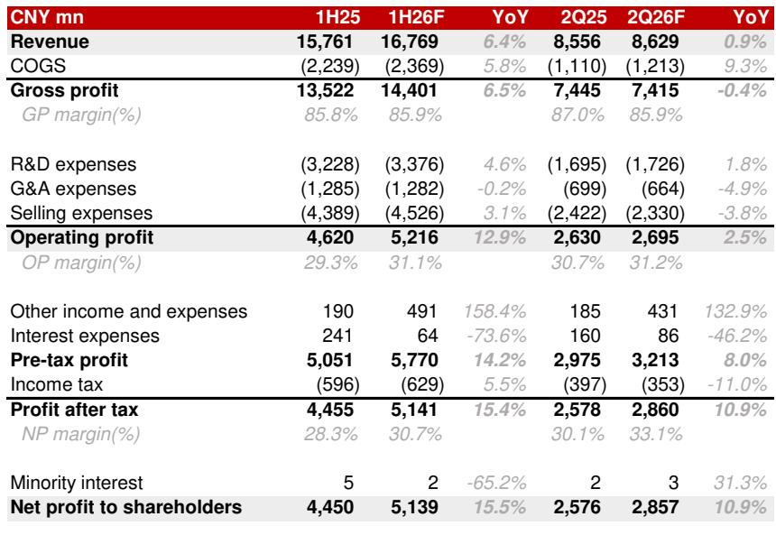
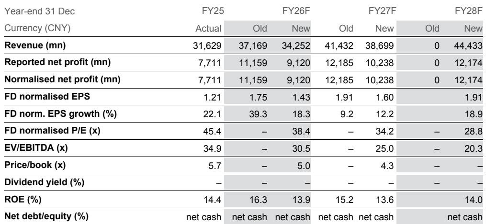
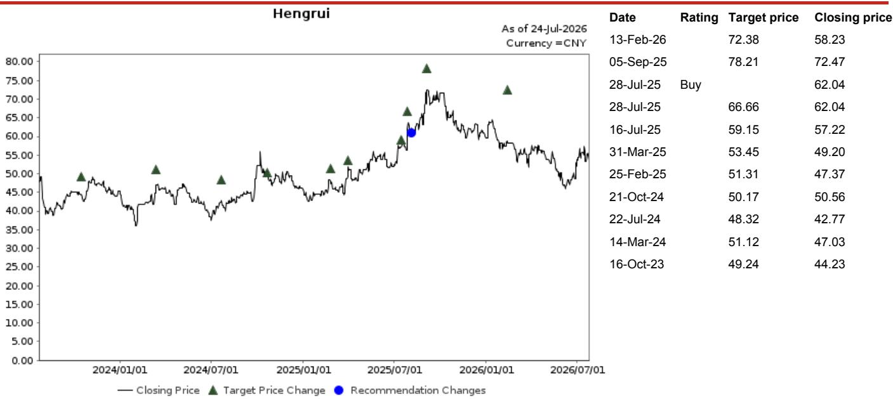

# 恒瑞医药：利润增长与营收扩张脱钩，需要新的估值视角

恒瑞医药有望在2026财年第二季度实现创纪录的季度净利润，但其营收增长几乎持平。公司2026财年第二季度销售额预计仅同比增长1%至86亿元，而归属股东的净利润预计将达到创纪录的29亿元，同比增长11%。个位数营收增长与两位数利润增长之间的这种分化并非暂时现象。它标志着公司盈利驱动因素已发生结构性转变，从依赖销量驱动的药品销售，转向高毛利创新药销售、许可收入和非经常性投资收益的组合。

对于那些长期将恒瑞视为中国领先制药创新者的观察者而言，其含义虽令人不安却无法回避。传统的营收倍数框架已不再能捕捉公司的盈利能力。基于未来现金流具体构成校准的现金流折现模型，如今是相对少见合适的估值方法。该公司报价为远期回报的38.4倍，这一溢价只有在市场正确评估了盈利构成的质量和可持续性（而不仅仅是营收增长率）时才能得到合理解释。

2026年第二季度标志着一个明确的转折点。合作收入（一种高毛利但不稳定的收入流）同比大幅压缩。2025年第二季度强劲的14亿元合作收入带来的基数效应意味着，即使2026年第二季度实现8亿元的合作收入，该细项也同比下降了43%。在此逆风下，整体净利润仍能增长11%，这有力地说明了核心药品业务中潜在的经营杠杆。

## 创新药销售增长正在弥补仿制药的结构性下滑和许可收入的周期性压缩

2026年第二季度的核心经营动态是一种双向替代。一方面，恒瑞的创新药组合预计药品销售额同比增长10%至78亿元。另一方面，仿制药业务持续面临不利的市场环境，包括集中采购带来的价格压力。仿制药的下滑是结构性的，预计将持续。与此同时，合作收入线是周期性的，将根据对外许可里程碑的时间安排逐季波动。

关键洞察在于，创新药销售额现已足够庞大，能够同时吸收仿制药的侵蚀和合作收入的波动。2026年第二季度，创新药约占药品销售总额的90%以及毛利润贡献的绝大部分。这种集中度是一把双刃剑。它在短期内提供了盈利稳定性，但也意味着未来的盈利增长几乎完全依赖于现有创新药组合的持续增长以及管线资产的成功商业化。

毛利率从2025年第二季度的87.0%压缩至2026年第二季度的85.9%，是收入结构变化的直接结果。合作收入具有100%的毛利率，但其在2026年第二季度的相对贡献较低，在数学上拉低了综合毛利率。药品毛利率本身估计约为84.5%，与2026年第一季度水平持平且稳定。核心毛利率的这种稳定性才是真正的信号。它表明创新药组合中的定价压力已得到控制，公司并未被迫采取激进折扣来维持销量。

## 营业利润率扩张由销售费用纪律驱动，而非营收加速

尽管毛利率下降，营业利润率仍从30.7%同比提升至31.2%，这是一个值得关注的财务表现。杠杆在于销售费用。恒瑞似乎在其商业组织中实现了更高的效率，从每单位销售成本中获得了更多收入。这与一个成熟的创新药组合相一致，随着品牌建立和医生认知度提高，推广的边际成本会下降。

研发费用线预计在2026年第二季度为17亿元，继续以1.8%的同比温和增长。这是一个深思熟虑的选择。恒瑞并未处于资本密集型的管线扩张阶段，而是处于商业化阶段。该公司拥有约400项针对90多个创新药候选药物的临床试验，按任何标准衡量都是庞大的管线，但增量研发支出正被严格控制。这种纪律对于一家已建立深厚组合、现在需要最大化已投入资本回报的公司来说是恰当的。

一般及行政费用实际上略有下降，2026年第二季度同比下降4.9%。这表明公司管理架构正在优化，可能通过规模效益和流程效率实现。稳定的研发、下降的管理费用以及提升的销售效率相结合，创造了一种强大的经营杠杆机制，该机制不依赖营收增长即可产生盈利上行空间。

## 非经常性投资收益是真实但有限的盈利贡献者，估值时必须明确分离

2026年第二季度创纪录的净利润包含一项非经常性成分：恒瑞海外New-Co估值公允价值的增加。这是一项账面收益，反映了对持有恒瑞管线资产海外权益的实体进行股权投资的市值计价。它不是经营性现金流，而是金融资产的重估。

根据会计准则，将此项目纳入净利润是合法的，但它造成了观察者必须调整的扭曲。在2026年第二季度，这项非经常性收入对11%的净利润增长有显著贡献。剔除它，来自经营活动的潜在盈利增长会更低，尽管考虑到营业利润率扩张，仍为正值。

风险在于观察者可能锚定于标题盈利数字，并外推一个不可持续的增长速度。公允价值收益本质上是波动的。它们取决于外部融资轮次、市场对生物技术资产的情绪，以及这些海外实体所持特定资产的临床数据读出进展。这些收益在未来季度出现逆转是完全可能的，即使经营业务继续表现良好，也会导致报告净利润急剧减速。

对于基于现金流折现的估值，这些收益应被视为一项独立的、有限的现金流项目，并应用更高的折现率以反映其资本成本和5.0%的终值增长率，这隐含地包含了这一逻辑。该模型对来自药品销售和许可的经常性经营现金流进行估值，而非经常性收益则被排除或大幅折现。

## 2026财年下半年营收轨迹更为有利，但盈利构成仍将是主导变量

2026财年下半年的前景在营收方面更为乐观。受创新药销售加速以及预计17亿元对外许可收入的推动，营收预计同比增长10.2%至175亿元。2026财年下半年净利润预计为40亿元，同比增长22%。

这种加速是受欢迎的，但不应被解读为回归恒瑞早年享有的高增长轨迹。2026财年下半年22%的净利润增长部分源于2025财年下半年的较低基数，部分源于许可收入的时间安排。当剥离许可和非经常性项目后，创新药组合的潜在有机增长率可能在10%至15%之间。

整个2026财年的预测说明了问题。营收预计为343亿元，较2025财年增长8.3%。正常化净利润预计为91亿元，增长18.3%。营收增长与盈利增长之间的差距约为10个百分点。这个差距就是经营杠杆。它是利润率扩张、费用纪律以及许可收入高增量利润率的综合效应。对观察者而言，问题在于这种经营杠杆在2027财年及以后是否可持续。

## 观察者的决策框架：三个变量决定当前估值是否合理

报价为54.91元（2026年7月23日）。该报价为远期回报的38.4倍，这一溢价反映了市场愿意为创新药组合的盈利质量和增长前景支付的价格。这一溢价是否合理取决于三个变量，它们构成了一个连贯的决策框架。

第一个变量是创新药销售增长的轨迹。当前对2026年第二季度10%增长的估计是稳健的，但并不突出。为使估值合理，这一增长速度需要在未来两到三年内加速至15%左右。这种加速取决于现有药物新适应症的成功推出、向中国低线城市市场准入的扩展，以及医院处方集的持续渗透。如果创新药销售增长减速至10%以下，经营杠杆机制就会失效，盈利增长将向营收增长收敛。

第二个变量是销售费用效率的可持续性。2026年第二季度营业利润率的改善是由较低的销售费用驱动的。这不是一次性的优化。它代表了商业模式的结构性转变。随着组合成熟，推广的边际成本应继续下降。如果销售费用占收入的比例再次开始上升（可能由于竞争压力或需要大量推广投入的新药上市），营业利润率扩张将停滞。

第三个变量是非经常性收入线的表现。来自海外New-Co估值的公允价值收益是一个不确定因素。如果这些收益被证明是可重复的，它们将为报告盈利增加有意义的推动力。如果它们逆转，则会造成经营业务必须克服的逆风。出于估值目的，审慎的假设是这些收益在多年期内为零。任何正贡献都是红利，而非基准情形。

应用这一框架，当前38.4倍远期回报的估值看似合理，但前提是创新药增长持续、经营杠杆持续以及许可收入流正常化。上行空间是真实的，但有条件。下行风险主要来自创新药增长减速或药品定价监管环境的不利变化。

该报价过去12个月的相对表现（相对下跌3.9%，相对沪深300指数下跌18.6%）表明，市场已部分消化了围绕盈利构成转变的不确定性。23.8%的盈利质量反映了新盈利结构。未来两个季度将是确认这一观点是否正确关键时期。

*仅供参考。部分内容可能基于源材料通过AI辅助生成、翻译、总结或编辑，可能存在遗漏或错误。请独立核实。本文不构成专业建议。*

仅供参考。部分内容可能基于源材料通过AI辅助生成、翻译、总结或编辑，可能存在遗漏或错误。请独立核实。本文不构成专业建议。

