Amazon Inc. (AMZN)

# 超大规模企业对零售板块的影响

我们下调了对AMZN及零售板块的评级。该板块表现持续受到信用债超比例代表和发行压力的影响。展望下周的财报，由于资本支出增加或经营现金流表现偏弱，自由现金流预期存在下调空间。

Extel调查将于今天（7月24日，星期五）截止！请花一分钟时间，在美国：投资级→零售业和美国：投资级→消费品类别中，为我们投出5星（★★★★★）支持。每一票都很重要。感谢。

- 我们将零售板块评级下调（此前为增持），以反映亚马逊未来发行带来的持续压力，预计其将成为美元市场每年发行两到三次的发行人。
- 我们也将亚马逊的评级下调（此前为标配），因为我们预计其信用表现将落后于板块，尤其是在新发债利差持续走高、认购倍数仍低于平均水平的情况下。
- 我们估计，到2026年底，其资产负债表还有空间增加250-350亿美元的债务（假设可能在美元市场以外再发行约100亿美元，尤其是美元与欧元发行利差目前已可忽略不计）。
- 展望亚马逊下周的财报，我们认为存在资本支出预期上调或经营现金流表现偏弱的风险。在零售方面，市场对份额的关注度依然很高，加上Prime Day的提前效应，可能会对零售利润率表现产生影响。

- 交易思路
  - 在美元债方面，我们建议卖出AMZN 2029年到期4.65%、2032年到期4.7%、2034年到期4.8%、2044年到期4.95%和2052年到期3.95%的债券，因为这些较老年份的债券在供给中保持利差偏紧，有空间向曲线其他部分走阔。

Priya Ohri-Gupta, CFA

+1 212 412 3759

priya.ohrigupta@BARC.com

BCI, US

Teresa Tian

+1 212 526 8973

teresa.tian@BARC.com

BCI, US

本文件面向机构读者，不适用于美国FINRA规则2242下为零售读者准备的债市研究报告所适用的独立性和披露标准。BARC为其自身账户及基于酌情权代表特定客户交易本报告所涵盖的证券。此类交易利益可能与本报告中的建议相反。

- 在欧元债方面，我们建议卖出AMZN 2030年到期3.1%、2032年到期3.35%、2039年到期4.05%和2064年到期4.85%的债券，因为发行空间应会导致其与谷歌（在这些债券中利差相对平坦）的关系向我们的公允价值估计（+10-15bp）走阔。
- 买入AMZN 5年期CDS，因为我们预计持续的发行将导致利差走阔，读者寻求对冲。

EXTEL调查即将截止

请在今年Extel全球固收研究调查中，为我们的行业领先分析师投出5星支持。

立即投票 查看分析师

作为我们近期报告《超大规模企业：利差宽到无法忽视，供给多到难以追逐》的后续，我们研究了亚马逊及其近期发行节奏（与其他超大规模企业一致）如何影响零售板块的表现。

## 亚马逊对零售板块表现的影响

随着亚马逊在美元和欧元投资级零售板块中的占比分别增长至35%和25%，零售板块的构成在美国和欧洲变得更加集中。与我们关于超大规模企业对更广泛市场影响的发现类似，亚马逊的发行一直对零售板块表现构成拖累，导致其过去一年和年初至今相对于信用债的超额回报分别为-89bp和-70bp。剔除亚马逊后，零售板块其余部分相对于信用债的超额回报分别为11bp和3bp。过去三个月，剔除亚马逊的零售板块也落后信用债8bp，主要受5月份的拖累，当时恰逢汽油价格上涨（见图7），且该月亚马逊表现领先。

图1. AMZN已占美元投资级零售板块的35%...
美国投资级零售板块构成（按市值）
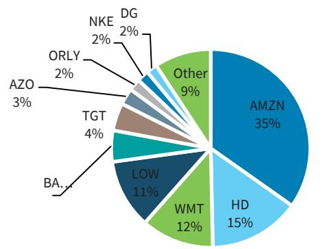
来源：彭博，BARC

图2. ...以及欧元投资级零售板块的25%
WESA % 欧元投资级零售板块构成（按市值）
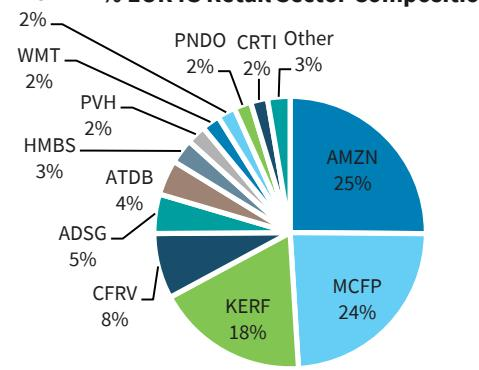
来源：彭博，BARC

图3. AMZN拖累了美元投资级零售板块表现...
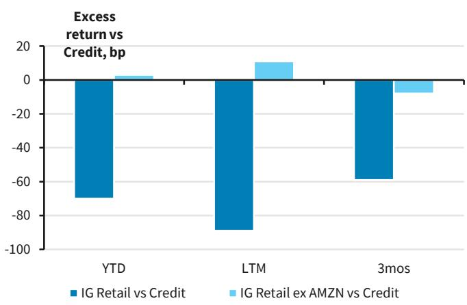
来源：彭博，BARC。

图4. ...但其他发行人在5月和6月也表现落后
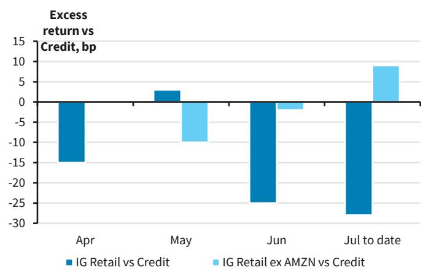
来源：彭博，BARC。

鉴于AMZN对表现造成的拖累，所有其他零售商在过去3个月和年初至今期间均跑赢零售板块（图5）。并且，剔除AMZN后，我们发现过去三个月表现最好的是一些交易利差较宽、评级偏弱的BBB级信用（如GPC和PVH）以及消费降级受益者（如Dollar Stores和Ross Stores），而高质量发行人则表现滞后（图6）。

图5. 过去3个月和年初至今，AMZN是相对少见跑输美元投资级零售板块的信用
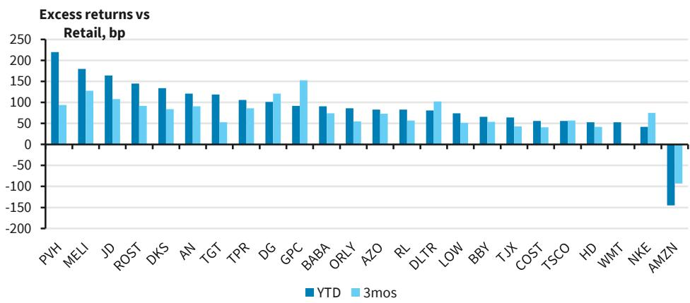
来源：彭博，BARC。

图6. 剔除AMZN，交易利差较宽的名称和消费降级受益者表现领先，而高质量则滞后
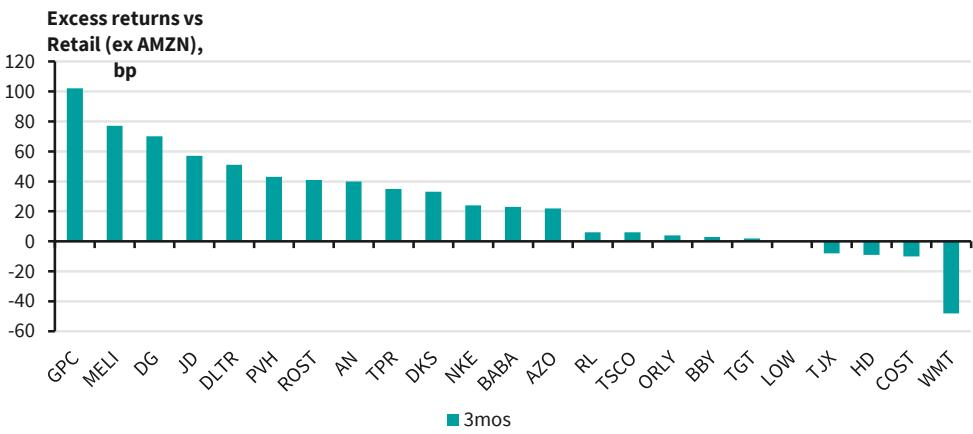
来源：彭博，BARC。

鉴于AMZN持续的发行压力与其他零售商有限的供给需求并存，我们认为该板块内的表现分化至少将持续到本日历年度末。部分原因是并购活动缺乏，以及家得宝和劳氏等较大发行人专注于去杠杆。

随着我们进入第二季度财报季，我们认为将有证据表明消费者行为因汽油价格波动而不一致。非周期报告公司的业绩表明情况确实如此（见《非周期洞察：观察高油价的影响》），6月份表现偏弱，而最近报告的公司（如GPC）则显示随着7月份汽油价格回落，出现反弹。随着油价回到95美元，我们可能会听到一些关于消费强度的温和论调。尽管如此，我们确实认为第一季度的超预期表现和预计持续到年底的IEEPA退款将有助于缓解部分因需要驱动客流而对利润率可能产生的潜在压力。

零售业的并购活动相当平淡，最近的证据来自GPC，其在财报电话会议上否认了与竞争对手进行任何合并谈判的可能性。该公司继续专注于在2027年第一季度前分拆其业务。我们认为这并未完全消除进一步整合的可能性，但可能将其推迟到2027年，考虑到可能的税务因素（类似于Kellogg及其两个分拆实体的分拆和最终整合），这似乎是审慎的。

图7. 我们认为汽油价格波动可能会抑制零售业的短期情绪

来源：彭博，BARC

## 亚马逊发行动态

## 规模带来多元化，但进一步发行仍在眼前

该公司今年迄今已发行620亿美元，使其成为第九大公司发行人，占美元市场的1.2%。而其145亿欧元的发行使其仅占泛欧公司债指数欧元计价部分的0.4%，成为第54大发行人，但其与谷歌一起进入该市场，使两者合计占该指数长期端（即欧元投资级10年以上部分）的7.88%，因为长期债券占AMZN欧元发行的三分之一。该公司今年还进入了瑞士法郎和加元市场，占泛欧公司债指数瑞士法郎计价部分的5.8%，成为第四大发行人。

由于美元仍占该公司债券组合的81%，我们预计非美元市场的发行将持续。AMZN尚未进入谷歌已涉足的一些市场，如英镑或日元，两者均未进入澳元市场。

我们预计AMZN将继续寻求每年在美元市场发行2-3次，而欧元可能每年两次。鉴于其他货币市场规模尚小，我们估计这些市场的发行空间可能更为有限（最多每年一次）。这将使得银行市场、潜在的股权发行和数据中心融资成为可用于融资的其他来源。

我们认为财报后有欧元发行的空间。正如《欧洲投资级：超大规模企业的融资机器无国界》所指出的，随着欧元和美元发行利差变得可忽略不计，欧元发行比今年早些时候更具吸引力。

图8. 亚马逊已按货币多元化其债券发行，但美元仍占约80%
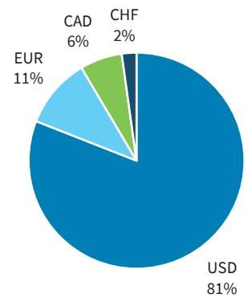
基于美元等值面值的优先无担保债券百分比。来源：彭博，BARC。

图9. AMZN欧元和美元债券交易利差基本一致
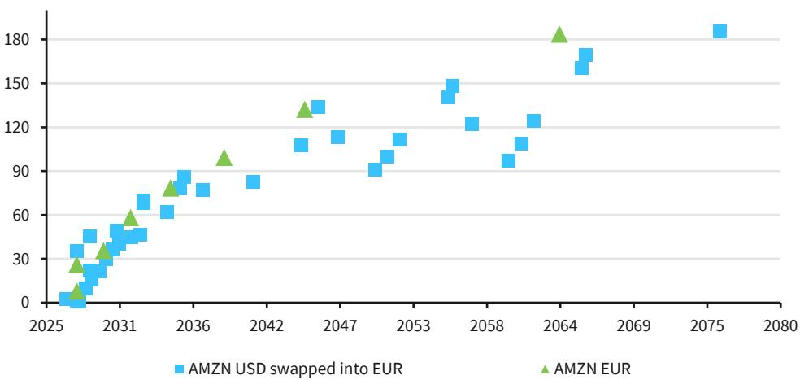
来源：彭博，BARC。

## 跨币种发行正在造成市场饱和

这在美元市场最为明显，因为AMZN过去三笔美元交易的新发债利差逐次走高，新发债认购倍数逐次走低，反映了超大规模企业的方向性趋势。这反映了为补偿近期利差以及因进一步发行可能性而产生的盯市风险，需要更高的利差。此外，鉴于AMZN和其他超大规模企业的集中度上升，许多读者已持有相当大的敞口，因此需要更具吸引力的回报表现才能产生增量需求。这一趋势可能会持续，并可能受到未来交易（来自该领域的其他发行人）密集发行或来自超大规模企业相关供给（即数据中心债券）竞争的不利影响。

- 在AMZN最近的三笔交易中，认购倍数（即超额认购水平）普遍低于其他发行人（图9），尽管新发债利差随着每笔交易依次走高（图10）。

图10. 超大规模企业的中位新债认购倍数在过去12个月显著下降，但新债市场的其他部分保持稳定
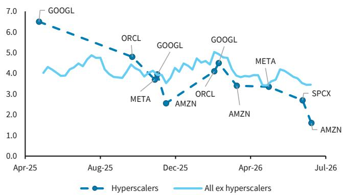
更多细节见《超大规模企业：利差宽到无法忽视，供给多到难以追逐》。来源：彭博，BARC

图11. 超大规模企业的新发债利差正在增加，而新非超大规模企业债券的平均利差仍较低
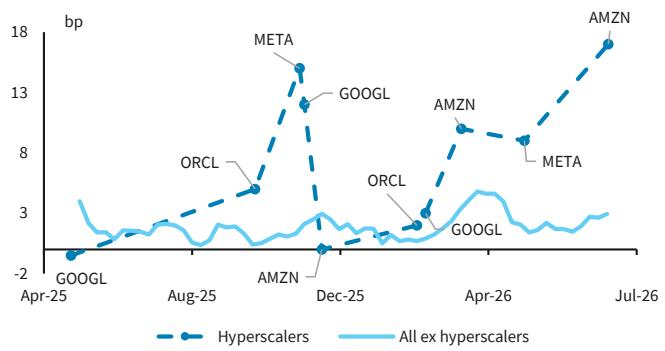
更多细节见《超大规模企业：利差宽到无法忽视，供给多到难以追逐》。来源：彭博，BARC

## 框算进一步发行需求及下周关注点

我们估计，该公司到2027年可能需要高达900亿美元的增量债务（如果GlobalStar完全通过债务融资），到2028年则需要1250亿美元。这假设2027年资本支出为2750亿美元，2028年为3600亿美元。虽然今年已发行了920亿美元的美元等值债务，符合我们先前的估计，但仍有可能考虑其他货币（如上所述），或提前部分2027年的需求。此外，该公司有一笔175亿美元的延迟提取定期贷款，可能在9月前全部使用；我们认为，如果该公司选择将发行推迟到2027年，这将起到后盾作用。因此，我们估计，到2026年底，其资产负债表还有空间增加250-350亿美元的债务（假设可能在美元市场以外再发行约100亿美元）。

- 鉴于年初至今的发行情况，我们认为该公司有可能上调其2026年的资本支出展望（目前为2000亿美元），谷歌最近已将其展望上调了150亿美元，或者暗示经营现金流表现更为温和。我们的感觉是，这两者都不是市场假设的一部分。

图12. AMZN流动性路径

<table><tr><td>AMZN</td><td>3Q25</td><td>4Q25</td><td>1Q26</td><td>2Q26E</td><td>3Q26E</td><td>4Q26E</td><td>1Q27E</td><td>2Q27E</td><td>3Q27E</td><td>4Q27E</td><td>1Q28E</td><td>2Q28E</td><td>3Q28E</td><td>4Q28E</td></tr><tr><td>($mn)</td><td>Sep-25</td><td>Dec-25</td><td>Mar-26</td><td>Jun-26</td><td>Sep-26</td><td>Dec-26</td><td>Mar-27</td><td>Jun-27</td><td>Sep-27</td><td>Dec-27</td><td>Mar-28</td><td>Jun-28</td><td>Sep-28</td><td>Dec-28</td></tr><tr><td>收入</td><td>180,169</td><td>213,386</td><td>181,519</td><td>196,077</td><td>204,628</td><td>239,754</td><td>202,561</td><td>217,631</td><td>227,276</td><td>265,804</td><td>227,051</td><td>242,571</td><td>253,890</td><td>296,087</td></tr><tr><td>EBITDA</td><td>43,365</td><td>51,285</td><td>46,829</td><td>49,475</td><td>50,070</td><td>57,833</td><td>51,653</td><td>55,496</td><td>61,819</td><td>73,096</td><td>59,487</td><td>63,675</td><td>71,343</td><td>84,385</td></tr><tr><td>利润率</td><td>24.1%</td><td>24.0%</td><td>25.8%</td><td>25.2%</td><td>24.5%</td><td>24.1%</td><td>25.5%</td><td>25.5%</td><td>27.2%</td><td>27.5%</td><td>26.2%</td><td>26.3%</td><td>28.1%</td><td>28.5%</td></tr><tr><td>经营现金流</td><td>35,525</td><td>54,459</td><td>26,032</td><td>35,155</td><td>38,988</td><td>62,995</td><td>37,017</td><td>44,040</td><td>49,199</td><td>73,806</td><td>45,385</td><td>51,659</td><td>59,457</td><td>87,638</td></tr><tr><td>资本支出</td><td>-35,095</td><td>-39,522</td><td>-44,203</td><td>-47,000</td><td>-52,000</td><td>-56,797</td><td>-62,000</td><td>-66,000</td><td>-70,000</td><td>-77,000</td><td>-82,000</td><td>-88,000</td><td>-92,000</td><td>-98,000</td></tr><tr><td>股息</td><td>0</td><td>0</td><td>0</td><td>0</td><td>0</td><td>0</td><td>0</td><td>0</td><td>0</td><td>0</td><td>0</td><td>0</td><td>0</td><td>0</td></tr><tr><td>回购</td><td>0</td><td>0</td><td>0</td><td>0</td><td>0</td><td>0</td><td>0</td><td>0</td><td>0</td><td>0</td><td>0</td><td>0</td><td>0</td><td>0</td></tr><tr><td>资产出售</td><td>867</td><td>1,053</td><td>969</td><td>800</td><td>900</td><td>831</td><td>850</td><td>850</td><td>850</td><td>450</td><td>850</td><td>850</td><td>850</td><td>450</td></tr><tr><td>并购</td><td>(786)</td><td>(1,403)</td><td>(15,408)</td><td>(5,000)</td><td>(35,000)</td><td>0</td><td>(10,900)</td><td>0</td><td>0</td><td>0</td><td>0</td><td>0</td><td>0</td><td>0</td></tr><tr><td>净自由现金流</td><td>511</td><td>14,587</td><td>-32,610</td><td>-16,045</td><td>-47,112</td><td>7,029</td><td>-35,033</td><td>-21,110</td><td>-19,951</td><td>-2,744</td><td>-35,765</td><td>-35,491</td><td>-31,693</td><td>-9,912</td></tr><tr><td>到期债务</td><td></td><td></td><td></td><td>-2,750</td><td></td><td></td><td></td><td>-3,250</td><td>-3,500</td><td>-2,000</td><td>-7,503</td><td>-2,250</td><td></td><td>-2,500</td></tr><tr><td>现金</td><td>66,922</td><td>86,810</td><td>101,816</td><td>83,021</td><td>35,908</td><td>42,937</td><td>7,905</td><td>-16,456</td><td>-39,907</td><td>-44,651</td><td>-87,919</td><td>-125,660</td><td>-157,353</td><td>-169,765</td></tr><tr><td>债务</td><td>54,959</td><td>68,851</td><td>122,058</td><td>125,670</td><td>125,670</td><td>159,708</td><td>214,708</td><td>214,708</td><td>214,708</td><td>244,708</td><td>304,708</td><td>304,708</td><td>304,708</td><td>369,708</td></tr><tr><td>净债务</td><td>-11,963</td><td>-17,959</td><td>20,242</td><td>42,650</td><td>89,762</td><td>116,771</td><td>206,803</td><td>231,164</td><td>254,615</td><td>289,359</td><td>392,627</td><td>430,368</td><td>462,061</td><td>539,473</td></tr><tr><td>假设目标现金</td><td>80,000</td><td></td><td></td><td></td><td></td><td></td><td></td><td></td><td></td><td></td><td></td><td></td><td></td><td></td></tr><tr><td>累计融资需求</td><td></td><td></td><td>0</td><td>0</td><td>44,092</td><td>37,063</td><td>72,095</td><td>96,456</td><td>119,907</td><td>124,651</td><td>167,919</td><td>205,660</td><td>237,353</td><td>249,765</td></tr></table>

来源：BARC

## 估值

我们认为该信用的公允价值比谷歌低10-15bp，并预计估值将与其他超大规模企业挂钩，这将导致其与沃尔玛和家得宝等高质量零售商的差距保持在高位。目前，我们尚未看到亚马逊对零售领域其他名称的相对价值产生溢出效应；随着读者在资本支出和发行需求增长中继续寻求超大规模企业以外的多元化，这种情况可能会持续。

## 交易思路

- 在美元债方面，我们建议卖出曲线上一些交易利差较紧的较老年份债券，这些债券在新供给以更宽水平出现时保持坚挺。随着时间的推移，这些关系应该会收窄，表明这些债券有表现落后的空间。
  - 卖出AMZN 2029年到期4.65%、2032年到期4.7%、2034年到期4.8%、2044年到期4.95%和2052年到期3.95%的债券。
- 鉴于亚马逊可能进行欧元发行以及与谷歌的关系相对平坦，我们建议卖出部分欧元债券。随着亚马逊的发行继续建立其在欧元市场的信用存在，我们预计其与谷歌的关系将从目前相对平坦的水平走阔至接近10-15bp（符合我们的公允价值估计）。
  - 卖出AMZN 2030年到期3.1%、2032年到期3.35%、2039年到期4.05%和2064年到期4.85%的债券。
- 买入AMZN 5年期CDS。虽然AMZN 5年期CDS相对于CDX.IG持续走阔（无论是名义上还是作为比率），但我们预计持续的发行空间，加上可能转向私人信贷，将导致这种压力持续存在。

图13. AMZN估值可能仍将锚定超大规模企业，保持与高质量零售的差距
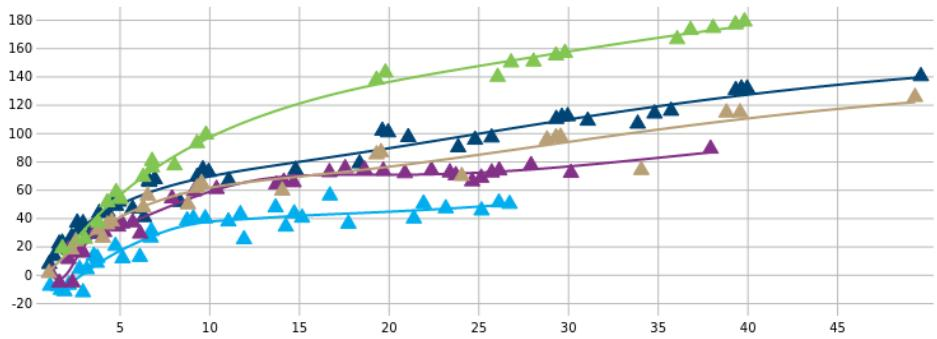
AMZN 美元优先债券 WMT 美元优先债券 HD 美元优先债券 GOOGL 美元优先债券 META 美元优先债券

√ 在BARC Live Chart中打开
来源：信用 - BARC交易，标普全球市场财智

图14. 我们建议读者卖出曲线上交易利差较紧的债券
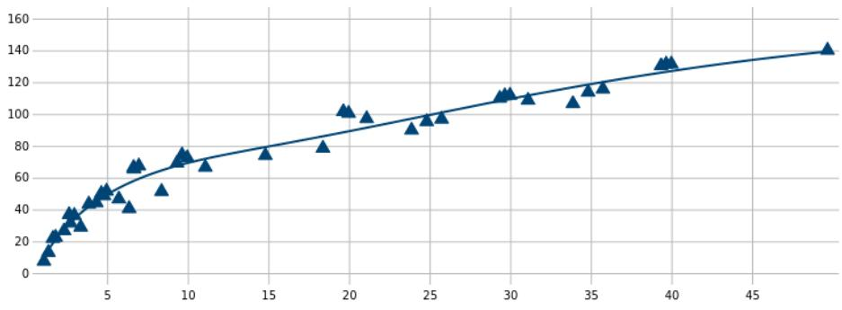
AMZN 美元优先债券

## 在BARC Live Chart中打开

来源：信用 - BARC交易，标普全球市场财智

## 评级摘要

## 彭博美国信用指数

<table><tr><td></td><td>旧</td><td>新</td></tr><tr><td>美国投资级零售商</td><td>增持</td><td>减持</td></tr><tr><td>亚马逊公司</td><td>标配</td><td>减持</td></tr></table>

来源：BARC

## 分析师认证：

我们，Priya Ohri-Gupta, CFA 和 Teresa Tian，特此证明 (1) 本研究报告中所表达的观点准确反映我们个人对任何或所有标的证券或发行人的看法，以及 (2) 我们的薪酬中没有任何部分直接或间接与本研究报告中的具体建议或观点相关。

## 重要披露：

BARC由BARC Bank PLC及其附属公司（统称及各自单独称为“BARC”）的投资银行部门编制。

除非另有说明，所有为本研究报告撰稿的作者均为研究分析师。报告顶部的发布日期反映了报告制作地的当地时间，可能与GMT提供的发布日期不同。

## 披露信息的获取：

有关本研究报告所涉及的任何发行人的当前重要披露，请参阅 https://publicresearch.BARC.com，或另函寄送至：BARC Compliance, 745 Seventh Avenue, 13th Floor, New York, NY 10019，或致电 +1-212-526-1072。

BARC Capital Inc. 和/或其一家附属公司会寻求与其研究报告中所涵盖的公司开展业务。因此，读者应注意，BARC可能存在可能影响本报告客观性的利益冲突。BARC Capital Inc. 和/或其一家附属公司定期交易、通常作为自营商交易，并通常（作为做市商或其他身份）为本研究报告所涉及之债务证券（及其相关衍生品）提供流动性。BARC交易台可能持有此类证券、其他金融工具和/或衍生品的多头和/或空头头寸，这可能与投资客户的利益产生冲突。在允许且受制于适当信息隔离限制的情况下，BARC固定收益研究分析师定期与其交易台人员就当前市场状况和价格进行交流。BARC固定收益研究分析师的薪酬基于多种因素，包括但不限于其工作质量、公司整体业绩（包括投资银行部门的盈利能力）、市场业务的盈利和收入，以及公司投资客户对分析师所覆盖资产类别研究的潜在兴趣。如果任何历史定价信息来自BARC交易台，公司不保证其准确或完整。所有水平、价格和利差均为历史数据，不一定代表当前市场水平、价格或利差，其中部分或全部可能在本文件发布后已发生变化。BARC部门制作多种类型的研究，包括但不限于基本面分析、股权挂钩分析、定量分析和交易思路。一种BARC中包含的建议和交易思路可能与另一种BARC中的不同，无论是由于不同的时间范围、方法论或其他原因。

要访问BARC关于研究传播政策和程序的声明，请参阅 https://publicresearch.BARC.com/S/RD.htm。要访问BARC冲突管理政策声明，请参阅：https://publicresearch.BARC.com/S/CM.htm。

## 关于信息来源的披露

版权所有 © 2026，标普全球市场财智（及其附属公司，如适用）。未经相关方事先书面许可，禁止以任何形式复制任何信息、数据或材料，包括评级（“内容”）。该方、其附属公司和供应商（“内容提供者”）不保证任何内容的准确性、充分性、完整性、及时性或可用性，并且不对因使用此类内容而产生的任何错误或遗漏（无论疏忽与否），无论原因如何，或对使用此类内容所获得的结果负责。在任何情况下，内容提供者均不对与任何内容使用相关的任何损害、成本、费用、法律费用或损失（包括收入损失或利润损失和机会成本）承担责任。提及特定投资或证券、评级或任何关于作为内容一部分的投资的观察，并非购买、出售或持有该投资或证券的建议，不涉及投资或证券的适用性，不应作为研究交流依赖。信用评级是意见陈述，而非事实陈述。

Bloomberg® 是 Bloomberg Finance L.P. 及其附属公司（统称“Bloomberg”）的商标和服务标志，彭博指数是 Bloomberg 的商标。Bloomberg 或其许可方拥有彭博指数的所有专有权利。Bloomberg 不批准或认可此材料，也不保证此处任何信息的准确性或完整性，也不对由此获得的结果作出任何明示或暗示的保证，并且在法律允许的最大范围内，Bloomberg 不对与此相关的任何伤害或损害承担责任。

## 主要发行人/债券

亚马逊公司，减持，A/CD/CE/D/E/J/K/L/M/N/R

估值方法：鉴于持续的供给压力，我们认为亚马逊的估值将锚定其他超大规模企业，并相对于高质量零售保持较宽利差，导致其表现落后于板块，因此给予减持评级。

可能阻碍评级实现的风险：在线业务表现好于预期
AWS业务强于预期
竞争压力降低提升市场地位
2027-28年资本支出展望和发行需求减少

代表债券：AMZN 3.95 04/13/52 (USD 71.54, 2026年7月22日)
代表债券：AMZN 4.7 12/01/32 (USD 98.86, 2026年7月22日)

实质性提及的发行人/债券

亚马逊公司，减持，A/CD/CE/D/E/J/K/L/M/N/R
AMZN 3.1 03/16/30 (EUR 98.87, 2026年7月22日)
AMZN 3.35 03/16/32 (EUR 98.30, 2026年7月22日)
AMZN 3.95 04/13/52 (USD 71.54, 2026年7月22日)
AMZN 4.05 03/16/39 (EUR 97.60, 2026年7月22日)
AMZN 4.65 12/01/29 (USD 99.94, 2026年7月22日)
AMZN 4.7 12/01/32 (USD 98.86, 2026年7月22日)
AMZN 4.8 12/05/34 (USD 97.72, 2026年7月22日)
AMZN 4.85 03/16/64 (EUR 96.40, 2026年7月22日)
AMZN 4.95 12/05/44 (USD 89.54, 2026年7月22日)

所有定价信息仅供参考。除非另有说明，价格来源于LSEG数据与分析，并反映相关交易市场的收盘价，可能不是发布时的最新可用价格。

## 披露图例：

A: BARC Bank PLC 和/或一家附属公司在过去12个月内曾担任该发行人公开披露证券发行的牵头经办人或联合牵头经办人。
B: BARC PLC 的一名员工或非执行董事是该发行人的董事。
CD: BARC Bank PLC 和/或一家附属公司是该发行人发行的债务证券的做市商。
CE: BARC Bank PLC 和/或一家附属公司是该发行人发行的股权证券的做市商。
CH: BARC Bank PLC 和/或其集团公司将就该发行人的证券（定义见香港证监会《操守准则》第16.2(k)段）进行做市。
D: BARC Bank PLC 和/或一家附属公司在过去12个月内已从该发行人处获得投资银行服务报酬。
E: BARC Bank PLC 和/或一家附属公司预计在未来3个月内将从该发行人处寻求获得投资银行服务报酬。
FA: BARC Bank PLC 和/或一家附属公司实益拥有该发行人一类股权证券的1%或以上，按美国法规计算。
FB: BARC Bank PLC 和/或一家附属公司实益拥有该发行人一类股权证券的多头头寸超过0.5%，按欧盟法规计算。
FC: BARC Bank PLC 和/或一家附属公司实益拥有该发行人一类股权证券的空头头寸超过0.5%，按欧盟法规计算。
FD: BARC Bank PLC 和/或一家附属公司实益拥有该发行人一类股权证券的1%或以上，按韩国法规计算。
FE: BARC Bank PLC 和/或其集团公司与该发行人存在财务利益关系，且此类利益总额等于或超过该发行人市值的1%，按香港法规计算。
GD: 基本面信用覆盖团队的一名研究分析师（和/或其家庭成员）持有该发行人普通股证券的多头头寸。
GE: 基本面股权覆盖团队的一名研究分析师（和/或其家庭成员）持有该发行人普通股证券的多头头寸。
H: 该发行人实益拥有BARC PLC任何一类普通股证券的5%以上。
I: BARC Bank PLC 和/或一家附属公司已与该发行人达成协议，为BARC Bank PLC 和/或一家附属公司提供金融服务。
J: BARC Bank PLC 和/或一家附属公司是该发行人证券和/或任何相关衍生品的流动性提供者和/或定期交易。
K: BARC Bank PLC 和/或一家附属公司在过去12个月内已从该发行人处获得非投资银行相关报酬（包括经纪服务报酬，如适用）。
L: 该发行人是，或在过去12个月内曾是，BARC Bank PLC 和/或一家附属公司的投资银行客户。
M: 该发行人是，或在过去12个月内曾是，BARC Bank PLC 和/或一家附属公司的非投资银行客户（证券相关服务）。
N: 该发行人是，或在过去12个月内曾是，BARC Bank PLC 和/或一家附属公司的非投资银行客户（非证券相关服务）。
O: 未使用。
P: 未使用。
Q: BARC Bank PLC 和/或一家附属公司是该发行人的公司经纪商。
R: 未使用。
S: 该发行人是BARC PLC的公司经纪商。
T: BARC Bank PLC 和/或一家附属公司正在向该发行人提供读者参与服务。

BARC公司信用板块评级系统说明

## 增持 (OW):

对于对标彭博美国信用指数、彭博泛欧信用指数、彭博EM亚洲美元高等级信用指数或彭博EM美元公司与准主权指数的板块，分析师预计该板块的六个月超额回报将超过相关指数的六个月超额回报。
对于对标彭博美国高收益2%发行人上限信用指数、彭博泛欧高收益3%发行人上限信用指数（不含金融）、彭博泛欧高收益金融指数或彭博EM亚洲美元高收益公司信用指数的板块，分析师预计该板块的六个月总回报将超过相关指数的六个月总回报。

## 标配 (MW):

对于对标彭博美国信用指数、彭博泛欧信用指数、彭博EM亚洲美元高等级信用指数或彭博EM美元公司与准主权指数的板块，分析师预计该板块的六个月超额回报将与相关指数的六个月超额回报一致。
对于对标彭博美国高收益2%发行人上限信用指数、彭博泛欧高收益3%发行人上限信用指数（不含金融）、彭博泛欧高收益金融指数或彭博EM亚洲美元高收益公司信用指数的板块，分析师预计该板块的六个月总回报将与相关指数的六个月总回报一致。

## 减持 (UW):

对于对标彭博美国信用指数、彭博泛欧信用指数、彭博EM亚洲美元高等级信用指数或彭博EM美元公司与准主权指数的板块，分析师预计该板块的六个月超额回报将低于相关指数的六个月超额回报。
对于对标彭博美国高收益2%发行人上限信用指数、彭博泛欧高收益3%发行人上限信用指数（不含金融）、彭博泛欧高收益金融指数或彭博EM亚洲美元高收益公司信用指数的板块，分析师预计该板块的六个月总回报将低于相关指数的六个月总回报。

## 板块定义：

美国高等级研究中的板块使用彭博美国信用指数的板块定义，并对照彭博美国信用指数进行评级。
美国高收益研究中的板块使用彭博美国高收益2%发行人上限信用指数的板块定义，并对照彭博美国高收益2%发行人上限信用指数进行评级。
欧洲高等级研究中的板块使用彭博泛欧信用指数的板块定义，并对照彭博泛欧信用指数进行评级。
欧洲高收益研究中的工业与公用事业板块使用彭博泛欧高收益3%发行人上限信用指数（不含金融）的板块定义，并对照彭博泛欧高收益3%发行人上限信用指数（不含金融）进行评级。
欧洲高收益研究中的金融板块使用彭博泛欧高收益金融指数的板块定义，并对照彭博泛欧高收益金融指数进行评级。
亚洲高等级研究中的板块在BARC Live上定义，并对照彭博EM亚洲美元高等级信用指数进行评级。
亚洲高收益研究中的板块在BARC Live上定义，并对照彭博EM亚洲美元高收益公司信用指数进行评级。
EEMEA和拉丁美洲研究中的板块在BARC Live上定义，并对照彭博EM美元公司与准主权指数进行评级。这些板块可能同时包含高等级和高收益发行人。
要查看亚洲、EEMEA和拉丁美洲研究的板块定义和月度板块回报，请访问BARC Live上的 https://live.barcap.com/go
