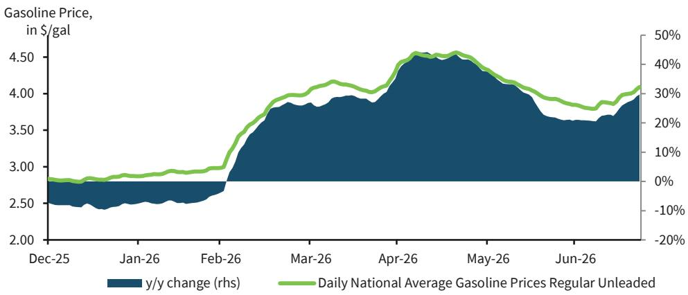
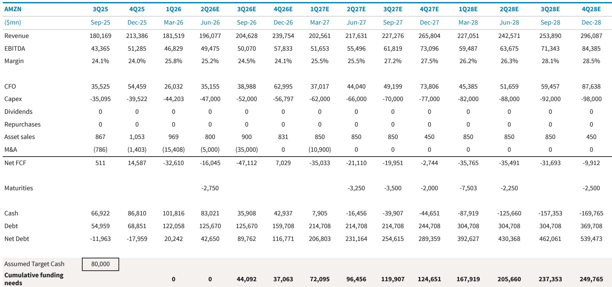

# Amazon's Issuance Machine Is Now the Dominant Force Shaping Retail Credit Performance

Amazon has grown to represent 35% of the USD investment-grade retail sector and 25% of the EUR IG retail sector by market value. This concentration has produced a counterintuitive outcome: the largest and most creditworthy name in the sector has become its worst performer. Over the last twelve months, Amazon has dragged the entire USD IG retail sector's excess returns to -89 basis points relative to the broader credit market. Strip Amazon out, and the rest of retail generated positive excess returns of 11 basis points. The company's debt issuance cadence—now running at two to three deals per year in USD alone—has created a structural supply overhang that is compressing its own bond performance and distorting the entire retail sector's risk-return profile.

This is not a temporary technical dislocation. It reflects a fundamental shift in how hyperscaler capital needs interact with fixed-income markets. Amazon has already issued $62 billion in USD-equivalent debt this year, making it the ninth-largest corporate issuer in the USD market. The company has entered the CHF and CAD markets for the first time, and its EUR issuance now accounts for 7.88% of the long-end of the Pan European Corporate Aggregate. The spread cost between EUR and USD issuance has become negligible, removing any currency-based friction that might have slowed further diversification. What matters for observers is that this supply wave shows no sign of cresting.

The implications extend well beyond Amazon's own bonds. The company's outsized representation means that any observer with a retail sector mandate is effectively forced to consider a structurally underperforming position. The issuance overhang is not a one-time event to be weathered—it is a recurring feature of the credit landscape that demands a strategic reassessment of sector exposure, position sizing, and relative value frameworks.

## Amazon's Issuance Cadence Has Created a Self-Reinforcing Performance Drag That Will Persist Through Year-End

The evidence that Amazon is the primary driver of retail sector underperformance is unambiguous. Over the trailing twelve months, the retail sector's excess returns versus credit were -89 basis points. Excluding Amazon, the sector generated +11 basis points. Over the year-to-date period, the pattern repeats: -70 basis points for the sector including Amazon, +3 basis points excluding it. Even over the past three months, when retail ex-Amazon also underperformed credit by 8 basis points, that weakness was concentrated in May—a month that coincided with a spike in gas prices and one in which Amazon actually outperformed.

The mechanism at work is straightforward but powerful. Amazon's frequent issuance forces new issue concessions higher with each successive deal. The company's three most recent USD transactions have each required a larger concession than the prior one, while new issue coverage ratios have declined. This pattern is not unique to Amazon—it is consistent across hyperscalers—but Amazon's scale makes it the most consequential. Observers who already hold sizable Amazon exposure from previous deals require progressively higher yields to justify incremental allocation. The result is that each new Amazon deal reprices the existing curve wider, creating a persistent drag on total return performance for anyone holding the bonds.

This dynamic will not resolve quickly. With limited M&A activity across the broader retail sector and a focus on deleveraging among large issuers such as Home Depot and Lowe's, there is no offsetting supply reduction to absorb Amazon's issuance. The performance divergence between Amazon and the rest of retail is likely to persist at least through calendar year-end.

## The Supply Overhang Is Creating Dislocation Within the Retail Sector That Rewards Trade-Down Exposure and Punishes High Quality

When Amazon is excluded from the analysis, the retail sector's performance hierarchy inverts conventional expectations. Over the past three months, the best-performing retail credits have been a combination of wider-trading, weak BBB names and companies that benefit from consumer trade-down behavior. Dollar stores and Ross Stores have outperformed. Higher-quality issuers have lagged. This is the opposite of what one would expect in a typical risk-off environment, and it is directly attributable to the hyperscaler supply dynamic.

The logic is as follows: observers seeking to maintain retail sector exposure while avoiding Amazon's issuance drag have rotated into names that offer spread pickup and are less correlated with the hyperscaler supply cycle. Wider-trading credits provide compensation for the sector's technical headwinds. Trade-down beneficiaries offer a fundamental narrative that is independent of Amazon's capital spending trajectory. High-quality retail names, by contrast, trade at tighter spreads that offer less cushion against the widening pressure generated by Amazon's deals. They also face direct relative-value comparison to Amazon, since both are viewed as core holdings by many retail sector observers.

This pattern has a second-order implication for portfolio construction. A passive approach to retail sector exposure—one that weights positions by market value—will systematically differ from an active approach that overweights names benefiting from the supply dislocation and underweights Amazon itself. The sector's composition has reached a point where benchmark-aware positioning in retail is no longer a neutral decision; it is an active consideration regarding Amazon's continued underperformance.

## Amazon's Capital Needs Extend Far Beyond Current Issuance, With $90 Billion in Incremental Debt Possible by 2027

The supply story is not a short-term phenomenon. Based on the company's disclosed capex trajectory and the liquidity walk provided in the analysis, Amazon could require incremental debt of up to $90 billion by 2027 and $125 billion by 2028. This assumes capex of $275 billion in 2027 and $360 billion in 2028. The company has already issued $92 billion in USD-equivalent debt this year, in line with prior estimates, but there is room for an additional $25 to $35 billion to be added to the balance sheet by year-end 2026, including approximately $10 billion in non-USD markets.

Several factors could accelerate or amplify these needs. The company has a $17.5 billion delayed draw term loan that could be fully utilized by September, serving as a backstop if it chooses to delay bond issuance until 2027. There is scope for Amazon to raise its 2026 capex outlook from the current $200 billion level—Google recently raised its own outlook by $15 billion—which would increase funding requirements further. And the company has not yet tapped the GBP, JPY, or AUD markets, suggesting additional currency diversification is possible.

The critical point for bondholders is that Amazon's supply is not a function of cyclical working capital needs or opportunistic refinancing. It is a structural consequence of a capital spending program that is transforming the company's balance sheet. The liquidity walk shows cash turning negative by early 2027 and cumulative funding needs reaching nearly $250 billion by the end of 2028. This is a multi-year supply story that will shape the credit's relative value for the foreseeable future.

## A Decision Framework for Retail Credit Observers: Three Strategic Choices to Navigate the Hyperscaler Supply Regime

The analysis points to three distinct strategic decisions for observers managing retail sector exposure. Each involves a trade-off between yield pickup, tracking error, and the risk of further supply-driven widening.

First, the decision on Amazon exposure itself. The recommendation to consider select USD and EUR bonds and to review Amazon 5-year CDS reflects a view that ongoing issuance will continue to pressure cash bonds while CDS offers a more efficient hedging vehicle. The specific USD bonds mentioned for review—the 4.65s of 2029, 4.7s of 2032, 4.8s of 2034, 4.95s of 2044, and 3.95s of 2052—are older vintage issues that have remained tight relative to newer supply. As the curve adjusts to incorporate the higher concessions demanded by recent deals, these bonds have room to widen. The EUR recommendation targets bonds where the relationship to Google is currently flat, with the expectation that continued Amazon issuance will push that relationship to 10-15 basis points wider.

Second, the decision on sector allocation. The retail sector's performance is now heavily influenced by a single issuer's supply calendar. This argues for reducing sector weight relative to the broader credit market, particularly for observers who cannot easily exclude Amazon from their portfolio. The report explicitly lowers the retail sector rating to reflect the ongoing issuance overhang. This is not a comment on consumer fundamentals—it is a recognition that technical supply factors will dominate sector performance in the near term.

Third, the decision on which retail names to own. The pattern of outperformance among wider-trading, weak BBB credits and trade-down beneficiaries is likely to persist as long as Amazon's supply remains elevated. Observers who must maintain retail exposure should consider rotating toward names that offer spread compensation for the sector's technical headwinds, while avoiding high-quality names that trade at tight spreads and face direct relative-value pressure from Amazon. The caveat is that gas price fluctuations could dampen near-term sentiment across the sector, as evidenced by the May weakness that coincided with higher gas prices. The rebound into July as gas prices moderated, reported by companies such as GPC, suggests that consumer behavior remains sensitive to fuel costs, adding a macro variable to the sector's near-term outlook.

## Amazon's Valuation Will Remain Anchored to Other Hyperscalers, Keeping the Spread Gap to High-Quality Retail Wide

The relative value framework for Amazon bonds is now defined by the hyperscaler peer group rather than the retail sector. Fair value for Amazon is estimated at 10 to 15 basis points behind Google, and this relationship is expected to persist as both companies continue to issue. The gap to high-quality retail names such as Walmart and Home Depot will remain elevated, reflecting the structural supply premium that hyperscalers must offer to attract demand.

Importantly, there is no evidence yet of spillover effects from Amazon to other retail names in terms of relative value. This is because observers continue to use other retail credits as a source of diversification away from hyperscalers. As long as Amazon's issuance needs grow, the demand for non-Amazon retail exposure should remain intact, providing a floor for those names' valuations even as Amazon's own bonds widen.

The risk to this view would be a scenario in which hyperscaler supply becomes so large that it crowds out demand for other retail credits entirely, or in which a broader risk-off move causes observers to reduce all retail exposure indiscriminately. Neither scenario appears imminent, but both are worth monitoring as Amazon's cumulative funding needs approach $250 billion over the next three years.

The strategic implication is clear: Amazon credit is no longer a core retail holding to be bought and held for stability. It is a high-supply, structurally-widening credit that must be actively managed, hedged, or avoided. The retail sector itself must be evaluated net of Amazon's contribution, and portfolio decisions should reflect the reality that the sector's largest constituent is also its most persistent source of underperformance.

*For informational purposes only. Portions may be generated, translated, summarized, or edited with AI assistance based on source materials and may contain omissions or errors. Please verify independently. This is not professional advice.*

For informational purposes only. Portions may be generated, translated, summarized, or edited with AI assistance based on source materials and may contain omissions or errors. Please verify independently. This is not professional advice.

