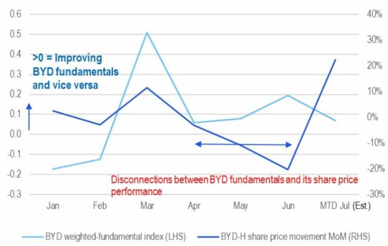
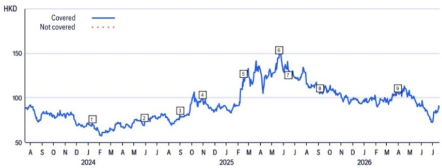
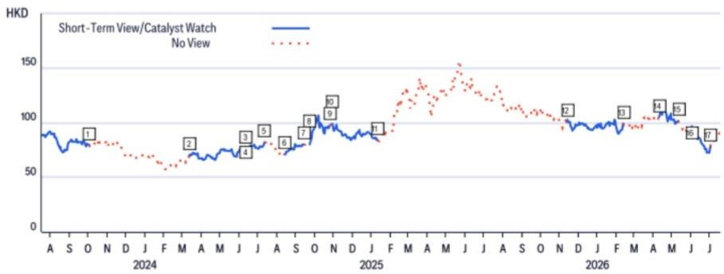

24 Jul 2026 04:58:28 ET | 12 pages

# BYD (1211.HK)

## 基本面与资金流向观察

## 核心观点

BYD的报价走势，历史上与其基本面表现紧密相关，但在2026年4月至6月下旬期间，两者似乎出现了偏离——我们认为，这主要是由AI驱动的资金流向扰动、关税相关情绪波动以及国内新能源车需求变化等因素共同导致。为了客观衡量不受市场噪音干扰的基本面动能，我们构建了一个“BYD加权基本面指数”，权重分配为：BYD出口环比变动40%、订单25%、国内市场份额20%、行业新能源车同比趋势10%、库存水平5%。该指数若为正（>0），则表明基本面动能改善，历史上对报价表现有积极意义（如图1所示，以2026年3月为例）。尽管该指数在2026年4月至6月期间持续为正，但BYD的报价却出现回调——我们将这一异常归因于AI资金流向对该公司的反向作用（图2）；我们认为，报价与资金流向定位之间的差距正在明显收窄，并有望在7月出现反转。

对BYD的积极基本面看法：我们的2026年7月“BYD加权基本面指数”为+0.07，基于以下假设输入：BYD库存环比-3%，BYD出口环比+5%，行业新能源车同比-5%，BYD订单环比+15%，BYD批发量环比-13%，这进一步强化了我们对基本面的积极看法。展望未来，我们预计出口动能将持续至2026年第三季度，而稳健的第二季度业绩表现将有助于厘清2026年下半年的盈利可见度问题，支持BYD在2027财年的盈利预期通过市场整合与出口增长逻辑逐步实现重新定价。同时，波动性降低的AI资金流向应能减轻对BYD估值的压力，反之亦然。

## 公司观点：

防御性长期关注：奇瑞、吉利、敏实

高弹性向上潜力（进入汽车销售旺季）：零跑、小鹏

第二季度及下半年盈利重估潜力（来自出口）：BYD/潍柴/中国重汽/宇通

关注：赛力斯、长城；中性：理想、三花、拓普

延伸阅读：中国汽车制造商 - 潍柴-中国重汽动能追踪

## 买入

<table><tr><td>报价（23 Jul 26 16:10）</td><td>88.65港元</td></tr><tr><td>目标价</td><td>142.00港元</td></tr><tr><td>预期报价回报</td><td>60.2%</td></tr><tr><td>预期股息率</td><td>1.7%</td></tr><tr><td>预期总回报</td><td>61.9%</td></tr><tr><td>市值</td><td>808,240百万港元 103,076百万美元</td></tr></table>

Jeff Chung $^{AC}$ +852-2501-2787
jeff.m.chung@citi.com

Kyle Wu
+852-2501-8483
kyle.wu@citi.com

详见附录A-1：分析师认证、重要披露及研究分析师关联信息

图1. BYD基本面与其H股报价走势

© 2026 Citi Inc. 未经Citi书面许可不得转载。来源：Citi、公司报告、CPCA

图2. BYD及AIDC/SOFC/HDT相关公司年初至今报价走势

© 2026 Citi Inc. 未经Citi书面许可不得转载。
来源：Citi、彭博

三花（2050.HK；25.98港元；2；23 Jul 26；16:10）

赛力斯集团（601127.SS；54.33元人民币；3；24 Jul 26；15:00）

赛力斯集团（9927.HK；43.72港元；3；23 Jul 26；16:10）

中国重汽（香港）（3808.HK；41.36港元；1；24 Jul 26；16:10）

潍柴动力（2338.HK；33.46港元；1；24 Jul 26；16:10）

小鹏汽车（XPEV.N；12.76美元；1；23 Jul 26；16:00）

小鹏汽车（9868.HK；49.48港元；1；24 Jul 26；16:10）

宇通客车（600066.SS；31.66元人民币；1；24 Jul 26；15:00）

浙江三花智能控制（002050.SZ；35.05元人民币；2；24 Jul 26；15:00）

## BYD

## 估值

我们采用1.2倍2026E PEG，基于+25%的2026-28E净利润年复合增长率，得出目标价142港元，对应2026E/2027E 30倍/25倍市盈率。我们采用PEG估值法，认为其能更准确地反映该成长型公司的估值水平。

## 风险

可能阻碍BYD H股达到我们目标价的主要下行风险包括：1）新能源客车或乘用车销量不及预期；2）云轨业务爬坡速度慢于预期；3）再次出现较长的资本开支周期；4）意外的现金流问题。

## BYD

（002594.SZ；91.89元人民币；1；24 Jul 26；15:00）

## 估值

我们的目标价131元人民币，基于1.2倍26E PEG，以+25%的2025-27E净利润年复合增长率为基础。目标价对应2026E/2027E 30倍/25倍市盈率。我们采用PEG估值法，认为其能更准确地反映成长型公司的潜力。

## 风险

可能阻碍BYD A股达到我们目标价的下行风险包括：1）新能源客车或乘用车销量不及预期；2）云轨业务爬坡速度慢于预期；3）再次出现较长的资本开支周期；4）意外的现金流问题。

如果您有视觉障碍并希望就本文件中的图表细节与Citi代表沟通，请致电美国 1-888-500-5008（TTY：711），或从美国以外地区拨打 +1-210-677-3788

## 附录A-1

## 分析师认证

主要负责本研究报告准备和内容的研究分析师，要么在作者栏中以“AC”标识，要么以粗体列于其负责的内容旁。如果作者栏中指定了多位AC分析师，则每位分析师仅就其负责的整个研究报告部分进行认证，但不包括（a）由其他以粗体列出的AC认证分析师负责的内容，以及（b）仅针对特定发行人的观点，这些观点归因于下方该发行人价格图表或评级历史表中标识的其他AC认证分析师。每位分析师就其负责的报告部分认证：（1）其中表达的观点准确反映其个人对每个提及的发行人和证券的看法，并且是独立准备的，包括对Citi Global Markets Inc.及其关联公司的看法；（2）研究分析师的薪酬的任何部分，过去、现在或将来，均未直接或间接与该分析师在本报告中提出的具体建议或观点相关联。

## 重要披露

BYD (1211.HK)
评级与目标价历史
基本面研究

分析师：Jeff Chung

<table><tr><td></td><td>日期</td><td>评级</td><td>目标价</td><td>收盘价</td></tr><tr><td>1</td><td>11-Jan-24 13:28:07</td><td>1</td><td>*154.33</td><td>70.80</td></tr><tr><td>2</td><td>29-May-24 07:27:17</td><td>1</td><td>*158.33</td><td>72.53</td></tr><tr><td>3</td><td>01-Sep-24 20:09:08</td><td>1</td><td>*162.67</td><td>80.40</td></tr></table>

\*表示变更

<table><tr><td></td><td>日期</td><td>评级</td><td>目标价</td><td>收盘价</td></tr><tr><td>4</td><td>30-Oct-24 11:36:39</td><td>1</td><td>*166.67</td><td>98.33</td></tr><tr><td>5</td><td>14-Feb-25 11:26:49</td><td>1</td><td>*229.33</td><td>121.40</td></tr><tr><td>6</td><td>20-May-25 14:45:04</td><td>1</td><td>*242.33</td><td>148.20</td></tr></table>

<table><tr><td></td><td>日期</td><td>评级</td><td>目标价</td><td>收盘价</td></tr><tr><td>7</td><td>13-Jun-25 00:00:04</td><td>1</td><td>*233.00</td><td>131.10</td></tr><tr><td>8</td><td>07-Sep-25 20:44:21</td><td>1</td><td>*174.00</td><td>105.60</td></tr><tr><td>9</td><td>30-Mar-26 12:12:39</td><td>1</td><td>*142.00</td><td>105.80</td></tr></table>

上述评级/目标价变更反映美国东部时间

## BYD (1211.HK)

短期观点/催化剂观察研究

分析师：Jeff Chung

<table><tr><td></td><td>日期</td><td>操作</td><td>预期方向</td><td>持续时间</td><td>收盘价</td></tr><tr><td>1</td><td>03-Oct-23 00:16:29</td><td>移除CW</td><td>上行</td><td>90天</td><td>79.53</td></tr><tr><td>2</td><td>12-Mar-24 15:43:32</td><td>添加CW</td><td>上行</td><td>90天</td><td>69.87</td></tr><tr><td>3</td><td>11-Jun-24 00:18:43</td><td>移除CW</td><td>上行</td><td>90天</td><td>76.13</td></tr><tr><td>4</td><td>12-Jun-24 06:02:24</td><td>添加CW</td><td>上行</td><td>30天</td><td>73.33</td></tr><tr><td>5</td><td>12-Jul-24 00:12:00</td><td>移除CW</td><td>上行</td><td>30天</td><td>82.20</td></tr><tr><td>6</td><td>13-Aug-24 21:14:13</td><td>添加CW</td><td>上行</td><td>30天</td><td>71.00</td></tr></table>

CW - 催化剂观察，STV - 短期观点

<table><tr><td>日期</td><td>操作</td><td>预期方向</td><td>持续时间</td><td>收盘价</td></tr><tr><td>13-Sep-24 14:17:22</td><td>移除CW</td><td>上行</td><td>30天</td><td>79.93</td></tr><tr><td>23-Sep-24 21:08:42</td><td>添加CW</td><td>上行</td><td>30天</td><td>80.13</td></tr><tr><td>25-Oct-24 00:28:51</td><td>移除CW</td><td>上行</td><td>30天</td><td>97.53</td></tr><tr><td>28-Oct-24 22:24:43</td><td>添加CW</td><td>上行</td><td>90天</td><td>98.20</td></tr><tr><td>12-Jan-25 22:48:43</td><td>移除CW</td><td>上行</td><td>90天</td><td>83.80</td></tr><tr><td>12-Nov-25 21:56:41</td><td>添加CW</td><td>上行</td><td>90天</td><td>100.50</td></tr></table>

<table><tr><td>日期</td><td>操作</td><td>预期方向</td><td>持续时间</td><td>收盘价</td></tr><tr><td>13 11-Feb-26 22:14:43</td><td>移除CW</td><td>上行</td><td>90天</td><td>99.15</td></tr><tr><td>14 10-Apr-26 04:39:55</td><td>添加CW</td><td>上行</td><td>30天</td><td>105.10</td></tr><tr><td>15 11-May-26 00:13:29</td><td>移除CW</td><td>上行</td><td>30天</td><td>101.70</td></tr><tr><td>16 01-Jun-26 07:20:22</td><td>添加CW</td><td>上行</td><td>30天</td><td>90.75</td></tr><tr><td>17 02-Jul-26 00:35:24</td><td>移除CW</td><td>上行</td><td>30天</td><td>78.30</td></tr></table>

上述评级/目标价变更反映美国东部时间

<table><tr><td>2025年1月。</td></tr><tr><td>该公司自2025年1月1日起至少一次担任理想汽车公开交易权益证券的做市商。</td></tr><tr><td>该公司自2025年1月1日起至少一次担任比亚迪股份有限公司公开交易权益证券的做市商。</td></tr><tr><td>该公司自2025年1月1日起至少一次担任潍柴动力股份有限公司公开交易权益证券的做市商。</td></tr><tr><td>该公司自2025年1月1日起至少一次担任浙江零跑科技股份有限公司公开交易权益证券的做市商。</td></tr><tr><td>该公司自2025年1月1日起至少一次担任吉利汽车控股有限公司公开交易权益证券的做市商。</td></tr><tr><td>该公司自2025年1月1日起至少一次担任浙江三花智能控制股份有限公司公开交易权益证券的做市商。</td></tr><tr><td>Citi Global Markets Inc.或其关联公司实益拥有浙江三花智能控制任何类别普通股证券的1%或以上。该头寸反映截至前一交易日可获取的信息。</td></tr><tr><td>Citi Global Markets Inc.或其关联公司持有理想汽车任何类别普通股证券的净空头头寸达0.5%或以上。</td></tr><tr><td>Citi Global Markets Inc.或其关联公司在过去12个月内因向奇瑞、吉利汽车、中国重汽（香港）、小鹏汽车提供投资银行服务而获得报酬。</td></tr><tr><td>Citi Global Markets Inc.或其关联公司预计在未来三个月内将寻求或有意向从奇瑞、中国重汽（香港）获得投资银行服务报酬。</td></tr><tr><td>Citi Global Markets Inc.或其关联公司在过去12个月内因向比亚迪、奇瑞、吉利汽车、长城汽车、理想汽车、敏实集团、宁波拓普集团、赛力斯集团、中国重汽（香港）、潍柴动力、小鹏汽车、宇通客车、浙江三花智能控制提供投资银行服务以外的产品和服务而获得报酬。</td></tr><tr><td>Citi Global Markets Inc.或其关联公司目前拥有，或在过去12个月内曾拥有以下公司作为投资银行客户：奇瑞、吉利汽车、中国重汽（香港）、小鹏汽车。</td></tr><tr><td>Citi Global Markets Inc.或其关联公司目前拥有，或在过去12个月内曾拥有以下公司作为客户，且提供的服务为非投资银行、证券相关服务：比亚迪、奇瑞、吉利汽车、长城汽车、理想汽车、敏实集团、宁波拓普集团、赛力斯集团、中国重汽（香港）、小鹏汽车、浙江三花智能控制。</td></tr><tr><td>Citi Global Markets Inc.或其关联公司目前拥有，或在过去12个月内曾拥有以下公司作为客户，且提供的服务为非投资银行、非证券相关服务：比亚迪、奇瑞、吉利汽车、长城汽车、理想汽车、敏实集团、宁波拓普集团、赛力斯集团、中国重汽（香港）、潍柴动力、小鹏汽车、宇通客车、浙江三花智能控制。</td></tr><tr><td>Citi Global Markets Inc.和/或其关联公司与比亚迪、奇瑞、中国重汽（香港）存在重大经济利益关系。（有关重大经济利益确定的解释，请参阅www.citiVelocity.com上的利益冲突管理政策。）</td></tr><tr><td>分析师的薪酬由Citi管理层和Citi高级管理层根据旨在惠及Citi Global Markets Inc.及其关联公司（“公司”）读者客户的活动和服务确定。薪酬不与特定交易或建议挂钩。与所有公司员工一样，分析师的薪酬受到公司整体盈利能力的影响，包括投资银行、销售和交易以及自营交易收入。股权研究分析师薪酬的一个因素是安排机构客户与所覆盖公司管理层之间的企业接触活动。通常，当分析师对公司持积极看法时，公司管理层更有可能参与。</td></tr><tr><td>对于产品中推荐的非做市商金融工具，公司是该等金融工具（及其任何基础工具）的流动性提供者，并可能作为主体参与该等工具的交易。公司是定期发行与产品中可能推荐的证券挂钩的可交易金融工具的机构。公司定期交易产品中讨论的发行人证券。公司可能以与产品不一致的方式进行证券交易，并且对于产品所涵盖的证券，将按主体基础从客户处买入或卖出。</td></tr><tr><td>公司是比亚迪、吉利汽车、长城汽车、零跑汽车、理想汽车、潍柴动力、浙江三花智能控制公开交易权益证券的做市商。</td></tr><tr><td>除非另有说明，研究分析师或其团队成员在过去12个月内均未实地考察过已提供投资观点的公司的重大运营情况。</td></tr><tr><td>有关本Citi产品（“产品”）所涉及公司的重要披露（包括历史披露副本），请联系Citi，地址：388 Greenwich Street, 6th Floor, New York, NY, 10013，收件人：Legal/Compliance [E6WYB6412478]。此外，除估值与风险评估以及历史披露外，相同的重要披露载于公司披露网站：https://www.citivelocity.com/cvr/eppublic/citi_research_disclosures。估值与风险评估可在关于标的公司的最新研究笔记/报告正文中找到。根据市场滥用法规，过去12个月内发布的所有Citi建议的历史记录可通过Citi Velocity (https://www.citivelocity.com/cv2) 或您的标准分发门户访问。历史披露（最多过去三年）将应要求提供。</td></tr></table>

Citi股权评级分布

<table><tr><td rowspan="2">数据截至2026年7月1日</td><td colspan="3">12个月评级</td><td colspan="3">催化剂观察</td></tr><tr><td>买入</td><td>持有</td><td>卖出</td><td>买入</td><td>持有</td><td>卖出</td></tr><tr><td>Citi全球基本面覆盖（中性=持有）</td><td>61%</td><td>32%</td><td>7%</td><td>36%</td><td>48%</td><td>16%</td></tr><tr><td>各评级类别中为投资银行客户的公司的百分比</td><td>38%</td><td>42%</td><td>27%</td><td>42%</td><td>37%</td><td>36%</td></tr></table>

## Citi基本面研究投资评级指南：

Citi股票建议包括投资评级和可选的风险评级以标示高风险股票。风险评级同时考虑价格波动性和基本面标准。股票将没有风险评级或被赋予高风险评级。

投资评级：Citi投资评级为买入、中性、卖出。我们的评级是分析师对预期总回报（“ETR”）和风险的预期函数。ETR是未来12个月内股票预期价格升值（或贬值）加上股息回报表现的总和。目标价基于12个月的时间范围。投资评级定义如下：买入（1）ETR为15%或以上，或对于高风险股票为25%或以上；卖出（3）为负ETR。任何未指定买入或卖出的被覆盖股票均为中性（2）。对于评级为中性（2）的股票，如果分析师认为缺乏足够的估值驱动因素和/或投资催化剂来得出正面或负面的投资观点，他们可以在获得Citi管理层批准后选择不指定目标价，从而不推导ETR。Citi可能因监管和/或内部政策原因暂停其评级和目标价，并指定“评级暂停”状态。Citi也可能因其他特殊情况（例如，缺乏对分析师论点至关重要的信息、公司证券交易暂停）影响公司和/或公司证券交易而暂停其评级和目标价，并指定“审查中”状态。在这两种情况下，评级和目标价将在评级历史价格图表中分别显示为“—”和“-”。在2022年4月11日之前，Citi将两种情况均指定为“审查中”状态，而在2020年11月11日之前，仅在特殊情况下使用。在实际可行的情况下，分析师将发布重新建立评级和投资论点的说明。投资评级在首次覆盖、投资和/或风险评级变更或目标价变更时（受有限管理层酌情权限制）由上述范围确定。有时，由于市场价格波动和/或其他短期波动或交易模式，预期总回报可能落在此类范围之外。此类临时偏差将被允许，但将受到研究管理层的审查。您买卖证券的决定应基于您个人的投资目标，并且应在评估股票的预期表现和风险后做出。

## 催化剂观察/短期观点（“STV”）评级披露：

催化剂观察和STV上行/下行提示：Citi还可能包括催化剂观察或STV上行或下行提示，以表明分析师预期股价将在指定的30天或90天期限内，因一个或多个特定的近期催化剂或影响公司或市场的事件而相对上涨（下跌）。当分析师对股价将受到影响有较高信心时，将发布催化剂观察；当信心水平中等时，将发布STV。催化剂观察或STV上行/下行提示将在指定的30/90天期限结束时自动到期。如果股价表现（按市场收盘价计算）相对于提示方向变动超过$15\%$，催化剂观察也将自动移除（除非分析师推翻）。分析师也可能在指定期限结束前通过发布的研究说明移除催化剂观察或STV提示。催化剂观察/STV上行或下行提示可能与股票的基本面股权评级不同，且不影响该评级，后者反映更长期的总相对回报预期。就FINRA评级分布披露规则而言，催化剂观察/STV上行提示对应买入建议，催化剂观察/STV下行提示对应卖出建议。任何未指定催化剂观察上行、催化剂观察下行、STV上行或STV下行提示的股票被视为催化剂观察/STV无观点。就FINRA评级分布披露规则而言，我们在催化剂观察/STV上行/下行评级系统的评级分布表中将催化剂观察/STV无观点对应为持有。然而，我们重申，我们不认为无观点是一种建议。对于所有催化剂观察/STV上行/下行提示，存在催化剂和相关的股价变动可能不会如预期实现的风险。

## 研究分析师关联/非美国研究分析师披露

本报告作者的雇佣法律实体列于下方（其监管机构进一步列于下文）。非美国研究分析师（即除被标识为受雇于Citi Global Markets Inc.的分析师之外的所有下文列出的研究分析师）未在FINRA注册/具备研究分析师资格。此类研究分析师可能不是成员组织的关联人士（但受雇于成员组织的关联公司），因此可能不受FINRA规则2241关于与标的公司沟通、公开露面以及交易研究分析师账户持有的证券的限制。

Citi Global Markets Asia Limited

Jeff Chung; Kyle Wu

## 其他披露

除非另有说明，建议中提及的工具的任何价格均为前一交易日该工具主要市场的收盘价。

本研究报告中所作任何建议的完成和首次分发时间均为产品顶部显示的美国东部日期时间。如果产品引用了其他分析师的观点，请参阅价格图表或评级历史表，以了解该观点的完成和首次分发的日期/时间。

各司法管辖区的法规要求，如果建议与作者在过去12个月内发布的关于同一金融工具或发行人的任何先前建议不同，则应指明变更以及该先前建议的日期。对于基本面覆盖，请参阅本披露附录中的价格图表或评级变更历史，或发行人披露摘要：https://www.citivelocity.com/cvr/eppublic/citi\_research\_disclosures。

Citi已实施相关政策，用于识别、考虑和管理因发布或分发投资研究而产生的潜在利益冲突。这些政策的描述可在以下网址找到：https://www.citivelocity.com/cvr/eppublic/citi\_research\_disclosures。

过去12个月每个季度末，所有Citi研究建议中等同于“买入”、“持有”、“卖出”的比例（以及其中在过去12个月内曾接受Citi投资公司服务的百分比，显示在括号中）如下：2026年第一季度 买入 $33\% (63\%)$ ，持有 $44\% (52\%)$ ，卖出 $23\% (46\%)$ ，相对价值 $0.5\% (89\%)$ ：2025年第四季度 买入 $33\% (63\%)$ ，持有 $44\% (50\%)$ ，卖出 $23\% (46\%)$ ，相对价值 $0.4\% (91\%)$ ；2025年第三季度 买入 $33\% (61\%)$ ，持有 $44\% (52\%)$ ，卖出 $23\% (50\%)$ ，相对价值 $0.4\% (80\%)$ ；2025年第二季度 买入 $33\% (63\%)$ ，持有 $44\% (51\%)$ ，卖出 $23\% (49\%)$ ，相对价值 $0.4\% (86\%)$ 。为披露除股权以外的建议（其定义可在相应披露部分找到），“买入”表示正向方向性交易想法；“卖出”表示负向方向性交易想法；“相对价值”表示任何不具有明确投资策略方向的交易想法。

欧洲法规要求在引用证券过往表现时提供5年价格历史。CitiVelocity的图表工具（https://www.citivelocity.com/cv2/#go/CHARTING\_3\_Equities）提供创建可定制价格图表的功能，包括五年选项。该工具可在CitiVelocity（https://www.citivelocity.com/）任何资产类别菜单下的数据与分析部分找到。如需更多信息，请联系CitiVelocity支持（https://www.citivelocity.com/cv2/go/CLIENT\_SUPPORT）。除非另有说明，所有参考价格来源为DataCentral，其从LSEG Data & Analytics获取价格信息。过往表现并非未来结果的保证或可靠指标。预测并非未来表现的保证或可靠指标。

读者在投资前应始终仔细考虑ETF的投资目标、风险、费用和开支。适用的招股说明书和关键读者信息文件（如适用）应包含此等信息以及有关该ETF的其他信息。在投资前仔细阅读任何此类招股说明书非常重要。客户可从适用的分销商或授权参与者、ETF上市的交易所和/或适用的ETF发行人的适用网站获取ETF的招股说明书和关键读者信息文件。投资及其任何应计收入的价值可能下跌或上涨。任何过往表现、预测或预报均不表明未来或可能的表现。本文包含的任何有关ETF的信息仅供说明之用，不应被视为出售或招揽购买任何ETF单位的要约，无论是明示还是暗示。所表达的观点是作者的观点，不一定反映ETF发行人、其任何代理人或其关联公司的观点。

Citi Global Markets India Private Limited和/或其关联公司可能不时实际或实益拥有标的发行人债务证券的1%或以上。

请注意，根据第13959号行政命令及其修订版（“该命令”），美国人士被禁止投资于美国政府确定为该命令标的的任何公司的证券。本研究无意以任何可能导致违反该命令的方式被使用或依赖。鼓励读者依赖其自己的法律顾问就遵守该命令以及由美国财政部外国资产控制办公室管理和执行的其他经济制裁计划提供建议。

本通讯面向符合以色列《投资咨询、投资营销和投资组合管理法》（1995年）（“咨询法”）中定义的“合格客户”的人士。在以色列境内，本通讯不面向零售客户，Citi不会向零售客户或非合格客户提供此类产品或交易。演示者未获得以色列证券管理局（“ISA”）的投资顾问或投资营销人员许可，本通讯不构成投资或营销建议。本文包含的信息可能涉及ISA未监管的事项。作为本通讯主题的任何证券不得向任何以色列人士发售或出售，除非根据1968年《以色列证券法》及其项下规定的公开发售规则获得证券发售豁免。

Citi广泛并同时通过公司专有的电子分发平台（例如Citi Velocity和各种全球财富平台）向公司的机构和零售客户分发其研究内容。为方便起见，某些（但非全部）研究内容可能通过第三方聚合器分发。客户可能会在酌情基础上通过电子邮件收到已发布的研究报告，并且仅在此类研究内容已广泛分发之后。某些研究仅提供给机构读者以满足监管要求。Citi分析师向客户提供的服务水平和类型可能因多种因素而异，例如客户对接收分析师通讯的频率和方式的个人偏好、客户的风险状况和投资重点及视角（例如市场范围、特定行业、长期、短期等）、与公司的整体客户关系的规模和范围以及法律和监管限制。

根据Comissão de Valores Mobiliários Resolução 20和ASIC Regulatory Guide 264，Citi需要披露Citi关联公司或业务是否与标的公司存在商业关系。考虑到Citi在全球100多个国家开展多项业务，Citi很可能与标的公司存在商业关系。

公司推荐、要约或出售的证券：(i) 不受联邦存款保险公司保险；(ii) 不是任何受保存款机构（包括Citi）的存款或其他义务；以及 (iii) 面临投资风险，包括可能损失本金金额。产品仅供信息参考，不构成购买或出售证券的要约或招揽。任何购买产品中提及的证券的决定都必须考虑有关该证券的现有公开信息或任何注册招股说明书。尽管信息来自并基于公司认为可靠的来源，但我们不保证其准确性，并且信息可能不完整和经过浓缩。但请注意，公司已采取一切合理措施确定产品重要披露部分中所作披露的准确性和完整性。公司的研究部门已获得本产品中提及的标的公司的协助，包括但不限于与标的公司管理层的讨论。公司政策禁止研究分析师向标的公司发送研究草稿。但是，应假定产品的作者已与标的公司进行讨论，以确保在发布前事实的准确性。有关ESG（环境、社会、治理）因素的陈述和观点通常基于标的公司发布的公开声明或其他公开新闻，作者可能未独立核实。ESG因素是读者在做出投资决策时可能选择考虑的一个因素。所有意见、预测和估计构成作者截至产品日期的判断，并且这些以及产品中包含的任何其他信息如有变更，恕不另行通知。金融工具的价格和可用性也可能随时变化，恕不另行通知。尽管公司内部其他部门为产品中讨论的公司提供建议，但在此类角色中获得的信息不用于产品的准备。尽管Citi未设定预定的发布频率，但如果产品是基本面股权或信用研究报告，Citi有意提供对所覆盖发行人的研究覆盖，包括响应影响发行人的新闻。对于非基本面研究报告，Citi可能不会定期更新报告中的观点、建议和事实。尽管Citi维持对发行人的覆盖、提出建议或讨论发行人，但Citi可能因法律或政策原因定期被限制提及某些发行人。如果已发布的交易想法的一部分受到限制，则该交易想法将从产品中包含的任何开放交易想法列表中移除。限制解除后，如果分析师继续支持该交易想法，则将其重新列入开放交易想法列表，否则将正式关闭。Citi可能向不同类别的客户提供不同的研究产品和服务（例如，基于长期或短期投资期限），这可能导致不同的结论或建议，可能对证券价格产生与替代研究产品中的建议相反的影响，前提是每个产品与其各自评级系统一致。

投资非美国证券，包括ADR，可能涉及某些风险。非美国发行人的证券可能未在美国证券交易委员会注册，也不受其报告要求的约束。关于外国证券的信息可能有限。外国公司通常不受与美国公司相同的统一审计和报告标准、实践和要求的约束。某些外国公司的证券可能流动性较低，其价格波动性可能高于可比美国公司的证券。此外，汇率变动可能对美国读者投资外国股票的价值及其相应的股息支付产生不利影响。ADR读者的净股息是使用预扣税率惯例估算的，被认为是准确的，但敦促读者咨询其税务顾问以进行准确的股息计算。从公司收到产品的读者可能被禁止在某些州或其他司法管辖区从公司购买产品中提及的证券。请咨询您的财务顾问以获取更多详细信息。Citi Global Markets Inc.对美国的产品负责。美国读者因产品中包含的信息而产生的任何订单只能通过Citi Global Markets Inc.下达。

对产品生产负责的Citi法律实体是第一位作者受雇的法律实体。

产品在澳大利亚通过Citi Global Markets Australia Pty Limited提供。（ABN 64 003 114 832 和 AFSL No. 240992），ASX集团参与者，受澳大利亚证券和投资委员会监管。Citi Centre, 2 Park Street, Sydney, NSW 2000。Citi Global Markets Australia Pty Limited不是1959年《银行法》下的授权存款机构，也不受澳大利亚审慎监管局监管。

产品在巴西由Citi Global Markets Brasil - CCTVM SA提供，该公司受CVM - Comissão de Valores Mobiliários（“CVM”）、BACEN - 巴西中央银行、APIMEC - Associação dos Analistas e Profissionais de Investimento do Mercado de Capitais和ANBIMA – Associação Brasileira das Entidades dos Mercados Financeiro e de Capitais监管。地址：Av. Paulista, 1111 - 14º andar(parte) - CEP: 01311920 - São Paulo - SP。

本产品在智利通过Banchile Corredores de Bolsa S.A.提供，该公司是Citi Inc.的间接子公司，受Comisión Para El Mercado Financiero监管。地址：Enrique Foster Sur, 20, piso 6, Las Condes, Santiago, Chile。

哥伦比亚共和国读者披露：本通讯或信息不构成2010年第2555号法令第2.40.1.1.2条或其修订、替代或补充法规意义上的专业研究交流。编制和分发本文所述的研究报告和一般通讯无需成为哥伦比亚金融监管局监管的实体。

产品在德国由Citi Global Markets Europe AG（“CGME”）提供，该公司受欧洲中央银行和德国联邦金融监管局（Bundesanstalt für Finanzdienstleistungsaufsicht BaFin）监管。地址：Börsenplatz 9, 60313 Frankfurt am Main, Germany。

除非另有说明，如果准备本报告的分析师位于香港且报告涉及“证券”（定义见香港法例第571章《证券及期货条例》），则该报告由Citi Global Markets Asia Limited在香港发布。Citi Global Markets Asia Limited受香港证券及期货事务监察委员会监管。如果报告由非香港分析师准备，请注意该分析师（及其受雇或认可的法律实体）未在香港获得许可/注册，并且他们不声称如此。有关分析师雇佣实体的详细信息，请参阅“研究分析师关联/非美国研究分析师披露”部分。

产品在印度由Citi Global Markets India Private Limited（CGM）提供，该公司作为研究分析师受印度证券交易委员会（SEBI）监管（SEBI注册号INH000000438）。CGM还积极参与印度的商人银行业务（SEBI注册号IN
