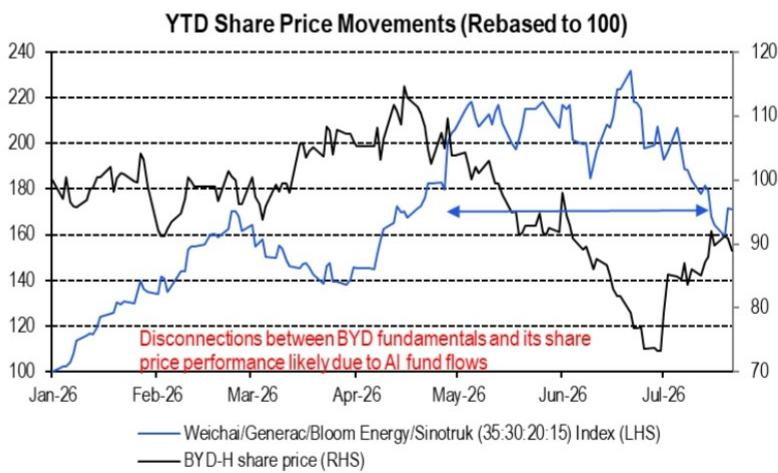
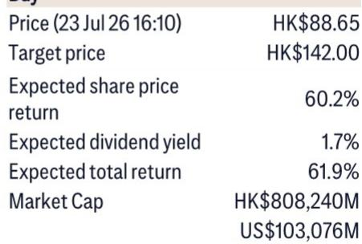

# 比亚迪的定价偏差是暂时的：基本面已恢复，回归在即

比亚迪的H股报价从2026年3月底约105港元跌至6月底低于90港元，而同期公司在几乎所有可衡量维度上的运营势头都在改善。出口量环比增长，订单接收加速，国内市场份额保持稳定，库存水平下降。一个综合基本面指数——由出口动态（权重40%）、订单（25%）、国内市场份额（20%）、行业新能源车同比趋势（10%）和库存水平（5%）构成——在整个4月至6月期间保持正值。从历史数据看，该指数的正值读数对报价回升具有建设性意义。2026年3月的案例印证了这一模式。第二季度的背离是例外，而非规律。

造成这种偏差的原因并非比亚迪业务恶化，而是三种外部力量暂时压过了公司的基本面信号：人工智能驱动的资金流向扰动将资本转向主题科技公司、关税相关情绪噪音导致对中国出口导向型企业采取避险姿态，以及国内新能源车需求偏弱对整个行业的估值倍数产生影响。这些因素均未改变比亚迪的竞争地位、成本结构或中期盈利轨迹，它们只是延迟了市场对基本面改善的认知。自6月底以来，报价与资金流向定位之间的差距已明显收窄，回归的结构性条件已经具备。

7月基本面指数读数为+0.07，基于以下假设输入：比亚迪库存环比下降3%、出口量增长5%、订单增长15%、批发量下降13%、行业新能源车销量同比下降5%。正值读数虽温和但明确。比相对水平更重要的是方向：该指数已连续四个月保持正值，而报价直到最近才开始反映这一现实。背离正在收窄，7月的数据点可能成为将报价与基本面重新连接起来的催化剂。

## 综合基本面指数揭示：比亚迪第二季度报价下跌是异常现象，而非信号

对报价下跌最简单的解释是业务发生了变化。在比亚迪的案例中，这种解释不成立。加权基本面指数——将五个运营变量整合为单一方向信号——在4月、5月和6月均为正值。出口量在这几个月均环比增长，订单接收增强，库存水平下降。相对少见转为负值的变量是行业层面的新能源车同比趋势，这反映了国内市场需求偏软。但这一单一逆风不足以将综合指数转为负值，因为比亚迪自身的运营指标改善足以抵消行业拖累。

对于依赖报价行为作为业务健康代理指标的观察者来说，这一含义至关重要。在第二季度，报价行为具有误导性，它暗示比亚迪面临基本面逆风。而实际上，公司执行良好，出口势头正在积聚，年初令市场担忧的库存积压正在消化。报价与基本面之间的脱节完全由公司外部因素驱动：人工智能资金流将资本从传统制造业公司抽走，以及关税头条新闻对中国相关公司（无论个体公司敞口如何）造成了全面折价。

这种偏差不可持续。基本面最终会重新确立自身，尤其是当报价与内在价值之间的差距像6月底那样扩大时。7月初这一差距的收窄表明重新确立已经开始。那些等待报价确认后再行动的观察者可能已经错过了最佳入场点。

## 人工智能资金流扰动是偏差最可能的原因，其消退是回归最可能的催化剂

报告明确将报价与基本面脱节归因于人工智能驱动的资金流扰动。这不是对市场情绪的模糊提及，而是一个具体机制：第二季度机构资本轮动进入人工智能主题公司，为非人工智能公司（包括比亚迪）创造了人为逆风。报告图2的数据显示了比亚迪与一组人工智能相关公司的年初至今报价走势，背离十分明显。当人工智能公司上涨时，比亚迪下跌，尽管其基本面正在改善。

该机制双向运作。如果人工智能资金流导致了偏差，那么这些资金流的消退应引发回归。有早期迹象表明这正在发生。自6月底以来，比亚迪报价与其资金流向定位之间的差距已明显收窄。报告将这种关系描述为“准备在7月回归”。这不是投机性预测，而是导致最初偏差的相同力量的逻辑结果。随着人工智能相关资金流稳定或逆转，资本将轮动回基本面良好但被落下的公司。比亚迪是中国汽车行业中最明显的候选者。

二阶含义是，观察者不应将第二季度的报价下跌视为永久性折价。它是一个由特定、可识别且可逆的资本流动模式造成的暂时扭曲。回归已经开始，7月基本面指数读数为此轮轮动提供了基本面依据。

## 出口势头和第二季度盈利交付是缩小估值差距的两个具体催化剂

报告确定了两个具体催化剂，应支持比亚迪2027财年盈利在2026年下半年逐步重估。第一个是持续到第三季度的出口势头。第二个是稳健的第二季度盈利交付，以解决市场对下半年净利润可见性的担忧。

出口势头是两者中更具结构性的一个。比亚迪的出口量一直在环比增长，报告假设仅7月就增长5%。这不是一次性事件，它反映了更广泛的战略转变：比亚迪越来越专注于国际市场作为增长驱动力，早期结果令人鼓舞。出口提供了多元化的收入来源，减少了对国内新能源车周期的依赖，并且由于比亚迪在竞争不那么激烈的市场中可以更具竞争力地定价，这些出口业务利润率更高。

第二季度盈利交付是更直接的催化剂。由于国内需求环境偏软和关税政策的不确定性，市场一直担心下半年净利润可见性。一份强劲的第二季度盈利报告将直接解决这些担忧，它将证明比亚迪即使在国内市场疲软时也能保持盈利能力，并为下半年预期提供基准。报告认为，这一上行空间取决于这两个催化剂能否实现。

## 估值框架基于PEG而非市盈率，因为成长型公司需要增长调整视角

报告使用1.2倍市盈率相对增长率（PEG）对比亚迪进行估值，应用于2026年至2027年25%的净利润复合年增长率。选择PEG而非市盈率是经过深思熟虑且分析合理的。简单的市盈率倍数会低估比亚迪，因为它未能考虑公司高于平均水平的盈利增长轨迹。PEG比率调整了增长因素，提供了与其他成长型公司更准确的比较。

隐含的2026年30倍市盈率按历史标准并不便宜，但对于一家每年盈利增长25%的公司来说是合理的。2027年25倍市盈率更具吸引力，因为它意味着随着盈利增长进入估值，倍数将压缩。估值论点的关键风险是增长率未能实现。报告确定了四个下行风险：新能源客车或乘用车销售弱于预期、云轨业务爬坡慢于预期、另一个长期资本支出周期以及意外现金流问题。这些都是资本密集型制造商的常见风险，但它们是可控的。比亚迪拥有强劲的资产负债表、多元化的产品组合和清晰的战略方向。增长轨迹是合理的，基于PEG的估值是适当的。

## 中国汽车行业定位决策框架：防御性稳定、出口主导重估和高贝塔上行是三种不同策略

报告的公司观点可以组织成一个决策框架，帮助观察者根据其风险承受能力和时间范围匹配适当的策略。该框架包含三个类别。

第一个类别是防御性稳定。报告将奇瑞、吉利和敏实集团列为“防御性长期买入”。这些公司拥有强大的市场地位、多元化的收入来源和相对较低的估值风险。它们适合希望获得中国汽车行业敞口但又不愿承担高增长公司波动的观察者。第二个类别是出口主导重估，包括比亚迪、潍柴动力、中国重汽和宇通客车。这些公司受益于出口势头，并随着盈利可见性改善而具有倍数扩张的潜力。这是2026年下半年信心最高的类别，因为催化剂具体且可衡量。第三个类别是进入汽车销售旺季的高贝塔上行潜力，包括零跑汽车和小鹏汽车。这些公司如果市场环境改善可能会大幅上涨，但风险更高，因为它们的估值更依赖于情绪而非基本面。

报告还包括对赛力斯和长城汽车的观点，以及对理想汽车、三花智控和拓普集团的观点。这不是对整个行业的全面看多，而是一个差异化观点，奖励具有出口敞口、运营纪律和可信增长轨迹的公司，同时惩罚缺乏这些特质的公司。对于构建中国汽车行业组合的观察者来说，该框架提供了一套清晰的权衡：防御性稳定适合风险规避资本，出口主导重估适合信念驱动资本，高贝塔上行适合战术资本。

对比亚迪的基本面论证是直接的：业务在改善，报价尚未反映，差距正在收窄。第二季度的偏差由外部资金流造成，而非内部恶化。7月基本面指数确认改善仍在继续。出口势头和第二季度盈利是缩小差距的催化剂。估值在PEG基础上是合理的，风险回报比有利。回归不是一种可能性，而是一种必然性，并且已经开始。

*仅供参考。部分内容可能基于源材料通过AI辅助生成、翻译、总结或编辑，可能存在遗漏或错误。请独立核实。这不构成专业建议。*

仅供参考。部分内容可能基于源材料通过AI辅助生成、翻译、总结或编辑，可能存在遗漏或错误。请独立核实。这不构成专业建议。

