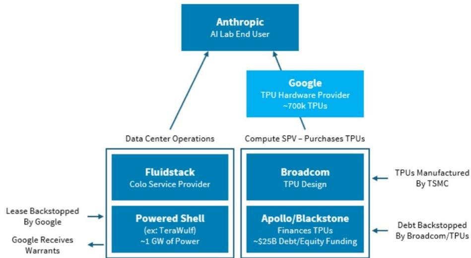
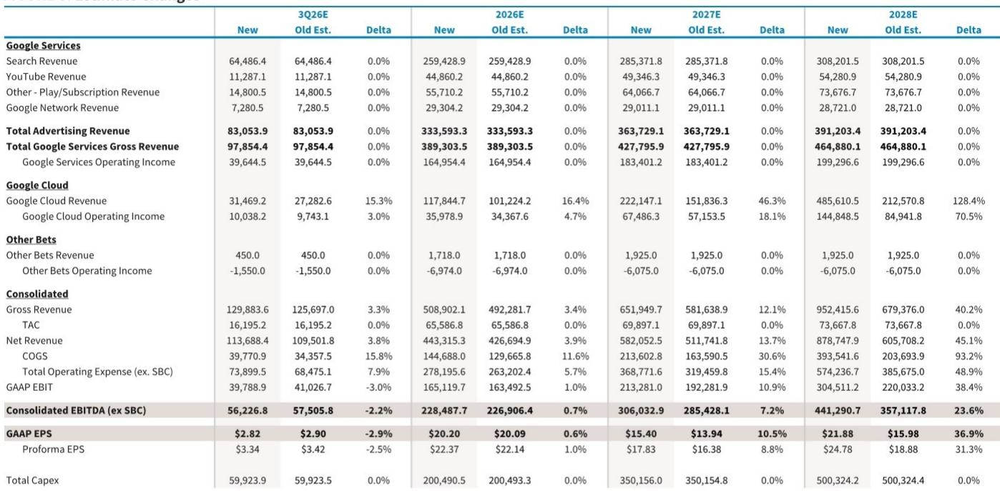
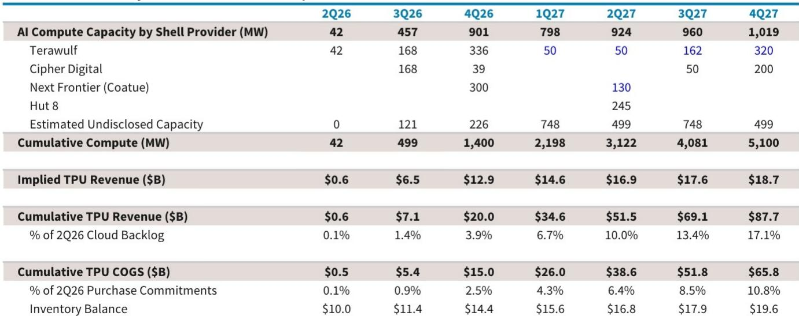

# Google的TPU即服务并非边缘项目——它可能重塑整个AI基础设施格局

Alphabet在云计算领域最具战略意义的转变，并非某个新产品功能或数据中心扩建，而是对AI算力融资、所有权和消费方式的根本性重构。通过将Tensor Processing Units直接出售给第三方特殊目的载体，而非仅通过Google Cloud Platform出租，Google实际上正在为AI时代打造一个芯片商业业务。这一规模已在其财务报表中显现：隐藏在10-Q文件中的采购承诺已飙升至8110亿美元，单季度增长4790亿美元。积压订单在短短六个月内增长了超过2750亿美元。这些并非增量数字，它们标志着一个商业模式转变——到2028年，可能为Alphabet的合并毛利润增加15%，并在公司转向轻资产AI基础设施模式时，显著降低未来的资本支出增长。

催化剂来自本季度的两项公告。5月，黑石集团和Google Cloud成立了一家合资企业，由一位前Google基础设施高管领导，为客户提供TPU即服务，初始0.5吉瓦容量将于2027年上线，并计划此后大幅扩展。6月，博通、黑石和阿波罗宣布了一个更大的AI XPU平台，目标到2028年达到20吉瓦容量，首批超过1吉瓦将于2026年中开始交付。第二个结构将同时支持Google的TPU和其他AI实验室（如OpenAI的Jalapeno芯片）的定制ASIC。对于Google的股东而言，相关部分是TPU组件，我们估计这可能在20吉瓦总容量中约占15吉瓦。财务影响显著：到2028年，TPU即服务收入可能达到2500亿美元，相当于当前市场共识Alphabet收入预期上修36%，毛利润提升15%。

这不是一个边缘实验。这是一项深思熟虑的战略，旨在将AI行业标准化到Google的芯片体系上，同时将资本密集度转移给财务合作伙伴。该结构之所以有效，是因为它协调了四个不同群体的利益：Google转移了资本支出和下游责任，Anthropic获得了运营控制权，博通开辟了新的收入来源，基础设施读者获得了有抵押的回报。AI生态系统中的每个参与者都应理解这一模式的运作方式，因为它将决定谁控制下一代前沿模型的成本结构。

## Google对外提供TPU的动机超越资本效率

显而易见的问题是，当Google自身面临算力约束时，为何要向第三方提供其最先进的AI芯片。答案并非单一，而这正是该战略稳健的原因。首先，Alphabet能在自身资产负债表上部署的AI资本支出存在自然限制。即使拥有Alphabet这样的财务资源，公司在债务容量、股权稀释容忍度和数据中心电力可用性方面也面临约束。其次，更具战略意义的是，Google Cloud的部分大型客户——Anthropic、Meta等——越来越要求对其计算基础设施拥有比标准云租赁协议更多的控制权。他们愿意为此控制权支付溢价。第三，作为芯片供应商销售TPU，为将更多AI行业标准化到Google的芯片架构上创造了路径。每个在TPU硬件上构建的开发者，即使在Google Cloud之外，也成为强化对Google软件栈、机器学习框架和开发者工具需求生态系统的一部分。第四，销售硬件而非出租算力，使Alphabet免受AI领域可能出现的下游责任——版权纠纷、安全漏洞、隐私侵犯或尚未出现的监管行动。当Anthropic通过特殊目的载体拥有的TPU运行推理时，版权侵权或内容审核失败的法律风险由Anthropic承担，而非Google。

这一转变的财务影响已嵌入Google的资产负债表。8110亿美元的采购承诺、新的库存项目以及快速增长的积压订单，都指向芯片商业产能的有意积累。我们估计每块TPU销售的毛利率约为25%——2026年每块约5000美元，到2028年随着下一代芯片定价更高，将升至超过13000美元——这意味着每吉瓦外部TPU容量在初始部署年为Google带来约140亿美元收入和35亿美元毛利润。到2028年，随着11.5吉瓦外部TPU容量上线，毛利润贡献达到630亿美元。

## 特殊目的载体结构为基础设施读者创造新资产类别

这些交易的架构设计与规模同样重要。每个TPU即服务部署遵循一致的四层结构。在底层，黑石、阿波罗或其他基础设施读者建立一个由股权和债务组合融资的特殊目的载体，其中债务以计算资产本身为抵押。该SPV直接从Google购买TPU，这些TPU由博通共同设计并由台积电制造。计算硬件随后安装在由第三方外壳提供商提供的数据中心中——TeraWulf、Cipher Digital和Hut 8等公司已宣布容量承诺——并由Fluidstack等托管运营商管理，负责Kubernetes管理和运营监督的“智能操作”层。最后，Anthropic等AI实验室以预定费率从SPV租赁容量，获得通过标准云服务协议无法获得的硬件根级访问权限。

这一结构之所以重要，是因为它将AI基础设施转变为可融资的资产类别。SPV的债务以已知使用寿命（通常为五年）的硬件和来自信用良好的AI实验室的合同收入流为担保。基础设施读者可以用与数据中心、管道或可再生能源项目相同的逻辑来承销这些交易：可预测的现金流、硬抵押品和不断增长的终端市场。不同之处在于技术周期更快，且每单位收入在上升而非下降，因为每一代TPU每美元提供的算力更多。这创造了一个良性循环：随着TPU性能提升，SPV可以收取更高的租赁费率，这支撑了更高的资产估值，从而吸引更多资本进入新的SPV。

对于博通而言，这一结构开辟了一个重要的新收入来源，使其业务从传统半导体客户中多元化。博通在共同设计TPU和其他定制XPU中的角色意味着它在每吉瓦部署的芯片价值中占据一部分。该公司到2028年实现20吉瓦容量的承诺，意味着一个多年收入流，该收入流在很大程度上独立于任何单一超大规模企业的资本支出周期。

## Anthropic获得运营控制权并隔离超大规模企业风险

对于Anthropic而言，其动机同样明确且可能更为紧迫。该公司依靠与Google Cloud和AWS的云计算合同发展壮大，虽然这种轻资产模式对其业务建设有效，但也带来了显著限制。在标准云协议下，Anthropic除了合同中明确规定的权利外，没有任何其他权利。它无法定制计算栈，无法修改内核或网络层，并且在可接受使用政策方面完全受超大规模企业自由裁量。

TPU即服务结构改变了这一切。通过SPV拥有计算资源，Anthropic获得了三个具体优势。首先，它可以在栈的多个层面定制计算。对TPU的根级访问使其能够进行在多租户云环境中根本无法实现的优化——定制内核模块、专用内存分配和精细功耗管理。其次，该公司可以更有效地进行垂直整合。当Anthropic控制硬件层时，它可以将其模型架构、训练流程和推理优化设计为一个统一系统，而非适应租赁平台的约束。第三，虽然这种情况不太可能发生，但控制计算资源使Anthropic的业务模式免受超大规模企业服务协议中任何差异的影响。违反可接受使用政策、合同纠纷或条款变更理论上可能导致云协议终止，这对完全依赖租赁计算的公司将是灾难性的。通过TPU即服务，这一风险被消除。

从纯单位成本角度看，Anthropic的经济效益略逊一筹。我们对一个代表性1吉瓦集群的分析显示，TPU即服务结构下每块TPU的总成本约为35000美元，而通过Google Cloud租赁同等容量为28000美元。差异源于SPV结构中更高的资本成本以及额外的托管管理费。然而，这种权衡是可以接受的，原因有二。首先，随着TPU代际进步和单位经济改善，成本差距会缩小。其次，更重要的是，对于前沿AI实验室而言，运营控制和垂直整合的价值远超边际成本溢价。Anthropic在自有结构下的推理利润率约为63%，而GCP租赁下为70%，但这7个百分点的利润率下降是为战略自主权付出的微小代价。

## 决策框架：CEO和CFO应如何评估TPU即服务

对于任何评估是否参与这一新模式的决策者——无论是作为客户、合作伙伴还是读者——决策框架基于四个变量：资本密集度、控制需求、技术周期风险和生态系统依赖。

资本密集度是最直接的变量。希望最小化前期投资并保持资产负债表灵活性的公司应继续从超大规模企业租赁计算资源。轻资产模式对AI实验室而言极为成功，正是因为它将资本支出推迟给云提供商。然而，这以牺牲控制权为代价，并使公司面临合同重新谈判或服务终止的风险。能够承受较高前期成本的公司——无论是通过自身资产负债表还是通过与基础设施读者合作——应追求TPU即服务模式以获得运营自主权。

控制需求是第二个变量。并非每个AI实验室都需要对其硬件的根级访问。专注于微调现有模型或在标准架构上运行推理的公司可能不会从TPU即服务实现的定制中受益。但对于推动模型架构、训练效率和推理优化边界的前沿实验室而言，控制完整栈的能力不是奢侈品，而是必需品。决策规则很简单：如果你的竞争优势依赖于硬件-软件协同优化，你需要拥有计算资源。

技术周期风险是第三个变量。TPU代际快速演进，今天最先进的硬件可能在三年后过时。在超大规模企业租赁模式下，这一风险由云提供商承担。在TPU即服务模式下，它由SPV承担，并最终通过租赁付款由AI实验室承担。公司必须评估所有权的运营收益是否超过被锁定在可能被拥有更新芯片的竞争对手超越的硬件代际中的风险。

生态系统依赖是第四个变量。Google的TPU栈与其软件生态系统深度集成——TensorFlow、JAX以及更广泛的Google Cloud AI平台。采用TPU即服务的公司是在对Google的芯片路线图和软件工具做出长期押注。这本身并非问题；Google在TPU性能改进和开发者投资方面有良好记录。但这是决策者必须承认的依赖关系。采用TPU即服务的决定，同时也是加深与Google技术栈对齐、减少对超大规模企业云服务依赖的决定。

## 积压订单数据证实这已在推进，而非推测

怀疑论者可能会认为这些结构过于复杂难以规模化，融资不确定，或者AI实验室最终会更喜欢云租赁的简单性。Google自身财务披露的数据表明并非如此。截至2026年第二季度的8110亿美元采购承诺并非理论数字。它代表了Google已向TPU及相关基础设施供应商做出的合同义务。过去六个月积压订单增加2750亿美元表明这些承诺正在加速而非减速。

此外，将容纳这些TPU的数据中心外壳提供商已开始宣布容量。TeraWulf、Cipher Digital、Next Frontier和Hut 8已共同披露了部署时间表，暗示到2027年底累计计算容量超过5000兆瓦。仅这些已宣布的部署所隐含的TPU收入，到2027年第四季度累计达到877亿美元。这些并非推测性预测。它们是已签署合同和建设时间表的直接结果。

对观察者而言，最重要的启示是TPU即服务最终可能降低Google未来的资本支出增长。如果公司可以通过外部SPV而非自身资产负债表扩展AI基础设施，那么市场共识预测2028年5000亿美元的资本支出可能过高。AI基础设施的轻资产方法改善了Google的投入资本回报率，释放了用于股票回购或其他投资的现金，并降低了建设可能未被充分利用的容量的风险。这与超大规模企业资本支出将持续无限增长的说法相反。

AI基础设施模式正在实时重写。Google找到了在不承担全部资本风险的情况下将其芯片优势货币化的方法，Anthropic找到了运营独立的路径，基础设施读者发现了一个具有可预测回报的新资产类别。数字是巨大的——2500亿美元收入、630亿美元毛利润、相对于市场共识15%的上行空间——但战略逻辑更为宏大。TPU即服务不是产品扩展。它是AI行业未来十年如何为其增长融资的蓝图。

*仅供参考。部分内容可能基于源材料通过AI辅助生成、翻译、总结或编辑，可能存在遗漏或错误。请独立核实。本文不构成专业建议。*
