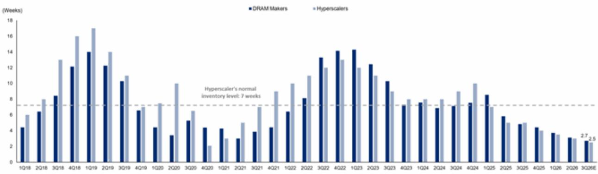
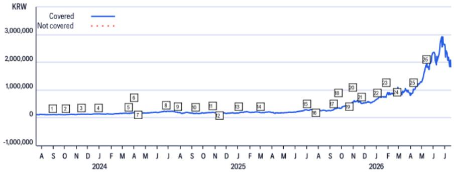
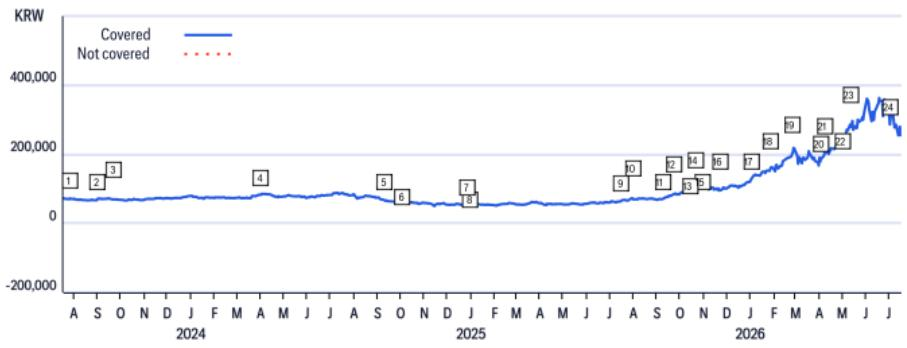
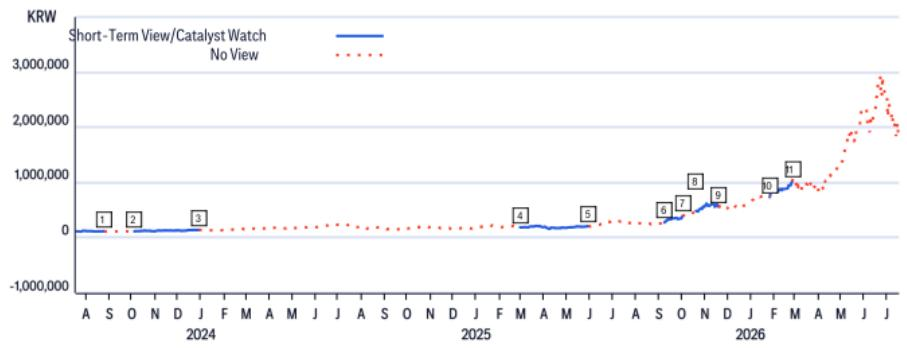

# Global Semiconductors

Reality Check: Memory Upcycle Intact on Tight Inventories and Strong KV Cache Demand

## CITI'S TAKE

Korea memory equities have seen share price pullback amid the debate around possible peak-out of DRAM/NAND cycle on weakened Chinese smartphone demand and rising NAND channel inventory. Contrary to the market concern, our market analysis indicates that NAND inventories stand extremely lean at 2.6 weeks at memory suppliers and 3 weeks at hyperscalers who are major eSSD customers. We reaffirm that solid AI demand keeps memory in undersupply.

NAND Inventory of Memory Suppliers/Hyperscalers at 2.6/3.0 weeks — Our analysis indicates (Fig.1) that 3Q26 NAND inventory at NAND suppliers is severely depleted at 2.6 weeks, below the normal level of 5 weeks. Hyperscaler's NAND inventory is at 3 weeks, much lower than the normal level of 7 weeks. In terms of NAND channel inventory, the inventory is at 5 weeks, significantly lower than the average normal level of 15 weeks. Likewise, DRAM suppliers' inventory is at 2.7 weeks (Fig.2), lower than the normal level of 5 weeks. Hyperscalers' DRAM inventory remains very low at 2.5 weeks, falling below the normal level of 7 weeks. DRAM channel inventory is at 4 weeks, which is also exceptionally lower vs. the normal level of 15 weeks.

Robust NAND Demand Upside from CMX and QLC NAND despite Consumer NAND Weakness — While recent weakness in Chinese smartphone demand has raised concerns about softening NAND prices, we expect CMX demand to rise driven by KV cache demand growth on the increasing usage of AI agents. Moreover, we project QLC SSD NAND demand to grow further as QLC SSD NAND will be increasingly utilized as a near GPU storage solution to enhance AI computing efficiency. In particular, given that Nvidia's Vera Rubin has adopted 16TB TLC SSD for CMX operation, 1,152 TB SSD is required per Rubin server system. We project CMX NAND demand to reach 34.6/115.2bn 8Gb Equiv. in 26E/27E respectively, which translates to 2.8%/9.3% of 26E global NAND demand.

Implication — Contrary to market concerns, we find memory inventory levels to be materially low at both memory suppliers and their customers. Despite fears of weak Chinese smartphone demand, memory supply/demand sufficiency at DRAM/NAND suppliers has in fact fallen from 70% to 50%. With lean memory inventory situation across supply chain, rising CMX and QLC NAND demand will result in persistent undersupply.

Peter Lee $^{AC}$ +82-2-3705-0720
peter.sc.lee@citi.com

Jayden Oh
+82-2-3705-0747
jayden.oh@citi.com

See Appendix A-1 for Analyst Certification, Important Disclosures and Research Analyst Affiliations

Figure 1. NAND Inventory Trend  
  
© 2026 Citi Inc. No redistribution without Citi's written permission.
Source: Citi Estimates

Figure 2. DRAM Inventory Trend  
  
© 2026 Citi Inc. No redistribution without Citi's written permission.  
Source: Citi Estimates

## Samsung Electronics

(005930.KS; W249500.0; 1; 24 Jul 26; 15:45)

## Valuation

Our 12-month target price for Samsung of W530,000 is derived using a sum-of-the-parts (SOTP) methodology, based on 2026E EBITDA. In calculating total operating value, we reference global peers in assigning fair-value EV/EBITDA multiples for the five main divisions (7.6x for Memory, 4.1x for Foundry, 0.5x for Display Panel, 4.8x for Mobile and 2.0x for Consumer Electronics), in line with trading multiples of relevant peer companies.

## Risks

Downside risks that could prevent the shares from reaching our target price include: 1) Longer-than-expected approval delay in HBM shipment to its key customers; 2) PC sales weaken more than our forecast and NAND demand fails to meet our expectations; 3) aggressive investment by competitors in memory semiconductor/foundry could have a negative impact on prices; 4) competition in the handset market intensifies, reducing SEC's handset margins; 5) any major appreciation of the won would impact SEC's earnings.

## SK Hynix

(000660.KS; W1759000.0; 1; 24 Jul 26; 15:45)

## Valuation

Our 12-month target price for SK Hynix of W3,100,000 is derived using a sum-of-the-parts (SOTP) methodology, based on 2026E EBITDA. In calculating total operating value, we break down SK Hynix's operating businesses into HBM and commodity/others business to reflect a structural change in next-gen memory market. We reference a global peer (TSMC) in assigning a fair-value EV/EBITDA multiple for HBM business, as we project the memory market is evolving from a traditional commodity market into a highly customized & customer-specific market much closer to the foundry business. For commodity memory business, we apply a historical average of 12m fwd EV/EBITDA during the beginning or early stage of memory upcycles in the past. We apply 7.2x EV/EBITDA to HBM segment and 4.2x to commodity segment to derive the target price.

## Risks

Downside risks that could prevent the shares from reaching our target price include: 1) a downturn in DRAM demand; 2) weaker NAND demand than our forecasts; and 3) weakness in global consumption.

If you are visually impaired and would like to speak to a Citi representative regarding the details of the graphics in this document, please call USA 1-888-500-5008 (TTY: 711), from outside the US +1-210-677-3788

## Appendix A-1

## ANALYST CERTIFICATION

The research analysts primarily responsible for the preparation and content of this research report are either (i) designated by "AC" in the author block or (ii) listed in bold alongside content which is attributable to that analyst. If multiple AC analysts are designated in the author block, each analyst is certifying with respect to the entire research report other than (a) content attributable to another AC certifying analyst listed in bold alongside the content and (b) views expressed solely with respect to a specific issuer which are attributable to another AC certifying analyst identified in the price charts or rating history tables for that issuer shown below. Each of these analysts certify, with respect to the sections of the report for which they are responsible: (1) that the views expressed therein accurately reflect their personal views about each issuer and security referenced and were prepared in an independent manner, including with respect to Citi Global Markets Inc. and its affiliates; and (2) no part of the research analyst's compensation was, is, or will be, directly or indirectly, related to the specific recommendations or views expressed by that research analyst in this report.

## IMPORTANT DISCLOSURES

SK Hynix (000660.KS)
Ratings and Target Price History
Fundamental Research

<table><tr><td colspan="2">Date</td><td>Rating</td><td>Target Price</td><td>Closing Price</td></tr><tr><td>1</td><td>30-Aug-23 11:34:39</td><td>1</td><td>*180,000.00</td><td>119,400.00</td></tr><tr><td>2</td><td>04-Oct-23 06:14:16</td><td>1</td><td>*185,000.00</td><td>115,400.00</td></tr><tr><td>3</td><td>13-Nov-23 09:52:50</td><td>1</td><td>*190,000.00</td><td>131,800.00</td></tr><tr><td>4</td><td>01-Jan-24 18:20:58</td><td>1</td><td>*230,000.00</td><td>141,500.00</td></tr><tr><td>5</td><td>18-Mar-24 10:47:11</td><td>1</td><td>*234,000.00</td><td>164,300.00</td></tr><tr><td>6</td><td>01-Apr-24 10:34:31</td><td>1</td><td>*238,000.00</td><td>185,500.00</td></tr><tr><td>7</td><td>12-Apr-24 08:17:40</td><td>1</td><td>*310,000.00</td><td>187,400.00</td></tr><tr><td>8</td><td>25-Jun-24 06:27:18</td><td>1</td><td>*350,000.00</td><td>225,000.00</td></tr><tr><td>9</td><td>25-Jul-24 03:44:27</td><td>1</td><td>*337,000.00</td><td>190,000.00</td></tr></table>

\*Indicates Change

<table><tr><td colspan="2">Date</td><td>Rating</td><td>Target Price</td><td>Closing Price</td></tr><tr><td>10</td><td>09-Sep-24 02:31:32</td><td>1</td><td>*310,000.00</td><td>157,000.00</td></tr><tr><td>11</td><td>24-Oct-24 06:29:30</td><td>1</td><td>*330,000.00</td><td>198,200.00</td></tr><tr><td>12</td><td>12-Nov-24 10:31:16</td><td>1</td><td>*350,000.00</td><td>185,800.00</td></tr><tr><td>13</td><td>31-Dec-24 06:45:21</td><td>1</td><td>*340,000.00</td><td>173,900.00</td></tr><tr><td>14</td><td>03-Mar-25 15:00:11</td><td>1</td><td>*350,000.00</td><td>190,200.00</td></tr><tr><td>15</td><td>01-Jul-25 03:45:10</td><td>1</td><td>*430,000.00</td><td>285,500.00</td></tr><tr><td>16</td><td>24-Jul-25 04:40:40</td><td>1</td><td>*380,000.00</td><td>269,500.00</td></tr><tr><td>17</td><td>08-Sep-25 10:00:23</td><td>1</td><td>*430,000.00</td><td>277,000.00</td></tr><tr><td>18</td><td>22-Sep-25 06:19:28</td><td>1</td><td>*480,000.00</td><td>351,000.00</td></tr></table>

<table><tr><td>Date</td><td>Rating</td><td>Target Price</td><td>Closing Price</td></tr><tr><td>19 20-Oct-25 04:22:50</td><td>1</td><td>*640,000.00</td><td>485,500.00</td></tr><tr><td>20 29-Oct-25 02:38:54</td><td>1</td><td>*770,000.00</td><td>558,000.00</td></tr><tr><td>21 23-Nov-25 10:20:04</td><td>1</td><td>*830,000.00</td><td>521,000.00</td></tr><tr><td>22 02-Jan-26 03:22:42</td><td>1</td><td>*900,000.00</td><td>677,000.00</td></tr><tr><td>23 26-Jan-26 07:57:46</td><td colspan="2"> $\dagger$ 1,400,000.00</td><td>736,000.00</td></tr><tr><td>24 24-Feb-26 08:08:02</td><td colspan="2"> $\dagger$ 1,550,000.00</td><td>,005,000.00</td></tr><tr><td>25 08-Apr-26 07:47:52</td><td colspan="2"> $\dagger$ 1,700,000.00</td><td>,033,000.00</td></tr><tr><td>26 11-May-26 07:42:14</td><td colspan="2"> $\dagger$ 3,100,000.00</td><td>,880,000.00</td></tr></table>

Rating/target price changes above reflect Eastern Time

Samsung Electronics (005930.KS)
Ratings and Target Price History
Fundamental Research  

<table><tr><td colspan="2">Date</td><td>Rating</td><td>Target Price</td><td>Closing Price</td></tr><tr><td>1</td><td>27-Jul-23 05:53:47</td><td>1</td><td>*110,000.00</td><td>71,700.00</td></tr><tr><td>2</td><td>31-Aug-23 06:54:46</td><td>1</td><td>*120,000.00</td><td>66,900.00</td></tr><tr><td>3</td><td>22-Sep-23 09:53:22</td><td>1</td><td>*110,000.00</td><td>68,800.00</td></tr><tr><td>4</td><td>01-Apr-24 05:23:20</td><td>1</td><td>*120,000.00</td><td>82,000.00</td></tr><tr><td>5</td><td>09-Sep-24 02:31:35</td><td>1</td><td>*110,000.00</td><td>67,500.00</td></tr><tr><td>6</td><td>02-Oct-24 05:16:51</td><td>1</td><td>*97,000.00</td><td>61,300.00</td></tr><tr><td>7</td><td>26-Dec-24 07:42:50</td><td>1</td><td>*87,000.00</td><td>53,600.00</td></tr><tr><td>8</td><td>31-Dec-24 06:21:22</td><td>1</td><td>*83,000.00</td><td>53,200.00</td></tr></table>

\*Indicates Change

<table><tr><td></td><td>Date</td><td>Rating</td><td>Target Price</td><td>Closing Price</td></tr><tr><td>9</td><td>16-Jul-25 05:08:04</td><td>1</td><td>*90,000.00</td><td>64,700.00</td></tr><tr><td>10</td><td>31-Jul-25 02:49:57</td><td>1</td><td>*100,000.00</td><td>71,400.00</td></tr><tr><td>11</td><td>08-Sep-25 09:30:31</td><td>1</td><td>*110,000.00</td><td>70,100.00</td></tr><tr><td>12</td><td>22-Sep-25 05:57:03</td><td>1</td><td>*120,000.00</td><td>83,500.00</td></tr><tr><td>13</td><td>14-Oct-25 07:05:40</td><td>1</td><td>*133,000.00</td><td>91,600.00</td></tr><tr><td>14</td><td>20-Oct-25 06:25:10</td><td>1</td><td>*145,000.00</td><td>98,100.00</td></tr><tr><td>15</td><td>30-Oct-25 11:44:04</td><td>1</td><td>*150,000.00</td><td>104,100.00</td></tr><tr><td>16</td><td>23-Nov-25 10:07:18</td><td>1</td><td>*170,000.00</td><td>94,800.00</td></tr></table>

<table><tr><td>Date</td><td>Rating</td><td>Target Price</td><td>Closing Price</td></tr><tr><td>17 02-Jan-26 02:41:08</td><td>1</td><td>*200,000.00</td><td>128,500.00</td></tr><tr><td>18 26-Jan-26 09:32:20</td><td>1</td><td>*240,000.00</td><td>152,100.00</td></tr><tr><td>19 24-Feb-26 05:11:17</td><td>1</td><td>*280,000.00</td><td>200,000.00</td></tr><tr><td>20 02-Apr-26 07:54:27</td><td>1</td><td>*300,000.00</td><td>178,400.00</td></tr><tr><td>21 07-Apr-26 02:31:16</td><td>1</td><td>*320,000.00</td><td>196,500.00</td></tr><tr><td>22 30-Apr-26 03:49:59</td><td>1</td><td>*300,000.00</td><td>220,500.00</td></tr><tr><td>23 11-May-26 07:42:55</td><td>1</td><td>*460,000.00</td><td>285,500.00</td></tr><tr><td>24 02-Jul-26 03:16:27</td><td>1</td><td>*530,000.00</td><td>286,000.00</td></tr></table>

Rating/target price changes above reflect Eastern Time

<table><tr><td></td><td>Date</td><td>Action</td><td>Expected Direction</td><td>Duration</td><td>Closing Price</td></tr><tr><td>1</td><td>31-Aug-23 02:54:46</td><td>Add CW</td><td>Upside</td><td>90 Days</td><td>66,900.00</td></tr><tr><td>2</td><td>28-Nov-23 21:19:48</td><td>Remove CW</td><td>Upside</td><td>90 Days</td><td>72,700.00</td></tr><tr><td>3</td><td>01-Apr-24 01:23:20</td><td>Add CW</td><td>Upside</td><td>30 Days</td><td>82,000.00</td></tr><tr><td>4</td><td>30-Apr-24 22:52:33</td><td>Remove CW</td><td>Upside</td><td>30 Days</td><td>77,500.00</td></tr></table>

CW - Catalyst Watch, STV - Short-Term View

<table><tr><td></td><td>Date</td><td>Action</td><td>ExpectedDirection</td><td>Duration</td><td>ClosingPrice</td></tr><tr><td>5</td><td>17-Nov-24 11:09:02</td><td>Add CW</td><td>Upside</td><td>90 Days</td><td>53,500.00</td></tr><tr><td>6</td><td>14-Feb-25 12:17:17</td><td>Remove CW</td><td>Upside</td><td>90 Days</td><td>56,000.00</td></tr><tr><td>7</td><td>16-Jul-25 01:08:04</td><td>Add CW</td><td>Upside</td><td>30 Days</td><td>64,700.00</td></tr><tr><td>8</td><td>15-Aug-25 14:07:20</td><td>Remove CW</td><td>Upside</td><td>30 Days</td><td>71,600.00</td></tr></table>

<table><tr><td></td><td>Date</td><td>Action</td><td>Expected Direction</td><td>Duration</td><td>Closing Price</td></tr><tr><td>9</td><td>23-Nov-25 05:07:18</td><td>Add CW</td><td>Upside</td><td>30 Days</td><td>94,800.00</td></tr><tr><td>10</td><td>23-Dec-25 20:51:38</td><td>Remove CW</td><td>Upside</td><td>30 Days</td><td>111,500.00</td></tr><tr><td>11</td><td>11-May-26 03:42:55</td><td>Add CW</td><td>Upside</td><td>90 Days</td><td>285,500.00</td></tr></table>

Rating/target price changes above reflect Eastern Time

<table><tr><td></td><td>Date</td><td>Action</td><td>Expected Direction</td><td>Duration</td><td>Closing Price</td></tr><tr><td>1</td><td>27-Aug-23 22:58:59</td><td>Remove CW</td><td>Upside</td><td>90 Days</td><td>116,500.00</td></tr><tr><td>2</td><td>04-Oct-23 02:14:16</td><td>Add CW</td><td>Upside</td><td>90 Days</td><td>115,400.00</td></tr><tr><td>3</td><td>01-Jan-24 21:19:41</td><td>Remove CW</td><td>Upside</td><td>90 Days</td><td>141,500.00</td></tr><tr><td>4</td><td>03-Mar-25 10:00:11</td><td>Add CW</td><td>Upside</td><td>90 Days</td><td>190,200.00</td></tr></table>

CW - Catalyst Watch, STV - Short-Term View

<table><tr><td>Date</td><td>Action</td><td>Expected Direction</td><td>Closing Price</td></tr><tr><td>19-Nov-25 21:15:03</td><td>Remove CW</td><td>Upside</td><td>30 Days 562,000.00</td></tr><tr><td>26-Jan-26 02:57:46</td><td>Add CW</td><td>Upside</td><td>30 Days 736,000.00</td></tr><tr><td>25-Feb-26 20:57:35</td><td>Remove CW</td><td>Upside</td><td>30 Dayd,018,000.00</td></tr></table>

Rating/target price changes above reflect Eastern Time

Within the past 12 months, Citi Global Markets Inc. or its affiliates has acted as manager or co-manager of an offering of securities of SK Hynix, Samsung Electronics.

<table><tr><td>Citi Global Markets Inc. or its affiliates has received compensation for investment banking services provided within the past 12 months from SK Hynix,Samsung Electronics.</td></tr><tr><td>Citi Global Markets Inc. or its affiliates expects to receive or intends to seek, within the next three months, compensation for investment banking services from SK Hynix,Samsung Electronics.</td></tr><tr><td>Citi Global Markets Inc. or its affiliates received compensation for products and services other than investment banking services from SK Hynix,Samsung Electronics in the past 12 months.</td></tr><tr><td>Citi Global Markets Inc. or its affiliates currently has, or had within the past 12 months, the following as investment banking client(s): SK Hynix,Samsung Electronics.</td></tr><tr><td>Citi Global Markets Inc. or its affiliates currently has, or had within the past 12 months, the following as clients, and the services provided were non-investment-banking, securities-related: SK Hynix,Samsung Electronics.</td></tr><tr><td>Citi Global Markets Inc. or its affiliates currently has, or had within the past 12 months, the following as clients, and the services provided were non-investment-banking, non-securities-related: SK Hynix,Samsung Electronics.</td></tr><tr><td>Citi Global Markets Inc. and/or its affiliates has a significant financial interest in relation to SK Hynix,Samsung Electronics. (For an explanation of the determination of significant financial interest, please refer to the policy for managing conflicts of interest which can be found at www.citiVelocity.com.)</td></tr><tr><td>Analysts&#x27; compensation is determined by Citi management and Citi&#x27;s senior management and is based upon activities and services intended to benefit the investor clients of Citi Global Markets Inc. and its affiliates (the &quot;Firm&quot;). Compensation is not linked to specific transactions or recommendations. Like all Firm employees, analysts receive compensation that is impacted by overall Firm profitability which includes investment banking, sales and trading, and principal trading revenues. One factor in equity research analyst compensation is arranging corporate access events between institutional clients and the management teams of covered companies. Typically, company management is more likely to participate when the analyst has a positive view of the company.</td></tr><tr><td>For financial instruments recommended in the Product in which the Firm is not a market maker, the Firm is a liquidity provider in such financial instruments (and any underlying instruments) and may act as principal in connection with transactions in such instruments. The Firm is a regular issuer of traded financial instruments linked to securities that may have been recommended in the Product. The Firm regularly trades in the securities of the issuer(s) discussed in the Product. The Firm may engage in securities transactions in a manner inconsistent with the Product and, with respect to securities covered by the Product, will buy or sell from customers on a principal basis.</td></tr><tr><td>Unless stated otherwise neither the Research Analyst nor any member of their team has viewed the material operations of the Companies for which an investment view has been provided within the past 12 months.</td></tr><tr><td>For important disclosures (including copies of historical disclosures) regarding the companies that are the subject of this Citi product (&quot;the Product&quot;), please contact Citi, 388 Greenwich Street, 6th Floor, New York, NY, 10013, Attention: Legal/Compliance [E6WYB6412478]. In addition, the same important disclosures, with the exception of the Valuation and Risk assessments and historical disclosures, are contained on the Firm&#x27;s disclosure website at https://www.citivelocity.com/cvr/eppublic/citi_research_disclosures. Valuation and Risk assessments can be found in the text of the most recent research note/report regarding the subject company. Pursuant to the Market Abuse Regulation a history of all Citi recommendations published during the preceding 12-month period can be accessed via Citi Velocity (https://www.citivelocity.com/cv2) or your standard distribution portal. Historical disclosures (for up to the past three years) will be provided upon request.</td></tr></table>

<table><tr><td colspan="7">Citi Equity Ratings Distribution</td></tr><tr><td></td><td colspan="3">12 Month Rating</td><td colspan="3">Catalyst Watch</td></tr><tr><td>Data current as of 01 Jul 2026</td><td>Buy</td><td>Hold</td><td>Sell</td><td>Buy</td><td>Hold</td><td>Sell</td></tr><tr><td>Citi Global Fundamental Coverage (Neutral=Hold)</td><td>61%</td><td>32%</td><td>7%</td><td>36%</td><td>48%</td><td>16%</td></tr><tr><td>% of companies in each rating category that are investment banking clients</td><td>38%</td><td>42%</td><td>27%</td><td>42%</td><td>37%</td><td>36%</td></tr></table>

## Guide to Citi Fundamental Research Investment Ratings:

Citi stock recommendations include an investment rating and an optional risk rating to highlight high risk stocks. Risk rating takes into account both price volatility and fundamental criteria. Stocks will either have no risk rating or a High risk rating assigned.

Investment Ratings: Citi investment ratings are Buy, Neutral and Sell. Our ratings are a function of analyst expectations of expected total return ("ETR") and risk. ETR is the sum of the forecast price appreciation (or depreciation) plus the dividend yield for a stock within the next 12 months. The target price is based on a 12 month time horizon. The Investment rating definitions are: Buy (1) ETR of 15% or more or 25% or more for High risk stocks; and Sell (3) for negative ETR. Any covered stock not assigned a Buy or a Sell is a Neutral (2). For stocks rated Neutral (2), if an analyst believes that there are insufficient valuation drivers and/or investment catalysts to derive a positive or negative investment view, they may elect with the approval of Citi management not to assign a target price and, thus, not derive an ETR. Citi may suspend its rating and target price and assign "Rating Suspended" status for regulatory and/or internal policy reasons. Citi may also suspend its rating and target price and assign "Under Review" status for other exceptional circumstances (e.g. lack of information critical to the analyst's thesis, trading suspension) affecting the company and/or trading in the company's securities. In both such situations, the rating and target price will show as "—" and "-" respectively in the rating history price chart. Prior to 11 April 2022 Citi assigned "Under Review" status to both situations and prior to 11 Nov 2020 only in exceptional circumstances. As soon as practically possible, the analyst will publish a note re-establishing a rating and

investment thesis. Investment ratings are determined by the ranges described above at the time of initiation of coverage, a change in investment and/or risk rating, or a change in target price (subject to limited management discretion). At times, the expected total returns may fall outside of these ranges because of market price movements and/or other short-term volatility or trading patterns. Such interim deviations will be permitted but will become subject to review by Research Management. Your decision to buy or sell a security should be based upon your personal investment objectives and should be made only after evaluating the stock's expected performance and risk.

Catalyst Watch/Short Term Views ("STV") Ratings Disclosure:

Catalyst Watch and STV Upside/Downside calls: Citi may also include a Catalyst Watch or STV Upside or Downside call to indicate the analyst expects the share price to rise (fall) in absolute terms over a specified period of 30 or 90 days in reaction to one or more specific near-term catalysts or events impacting the company or the market. A Catalyst Watch will be published when Analyst confidence is high that an impact to share price will occur; it will be a STV when confidence level is moderate. A Catalyst Watch or STV Upside/Downside call will automatically expire at the end of the specified 30/90 day period. The Catalyst Watch will also be automatically removed if share price performance (calculated at market close) exceeds 15% against the direction of the call (unless over-ridden by the analyst). The analyst may also remove a Catalyst Watch or STV call prior to the end of the specified period in a published research note. A Catalyst Watch/STV Upside or Downside call may be different from and does not affect a stock's fundamental equity rating, which reflects a longer-term total absolute return expectation. For purposes of FINRA ratings-distribution-disclosure rules, a Catalyst Watch/STV Upside call corresponds to a buy recommendation and a Catalyst Watch/STV Downside call corresponds to a sell recommendation. Any stock not assigned to a Catalyst Watch Upside, Catalyst Watch Downside, STV Upside, or STV Downside call is considered Catalyst Watch/STV No View. For purposes of FINRA ratings distribution-disclosure rules, we correspond Catalyst Watch/STV No View to Hold in our ratings distribution table for our Catalyst Watch/STV Upside/Downside rating system. However, we reiterate that we do not consider No View to be a recommendation. For all Catalyst Watch/STV Upside/Downside calls, risk exists that the catalyst(s) and associated share-price movement will not materialize as expected.

## RESEARCH ANALYST AFFILIATIONS / NON-US RESEARCH ANALYST DISCLOSURES

The legal entities employing the authors of this report are listed below (and their regulators are listed further herein). Non-US research analysts who have prepared this report (i.e., all research analysts listed below other than those identified as employed by Citi Global Markets Inc.) are not registered/qualified as research analysts with FINRA. Such research analysts may not be associated persons of the member organization (but are employed by an affiliate of the member organization) and therefore may not be subject to the FINRA Rule 2241 restrictions on communications with a subject company, public appearances and trading securities held by a research analyst account.

<table><tr><td>Citi Global Markets Korea Securities Limited</td><td>Peter Lee; Jayden Oh</td></tr><tr><td colspan="2">OTHER DISCLOSURES</td></tr><tr><td colspan="2">Any price(s) of instruments mentioned in recommendations are as of the prior day&#x27;s market close on the primary market for the
