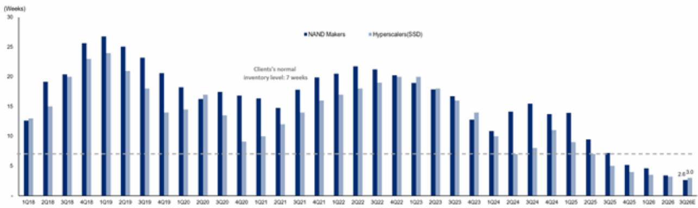
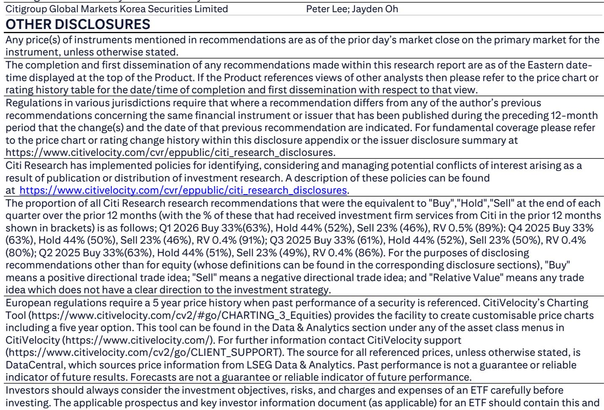

# The Memory Upcycle Has Not Peaked: AI-Driven KV Cache Demand Is Creating a Structural Undersupply That the Market Is Underpricing

The recent pullback in Korea memory equities reflects a classic market error: extrapolating a narrow weakness in Chinese smartphone demand into a broad-cycle peak. According to a detailed inventory analysis, NAND inventories at memory suppliers stand at just 2.6 weeks, and at hyperscalers at only 3 weeks. Both figures are roughly half their normal levels of 5 and 7 weeks, respectively. DRAM inventories tell the same story: 2.7 weeks at suppliers versus a normal 5 weeks, and 2.5 weeks at hyperscalers versus a normal 7 weeks. These are not the inventory levels of a cycle turning over. They are the signature of an industry that remains structurally undersupplied.

The market's fixation on consumer-end weakness obscures a more consequential development: the emergence of AI-driven memory demand from two specific sources that did not exist in prior cycles. Compute Express Link (CMX) memory, driven by the exploding KV cache requirements of AI agents, and QLC NAND, increasingly deployed as near-GPU storage, are creating a new demand vector that is both large and growing rapidly. By 2027, CMX NAND demand alone is projected to reach 115.2 billion 8Gb equivalents, representing 9.3% of global NAND demand. When combined with persistently lean inventories across the entire supply chain, the implication is clear: the memory upcycle is intact, and the market is mispricing its duration and magnitude.

## The Supply-Demand Balance Has Tightened from 70% to 50%, Contradicting Peak-Cycle Narratives

The most direct evidence that the cycle has not peaked comes from the supply-demand sufficiency ratio, which measures how much of total demand can be met by available supply. According to the analysis, this ratio has fallen from 70% to 50% at DRAM and NAND suppliers. A declining sufficiency ratio in the face of rising demand is precisely the opposite of what one would observe at a cyclical peak. At a peak, supply catches up with demand, inventories build, and the sufficiency ratio rises. Here, the ratio is compressing, indicating that demand growth is outpacing supply additions.

This compression is occurring despite the widely reported weakness in Chinese smartphone demand, which has been the primary bear argument. The fact that the sufficiency ratio continues to tighten even as one end-market softens reveals that the AI-driven demand segments are more than compensating. For observers, the critical insight is that the traditional cycle-timing indicators—inventory weeks and sufficiency ratios—are pointing in the opposite direction from sentiment. The market is treating a consumer headwind as a systemic peak, when in reality the structural drivers are strengthening.

## CMX and QLC NAND Are Creating a Second Demand Curve That Consumer Weakness Cannot Offset

The standard memory cycle has been driven by PC, smartphone, and enterprise server demand. Each of these end-markets has a well-understood seasonal and replacement-cycle pattern. The current cycle is different because a new demand curve is emerging from the AI infrastructure buildout, specifically from the memory requirements of large language model inference.

CMX memory is the key enabler of the KV cache, which stores intermediate computations during AI inference. As AI agents become more autonomous and handle longer contexts, the KV cache grows super-linearly. The analysis projects CMX NAND demand at 34.6 billion 8Gb equivalents in 2026 and 115.2 billion in 2027. To put that in perspective, the 2027 figure represents nearly 10% of all global NAND demand. This is not a niche application. It is a new, large, and structurally growing demand pool that did not exist in the prior upcycle.

QLC NAND adds another layer. As AI training clusters scale, the bottleneck shifts from compute to data movement. QLC SSDs are increasingly used as near-GPU storage to improve computing efficiency, reducing the latency of feeding data to accelerators. The adoption of 16TB TLC SSDs in Nvidia's Vera Rubin systems for CMX operation means that each Rubin server system requires 1,152 TB of SSD capacity. This is a hardware requirement, not a forecast. The demand is baked into the architecture of next-generation AI systems.

For memory suppliers, the strategic implication is profound: they are no longer solely dependent on the consumer replacement cycle. Even if Chinese smartphone demand continues to soften, the AI-driven demand from CMX and QLC NAND is large enough to absorb available supply and keep the market in undersupply. The traditional cycle-timing framework that observers rely on is missing this new variable.

## Channel Inventory at 5 Weeks Versus a Normal 15 Weeks Means There Is No Inventory Overhang to Amplify a Downturn

One of the mechanisms that amplifies memory downturns is the inventory overhang in the distribution channel. When demand weakens, channel partners destock, and the compounded effect of falling end-demand and inventory reduction creates a severe price correction. Currently, NAND channel inventory stands at 5 weeks, compared to a normal level of 15 weeks. DRAM channel inventory is at 4 weeks versus a normal 15 weeks. These are not just low. They are historically depleted.

The absence of channel inventory overhang means that even a modest deceleration in end-demand would not trigger a cascading destock. There is simply no excess inventory to work through. For hyperscalers, who are the primary customers for enterprise SSDs and high-bandwidth memory, inventories are at 3 weeks for NAND and 2.5 weeks for DRAM. These customers are not sitting on buffer stock. They are buying to meet immediate deployment needs. Any incremental demand from AI server deployments will translate directly into supplier orders rather than being absorbed from existing inventory.

This structural lean inventory is a powerful buffer against downside scenarios. It also means that when the next wave of AI infrastructure spending materializes, the supply chain has no cushion. The result will be price increases and extended lead times, which is precisely what happens in an undersupplied market, not a peaking one.

## A Decision Framework for Observers: How to Distinguish a Cycle Pause from a Structural Inflection

The current market debate presents a classic strategic decision point. The following framework can help observers distinguish between a temporary pause in the upcycle and a genuine structural inflection.

First, monitor the supply-demand sufficiency ratio, not just revenue growth. A declining sufficiency ratio, as we are seeing now, indicates that demand is growing faster than supply, regardless of what any single end-market is doing. If the ratio stabilizes or begins to rise, that would be the first sign that supply is catching up. Until then, the cycle remains intact.

Second, track hyperscaler inventory weeks as a leading indicator. Hyperscalers are the marginal demand driver in this cycle. Their inventory levels are at 3 weeks for NAND and 2.5 weeks for DRAM, both far below normal. As long as hyperscaler inventories remain below 5 weeks, the procurement environment will favor suppliers. A normalization to 7 weeks or above would signal that AI-driven demand is being satiated.

Third, disaggregate memory demand by application. The traditional approach of looking at total industry revenue or total bit growth masks the divergence between consumer and AI demand. The relevant metric is the share of NAND demand attributable to CMX and QLC. At 9.3% of global demand by 2027, this segment is large enough to be a standalone demand driver. If this share is growing, the cycle has a structural tailwind independent of the consumer economy.

Fourth, evaluate memory supplier valuations in the context of the new demand composition, not historical multiples. The analysis applies a 7.2x EV/EBITDA multiple to SK Hynix's HBM business, reflecting its evolution from a commodity to a customized, foundry-like business. This structural re-rating is justified by the shift in demand composition. Traditional commodity memory multiples of 4-5x EV/EBITDA are no longer appropriate for the portion of revenue derived from AI-specific products.

## The Market Is Pricing Memory Equities for a Cyclical Peak That the Underlying Data Does Not Support

The bear case on memory rests on three pillars: weakening Chinese smartphone demand, rising NAND channel inventory concerns, and the historical pattern of memory cycles lasting 18-24 months before peaking. The data from this analysis invalidates all three. Chinese smartphone weakness is real but is being more than offset by CMX and QLC NAND demand. Channel inventory is not rising; it is at 5 weeks, one-third of normal levels. And the historical cycle duration framework is based on a demand composition that no longer exists.

The memory industry is undergoing a structural change. AI inference requirements are creating a new, persistent, and growing demand pool that is not tied to consumer discretionary spending or handset replacement cycles. The inventory data, the supply-demand sufficiency ratio, and the specific hardware requirements of next-generation AI systems all point in the same direction: the upcycle has not peaked, and the market's recent skepticism is creating a mispricing opportunity.

For observers who rely on traditional cycle-timing indicators, the risk is not that the cycle turns. The risk is that they exit a structural growth story because they mistake a consumer-driven pause for a systemic peak. The evidence supports the opposite conclusion.

*For informational purposes only. Portions may be generated, translated, summarized, or edited with AI assistance based on source materials and may contain omissions or errors. Please verify independently. This is not investment, legal, tax, accounting, or other professional advice.*

For informational purposes only. Portions may be generated, translated, summarized, or edited with AI assistance based on source materials and may contain omissions or errors. Please verify independently. This is not investment, legal, tax, accounting, or other professional advice.

