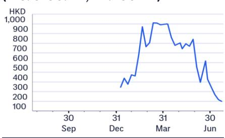
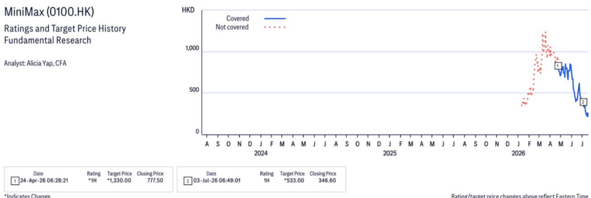
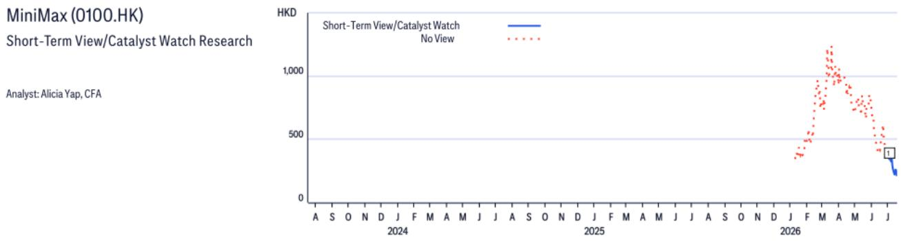

24 Jul 2026 05:48:38 ET | 13 pages

# MiniMax (0100.HK)

Key Takeaways from Senior Management Meeting

## CITI'S TAKE

On July 23, we attended a meeting for sell-side analysts hosted by MiniMax in Shanghai where Dr. Yan Junjie, Chairman and CEO, and Ms. Yun Yeyi, ED and COO, shared their thoughts and answered questions regarding the industry landscape, MiniMax's strategic focus i.e. extreme intelligence at extreme cost-efficiency, the company's edges in computing infrastructure, strategies to optimize each step of its training process, coding and agentic tasks as focus of improvement for next foundational model, and thoughts on multimodal capabilities with Hailuo 3 to launch soon. We believe MiniMax possesses edges in infrastructure, and with management presenting clearer strategies on optimizing training processes, we see an improving outlook for next version of the foundational model. Investor sentiment will likely remain cautious until MiniMax proves the next version of its models can deliver better capabilities – hence we see Hailuo 3, to be launched soon, as a potential catalyst.

Thoughts on industry landscape — Management believes the LLM industry is entering a phase of rapid growth with active competition, characterized by persistent computing demand and high user churn. Over the next several months, model scale could further expand quickly, achieving 3tn-parameter levels, while application demand, especially in coding, autonomous agents, and multimodal content creation, is expected to grow significantly. Computing supply, constrained by global production, will remain tight, resulting in reasonable margins for LLMs. For the market, management believes no single player has achieved absolute dominance, and this presents opportunity for a player who can deliver strong model capabilities with low cost. Management believes future success will depend not only on a single breakthrough but on sustained R&D while maintaining attractive pricing.

Strategies — MiniMax will focus on its strategy, extreme intelligence at extreme cost-efficiency, i.e. the company aims to offer the best possible performance per dollar spent, which will become increasingly important as token volumes grow. The upcoming 3tn-parameter model, which we expect will be released in ~Sep-Oct, has shown decent progress and will have a more mature update. Architecturally, MinimMax chooses sparse attention over linear attention variants, prioritizing inference speed and stability. (Continued below...)

Earnings Summary

<table><tr><td>Year to 31 Dec</td><td>Net Profit (US$M)</td><td>Diluted EPS (US$)</td><td>EPS growth (%)</td><td>P/E (x)</td><td>P/B (x)</td><td>ROE (%)</td><td>Yield (%)</td></tr><tr><td>2024A</td><td>-244</td><td>-2.25</td><td>-165.8</td><td>-11.3</td><td>-3.5</td><td>na</td><td>na</td></tr><tr><td>2025A</td><td>-251</td><td>-2.31</td><td>-2.7</td><td>-11.0</td><td>-1.0</td><td>na</td><td>na</td></tr><tr><td>2026E</td><td>-516</td><td>-1.64</td><td>28.8</td><td>-15.5</td><td>7.0</td><td>na</td><td>na</td></tr><tr><td>2027E</td><td>-571</td><td>-1.80</td><td>-9.7</td><td>-14.1</td><td>14.3</td><td>-67.4</td><td>na</td></tr><tr><td>2028E</td><td>-344</td><td>-1.07</td><td>40.4</td><td>na</td><td>37.1</td><td>-88.1</td><td>na</td></tr></table>

Source: Powered by dataCentral

<table><tr><td colspan="2">Buy / High Risk</td></tr><tr><td>Price (23 Jul 26 16:10)</td><td>HK$199.30</td></tr><tr><td>Target price</td><td>HK$533.00</td></tr><tr><td>Expected share price return</td><td>167.4%</td></tr><tr><td>Expected dividend yield</td><td>0.0%</td></tr><tr><td>Expected total return</td><td>167.4%</td></tr><tr><td>Market Cap</td><td>HK$69,603MUS$8,877M</td></tr></table>

## Price Performance

Alicia Yap, CFA $^{AC}$ +852-2501-2773
alicia.yap@citi.com

Brian Gong
+852-2501-2747
brian.gong@citi.com

Nelson Cheung
nelson.cheung@citi.com

<table><tr><td>Profit &amp; Loss (US$m)</td><td>2024</td><td>2025</td><td>2026E</td><td>2027E</td><td>2028E</td></tr><tr><td>Sales revenue</td><td>31</td><td>79</td><td>232</td><td>726</td><td>1,808</td></tr><tr><td>Cost of sales</td><td>-27</td><td>-59</td><td>-162</td><td>-461</td><td>-1,052</td></tr><tr><td>Gross profit</td><td>4</td><td>20</td><td>70</td><td>265</td><td>756</td></tr><tr><td>Gross Margin (%)</td><td>12.2</td><td>25.4</td><td>30.1</td><td>36.5</td><td>41.8</td></tr><tr><td>EBITDA (Adj)</td><td>-463</td><td>-1,870</td><td>-551</td><td>-608</td><td>-375</td></tr><tr><td>EBITDA Margin (Adj) (%)</td><td>na</td><td>na</td><td>na</td><td>-83.7</td><td>-20.8</td></tr><tr><td>Depreciation</td><td>-2</td><td>-1</td><td>-2</td><td>-5</td><td>-14</td></tr><tr><td>Amortisation</td><td>0</td><td>0</td><td>0</td><td>0</td><td>0</td></tr><tr><td>EBIT (Adj)</td><td>-258</td><td>-251</td><td>-516</td><td>-571</td><td>-344</td></tr><tr><td>EBIT Margin (Adj) (%)</td><td>na</td><td>na</td><td>na</td><td>-78.7</td><td>-19.0</td></tr><tr><td>Net interest</td><td>-1</td><td>-1</td><td>-1</td><td>-1</td><td>-1</td></tr><tr><td>Associates</td><td>0</td><td>0</td><td>0</td><td>0</td><td>0</td></tr><tr><td>Non-Op/Except/Other Adj</td><td>-207</td><td>-1,620</td><td>-37</td><td>-41</td><td>-45</td></tr><tr><td>Pre-tax profit</td><td>-465</td><td>-1,872</td><td>-554</td><td>-613</td><td>-390</td></tr><tr><td>Tax</td><td>0</td><td>0</td><td>0</td><td>0</td><td>0</td></tr><tr><td>Extraord./Min.Int./Pref.div.</td><td>0</td><td>0</td><td>0</td><td>0</td><td>0</td></tr><tr><td>Reported net profit</td><td>-465</td><td>-1,872</td><td>-554</td><td>-613</td><td>-390</td></tr><tr><td>Net Margin (%)</td><td>na</td><td>na</td><td>na</td><td>-84.5</td><td>-21.6</td></tr><tr><td>Core NPAT</td><td>-244</td><td>-251</td><td>-516</td><td>-571</td><td>-344</td></tr></table>

Price: HK\$199.30; TP: HK\$533.00; Market Cap: HK\$69,603m; Recomm: Buy/High Risk

<table><tr><td>Valuation ratios</td><td>2024</td><td>2025</td><td>2026E</td><td>2027E</td><td>2028E</td></tr><tr><td>PE (x)</td><td>-11.3</td><td>-11.0</td><td>-15.5</td><td>-14.1</td><td>-23.7</td></tr><tr><td>PB (x)</td><td>-3.5</td><td>-1.0</td><td>7.0</td><td>14.3</td><td>37.1</td></tr><tr><td>EV/EBITDA (x)</td><td>-18.6</td><td>-4.5</td><td>-14.9</td><td>-13.8</td><td>-23.7</td></tr><tr><td>FCF yield (%)</td><td>-9.4</td><td>-9.6</td><td>-5.7</td><td>-6.9</td><td>-4.8</td></tr><tr><td>Dividend yield (%)</td><td>na</td><td>na</td><td>na</td><td>na</td><td>na</td></tr><tr><td>Payout ratio (%)</td><td>0</td><td>0</td><td>0</td><td>0</td><td>0</td></tr><tr><td>ROE (%)</td><td>na</td><td>na</td><td>na</td><td>-72.4</td><td>-99.9</td></tr></table>

<table><tr><td>Cashflow (US$m)</td><td>2024</td><td>2025</td><td>2026E</td><td>2027E</td><td>2028E</td></tr><tr><td>EBITDA</td><td>-463</td><td>-1,870</td><td>-551</td><td>-608</td><td>-375</td></tr><tr><td>Working capital</td><td>14</td><td>-4</td><td>69</td><td>33</td><td>-23</td></tr><tr><td>Other</td><td>191</td><td>1,614</td><td>37</td><td>41</td><td>45</td></tr><tr><td>Operating cashflow</td><td>-258</td><td>-260</td><td>-445</td><td>-534</td><td>-353</td></tr><tr><td>Capex</td><td>-1</td><td>-4</td><td>-7</td><td>-22</td><td>-36</td></tr><tr><td>Net acq/disposals</td><td>-503</td><td>28</td><td>-26</td><td>-27</td><td>-28</td></tr><tr><td>Other</td><td>72</td><td>13</td><td>0</td><td>0</td><td>0</td></tr><tr><td>Investing cashflow</td><td>-431</td><td>37</td><td>-33</td><td>-49</td><td>-65</td></tr><tr><td>Dividends paid</td><td>0</td><td>0</td><td>0</td><td>0</td><td>0</td></tr><tr><td>Financing cashflow</td><td>771</td><td>439</td><td>710</td><td>400</td><td>300</td></tr><tr><td>Net change in cash</td><td>83</td><td>219</td><td>229</td><td>-182</td><td>-118</td></tr><tr><td>Free cashflow to s/holders</td><td>-259</td><td>-264</td><td>-452</td><td>-555</td><td>-389</td></tr></table>

<table><tr><td>Per share data</td><td>2024</td><td>2025</td><td>2026E</td><td>2027E</td><td>2028E</td></tr><tr><td>Reported EPS ($)</td><td>-4.28</td><td>-17.23</td><td>-1.77</td><td>-1.94</td><td>-1.22</td></tr><tr><td>Core EPS ($)</td><td>-2.25</td><td>-2.31</td><td>-1.64</td><td>-1.80</td><td>-1.07</td></tr><tr><td>DPS ($)</td><td>0</td><td>0</td><td>0</td><td>0</td><td>0</td></tr><tr><td>CFPS ($)</td><td>-2.38</td><td>-2.39</td><td>-1.42</td><td>-1.69</td><td>-1.10</td></tr><tr><td>FCFPS ($)</td><td>-2.39</td><td>-2.43</td><td>-1.44</td><td>-1.75</td><td>-1.22</td></tr><tr><td>BVPS ($)</td><td>-7.36</td><td>-24.37</td><td>3.61</td><td>1.78</td><td>0.69</td></tr><tr><td>Wtd avg ord shares (m)</td><td>109</td><td>109</td><td>314</td><td>315</td><td>318</td></tr><tr><td>Wtd avg diluted shares (m)</td><td>109</td><td>109</td><td>314</td><td>317</td><td>320</td></tr></table>

<table><tr><td>Growth rates</td><td>2024</td><td>2025</td><td>2026E</td><td>2027E</td><td>2028E</td></tr><tr><td>Sales revenue (%)</td><td>782.2</td><td>158.9</td><td>193.5</td><td>212.8</td><td>149.2</td></tr><tr><td>EBIT (Adj) (%)</td><td>-169.3</td><td>2.7</td><td>-105.8</td><td>-10.6</td><td>39.8</td></tr><tr><td>Core NPAT (%)</td><td>-174.2</td><td>-2.7</td><td>-105.8</td><td>-10.6</td><td>39.8</td></tr><tr><td>Core EPS (%)</td><td>-165.8</td><td>-2.7</td><td>28.8</td><td>-9.7</td><td>40.4</td></tr></table>

<table><tr><td>Balance Sheet (US$m)</td><td>2024</td><td>2025</td><td>2026E</td><td>2027E</td><td>2028E</td></tr><tr><td>Cash &amp; cash equiv.</td><td>289</td><td>508</td><td>737</td><td>555</td><td>437</td></tr><tr><td>Accounts receivables</td><td>7</td><td>11</td><td>19</td><td>30</td><td>50</td></tr><tr><td>Inventory</td><td>0</td><td>0</td><td>0</td><td>0</td><td>0</td></tr><tr><td>Net fixed &amp; other tangibles</td><td>2</td><td>2</td><td>14</td><td>37</td><td>75</td></tr><tr><td>Goodwill &amp; intangibles</td><td>3</td><td>2</td><td>2</td><td>2</td><td>2</td></tr><tr><td>Financial &amp; other assets</td><td>610</td><td>565</td><td>626</td><td>681</td><td>783</td></tr><tr><td>Total assets</td><td>911</td><td>1,088</td><td>1,398</td><td>1,305</td><td>1,347</td></tr><tr><td>Accounts payable</td><td>51</td><td>58</td><td>111</td><td>126</td><td>144</td></tr><tr><td>Short-term debt</td><td>19</td><td>35</td><td>45</td><td>445</td><td>745</td></tr><tr><td>Long-term debt</td><td>0</td><td>0</td><td>0</td><td>0</td><td>0</td></tr><tr><td>Provisions &amp; other liab</td><td>1,639</td><td>3,643</td><td>109</td><td>171</td><td>239</td></tr><tr><td>Total liabilities</td><td>1,710</td><td>3,737</td><td>265</td><td>743</td><td>1,129</td></tr><tr><td>Shareholders&#x27; equity</td><td>-799</td><td>-2,648</td><td>1,133</td><td>562</td><td>218</td></tr><tr><td>Minority interests</td><td>0</td><td>0</td><td>0</td><td>0</td><td>0</td></tr><tr><td>Total equity</td><td>-799</td><td>-2,648</td><td>1,133</td><td>562</td><td>218</td></tr><tr><td>Net debt (Adj)</td><td>-269</td><td>-472</td><td>-692</td><td>-109</td><td>308</td></tr><tr><td>Net debt to equity (Adj) (%)</td><td>na</td><td>na</td><td>-61.0</td><td>-19.4</td><td>141.4</td></tr></table>

For definitions of the items in this table, please click here.

Computing infrastructure as a key edge — Management believes its self-built computing infrastructure is its important key competitive edge, operating on one of the largest GPU clusters among independent Chinese AI firms. By building its own data centers last year, MiniMax was able to lock in lower hardware prices before the recent surge. This early bet gives them a structural cost advantage that competitors who rely on cloud rentals can’t easily replicate, according to management. More importantly, owning the full stack provides MiniMax the capability for deep integration like custom networking and proprietary storage solutions. As a result, its cluster utilization exceeds 90% above the industry norm. With GPU vendors now iterating annually, MiniMax’s ability to procure the right chips at the right time through strategic planning becomes an important competitive edge, according to management.

■ Strategies to optimize training — MiniMax has clear strategies to optimize each step of its model training. For pre-training, the next-version model will scale to 3tn-parameter level, and MiniMax is optimizing through compressing KV cache usage, which will make its next model more advanced. For post-training data distribution, to ensure sufficient source diversity and complexity of data, MiniMax is recruiting domain experts from critical fields to curate high-quality and complex data and collecting high quality data through screening and mining on internet. Beyond data collection, high quality data requires rigorous cleaning and processing. Lastly, reinforcement learning (RL) stabilizes model capabilities and raises their ceiling. MiniMax has achieved decent progress on pre-training for its next model, and management believes RL remains underdeveloped in the domestic model industry, presenting ample room for improvement, and MiniMax has invested heavily in this area.

■ Focus of the next-version model — The upcoming 3tn-parameter model will focus on two primary areas:

\- Coding – The goal is to achieve world-class proficiency in solving isolated programming problems, leveraging high-quality data from sources such as GitHub, open-source codebases and internally curated examples. MiniMax believes that coding serves as a foundational capability for almost all downstream applications.

\- Agentic tasks – MiniMax actively recruits domain experts in fields such as cybersecurity, chip design, law and others. These experts do not merely label data, but interact with the model through real problem-solving processes.

\- Thoughts on multimodal model — MiniMax has high conviction in native multimodal architectures, believing that true intelligence requires unified perception including understanding scene, text, image and videos. During the training on the next-version foundational model, the company introduced an “information density” filter, prioritizing high density multi-modal data. The company believes that multimodal capabilities are becoming a standard requirement for major frontier models, evidenced by US peers’ focus on visual input and native multimodal capabilities. MiniMax sees strong potential of video generation model and will launch its next version Hailuo soon.

## Removing Downside 30-Day Short-Term View on MiniMax (0100.HK)

Direction: Downside

Date Added: 03 Jul 2026

Category: Special situations and Valuation

In our previous note published on July 3rd, we opened a Downside 30-Day Short-Term View on the stock as we were cautious amid selling pressure post the IPO lock-up expiration on July 9th. The share price is down >40% in the past 20 days, which we believe likely largely reflects the dissipation of the overhang, and hence we now close our Downside 30-Day Short-Term View. With the upcoming release of Hailuo 3 and possible future release of 3tn-parameter model in the next few months, any better-than-expected traction of these models would likely support neutralizing negative sentiment on the stock.

## MiniMax

## Company description

MiniMax is a pure-play model company, focusing on global, multi-modality (text, video, audio, music) models with strategic emphasis on modality integration (LLM +VLM). Since its inception in 2021, the company has strived to create models capable of handling text, video, audio and music. As of December 31, 2025, MiniMax had served more than 236m users across over 200 countries and regions, as well as 214,000 enterprise customers and developers from more than 100 countries and regions.

## Investment strategy

We rate the MiniMax stock as Buy/High Risk. Our investment thesis is based on the company's: 1) advanced technological breakthroughs and quick new model releases; 2) multimodality approach that has been strategic; 3) diversified approach in generating revs from domestic and global markets; and 4) smart and balanced approach to both ToC and ToB monetization. Upcoming catalysts include M3 series model releases and robust growth demand from agentic scenarios, which are likely to further boost ARR growth and future opportunity in software + hardware robotic AI use cases.

## Valuation

We value MiniMax at HK\$533, 12x 28E P/S, set at two-year forward 2028E P/S multiple. As the stock does not have any direct listed comps with a long history and given the nascent stage of the sector, we use the stock's own trading history – despite it being short – as a benchmark. A 2Y forward multiple is being employed to capture the company's strong rev growth, estimated at a 128% CAGR for 2025-30E and 184% for 2025-28E.

## Risks

We rate the Minimax stock High Risk to reflect its short trading history and uncertainties from an ever-changing AI environment. Risks that could impede the stock from reaching our target price include: 1) Fast evolution of models and intense competition; 2) Overhang from upcoming 6M lock-up expiration; 3) Constant capital funding needs; 4) FX fluctuation given USD is the reporting currency; 5) R&D talent retention and intellectual property infringement risks.

If you are visually impaired and would like to speak to a Citi representative regarding the details of the graphics in this document, please call USA 1-888-500-5008 (TTY: 711), from outside the US +1-210-677-3788

## Appendix A-1

## ANALYST CERTIFICATION

The research analysts primarily responsible for the preparation and content of this research report are either (i) designated by “AC” in the author block or (ii) listed in bold alongside content which is attributable to that analyst. If multiple AC

analysts are designated in the author block, each analyst is certifying with respect to the entire research report other than (a) content attributable to another AC certifying analyst listed in bold alongside the content and (b) views expressed solely with respect to a specific issuer which are attributable to another AC certifying analyst identified in the price charts or rating history tables for that issuer shown below. Each of these analysts certify, with respect to the sections of the report for which they are responsible: (1) that the views expressed therein accurately reflect their personal views about each issuer and security referenced and were prepared in an independent manner, including with respect to Citi Global Markets Inc. and its affiliates; and (2) no part of the research analyst's compensation was, is, or will be, directly or indirectly, related to the specific recommendations or views expressed by that research analyst in this report.

## IMPORTANT DISCLOSURES

\*Indicates Change

Rating/target price changes above reflect Eastern Time

  
CW - Catalyst Watch, STV - Short-Term View  
Rating/target price changes above reflect Eastern Time

The Firm has made a market in the publicly traded equity securities of MiniMax Group Inc on at least one occasion since 1 Jan 2025.

Citi Global Markets Inc. or its affiliates received compensation for products and services other than investment banking services from MiniMax in the past 12 months.

Citi Global Markets Inc. or its affiliates currently has, or had within the past 12 months, the following as clients, and the services provided were non-investment-banking, securities-related: MiniMax.

Citi Global Markets Inc. or its affiliates currently has, or had within the past 12 months, the following as clients, and the services provided were non-investment-banking, non-securities-related: MiniMax.

Analysts' compensation is determined by Citi management and Citi's senior management and is based upon activities and services intended to benefit the investor clients of Citi Global Markets Inc. and its affiliates (the "Firm"). Compensation is not linked to specific transactions or recommendations. Like all Firm employees, analysts receive

compensation that is impacted by overall Firm profitability which includes investment banking, sales and trading, and principal trading revenues. One factor in equity research analyst compensation is arranging corporate access events between institutional clients and the management teams of covered companies. Typically, company management is more likely to participate when the analyst has a positive view of the company.

For financial instruments recommended in the Product in which the Firm is not a market maker, the Firm is a liquidity provider in such financial instruments (and any underlying instruments) and may act as principal in connection with transactions in such instruments. The Firm is a regular issuer of traded financial instruments linked to securities that may have been recommended in the Product. The Firm regularly trades in the securities of the issuer(s) discussed in the Product. The Firm may engage in securities transactions in a manner inconsistent with the Product and, with respect to securities covered by the Product, will buy or sell from customers on a principal basis.

The Firm is a market maker in the publicly traded equity securities of MiniMax.

Unless stated otherwise neither the Research Analyst nor any member of their team has viewed the material operations of the Companies for which an investment view has been provided within the past 12 months.

For important disclosures (including copies of historical disclosures) regarding the companies that are the subject of this Citi product ("the Product"), please contact Citi, 388 Greenwich Street, 6th Floor, New York, NY, 10013, Attention: Legal/Compliance [E6WYB6412478]. In addition, the same important disclosures, with the exception of the Valuation and Risk assessments and historical disclosures, are contained on the Firm's disclosure website at https://www.citivelocity.com/cvr/eppublic/citi\_research\_disclosures. Valuation and Risk assessments can be found in the text of the most recent research note/report regarding the subject company. Pursuant to the Market Abuse Regulation a history of all Citi recommendations published during the preceding 12-month period can be accessed via Citi Velocity (https://www.citivelocity.com/cv2) or your standard distribution portal. Historical disclosures (for up to the past three years) will be provided upon request.

Citi Equity Ratings Distribution

<table><tr><td></td><td colspan="3">12 Month Rating</td><td colspan="3">Catalyst Watch</td></tr><tr><td>Data current as of 01 Jul 2026</td><td>Buy</td><td>Hold</td><td>Sell</td><td>Buy</td><td>Hold</td><td>Sell</td></tr><tr><td>Citi Global Fundamental Coverage (Neutral=Hold)</td><td>61%</td><td>32%</td><td>7%</td><td>36%</td><td>48%</td><td>16%</td></tr><tr><td>% of companies in each rating category that are investment banking clients</td><td>38%</td><td>42%</td><td>27%</td><td>42%</td><td>37%</td><td>36%</td></tr></table>

Guide to Citi Fundamental Research Investment Ratings:

Citi stock recommendations include an investment rating and an optional risk rating to highlight high risk stocks. Risk rating takes into account both price volatility and fundamental criteria. Stocks will either have no risk rating or a High risk rating assigned.

Investment Ratings: Citi investment ratings are Buy, Neutral and Sell. Our ratings are a function of analyst expectations of expected total return ("ETR") and risk. ETR is the sum of the forecast price appreciation (or depreciation) plus the dividend yield for a stock within the next 12 months. The target price is based on a 12 month time horizon. The Investment rating definitions are: Buy (1) ETR of 15% or more or 25% or more for High risk stocks; and Sell (3) for negative ETR. Any covered stock not assigned a Buy or a Sell is a Neutral (2). For stocks rated Neutral (2), if an analyst believes that there are insufficient valuation drivers and/or investment catalysts to derive a positive or negative investment view, they may elect with the approval of Citi management not to assign a target price and, thus, not derive an ETR. Citi may suspend its rating and target price and assign "Rating Suspended" status for regulatory and/or internal policy reasons. Citi may also suspend its rating and target price and assign "Under Review" status for other exceptional circumstances (e.g. lack of information critical to the analyst's thesis, trading suspension) affecting the company and/or trading in the company's securities. In both such situations, the rating and target price will show as “—” and “-” respectively in the rating history price chart. Prior to 11 April 2022 Citi assigned "Under Review" status to both situations and prior to 11 Nov 2020 only in exceptional circumstances. As soon as practically possible, the analyst will publish a note re-establishing a rating and investment thesis. Investment ratings are determined by the ranges described above at the time of initiation of coverage, a change in investment and/or risk rating, or a change in target price (subject to limited management discretion). At times, the expected total returns may fall outside of these ranges because of market price movements and/or other short-term volatility or trading patterns. Such interim deviations will be permitted but will become subject to review by Research Management. Your decision to buy or sell a security should be based upon your personal investment objectives and should be made only after evaluating the stock's expected performance and risk.

## Catalyst Watch/Short Term Views (“STV”) Ratings Disclosure:

Catalyst Watch and STV Upside/Downside calls: Citi may also include a Catalyst Watch or STV Upside or Downside call to indicate the analyst expects the share price to rise (fall) in absolute terms over a specified period of 30 or 90 days in reaction to one or more specific near-term catalysts or events impacting the company or the market. A Catalyst Watch will be published when Analyst confidence is high that an impact to share price will occur; it will be a STV when confidence level is moderate. A Catalyst Watch or STV Upside/Downside call will automatically expire at the end of the specified 30/90 day period. The Catalyst Watch will also be automatically removed if share price performance (calculated at market close) exceeds $15\%$ against the direction of the call (unless over-ridden by the analyst). The analyst may also remove a Catalyst Watch or STV call prior to the end of the specified period in a published research note. A Catalyst Watch/STV Upside or Downside call may be different from and does not affect a stock's fundamental equity rating, which reflects a longer-term total absolute return expectation. For purposes of FINRA ratings-distribution-disclosure rules, a Catalyst Watch/STV Upside call corresponds to a buy recommendation and a Catalyst Watch/STV Downside call corresponds to a sell recommendation. Any stock not assigned to a Catalyst Watch Upside, Catalyst Watch Downside, STV Upside, or STV Downside call is considered Catalyst Watch/STV

No View. For purposes of FINRA ratings distribution-disclosure rules, we correspond Catalyst Watch/STV No View to Hold in our ratings distribution table for our Catalyst Watch/STV Upside/Downside rating system. However, we reiterate that we do not consider No View to be a recommendation. For all Catalyst Watch/STV Upside/Downside calls, risk exists that the catalyst(s) and associated share-price movement will not materialize as expected.

## RESEARCH ANALYST AFFILIATIONS / NON-US RESEARCH ANALYST DISCLOSURES

The legal entities employing the authors of this report are listed below (and their regulators are listed further herein). Non-US research analysts who have prepared this report (i.e., all research analysts listed below other than those identified as employed by Citi Global Markets Inc.) are not registered/qualified as research analysts with FINRA. Such research analysts may not be associated persons of the member organization (but are employed by an affiliate of the member organization) and therefore may not be subject to the FINRA Rule 2241 restrictions on communications with a subject company,
