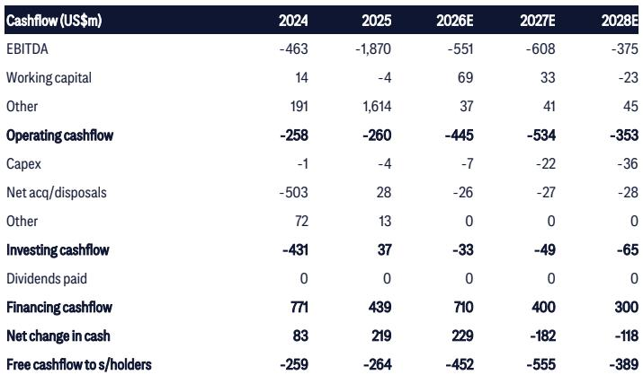
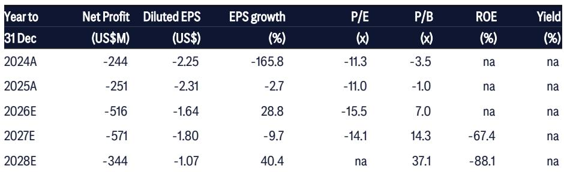
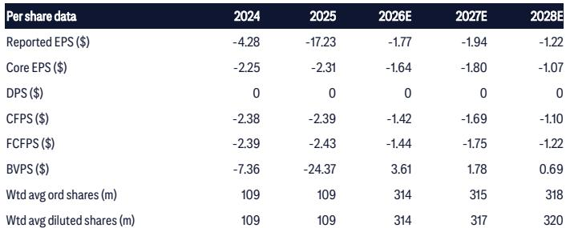

# MiniMax的下一代模型将决定其基础设施优势能否转化为市场领先地位

2026年7月23日，MiniMax管理层在上海向研究机构分析师表示，大语言模型行业正进入快速增长阶段。他们描述了一个持续存在算力稀缺、用户流失率高、模型规模快速向3万亿参数扩展的市场。管理层认为，目前国内尚无任何单一参与者取得相对领先地位，能够以低成本提供强大模型能力的公司仍有机会。

该公司对此挑战有明确的战略回应：以极致的成本效率实现极致的智能。MiniMax自建的算力基础设施锁定了较低的硬件价格，集群利用率超过90%，这为其提供了云依赖型竞争对手难以快速复制的结构性成本优势。但仅有基础设施并不能赢得市场份额。预计于2026年9月或10月左右发布的3万亿参数基础模型，将是检验这些优势能否转化为实际性能提升的首次真正考验。

读者情绪仍持观望态度，这有其合理原因。MiniMax的财务数据显示，该公司仍处于深度投入阶段，核心净利润亏损从2024年的2.44亿美元扩大至2026年预计的5.16亿美元。收入增长迅速，从2024年的3100万美元增至2026年预计的2.32亿美元，但实现盈利的路径需要一款能够大规模吸引并留住用户的模型。未来几个月将决定MiniMax的架构选择、训练优化和基础设施投入能否产出一款改变竞争格局的模型。

## 公司自建算力基础设施创造了竞争对手难以快速复制的结构性成本优势

MiniMax最稳固的资产并非某一特定算法或数据集，而是其在近期硬件价格上涨之前自建的物理算力基础设施。通过去年自建数据中心，MiniMax在全球供应趋紧之际锁定了较低的GPU集群成本。管理层报告称，集群利用率超过90%，远高于行业平均水平，因为拥有完整技术栈使得深度集成成为可能，包括定制网络和专有存储方案。

这一点之所以重要，是因为算力稀缺并非暂时现象。管理层预计，受全球产能限制，供应将持续紧张，这意味着依赖云租赁的公司将面临持续的成本劣势。每一次训练周期、每一次推理请求、每一次模型迭代，对于需按市场价支付算力费用的竞争对手而言，边际成本都更高。而对MiniMax来说，额外算力的边际成本更低，每个算力单元的效率也更高。

这一战略意义超越了成本本身。随着GPU供应商现在以年度周期迭代，通过战略规划在合适时机采购合适芯片的能力本身就成为竞争优势。MiniMax在基础设施上的早期投入使其获得了采购关系和技术集成经验，后来者难以企及。这不是一道能快速跨越的护城河，而是一个随硬件代际更迭而不断累积的领先优势。

## MiniMax的训练优化策略针对模型开发中最关键的三个瓶颈

管理层概述了在完整训练流程中提升模型性能的清晰、分步方法。在预训练方面，公司正在将规模扩展至3万亿参数级别，同时压缩KV缓存使用。这种规模与效率并重的做法至关重要：如果推理速度或内存消耗使模型在实际应用中不可行，那么原始参数数量就毫无意义。

在后训练方面，MiniMax通过两种机制解决数据质量瓶颈。首先，公司正在从网络安全、芯片设计、法律等关键领域招募领域专家，以策划高质量、复杂的数据。这些专家不仅标注数据，还通过实际解决问题的过程与模型互动，形成反馈循环，同时改进数据和模型的推理能力。其次，MiniMax正在投入资源进行严格的数据清洗和处理，认识到数据质量不仅是来源选择的问题，更是系统性精炼的问题。

第三个支柱是强化学习，管理层认为这在国内模型行业中仍发展不足。MiniMax在强化学习上投入了大量资源，将其视为稳定模型能力并提升其上限的机制。在一个许多竞争对手仅关注预训练规模的市场中，强化学习投入代表了一种差异化的押注，即后训练改进是竞争优势的来源。

## 编程和智能体能力是定义下一代模型实用性的两个重点领域

MiniMax即将推出的3万亿参数模型将优先考虑两个主要应用场景：编程和自主智能体任务。这些并非随意选择。管理层将编程视为几乎所有下游应用的基础能力。一个能够以世界级水平解决独立编程问题的模型，可应用于软件开发、数据分析、自动化以及广泛的企业工作流程。

编程重点得到了来自GitHub、开源代码库和内部策划示例的高质量训练数据的支持。但更有趣的战略押注在于智能体任务。MiniMax正在招募领域专家，他们通过实际解决问题的过程与模型互动，而非通过静态标注。这种方法产生的训练数据捕捉了从法律推理到硬件设计等实际专业工作的复杂性。

逻辑很简单：如果一个模型能在专业领域的智能体任务上表现良好，它就可以部署在需要高准确性和可靠性的高价值企业应用中。与消费级聊天机器人相比，这是一个利润率更高、规模较小的机会，并且与MiniMax以能力而非单纯价格竞争的战略相符。

## 多模态能力正成为标准要求，MiniMax的原生架构使其具备竞争力

管理层对原生多模态架构表达了高度信心，认为真正的智能需要跨文本、图像、视频和音频的统一感知。在下一代基础模型的训练中，MiniMax引入了“信息密度”过滤器，优先处理高密度多模态数据。这并非表面添加，而是反映了根本性的架构选择。

MiniMax选择稀疏注意力而非线性注意力变体，优先考虑推理速度和稳定性。这一决策对多模态性能有直接影响。稀疏注意力机制更适合处理多模态任务所需的变长、高维输入。线性注意力变体可能提供理论上的效率提升，但MiniMax管理层认为，实际推理速度和稳定性比理论上的FLOP减少更重要。

即将推出的视频生成模型新版本Hailuo 3，将是这一架构押注的早期测试。如果Hailuo 3在视频质量、连贯性和生成速度上展现出有意义的改进，将验证MiniMax的多模态策略，并为读者情绪提供催化剂。如果表现不及预期，围绕公司模型能力的疑虑将持续存在。

## 评估MiniMax未来十二个月的决策框架

对于关注MiniMax的观察者和策略制定者而言，未来十二个月可归结为四个具体问题。每个问题对应管理层提出的一个具体主张，且每个问题都有清晰的可观察结果。

第一，3万亿参数模型在编程基准测试中是否展现出相对于先前版本和竞争对手的可衡量改进？管理层已将编程作为主要关注点，模型在标准编程评估中的表现将是其训练优化是否有效的最透明信号。

第二，智能体任务能力能否转化为企业采用？MiniMax在领域专家和实际问题训练数据上的投入成本高昂且难以规模化。如果企业客户开始将MiniMax模型用于专业工作流程，则智能体押注正在见效。如果采用仍集中在消费级应用，则差异化尚未显现。

第三，基础设施成本优势是否体现在定价或利润率上？MiniMax的极致成本效率战略意味着它可以在保持合理单位经济性的同时提供有竞争力的定价。如果公司毛利率改善速度快于收入增长，则基础设施押注正在奏效。如果尽管利用率高，利润率仍受压缩，则成本优势可能小于管理层声称的程度。

第四，多模态能力能否成为有意义的收入驱动力？Hailuo 3的发布及后续视频生成功能的采用情况，将表明MiniMax的原生多模态架构是提供了真正的产品优势，还是仅使其保持在竞争行列。

这四个问题相互独立且涵盖全面。它们覆盖了模型性能、企业采用、单位经济性和产品差异化。每个问题都有明确的时间线：未来三个月关注Hailuo 3和初步模型基准测试，未来六个月关注企业采用信号，未来十二个月关注利润率趋势和收入构成。

## 基础设施押注是真实的，但模型必须证明它能将成本优势转化为性能领先

MiniMax已经完成了建设物理基础设施、优化训练流程和做出清晰架构选择的艰巨工作。公司自建的数据中心、高集群利用率和早期硬件采购，使其拥有竞争对手难以快速匹配的成本结构。其对编程、智能体任务和原生多模态能力的关注，反映了一个在尚无单一参与者取得主导地位的市场中竞争的一致战略。

但基础设施和战略是投入，而非产出。下一次模型发布将决定MiniMax能否将其结构性优势转化为可衡量的性能领先。该轨迹假设模型足够优秀，能够大规模吸引和留住用户、开发者和企业客户。

MiniMax面临的读者疑虑并非没有道理。这反映了一个市场，该市场已见证许多公司对模型能力和基础设施优势做出大胆声明。MiniMax的不同之处在于，其基础设施押注是切实的，成本优势是结构性的，训练策略是具体的。未来三个月将揭示这些优势能否产出一款改变竞争格局的模型，还是仅使公司保持在竞争行列。

*仅供参考。部分内容可能基于源材料通过AI辅助生成、翻译、总结或编辑，可能存在遗漏或错误。请独立核实。本文不构成专业建议。*

仅供参考。部分内容可能基于源材料通过AI辅助生成、翻译、总结或编辑，可能存在遗漏或错误。请独立核实。本文不构成专业建议。

