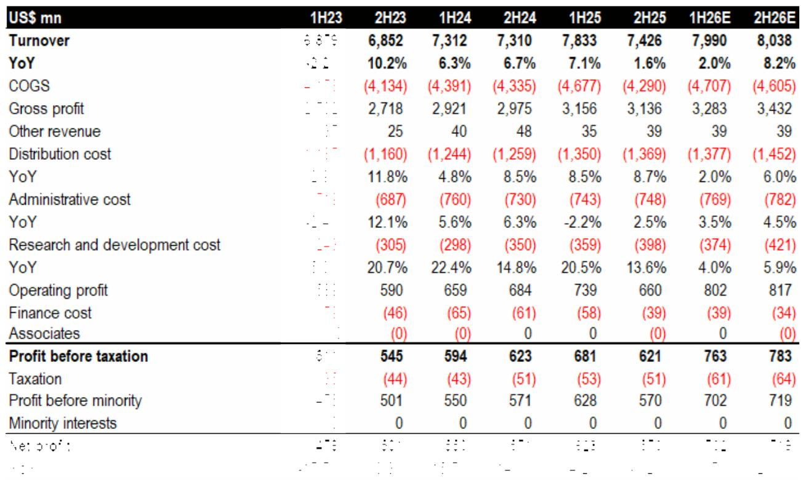
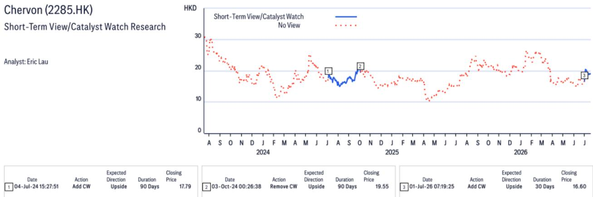
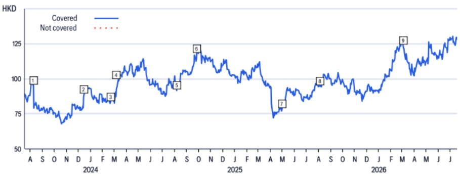

# Citi：跨境贸易与行业变化观察

2026年7月26日，美国宣布对60个贸易伙伴加征最高12.5%的新关税，取代7月25日到期的临时10%全球性关税。Citi研究认为，这一变化对全球电动工具行业构成正面信号——新关税税率低于此前市场预期的20%对等关税水平，消除了自去年以来笼罩在行业头上的关税不确定性。

对于以美国为主要市场的电动工具企业而言，关税从20%降至10-12.5%区间，意味着成本端不确定性小于此前预算。Citi分析师指出，创科实业（TTI）和史丹利百得（SWK）此前已将20%的对等关税纳入财务规划，新税率低于这一基准，因此存在盈利预测上调的空间。研究覆盖的四家公司中，Citi按偏好排序为：创科实业、巨星科技、泉峰控股、史丹利百得。

> **KC评论：** 关税从20%降至10-12.5%并非简单的税率下调，而是市场此前已计入的“最差情形”没有出现。对于读者而言，真正需要关注的是企业盈利预测的修正幅度，而非关税相对值本身。

## 1. 创科实业上半年盈利增长预计加速，下半年增速或达26%

Citi对创科实业2026年上半年业绩做出预测：收入同比增长约2%至79.9亿美元，净利润预计为7.02亿美元，较上年同期的6.28亿美元增长约12%。下半年增速有望加快至26%，全年盈利增长呈现前低后高格局。

盈利加速的核心驱动力来自营业利润率扩张。Citi模型显示，2026年上半年创科实业营业利润率预计扩张60个基点，其中30个基点来自关税降低（越南适用税率从20%对等关税降至10%），20个基点来自HART品牌亏损消除，10个基点来自产品组合向Milwaukee品牌倾斜。下半年利润率扩张幅度更大，预计达130个基点，其中80个基点来自HART亏损消除，40个基点来自关税降低。

HART品牌在2025年造成约0.5%的销售亏损，但大部分亏损集中在2025年下半年，主要源于资产减值及清仓促销。该品牌已于2025年底完成剥离。

## 2. 巨星科技与泉峰控股：产能转移与低基数驱动增长

巨星科技的核心手工具业务在北美市场保持韧性，Citi预计其核心手工具收入可实现两位数增长。电动工具及储能系统业务因基数较低，2028年前收入复合年增长率预计约50%，规模有望突破10亿美元。产能方面，巨星科技正将部分产线从中国迁至东盟，以降低生产成本和关税负担。

泉峰控股的估值逻辑基于2027年预期市盈率11倍，较全球同业均值折让约40-50%，主要反映其经营规模较小。Citi采用现金流折现模型交叉验证，得出公允价值约25港元。研究同时指出，泉峰控股在电动工具领域的市场份额是其最薄弱的环节。

## 3. 史丹利百得：利润率持续修复，行业增长回归正常化

史丹利百得的估值锚定于2026年预期市盈率18倍，较历史均值低0.5个标准差。Citi认为，2026年营业利润率和毛利率将继续改善，背后是效率提升和成本削减计划的推进。行业层面，2023年的盈利低谷已经过去，2026年有望回归正常增长。

研究同时提示，史丹利百得面临的主要不确定性包括美国及欧洲终端需求弱于预期、原材料成本超预期上涨，以及贸易政策进一步变化。

## 4. 一个可复用的观察框架：关税变化如何影响企业盈利

Citi对创科实业利润率拆解提供了一个清晰的观察框架：关税变化对企业盈利的影响并非线性，需要区分三个层次——适用税率的变化幅度、企业是否已提前计入更高税率、以及非关税因素（如品牌剥离、产品组合升级）的叠加效应。

具体而言，当市场已普遍预期20%关税时，实际落地10-12.5%带来的盈利修正空间，远大于“税率从10%降至5%”的同等幅度变化。同时，HART品牌亏损消除这一一次性因素，在2026年下半年对利润率的贡献甚至超过关税降低本身。这意味着，在评估关税政策对行业的影响时，不能只看税率数字，还需结合企业的产能布局、品牌组合和成本结构综合判断。

For informational purposes only. Portions may be generated,translated,summarized,or edited with AI assistance based on source materials and may contain omissions or errors. Please verify independently. This is not investment,legal,tax,accounting,or other professional advice.

For informational purposes only. Portions may be generated,translated,summarized,or edited with AI assistance based on source materials and may contain omissions or errors. Please verify independently. This is not investment,legal,tax,accounting,or other professional advice.

