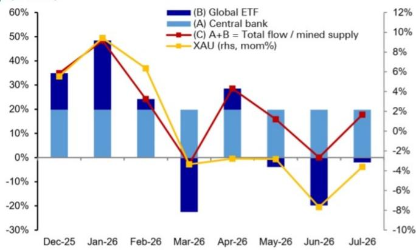

# 黄金4-7月表现偏弱：央行与ETF资金流之外，系统性卖出或是被忽视的因素

2026年1月，官方部门和ETF对黄金的需求消耗了约48%的矿产供应量。到3月，这一比例降至-3%——两个月内波动超过50个百分点。然而，即使来自价格弹性最低的买家的需求出现如此剧烈的逆转，也无法完全解释黄金从4月到7月的持续偏弱表现。央行和ETF综合资金流所预示的价格与实际黄金报价之间的差距自4月以来一直为负，且正在扩大。最可能的解释是一个在标准资金流数据中几乎不可见的因素：基于规则、趋势跟踪的系统性卖出。

问题不在于央行和ETF是否重要——它们显然重要。问题在于，为什么它们的综合信号在近几个月失去了解释力，以及这对试图判断黄金短期方向的观察者意味着什么。答案指向市场解读黄金资金流的一个结构性盲点，以及一个更深层次的问题：黄金定价是否完全可知。

理解这一差距现在很重要，因为系统性账户短期内不太可能转为买家。截至7月底，黄金的30日相对强弱指数为42.7——远低于通常触发趋势跟踪算法积累的50阈值。在该RSI恢复之前，系统性资金流将构成阻力，而非助力。这对仓位管理、风险控制和市场时机判断具有直接意义。

## 央行与ETF综合资金流信号自3月以来明显减弱，形成未解释的表现差距

黄金月度价格行为最有力的单一指标是官方部门购买和ETF活动的综合资金流。这两个需求板块有一个共同特征：它们是黄金需求中价格弹性最低的来源。央行出于储备多元化和战略原因进行配置，而非追逐趋势。ETF读者虽然比主权买家对价格趋势更敏感，但其价格弹性仍远低于珠宝或工业部门。当这两类群体共同行动时，它们对黄金的月度回报产生巨大影响。

从12月到3月，这一综合资金流异常强劲。仅1月份，官方和ETF需求就消耗了近一半的新增矿产供应。这些资金流与黄金月度价格变化之间的关系紧密且可预测。但从4月开始，这种关系被打破。实际黄金表现系统性弱于综合资金流数据所预示的水平。残差——预测价格变化与实际价格变化之间的差异——在4月转为负值，并持续到7月。

这不是一个微不足道的偏差。使用央行和ETF综合资金流的回归模型在12月至3月期间以合理精度解释了黄金的月度价格变动。4月至7月的偏差足够大，需要解释。它不能被当作噪音忽略。

## 期货持仓和亚洲进口无法填补缺口，系统性资金流成为相对少见可能的候选因素

当综合资金流模型失效时，自然的反应是寻找其他可观察的需求或供应来源来解释差异。两个明显的候选因素是CFTC期货持仓和亚洲黄金进口，特别是来自印度和中国的进口。两者都被广泛追踪，并经常被引用为边际价格驱动因素。

在这种情况下，两者都不起作用。4月至7月期间的期货持仓总体中性——不足以解释持续的负价格残差。与此同时，亚洲进口为净正值，这通常支撑价格，而非压低价格。如果有什么影响的话，这些因素本应缩小差距，而非扩大差距。

这就剩下第三类：基于规则、趋势跟踪的系统性资金流。这是商品交易顾问和其他算法策略的活动，它们基于价格趋势和相对强弱指数等技术指标做出决策。这些资金流未被标准ETF或期货持仓数据捕捉。它们以更短的时间框架运作，对动量信号做出反应，并可能放大任一方向的价格变动。

间接证据很强。当回归残差在4月转为负值时，黄金的30日RSI跌破50并一直保持在该水平。从历史上看，当RSI低于50时，系统性账户往往是净卖家；当RSI高于50时，则是净买家。模式一致：在12月至2月期间，当RSI远高于50时，出现强劲积累；从4月开始，则持续面临卖出压力。残差与RSI-50价差之间的相关性过于紧密，不容忽视。

## 价格行为与系统性资金流之间的相互作用形成双向反馈循环，使任何单因素模型复杂化

如果系统性资金流确实是缺失的变量，那么挑战就不仅仅是简单地在回归中添加一个新的数据序列。价格与系统性资金流之间的关系是双向的。价格趋势触发算法买入或卖出，这反过来又放大这些趋势。这形成了一个反馈循环，本质上难以用线性、静态的框架来建模。

这就是涌现和决定论概念变得相关的地方。黄金价格是央行、ETF读者、矿商、珠宝商、投机者和算法等数百万个体决策的涌现结果。这些参与者中的每一个都对价格做出反应，但他们的集体行为也塑造了价格。系统不仅仅是反应性的；它是自我指涉的。价格历史——趋势、移动平均线、RSI水平——成为产生未来价格的决策过程的输入。

这并不意味着黄金定价是随机或无法解释的。但这确实意味着简单的线性模型，即使是结合多种资金流类型的模型，也难免会留下未解释的残差。4月至7月的差距不是一个可以通过更好数据来纠正的异常现象。它是一个复杂自适应系统的特征，在这个系统中，建模行为会改变被建模的行为。

对于观察者来说，实际含义令人不安但不可避免：理解黄金短期价格动态没有捷径。将系统性资金流估计值添加到模型中几乎肯定会减少4月至7月的残差，但它也会引入一系列新的复杂性。一个系统性资金流模型可能会显示，算法买入在12月至2月期间异常强劲，这意味着将其纳入模型会在那些月份产生正残差，同时减少后期的负残差。模型在平均水平上会更准确，但月度稳定性会降低。

## 决策框架：观察者应将RSI视为系统性资金流压力的先行指标，而非入场时机信号

对于组合管理者和商品策略师来说，实际要点不是构建一个专有的系统性资金流模型——那是一个研究项目，而非交易工具。相反，这一见解提示了一个更简单的启发式方法。黄金的30日RSI，目前为42.7，可作为算法资金流方向和强度的代理指标。当RSI低于50时，系统性账户可能是净卖家，形成持续阻力，放大任何偏空的基本面信号。当RSI高于50时，情况相反。

这不是传统意义上的时机信号。RSI突破50并不保证系统性资金流立即逆转。但它确实表明了这些资金流所处的状态。RSI低于50意味着任何积极催化剂——央行购买公告、地缘政治冲击、美元走弱——都必须克服算法卖出压力才能推高价格。相反，RSI高于50意味着系统性买家已在市场中，提供助力，可以延长涨势，使其超出基本面本身所能支撑的范围。

因此，决策框架是关于状态识别。观察者应结合央行和ETF综合资金流数据评估黄金的RSI趋势。当两者均为正时——强劲的非弹性需求加上算法买入——黄金的论据最为有力。当它们出现分歧时，就像4月以来那样，举证责任转移。仅基于央行买入的黄金仓位是不完整的，如果它忽略了系统性卖出的阻力。

这一框架也明确了需要关注什么以寻找可能的转折点。黄金RSI回升至50以上将表明系统性卖出已减弱。这并不能保证反弹，但会消除一个显著的拖累因素。在此之前，残差差距可能会持续存在，黄金的价格表现将弱于综合官方和ETF资金流数据所预示的水平。

*仅供参考。部分内容可能基于源材料通过AI辅助生成、翻译、总结或编辑，可能存在遗漏或错误。请独立核实。这不构成专业建议。*

仅供参考。部分内容可能基于源材料通过AI辅助生成、翻译、总结或编辑，可能存在遗漏或错误。请独立核实。这不构成专业建议。

