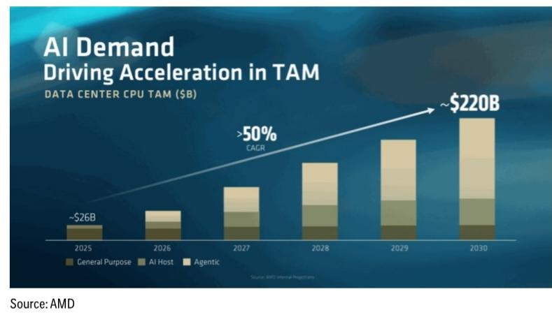

24 Jul 2026 06:00:00 ET | 11 pages

# 美国半导体与半导体设备

夏季市场调整；基本面保持稳定；更关注设备类公司

## 核心观点

我们认为，SOX指数因能源价格上涨、债券回报表现上升及AI相关支出担忧而出现的回调，提供了一个值得关注的窗口期。从基本面看，数据中心仍是需求较强劲的终端市场（占半导体总可寻址市场的34%），并有望在2030年前超过整个半导体市场的规模。汽车和工业领域（占21%）正在复苏，而PC、手机及消费电子（占42%）的需求则因存储成本上升和供应限制而持续调整（见图2）。我们总结了近期财报中的关键信息，并注意到已发布财报的公司，其2026/2027年收入预期平均上调了4%/7%，每股盈利预期平均上调了7%/8%。基于资本支出增加带来的预期上调，我们更看好设备类公司而非半导体公司。

**英特尔/台积电/特斯拉的资本支出展望对设备类公司均非常积极**——英特尔强调了其代工业务的显著进展，并将2026年资本支出指引从此前约180亿美元上调至超过200亿美元，主要驱动力来自设备采购，同比增长40%。英特尔正积极锁定设备订单，加速洁净室建设，并确保关键基板与存储供应。基于对多个终端市场客户需求的信心增强以及强大的先进封装订单积压，英特尔预计2027年资本支出将显著高于2026年，大部分投资将用于美国本土制造。台积电在第二季度财报电话会议上，再次将2026年资本支出从近560亿美元上调至600-640亿美元，主要受AI需求超预期及设备成本上升推动。鉴于供需缺口较大，管理层表示未来三年的资本支出将显著高于此前三年，并宣布在亚利桑那州追加1000亿美元投资（总额达2650亿美元），包括新增约四座晶圆厂。特斯拉重申2026年资本支出将超过250亿美元，并在未来2-3年内持续增长，其中包括半导体制造投资。关于Terafab，管理层透露其奥斯汀开发晶圆厂的设备订单已下达，埃隆·马斯克表示公司预计将很快公布选址及更详细的计划。在后端领域，安靠宣布与英伟达达成一项价值15亿美元的多年期合作，以支持美国先进封装产能，英伟达将提供预付款以支持扩建。安靠此前已公布70亿美元的亚利桑那州投资计划，一期工程已开工，预计2028年实现量产，2030年完成全部建设。

**AMD上调CPU可寻址市场预期**——在AMD AI Day上，公司将数据中心AI加速器可寻址市场预期从2025年的约2000亿美元上调至2030年的约1.4万亿美元（年复合增长率超过45%），并将数据中心CPU可寻址市场预期从约260亿美元上调至约2200亿美元（年复合增长率超过50%）。AMD上调CPU可寻址市场预期对英特尔构成积极影响。

Atif Malik $^{AC}$ +1-415-951-1892
atif.malik@citi.com

Kelsey Chia, CFA
+1-415-951-1791
kelsey.chia@citi.com

Elizabeth Sun, CFA
+1-212-816-3308
elizabeth.sun@citi.com

Adrienne Colby
+1-212-816-8975
adrienne.colby@citi.com

参见附录A-1，了解分析师认证、重要披露及研究分析师关联信息。

图1. AMD更新的CPU可寻址市场

**谷歌资本支出对网络与计算领域构成积极影响**——根据其第二季度业绩，谷歌将2026财年资本支出展望中值上调了150亿美元，原因是容量需求持续加速以及组件价格上涨推高了技术基础设施支出。预计2026财年资本支出在1950-2050亿美元区间，是2025财年910亿美元支出的两倍以上，也高于我们此前1900亿美元的预期。重要的是，谷歌重申了此前对2027财年资本支出将“显著增长”的预期。我们注意到，第二季度资本支出约为450亿美元，同比增长100%，其中计算/数据中心与网络领域的分配比例为60%/40%。我们认为，谷歌的资本支出展望对整个超大规模计算支出环境具有积极意义，尤其对我们覆盖的Celestica、博通和英伟达而言。

**模拟芯片评论**：德州仪器和意法半导体均报告了广泛的复苏，工业收入同比增长约30%，汽车收入同比增长中十几个百分点，个人电子产品收入同比增长高个位数。AI数据中心建设及新型电源架构正成为模拟芯片需求的增量驱动因素，德州仪器的数据中心业务预计2026年将同比弹性较高至31亿美元，意法半导体则将其目标上调至2026年10亿美元和2027年20亿美元，约为此前预期的两倍。意法半导体报告了供应趋紧和交货周期延长的情况，而德州仪器则利用其制造能力维持行业领先的交货周期。两家公司均在实施提价，德州仪器预计2026年定价将更为强劲。我们认为这对ADI、微芯科技、恩智浦和安森美构成积极影响。

图2. 半导体终端市场需求

<table><tr><td>终端市场</td><td>占半导体可寻址市场比例</td><td>3Q23</td><td>4Q23</td><td>1Q24</td><td>2Q24</td><td>3Q24</td><td>4Q24</td><td>1Q25</td><td>2Q25</td><td>3Q25E</td><td>4Q25</td><td>1Q26</td><td>2Q26</td><td>3Q26E</td></tr><tr><td>PC</td><td>19%</td><td>稳定</td><td>稳定</td><td>稳定</td><td>稳定</td><td>稳定</td><td>稳定</td><td>稳定</td><td>分化</td><td>稳定</td><td>稳定</td><td>下降</td><td>下降</td><td>下降</td></tr><tr><td>无线</td><td>16%</td><td>偏弱</td><td>稳定</td><td>稳定</td><td>稳定</td><td>稳定</td><td>稳定</td><td>稳定</td><td>稳定</td><td>稳定</td><td>稳定</td><td>下降</td><td>下降</td><td>下降</td></tr><tr><td>工业</td><td>10%</td><td>分化</td><td>下降</td><td>下降</td><td>下降</td><td>分化</td><td>偏弱</td><td>分化</td><td>稳定</td><td>改善</td><td>改善</td><td>改善</td><td>改善</td><td>改善</td></tr><tr><td>消费</td><td>7%</td><td>偏弱</td><td>偏弱</td><td>偏弱</td><td>稳定</td><td>稳定</td><td>分化</td><td>稳定</td><td>稳定</td><td>改善</td><td>改善</td><td>下降</td><td>下降</td><td>下降</td></tr><tr><td>通信基础设施</td><td>3%</td><td>偏弱</td><td>偏弱</td><td>偏弱</td><td>偏弱</td><td>改善</td><td>改善</td><td>分化</td><td>分化</td><td>改善</td><td>改善</td><td>改善</td><td>改善</td><td>改善</td></tr><tr><td>汽车</td><td>11%</td><td>分化</td><td>下降</td><td>下降</td><td>下降</td><td>分化</td><td>分化</td><td>偏弱</td><td>偏弱</td><td>偏弱</td><td>分化</td><td>分化</td><td>改善</td><td>改善</td></tr><tr><td>数据中心</td><td>34%</td><td>分化</td><td>分化</td><td>改善</td><td>改善</td><td>改善</td><td>良好</td><td>良好</td><td>良好</td><td>强劲</td><td>强劲</td><td>强劲</td><td>强劲</td><td>强劲</td></tr></table>

© 2026 Citi Inc. 未经Citi书面许可，不得转载。

图3. 财报后2026年及2027年每股盈利预期变化（本币）

<table><tr><td rowspan="2"></td><td colspan="3">2026年一致预期每股盈利</td><td colspan="3">2027年一致预期每股盈利</td></tr><tr><td>财报前</td><td>财报后</td><td>变化</td><td>财报前</td><td>财报后</td><td>变化</td></tr><tr><td>STLIFA-PAR</td><td>$1.13</td><td>$1.15</td><td>1%</td><td>$2.22</td><td>$2.18</td><td>1%</td></tr><tr><td>BES-AL</td><td>$4.14</td><td>$4.18</td><td>1%</td><td>$5.43</td><td>$5.42</td><td>0%</td></tr><tr><td>VTC</td><td>$1.09</td><td>$1.19</td><td>9%</td><td>$1.82</td><td>$1.72</td><td>6%</td></tr><tr><td>ASY-AL</td><td>$37.24</td><td>$37.35</td><td>18%</td><td>$51.43</td><td>$51.37</td><td>18%</td></tr><tr><td>TXN</td><td>$7.76</td><td>$8.54</td><td>10%</td><td>$9.10</td><td>$9.10</td><td>13%</td></tr><tr><td>VACN-SWX</td><td>$10.35</td><td>$10.35</td><td>3%</td><td>$15.15</td><td>$15.15</td><td>10%</td></tr><tr><td>平均</td><td></td><td></td><td>7%</td><td></td><td></td><td>8%</td></tr><tr><td>中位数</td><td></td><td></td><td>6%</td><td></td><td></td><td>8%</td></tr></table>

© 2026 Citi Inc. 未经Citi书面许可，不得转载。
来源：Citi, FactSet

图4. 财报后2026年及2027年收入预期变化（本币）

<table><tr><td rowspan="2"></td><td colspan="3">2026年一致预期收入</td><td colspan="3">2027年一致预期收入</td></tr><tr><td>财报前</td><td>财报后</td><td>变化</td><td>财报前</td><td>财报后</td><td>变化</td></tr><tr><td>STJIFA-PAR</td><td>$12,528</td><td>$12.5-3</td><td>0%</td><td>$1-889</td><td>$1-300</td><td>1%</td></tr><tr><td>BES-XL</td><td>$655</td><td>$58</td><td>1%</td><td>$1,028</td><td>$1,128</td><td>0%</td></tr><tr><td>VTO</td><td>$64-87</td><td>$55-44</td><td>9%</td><td>$53,857</td><td>$57-88</td><td>15%</td></tr><tr><td>ASML</td><td>$45,778</td><td>$4-878</td><td>9%</td><td>$57,188</td><td>$53-43</td><td>11%</td></tr><tr><td>TXN</td><td>$21,128</td><td>$21,855</td><td>4%</td><td>$23,687</td><td>$24-83</td><td>6%</td></tr><tr><td>VACN-SWX</td><td>$1,300</td><td>$1,328</td><td>2%</td><td>$1,858</td><td>$1,828</td><td>8%</td></tr><tr><td>平均</td><td></td><td></td><td>4%</td><td></td><td></td><td>7%</td></tr><tr><td>中位数</td><td></td><td></td><td>3%</td><td></td><td></td><td>7%</td></tr></table>

© 2026 Citi Inc. 未经Citi书面许可，不得转载。
来源：Citi, FactSet

## 提及公司：

Analog Devices (ADI.O; US\$380.2; 1; 23 Jul 26; 16:00) | Broadcom Inc (AVGO.O; US\$392.47; 1; 23 Jul 26; 16:00) | Celestica (CLS.N; US\$334.75; 1; 23 Jul 26; 16:00) | Intel Corp (INTC.O; US\$100.23; 1; 23 Jul 26; 16:00) | Microchip Technology (MCHP.O; US\$81.35; 1; 23 Jul 26; 16:00) | NVIDIA Corp (NVDA.O; US\$208.76; 1; 23 Jul 26; 16:00) | NXP Semiconductors NV (NXPI.O; US\$277.29; 1; 23 Jul 26; 16:00) | ON Semiconductor (ON.O; US\$90.13; 2; 23 Jul 26; 16:00)

如果您有视觉障碍并希望就本文件中图形的详细信息与Citi代表沟通，请致电美国 1-888-500-5008 (TTY: 711)，或从美国境外拨打 +1-210-677-3788。

## 附录 A-1

## 分析师认证

主要负责本研究报告编制和内容的研究分析师，要么在作者栏中以“AC”标识，要么以粗体列于其负责的内容旁。如果作者栏中指定了多位AC分析师，则每位分析师仅就其负责的整个研究报告部分进行认证，但以下内容除外：(a) 由其他以粗体列出的AC认证分析师负责的内容，以及(b) 仅针对特定发行人的观点，这些观点由该发行人下方价格图表或评级历史表中标识的其他AC认证分析师负责。每位分析师就其负责的报告部分认证：(1) 其中表达的观点准确反映了其个人对每个提及的发行人和证券的看法，并且是独立编制的，包括对Citi Global Markets Inc.及其关联方的独立性；(2) 研究分析师的薪酬的任何部分，过去、现在或将来，均不直接或间接与该研究分析师在本报告中提出的具体建议或观点相关。

## 重要披露

<table><tr><td>Citi董事会的一名成员同时也是Analog Devices的董事会成员。</td></tr><tr><td>Citi Global Markets Inc.或其关联方实益持有ON Semiconductor任何类别普通股证券的1%或以上。该头寸反映了截至前一交易日可获取的信息。</td></tr><tr><td>Citi Global Markets Inc.或其关联方净持有多头头寸，占Microchip Technology、NXP Semiconductors NV、ON Semiconductor任何类别普通股证券的0.5%或以上。</td></tr><tr><td>在过去12个月内，Citi Global Markets Inc.或其关联方曾担任Broadcom Inc、Intel Corp、NVIDIA Corp、ON Semiconductor证券发行的主承销商或联合主承销商。</td></tr><tr><td>Citi Global Markets Inc.或其关联方在过去12个月内因向Analog Devices、Broadcom Inc、Celestica、Intel Corp、NVIDIA Corp、NXP Semiconductors NV、ON Semiconductor提供投资银行服务而获得报酬。</td></tr><tr><td>Citi Global Markets Inc.或其关联方预计在未来三个月内将从Celestica、Intel Corp寻求或意图获得投资银行服务报酬。</td></tr><tr><td>Citi Global Markets Inc.或其关联方在过去12个月内因向Analog Devices、Broadcom Inc、Celestica、Intel Corp、NVIDIA Corp、NXP Semiconductors NV、ON Semiconductor提供非投资银行服务的产品和服务而获得报酬。</td></tr><tr><td>Citi Global Markets Inc.或其关联方目前拥有，或在过去12个月内曾拥有以下公司作为投资银行客户：Analog Devices、Broadcom Inc、Celestica、Intel Corp、NVIDIA Corp、NXP Semiconductors NV、ON Semiconductor。</td></tr><tr><td>Citi Global Markets Inc.或其关联方目前拥有，或在过去12个月内曾拥有以下公司作为客户，且提供的服务为非投资银行、证券相关服务：Analog Devices、Broadcom Inc、Celestica、Intel Corp、NVIDIA Corp、NXP Semiconductors NV、ON Semiconductor。</td></tr><tr><td>Citi Global Markets Inc.或其关联方目前拥有，或在过去12个月内曾拥有以下公司作为客户，且提供的服务为非投资银行、非证券相关服务：Analog Devices、Broadcom Inc、Celestica、Intel Corp、NVIDIA Corp、NXP Semiconductors NV、ON Semiconductor。</td></tr><tr><td>Citi Global Markets Inc.和/或其关联方对Broadcom Inc、Intel Corp、NVIDIA Corp拥有重大经济利益。（有关重大经济利益确定的解释，请参阅可在www.citiVelocity.com上查阅的利益冲突管理政策。）</td></tr><tr><td>分析师的薪酬由Citi管理层和Citi高级管理层确定，并基于旨在惠及Citi Global Markets Inc.及其关联方（“公司”）读者客户的活动和服务。薪酬不与特定交易或建议挂钩。与所有公司员工一样，分析师的薪酬受到公司整体盈利能力的影响，包括投资银行、销售与交易以及自营交易收入。股票研究分析师薪酬的一个因素是安排机构客户与所覆盖公司管理层之间的企业接触活动。通常，当分析师对公司持积极看法时，公司管理层更有可能参与。</td></tr><tr><td>对于产品中推荐的公司并非做市商的金融工具，公司是该等金融工具（及其任何基础工具）的流动性提供者，并可能在与该等工具的交易中作为主体行事。公司是定期发行的与产品中可能推荐过的证券挂钩的可交易金融工具的发行人。公司定期交易产品中讨论的发行人的证券。公司可能以与产品不一致的方式进行证券交易，并且对于产品所覆盖的证券，将按主体基础向客户买入或卖出。</td></tr></table>

除非另有说明，研究分析师或其团队的任何成员在过去12个月内均未实地考察过已提供投资观点的公司的运营情况。有关本Citi产品（“产品”）所涉及公司的重要披露（包括历史披露副本），请联系Citi，地址：388 Greenwich Street, 6th Floor, New York, NY, 10013，收件人：Legal/Compliance [E6WYB6412478]。此外，除估值与风险评估及历史披露外，相同的重要披露载于公司披露网站：https://www.citivelocity.com/cvr/eppublic/citi\_research\_disclosures。估值与风险评估可在关于标的公司的最新研究笔记/报告正文中找到。根据《市场滥用条例》，过去12个月内发布的所有Citi建议的历史记录可通过Citi Velocity (https://www.citivelocity.com/cv2) 或您的标准分发门户访问。历史披露（最多过去三年）将根据要求提供。

Citi股票评级分布

<table><tr><td rowspan="2">数据截至2026年7月1日</td><td colspan="3">12个月评级</td><td colspan="3">催化剂观察</td></tr><tr><td>买入</td><td>持有</td><td>卖出</td><td>买入</td><td>持有</td><td>卖出</td></tr><tr><td>Citi全球基本面覆盖（中性=持有）</td><td>61%</td><td>32%</td><td>7%</td><td>36%</td><td>48%</td><td>16%</td></tr><tr><td>各评级类别中为投资银行客户的公司的百分比</td><td>38%</td><td>42%</td><td>27%</td><td>42%</td><td>37%</td><td>36%</td></tr></table>

## Citi基本面研究投资评级指南：

Citi股票建议包括投资评级和可选的风险评级以标识高风险股票。风险评级同时考虑价格波动性和基本面标准。股票将没有风险评级或分配高风险评级。

投资评级：Citi投资评级为买入、中性、卖出。我们的评级是分析师对预期总回报和风险的预期函数。预期总回报是未来12个月内预测价格升值（或贬值）加上股息回报表现的总和。目标价格基于12个月的时间范围。投资评级定义如下：买入（1）预期总回报为15%或以上，或高风险股票为25%或以上；卖出（3）为负预期总回报。任何未分配买入或卖出的覆盖股票均为中性（2）。对于评级为中性的股票，如果分析师认为缺乏足够的估值驱动因素和/或投资催化剂来得出正面或负面的投资观点，他们可以在获得Citi管理层批准后选择不分配目标价格，从而不推导预期总回报。Citi可能因监管和/或内部政策原因暂停其评级和目标价格，并分配“评级暂停”状态。Citi也可能因其他特殊情况（例如，缺乏对分析师论点至关重要的信息、交易暂停）影响公司和/或公司证券交易而暂停其评级和目标价格，并分配“审查中”状态。在这两种情况下，评级和目标价格将在评级历史价格图表中分别显示为“—”和“-”。在2022年4月11日之前，Citi将这两种情况均分配为“审查中”状态，在2020年11月11日之前仅在特殊情况下分配。在实际可行的情况下，分析师将尽快发布重新建立评级和投资论点的笔记。投资评级由发起覆盖、投资和/或风险评级变更或目标价格变更时上述范围确定（受有限的管理酌情权约束）。有时，由于市场价格波动和/或其他短期波动或交易模式，预期总回报可能落在此范围之外。此类临时偏差将被允许，但将受到研究管理部门的审查。您买卖证券的决定应基于您个人的投资目标，并且只有在评估了股票的预期表现和风险后才能做出。

## 催化剂观察/短期观点评级披露：

催化剂观察和短期观点上行/下行判断：Citi还可能包括催化剂观察或短期观点上行或下行判断，以表明分析师预计股价将在指定的30天或90天期限内，因一项或多项影响公司或市场的特定近期催化剂或事件而相对上涨（下跌）。当分析师对股价将受到影响有较高信心时，将发布催化剂观察；当信心水平中等时，将发布短期观点。催化剂观察或短期观点上行/下行判断将在指定的30/90天期限结束时自动失效。如果股价表现（按市场收盘价计算）相对于判断方向超过15%，催化剂观察也将自动移除（除非分析师推翻）。分析师也可以在指定期限结束前通过发布的研究笔记移除催化剂观察或短期观点判断。催化剂观察/短期观点上行或下行判断可能与股票的长期基本面股权评级不同，并且不影响该评级，后者反映了更长期的相对总回报预期。为满足FINRA评级分布披露规则的目的，催化剂观察/短期观点上行判断对应买入建议，催化剂观察/短期观点下行判断对应卖出建议。任何未分配催化剂观察上行、催化剂观察下行、短期观点上行或短期观点下行判断的股票被视为催化剂观察/短期观点无观点。为满足FINRA评级分布披露规则的目的，我们在催化剂观察/短期观点上行/下行评级系统的评级分布表中将催化剂观察/短期观点无观点对应为持有。然而，我们重申，我们不认为无观点是一种建议。对于所有催化剂观察/短期观点上行/下行判断，存在催化剂和相关股价变动可能不会按预期实现的风险。

## 研究分析师关联信息/非美国研究分析师披露

本报告作者的法人实体列于下方（其监管机构进一步列于本文）。编制本报告的非美国研究分析师（即除被标识为Citi Global Markets Inc.员工之外的所有列于下方的研究分析师）未在FINRA注册/具备研究分析师资格。此类研究分析师可能不是成员组织的关联人士（但受成员组织关联方雇佣），因此可能不受FINRA规则2241关于与标的公司沟通、公开露面以及研究分析师账户持有证券交易限制的约束。

Citi Global Markets Inc.

Atif Malik; Elizabeth Sun, CFA; Adrienne Colby; Kelsey Chia, CFA

## 其他披露

除非另有说明，建议中提及的任何工具的价格均为前一交易日该工具主要市场的收盘价。

本研究报告中所作任何建议的完成和首次分发时间为产品顶部显示的美国东部日期时间。如果产品引用了其他分析师的观点，请参考价格图表或评级历史表，以了解该观点的完成和首次分发的日期/时间。

关于同一金融工具或发行人的建议，如果在过去12个月内已发布，则变更及该先前建议的日期均会注明。对于基本面覆盖，请参阅本披露附录中的价格图表或评级变更历史，或发行人披露摘要：https://www.citivelocity.com/cvr/eppublic/citi\_research\_disclosures。

Citi已实施识别、考虑和管理因发布或分发投资研究而产生的潜在利益冲突的政策。这些政策的描述可在以下网址找到：https://www.citivelocity.com/cvr/eppublic/citi\_research\_disclosures。

过去12个月内每个季度末，所有Citi研究建议中相当于“买入”、“持有”、“卖出”的比例（以及其中在过去12个月内从Citi获得投资公司服务的百分比，显示在括号中）如下：2026年第一季度 买入33%（63%），持有44%（52%），卖出23%（46%），相对价值0.5%（89%）；2025年第四季度 买入33%（63%），持有44%（50%），卖出23%（46%），相对价值0.4%（91%）；2025年第三季度 买入33%（61%），持有44%（52%），卖出23%（50%），相对价值0.4%（80%）；2025年第二季度 买入33%（63%），持有44%（51%），卖出23%（49%），相对价值0.4%（86%）。为披露除股权以外的建议（其定义可在相应披露部分找到），“买入”表示正向方向性交易想法；“卖出”表示负向方向性交易想法；“相对价值”表示任何不具有明确投资策略方向的交易想法。

欧洲法规要求在引用证券过往表现时提供5年价格历史。CitiVelocity的图表工具（https://www.citivelocity.com/cv2/#go/CHARTING\_3\_Equities）提供创建可定制价格图表的功能，包括五年期选项。该工具可在CitiVelocity（https://www.citivelocity.com/）任何资产类别菜单下的数据与分析部分找到。如需更多信息，请联系CitiVelocity支持（https://www.citivelocity.com/cv2/go/CLIENT\_SUPPORT）。除非另有说明，所有参考价格的来源均为DataCentral，该数据库从LSEG Data & Analytics获取价格信息。过往表现并非未来结果的保证或可靠指标。预测并非未来表现的保证或可靠指标。

读者在投资前应始终仔细考虑ETF的投资目标、风险以及费用和开支。适用的ETF招股说明书和关键读者信息文件（如适用）应包含有关该ETF的这些信息和其他信息。在投资前仔细阅读任何此类招股说明书非常重要。客户可从适用的分销商或授权参与者、ETF上市的交易所和/或适用ETF发行人的适用网站获取ETF的招股说明书和关键读者信息文件。研究价值及任何应计收益可能下跌或上涨。任何过往表现、预测或预测均不表明未来或可能的表现。本文包含的任何有关ETF的信息仅供说明之用，不应被视为出售或招揽购买任何ETF单位的要约，无论是明示还是暗示。所表达的观点是作者的观点，不一定反映ETF发行人、其任何代理人或其关联方的观点。

Citi Global Markets India Private Limited和/或其关联方可能不时实际或实益拥有标的发行人债务证券的1%或以上。

请注意，根据经修订的第13959号行政命令（“命令”），美国人被禁止投资于美国政府确定为命令标的的任何公司的证券。本研究不旨在以任何可能导致违反命令的方式使用或依赖。鼓励读者依赖其自己的法律顾问就遵守命令以及美国财政部外国资产控制办公室管理和执行的其他经济制裁计划提供建议。

本通讯面向符合以色列《研究交流、投资营销和投资组合管理法》（1995年）（“咨询法”）中定义的“合格客户”的人士。在以色列境内，本通讯不面向零售客户，Citi不会向零售客户或非合格客户提供此类产品或交易。演示者未获得以色列证券管理局（“ISA”）的投资顾问或投资营销许可，本通讯不构成投资或营销建议。本文所含信息可能涉及ISA未监管的事项。本通讯所涉任何证券不得向任何以色列人士发售或出售，除非根据《以色列证券法》（1968年）的证券发售豁免及其下的公开发售规则。

Citi广泛并同时通过公司专有的电子分发平台（例如Citi Velocity和各种全球财富平台）向公司的机构和零售客户分发其研究内容。为方便起见，某些（但非全部）研究内容可能通过第三方聚合商分发。客户可能会在酌情基础上通过电子邮件收到已发布的研究报告，并且仅在此类研究内容已广泛分发之后。某些研究仅提供给机构读者以满足监管要求。Citi分析师向客户提供的服务水平和类型可能因多种因素而异，例如客户对接收分析师通讯的频率和方式的个人偏好、客户的风险状况和投资重点及视角（例如市场范围、行业特定、长期、短期等）、客户与公司整体关系的规模和范围以及法律和监管限制。

根据Comissão de Valores Mobiliários Resolução 20和ASIC Regulatory Guide 264，Citi需要披露Citi关联公司或业务是否与标的公司存在商业关系。考虑到Citi在全球100多个国家经营多项业务，Citi很可能与标的公司存在商业关系。

公司推荐、发售或销售的证券：(i) 不受联邦存款保险公司保险；(ii) 不是任何受保存款机构（包括Citi）的存款或其他义务；以及(iii) 面临投资风险，包括可能损失本金投资金额。产品仅供信息参考，不构成购买或出售证券的要约或招揽。任何购买产品中提及的证券的决定必须考虑有关该证券的现有公开信息或任何注册招股说明书。尽管信息来自并基于公司认为可靠的来源，但我们不保证其准确性，并且信息可能不完整和经过浓缩。但请注意，公司已采取一切合理步骤确定产品重要披露部分中所作披露的准确性和完整性。公司的研究部门已获得本产品中提及的标的公司的协助，包括但不限于与标的公司管理层的讨论。公司政策禁止研究分析师向标的公司发送研究草稿。但是，应假定产品的作者在发布前已与标的公司进行讨论以确保事实准确性。关于ESG（环境、社会、治理）因素的陈述和观点通常基于受影响公司的公开声明或其他公开新闻，作者可能未独立核实。ESG因素是读者在做出投资决策时可能考虑的一个因素。所有意见、预测和估计构成作者截至产品日期的判断，并且这些以及产品中包含的任何其他信息如有变更，恕不另行通知。金融工具的价格和可用性也可能随时变更，恕不另行通知。尽管公司内部其他部门向本产品中讨论的公司提供建议，但在此类角色中获得的信息不用于产品的编制。尽管Citi未设定预定的发布频率，但如果产品是基本面股权或信用研究报告，则Citi旨在提供对所覆盖发行人的研究覆盖，包括响应影响发行人的新闻。对于非基本面研究报告，Citi可能不会定期更新报告中包含的观点、建议和事实。尽管Citi维持对发行人的覆盖、提出建议或讨论发行人，但Citi可能因法律或政策原因定期被限制引用某些发行人。如果已发布交易想法的组成部分受到限制，则该交易想法将从产品中包含的任何开放交易想法列表中移除。限制解除后，如果分析师继续支持该交易想法，则将其重新列入开放交易想法列表，否则将正式关闭。Citi可能向不同类别的客户提供不同的研究产品和服务（例如，基于长期或短期投资期限），这可能导致不同的结论或建议，可能对证券价格产生与替代研究产品中的建议相反的影响，前提是每个产品均符合各自产品的评级体系。

投资非美国证券，包括美国存托凭证，可能涉及某些风险。非美国发行人的证券可能未在美国证券交易委员会注册，也不受其报告要求的约束。关于外国证券的信息可能有限。外国公司通常不受与美国可比的一致审计和报告标准、实践和要求的约束。某些外国公司的证券可能流动性较差，其价格波动可能比可比美国公司的证券更大。此外，汇率变动可能对美国读者投资外国股票的价值及其相应股息支付产生不利影响。美国存托凭证读者的净股息是使用预扣税率惯例估算的，被认为是准确的，但鼓励读者咨询其税务顾问以获取准确的股息计算。从公司收到产品的读者可能被禁止在某些州或其他司法管辖区从公司购买产品中提及的证券。请咨询您的财务顾问以获取更多详细信息。Citi Global Markets Inc.对在美国的产品负责。美国读者因产品中包含的信息而产生的任何订单只能通过Citi Global Markets Inc.下达。

对产品生产负责的Citi法人实体是第一位作者受雇的法人实体。

产品在澳大利亚通过Citi Global Markets Australia Pty Limited提供。（ABN 64 003 114 832 和 AFSL No. 240992），ASX集团参与者，受澳大利亚证券与投资委员会监管。Citi Centre, 2 Park Street, Sydney, NSW 2000。Citi Global Markets Australia Pty Limited不是《1959年银行法》下的授权存款机构，也不受澳大利亚审慎监管局监管。

产品在巴西由Citi Global Markets Brasil - CCTVM SA提供，该公司受CVM - Comissão de Valores Mobiliários（“CVM”）、BACEN - 巴西中央银行、APIMEC - Associação dos Analistas e Profissionais de Investimento do Mercado de Capitais和ANBIMA – Associação Brasileira das Entidades dos Mercados Financeiro e de Capitais监管。Av. Paulista, 1111 - 14º andar(parte) - CEP: 01311920 - São Paulo - SP。

本产品在智利通过Banchile Corredores de Bolsa S.A.提供，该公司是Citi Inc.的间接子公司，受Comisión Para El Mercado Financiero监管。Enrique Foster Sur, 20, piso 6, Las Condes, Santiago, Chile。

哥伦比亚共和国读者披露：本通讯或信息不构成根据2010年第2555号法令第2.40.1.1.2条或修改、替代或补充该条款的法规意义上的专业研究交流。编制和分发本文所述的研究报告和一般通讯无需成为哥伦比亚金融监管局监管的实体。

产品在德国由Citi Global Markets Europe AG（“CGME”）提供，该公司受欧洲中央银行和德国联邦金融监管局（Bundesanstalt für Finanzdienstleistungsaufsicht BaFin）监管。Börsenplatz 9, 60313 Frankfurt am Main, Germany。

除非另有说明，如果编制本报告的分析师位于香港且报告涉及“证券”（定义见香港法例第571章《证券及期货条例》），则该报告由Citi Global Markets Asia Limited在香港发布。Citi Global Markets Asia Limited受香港证券及期货事务监察委员会监管。如果报告由非香港分析师编制，请注意该分析师（及其受雇或认可的法人实体）未在香港获得许可/注册，并且他们不声称如此。请参阅“研究分析师关联信息/非美国研究分析师披露”部分，了解分析师雇佣实体的详细信息。

产品在印度由Citi Global Markets India Private Limited（CGM）提供，该公司作为研究分析师受印度证券交易委员会（SEBI）监管（SEBI注册号 INH000000438）。CGM还积极参与印度的商人银行业务（SEBI注册号 INM000010718）和股票经纪业务（SEBI注册号 INZ000263033），并已就此向SEBI注册。SEBI授予的注册、在孟买证券交易所（BSE）的上市以及印度
