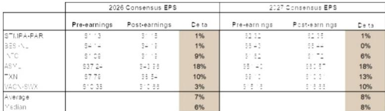

# 半导体行业观察：结构性调整中的新机遇

费城半导体指数近期出现明显回调，主要受能源价格波动、利率变化以及市场对AI相关支出可持续性的担忧影响。然而，最新财报季的底层数据所呈现的图景，与宏观层面的市场情绪有所不同。已发布财报的公司，其2026年营收一致预期上调了4%，2027年上调了7%；每股盈利预期则分别上调了7%和8%。市场价格走势与预期修正动能之间的这种背离，为能够区分周期性情绪波动与结构性需求趋势的观察者提供了值得关注的窗口。

当前的市场调整并非意味着半导体周期转向下行。它更多反映的是市场对增长构成的定价存在偏差。数据中心终端市场目前占半导体总可寻址市场的34%，预计到2030年其规模将超过整个半导体市场的总和。这一事实本身便足以重新定义整个讨论框架。市场并非在远离半导体领域，而是在半导体内部进行轮动，那些与资本支出周期紧密相关的公司，而非依赖消费驱动的终端市场公司，更有可能成为受益者。

从战略层面看，一个清晰的脉络是：半导体设备公司相较于半导体芯片公司本身，可能更具观察价值。这并非基于对芯片需求的悲观判断，而是因为资本支出周期正以尚未完全反映在设备公司估值中的速度加速。与此同时，汽车和工业领域的需求复苏虽然真实存在，但进程相对缓慢且不均衡。设备制造商受益于产能扩张的规模和紧迫性，而来自英特尔、台积电和特斯拉的数据也印证了这种紧迫性。

## 英特尔、台积电与特斯拉：资本支出前置，为设备供应商创造多年期可见度

英特尔将其2026年资本支出指引上调至超过200亿美元，高于此前约180亿美元的水平，主要驱动力是工具支出同比增长40%。该公司正积极锁定设备订单，加速洁净室建设，并确保关键基板和存储供应。管理层表示，2027年的资本支出将显著高于2026年，大部分投资将用于美国本土制造。

台积电在第二季度财报电话会议上，再次将2026年资本支出上调至600亿至640亿美元区间，高于此前近560亿美元的水平。驱动因素包括强于预期的AI需求以及更高的设备成本。管理层明确表示，未来三年的资本支出将显著高于此前三年，并宣布在亚利桑那州追加1000亿美元投资，使该地区总投资额达到2650亿美元，涉及约四座额外的晶圆厂。

特斯拉重申，2026年资本支出将超过250亿美元，并在未来两到三年内持续增长，其中包含半导体制造投资。关于其Terafab项目，管理层透露，已为其奥斯汀开发晶圆厂下达了设备订单。

这三个数据点并非孤立事件，它们共同构成了一个清晰的模式。全球最大的半导体制造商和汽车领域资本最密集的终端用户，都在传递一个信号：当前的产能水平不足以满足他们预见的未来需求。设备订单簿正在被提前数年填满。对于提供光刻、沉积、刻蚀和测试设备的公司而言，这创造了一个远比典型半导体周期更持久的收入储备。当前的设备周期正由结构性因素驱动——AI基础设施建设、先进制造的本土化，以及支持新兴功率架构所需的新晶圆厂——而非传统的由库存驱动的芯片行业节奏。

## 数据中心：从细分市场到半导体行业的结构性主导力量

数据中心需求目前占半导体总可寻址市场的34%，且其增长轨迹正在加速。在AMD的AI日活动中，该公司将其数据中心AI加速器总可寻址市场预测从2025年的约2000亿美元，上调至2030年的约1.4万亿美元，年复合增长率超过45%。更值得注意的是，AMD将其数据中心CPU总可寻址市场从约260亿美元上调至约2200亿美元，年复合增长率超过50%。

CPU总可寻址市场的修正尤为重要，因为它将AI基础设施的叙事从GPU加速器扩展到了更广泛的领域。未来的数据中心不仅需要专门的AI加速器，还需要更强大的中央处理器来管理数据移动、网络和通用计算。这对英特尔而言是积极信号，该公司一直在大力投资其代工业务和服务器CPU路线图。CPU总可寻址市场的扩张，验证了英特尔为自身产品和外部代工客户建设产能的战略。

谷歌的资本支出展望也印证了同样的主题。在发布第二季度业绩时，谷歌将2026年全年资本支出指引中点上调了150亿美元，目前预计范围为1950亿至2050亿美元。这比2025年支出的910亿美元翻了一倍多。关键的是，谷歌重申2027年资本支出预计将显著增长。在谷歌的资本支出中，计算与网络的比例大致为60:40，这意味着半导体生态系统中的网络和互连公司也将与计算领导者一同受益。

由此产生的二阶效应是，数据中心建设正在形成自我强化的循环。随着超大规模云服务商增加投入，它们对更先进芯片的需求随之产生，这反过来需要更多的晶圆产能，进而推动更多的设备支出。这个反馈循环正是设备周期可能远超典型半导体上升周期（通常为三到四年）的原因所在。

## 模拟与工业领域：复苏真实但渐进，AI基础设施成为新增长极

德州仪器和意法半导体在最近一个季度均报告了广泛的复苏。工业收入同比增长约30%，汽车收入增长中十几个百分点，个人电子产品增长高个位数。这些数字令人鼓舞，但需要结合背景来看待。模拟领域的复苏是从一个较深的低谷开始的，其改善速度虽然积极，但并未像数据中心建设那样加速。

更具战略意义的是，AI数据中心建设和新型功率架构正成为模拟需求的增量驱动因素。德州仪器报告称，其数据中心业务预计在2026年将同比弹性较高，达到31亿美元。意法半导体将其数据中心收入目标上调至2026年的10亿美元和2027年的20亿美元，大约是此前预期的两倍。两家公司都在实施提价，德州仪器预计2026年定价将更为强劲。

这并非观察者过去所习惯的模拟周期。传统上，模拟需求由工业生产、汽车销量和消费电子产品驱动。如今，数据中心正在注入一个新的、结构性增长的需求来源，它与GDP增长的关联度较低，而与AI基础设施投资的关联度更高。这改变了模拟公司的风险特征。它们正变得更具成长性而非纯粹的周期性，尤其是那些涉足电源管理、热管理和高性能计算环境信号调节领域的公司。

意法半导体还报告了供应状况趋紧和交货周期延长的情况。这是一个关键数据点。它表明，即使在复苏过程中，供应链仍然受限。相比之下，德州仪器正利用其内部制造能力来保持行业领先的交货周期。随着市场进一步收紧，这种供应可靠性方面的竞争优势将变得越来越有价值。

## 决策框架：三个问题，厘清设备、芯片设计与模拟领域的配置思路

当前环境并不支持对半导体板块进行无差别配置。终端市场之间的差异过大，增长驱动因素也各不相同。观察者需要一个决策框架来审视半导体价值链上的不同环节。

第一个问题是，观察者认为AI资本支出周期是接近顶峰还是仍在加速。如果答案是加速，那么设备公司是确定性最高的观察对象。英特尔、台积电和特斯拉的资本支出指引并非由短期需求预测驱动，而是基于结构性供需缺口的多年产能规划。设备公司既受益于订单量，也受益于供应紧张带来的定价能力。预期修正数据也支持这一点：ASML和其他设备类公司在板块中获得了最大的向上预期修正。

第二个问题是，观察者希望直接通过数据中心终端市场，还是通过其供应链来获得相关观察视角。直接关注英伟达、博通和迈威尔科技等公司，可以捕捉芯片层面的价值创造。但数据中心资本支出周期也使网络、互连和封装公司受益。安靠科技与英伟达达成的15亿美元多年期合作伙伴关系，以支持美国先进封装产能，便是一个例证。英伟达提供预付款以支持产能扩张，这意味着封装供应链正由终端客户提供资金以确保产能存在。这是需求可见性的有力信号。

第三个问题是，观察者能否承受汽车和工业领域不均衡的复苏。数据显示，汽车需求仍然疲软，预计到2026年才会逐步改善；而工业领域正在改善，但基数较低。拥有数据中心业务的模拟公司，如德州仪器和意法半导体，提供了一种混合模式，融合了周期性复苏与结构性数据中心增长。纯粹的汽车或工业模拟公司，则需要等待更长时间才能看到有意义的需求加速。

这一框架指向一个清晰的结论。设备公司提供了对结构性资本支出周期最直接、稀释度最低的观察视角。面向数据中心的芯片公司提供了高增长，但伴随更高的估值风险。拥有数据中心业务的模拟公司，则为那些希望同时获得复苏和结构性增长的观察者提供了平衡的风险回报特征。最不具吸引力的领域是消费类半导体，其中内存成本上涨和供应限制继续削弱个人电脑、手机和消费电子产品的需求，而这些领域合计占半导体总可寻址市场的42%。

半导体市场的调整是一个值得关注的窗口，但并非适用于所有公司。机会集中在与资本支出、基础设施建设和数据中心结构性转型相关的价值链环节。设备周期是真实的，数据中心需求轨迹是前所未有的，而预期修正也证实基本面正在加强而非减弱。能够认识到这一现实的观察者，将有望在下一轮周期中占据有利位置。

*仅供参考。部分内容可能基于原始材料通过AI辅助生成、翻译、总结或编辑，可能存在遗漏或错误。请独立核实。本文不构成任何专业建议。*

仅供参考。部分内容可能基于原始材料通过AI辅助生成、翻译、总结或编辑，可能存在遗漏或错误。请独立核实。本文不构成任何专业建议。

