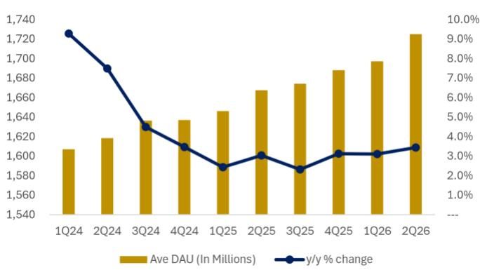
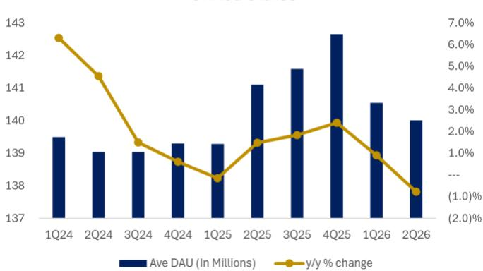
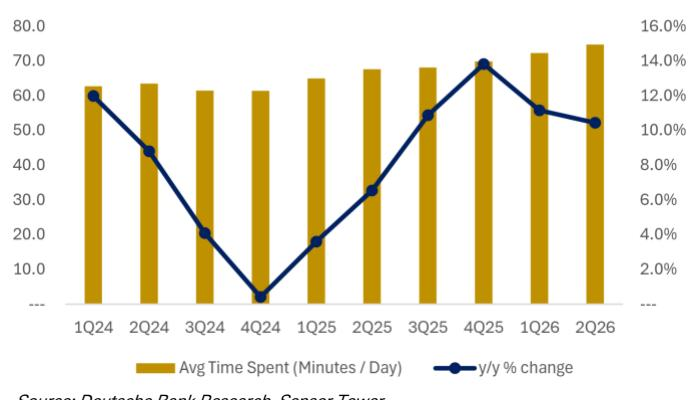
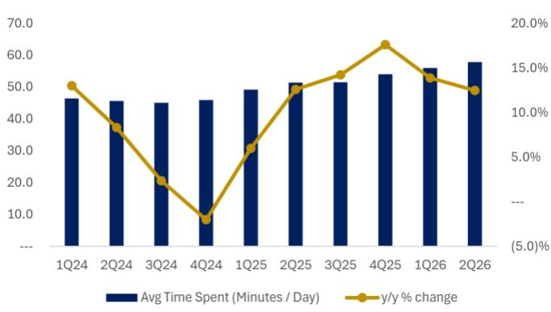

Rating Buy

## Company Meta

North America
United States

Reuters
META.OQ

Bloomberg
META US

TMT
Internet

## Meta Ambitions Need Meta Scale

We expect Meta to deliver another strong quarter, with advertising revenue likely approaching the high end of guidance as improving return on ad spend continues to attract incremental budget share. Our ad checks were overwhelmingly positive, highlighting stronger conversion performance, growing advertiser ROI, and sustained benefits from Meta's AI-driven ranking, retrieval, and campaign automation investments. The macro environment also appears to have improved from the weakness embedded in the original outlook, supporting our expectation for revenue of approximately \$60.5bn, modestly above consensus and close to current buy-side expectations which are approaching the high-\$61bn range. We think Alphabet's 2Q26 results (link), especially the steady q/q growth in Search revenue and accelerating YouTube revenue, are a positive read-through for Meta.

The setup for 3Q is similarly constructive. Our investor conversations suggest the buy-side is looking for the high end of guidance to reach approximately \$64bn. We think that bar is achievable if Meta sustains the recent magnitude of outperformance relative to its initial guidance, supported by improving ad efficiency, continued engagement growth, with growing contributions from business messaging. The broader implication is that the core business is producing sufficient growth to fund Meta's expanding AI ambitions while preserving meaningful earnings power.

Product momentum provides a second catalyst. Meta's release of Muse Spark 1.1, shortly after Muse Spark and (now discontinued) Muse Image, supports our view that Meta Superintelligence Labs has moved beyond rebuilding the company's training and post-training stack and into a faster, more predictable product cycle. The next-generation model is already in training, with Meta targeting a return to the frontier by year-end. We expect a more frequent cadence of model, assistant, creative, and agent releases to create recurring catalysts while improving engagement and advertising performance across the Family of Apps.

Meta is also building more visible paths to monetize AI directly. The rollout of subscriptions across Instagram, Facebook, WhatsApp, Meta AI, and creator/business products creates recurring revenue opportunities tied to premium features, additional AI capacity, and higher-value workflows. Separately, reports that Meta is evaluating third-party compute and hosted-model services introduce a potential direct return on the company's infrastructure investment. Raw compute sales could monetize older-generation or temporarily underutilized capacity, while a Bedrock-like API layer could establish a higher-

Date
24 July 2026

<table><tr><td>Rating</td><td>Buy</td></tr><tr><td>Price target (USD)</td><td>800.00</td></tr><tr><td>Price at 23 Jul 26</td><td>606.10</td></tr><tr><td>52-week range</td><td>789.46 – 525.72</td></tr></table>

Valuation & Risks

Benjamin Black, CFA
Research Analyst
+1-212-250-9218

Kunal Madhukar, CFA
Research Analyst
+1-212-250-9357

Benjamin Hui, Esq.
Research Associate
+1-212-250-2064

Key changes

Price target (USD) 810 800 -1%

Source: DB

quality recurring revenue stream around Meta-hosted models. Both initiatives should make the company's AI return profile easier for investors to underwrite.

Of course, Capex remains a key debate. Prior to Alphabet recently raising FY26 capex guide, we think there were limited expectations for Meta to increase its current 2026 guidance of \$125-\$145bn. However, now, it is likely investors fear an increase in FY26 outlook likely may be coming, although we would point out that Alphabet's raised capex guide includes the impact of both incremental capacity adds as well as price increases, and we do not think Meta may be adding more capacity (beyond what's currently planned) if it has spare capacity in the short term that it can rent to third parties. Looking further ahead, reports that capacity could rise from approximately 7GW in 2026 to 14GW in 2027 have shifted buy-side expectations for 2027 capex into the low-to-mid \$200bn range (we raise our estimate to \~\$210-\$215bn in 2027 and \~\$265bn in 2028). The headline investment is significant, although the directly funded amount could be lower after accounting for partner-funded capacity such as Hyperion and a growing contribution from lower-cost internal silicon. More importantly, a third-party cloud business would add a direct revenue stream against assets that investors currently value largely through indirect benefits to ads and engagement.

We expect Meta to maintain its FY26 total expense outlook. Recent restructuring actions should improve the company's underlying employee-cost trajectory, particularly in 2027, but higher restructuring and settlement charges are likely to offset most of the near-term benefit. The actions therefore improve the forward cost base without creating a meaningful reduction in reported FY26 expenses.

All in, Meta enters the print with improving advertising returns, a stronger product cadence, and increasingly credible paths to monetize AI directly. Capex would remain elevated, but the core business is generating tangible returns from those investments today, while subscriptions and third-party infrastructure sales expand the potential revenue opportunity. We maintain our Buy rating though lower our target to \$800 (from \$810), based on 24x FY27E GAAP EPS. In our view, Meta's shares modest discount to the broader market does not adequately reflect the durability of the advertising business or the growing monetization optionality across AI, subscriptions, business agents, and cloud infrastructure.

## Advertising checks point to upside

Our checks were broadly positive and suggest Meta's advertising business is outperforming our initial expectations. Advertisers consistently highlighted improved return on ad spend, better conversion performance, and growing willingness to allocate incremental budget to Meta. In our view, these improving outcomes are likely tied back to the cumulative impact of Meta's backend investments across Gem, Andromeda, adaptive ranking, creative automation, and Advantage+. Scaling these models across larger infrastructure clusters and training them on more data continues to improve conversion performance, creating a self-reinforcing cycle of stronger ROI and higher advertiser spend.

Engagement remains an important contributor. Instagram daily users continue to grow at a low-single-digit rate globally, while time spent is growing at a low-double-digit rate. One channel check indicated that client spend accelerated modestly sequentially during 2Q, supported by strong engagement and better pricing as advertiser ROAS improved. Meta's ability to grow engagement faster than users, and ad impressions faster than engagement, gives the company multiple levers to sustain advertising growth even as comparisons become more demanding.

United States  
United States  
Figure 1: Instagram daily users and time spent worldwide continue to grow Worldwide  

The macro backdrop also appears better than expected. Meta's 2Q outlook contemplated demand weakness associated with the conflict in Iran, initially concentrated in the Middle East before extending to other regions and verticals. Conditions began improving during April, and the guidance assumed that improvement would continue. Our checks indicate that the recovery has held, with strength across newer verticals including GLP-1 and peptide-related advertising and no material deterioration associated with energy prices.

All in all, we raise our 2Q revenue estimate to \$60.5bn from \$60.3bn, reflecting stronger advertising checks and a better macro outcome than we originally contemplated. This represents roughly 27% y/y growth and places Meta near the top of its \$58-\$61bn guidance range. We think buy-side expectations are approaching the high-\$61bn range. Looking to 3Q, investors appear to expect guidance with a high end near \$64bn (up 25-26% y/y). We think Meta can meet that bar if the advertising platform maintains its current momentum.

## A rebuilt AI stack should drive a faster product cadence

Muse Spark 1.1 represents more than an incremental model update. Meta Superintelligence Labs spent its first nine to ten months rebuilding the company's AI organization, training infrastructure, and post-training stack while simultaneously developing Muse Spark. With that foundation now in place, the company should be able to scale models more efficiently and release products more predictably. The next-generation model is already in training, and Meta continues to target a return to frontier performance by year-end.

The release sequence is encouraging. Muse Spark established the new model foundation, Muse Image expanded Meta's image-generation capabilities (though this has been withdrawn), and Muse Spark 1.1 added agentic coding functionality. This faster iteration supports our view that product releases should become recurring share catalysts rather than isolated events. It also expands the range of use cases across advertising creative, Meta AI, coding, business agents, wearables, and consumer content generation.

The models are already clearly benefiting Meta's core business. Meta uses LLMs to understand and label new content across topics and tone, improving the signals sent into recommendation systems. Over time, we think Meta intends to transition toward an LLM-native recommendation architecture that can generate tokens and match them against both organic content and advertising inventory. The same scaling dynamic applies to Gem, Andromeda, and Meta's adaptive adranking models, where larger systems and more training data continue to drive conversion gains.

This positions AI releases as both strategic and financially relevant. Better models can improve content relevance, increase engagement, automate advertiser creative, strengthen campaign conversion, and deepen usage of Meta AI. The investment return therefore begins inside the existing advertising franchise before expanding into new revenue streams.

## Subscriptions create an explicit AI monetization layer

Meta is rolling out subscriptions across its consumer apps, AI products, and creator/business ecosystem. The current framework includes app-specific plans for Instagram, Facebook, and WhatsApp, AI subscriptions at \$7.99 and \$19.99 per month, and creator/business products at \$14.99 and \$49.99 per month. Consumer features include personalization, enhanced reactions, and insights, while AI plans provide greater capacity for compute-intensive activities such as reasoning and image or video generation.

The near-term revenue impact should remain modest relative to advertising, but we contend that the strategic implications are meaningful. Subscriptions establish direct revenue against AI usage and create a capacity-management mechanism ahead of more capable models. They also demonstrate that Meta can monetize AI through recurring revenue in addition to the embedded benefits flowing through ad targeting, creative automation, and engagement.

Meta AI usage accelerated following the Muse Spark release, and the company is now laying the commercial rails for users who want deeper functionality or consume more tokens. The company is also bundling advanced AI tools, analytics, discoverability, and support into higher-value creator and business plans. Our prior scenario work (see here for more) suggests the combined subscription portfolio could generate \$4.5-\$15.6bn of FY27 revenue and approximately \$1.30-\$4.60 of incremental GAAP EPS under modest penetration assumptions. These remain scenario estimates rather than forecast changes, but we contend they illustrate how small conversion rates across Meta's distribution base can create a material revenue stream.

Business agents add another medium-term opportunity. Meta is facilitating approximately 10mn weekly conversations between users and business AIs across its messaging platforms, up tenfold since the start of the year. The products currently remain free to use, but we think the company will likely establish a longer-term monetization framework that could combine subscriptions with volume-based pricing. We view this primarily as a 2027 opportunity, with the potential to extend paid business messaging into markets where labor costs previously limited adoption.

## Cloud sales could improve the capex return framework

Reports indicate that Meta is considering a cloud infrastructure business that could sell raw compute capacity and hosted access to AI models. A Bedrock-like offering would allow developers to use Meta-hosted models through an API, while a neocloud-style product could monetize excess computing capacity directly. While a formal announcement of cloud sales has not yet occurred (Anthropic is reported to be in early discussions to lease compute from Meta, with a potential value of roughly \$10bn), the strategic logic is increasingly clear.

We believe Meta can preserve its frontier-model ambitions while monetizing less strategic capacity. The company could reserve its newest Rubin-era infrastructure for internal training while selling access to older Nvidia systems, inference clusters, or temporarily underutilized capacity. The third-party market remains supply constrained, giving Meta a potential utilization backstop at attractive pricing, best evidenced by Alphabet's announcement to continue to leverage third party bridge capacity.

Raw capacity sales would reduce stranded-asset risk and provide high incremental flow-through because much of the associated capex, depreciation, leases, power, and infrastructure expense already sits in investor forecasts. A hosted-model API layer would be more strategically valuable, creating usage-based recurring revenue and increasing the value of Meta's proprietary models. Meta would need to build enterprise sales, support, billing, security, and developer tooling, suggesting an initial focus on bilateral compute contracts before expanding into a broader platform.

Our previous capacity analysis work highlighted a potential medium-term opportunity of \$15-\$36bn, with a base case of approximately \$24bn in annualized third-party revenue after incorporating the reported 14GW of 2027 capacity (see here for more). These scenarios depend on available capacity, utilization, pricing, and customer demand and are not included in our current estimates. However, they demonstrate why a larger infrastructure footprint could increase revenue optionality alongside the capital requirement.

## 2027 capex expectations have moved higher, but the net burden may be more manageable

Reports suggesting that Meta could expand from approximately 7GW of capacity in 2026 to 14GW in 2027 have moved buy-side capex expectations into the low-to-mid \$200bn range. Applying a simple \$35bn-per-GW assumption to 7GW of incremental capacity produces approximately \$245bn of investment, although that figure likely overstates the amount Meta will directly fund.

Hyperion could contribute approximately 1.0-1.5GW through a partner-funded structure, reducing directly funded incremental capacity to approximately 5.5GW. Meta's internal Iris/MTIA roadmap could also lower the blended cost per unit of compute. Servers represent a majority of data-center cost, and shifting selected inference and recommendation workloads away from higher-cost merchant GPUs should improve the economics over time. Under a blended internal-silicon and merchant-GPU framework, the cost per GW could move closer to approximately \$30bn, implying around \$165bn of directly funded investment for 5.5GW.

These calculations clearly carry substantial uncertainty, but the implication is straightforward: 2027 capex will likely rise materially, although the economic burden may be below the headline 7GW calculation. A cloud revenue stream would further improve the net return profile by attaching direct revenue to part of the asset base.

## Restructuring improves the forward cost base, not FY26 reported expenses

Meta's recent restructuring should produce a leaner organization and help offset rising AI infrastructure costs. We do not expect a meaningful reduction in the FY26 total expense outlook as higher restructuring and settlement charges are likely to offset the near-term compensation savings. The key benefit should emerge in 2027 as the lower employee-cost base annualizes. We therefore expect Meta to maintain FY26 total expense guidance at \$162-\$169bn rather than lower it. The company is absorbing one-time charges while reallocating resources toward AI, infrastructure, recommendation systems, business agents, and model development. The forward earnings benefit should become more visible once restructuring costs roll off in FY27.

## Estimate Changes and Valuation

We raise our 2Q revenue estimate to approximately \$60.5bn from \$60.3bn, reflecting stronger advertising checks and a better macro outcome than originally contemplated. Our updated estimate implies approximately 27% y/y growth and sits near the top of Meta's \$58-\$61bn guidance range. We expect advertising revenue to remain the primary source of upside, driven by continued impression growth and sustained pricing as conversion performance improves.

For 3Q, we increase our revenue estimate to \~\$63.3bn, approaching the high-end expectation emerging in our investor conversations. We expect Meta to guide conservatively around ongoing geopolitical and macro volatility, although the underlying advertising trends support another quarter of strong growth.

We leave FY26 capex and total expense estimates broadly unchanged. The 2027 infrastructure reports have driven our longer-term capex assumptions higher (we now model \~\$210-\$215bn in FY27, up from our prior estimate of \~\$183bn), but the ultimate impact depends on project timing, partner financing, chip mix, and the amount of capacity Meta elects to monetize externally. Restructuring savings should be largely offset by associated charges and settlements in FY26, with a clearer benefit beginning in 2027.

We maintain our Buy rating, but lower our target price to \$800 (from \$810 previously), based on 24x FY27 GAAP EPS. Meta trades at approximately 16x NTM EPS versus the S&P 500 at approximately 21x, despite a core advertising business delivering materially faster growth and measurable returns from AI investment. We believe the current valuation underappreciates both the durability of the advertising franchise and the expanding set of direct monetization opportunities across subscriptions, business agents, model APIs, and cloud infrastructure.

Figure 2: 2Q26 Outlook

<table><tr><td colspan="10">2Q26E - Preview(In Millions, Unless otherwise stated)</td></tr><tr><td></td><td>DB Est. Current</td><td>DB Est. Prior</td><td>Current vs. Prior</td><td>Street Estimate</td><td>Current vs. Street</td><td>2Q25A</td><td>y/y cchange</td><td>1Q26A</td><td>q/q cchange</td></tr><tr><td rowspan="2">Total Revenue Guidance</td><td rowspan="2">$60,521</td><td>$60,302</td><td>0.4%</td><td>$60,273</td><td>0.4%</td><td>$47,516</td><td>27.4%</td><td>$56,311</td><td>7.5%</td></tr><tr><td colspan="8">$58bn - $61bn for the Quarter</td></tr><tr><td>Family of Apps</td><td>$60,077</td><td>$59,858</td><td>0.4%</td><td>$59,841</td><td>0.4%</td><td>$47,146</td><td>27.4%</td><td>$55,909</td><td>7.5%</td></tr><tr><td>Advertising</td><td>$59,086</td><td>$58,867</td><td>0.4%</td><td>$58,990</td><td>0.2%</td><td>$46,563</td><td>26.9%</td><td>$55,024</td><td>7.4%</td></tr><tr><td>Other</td><td>$991</td><td>$991</td><td>---</td><td>$860</td><td>15.3%</td><td>$583</td><td>70.0%</td><td>$885</td><td>12.0%</td></tr><tr><td>Reality Labs</td><td>$444</td><td>$444</td><td>---</td><td>$428</td><td>3.7%</td><td>$370</td><td>20.0%</td><td>$402</td><td>10.4%</td></tr><tr><td>Impressions Growth y/y</td><td>14.1%</td><td>14.1%</td><td>---</td><td>14.2%</td><td>(6) bps</td><td>10.8%</td><td>+336 bps</td><td>19.0%</td><td>(488) bps</td></tr><tr><td>Price Per Impression y/y</td><td>11.2%</td><td>10.8%</td><td>+41 bps</td><td>10.8%</td><td>+42 bps</td><td>9.7%</td><td>+151 bps</td><td>11.7%</td><td>(52) bps</td></tr><tr><td>GAAP Cost of Revenue</td><td>$11,580</td><td>$11,580</td><td>---</td><td>$11,970</td><td>(3.3)%</td><td>$8,491</td><td>36.4%</td><td>$10,218</td><td>13.3%</td></tr><tr><td>GAAP Op expenses</td><td>$26,171</td><td>$26,171</td><td>---</td><td>$26,976</td><td>(3.0)%</td><td>$18,584</td><td>40.8%</td><td>$23,221</td><td>12.7%</td></tr><tr><td rowspan="2">GAAP Total Costs/Expenses Guidance</td><td rowspan="2">$37,752</td><td>$37,752</td><td>---</td><td>$38,946</td><td>(3.1)%</td><td>$27,075</td><td>39.4%</td><td>$33,439</td><td>12.9%</td></tr><tr><td colspan="8">$162bn - $169bn for the Year</td></tr><tr><td>Operating Income</td><td>$22,769</td><td>$22,551</td><td>1.0%</td><td>$21,575</td><td>5.5%</td><td>$20,441</td><td>11.4%</td><td>$22,872</td><td>(0.4)%</td></tr><tr><td>Family of Apps</td><td>$27,314</td><td>$27,215</td><td>0.4%</td><td>$26,104</td><td>4.6%</td><td>$24,971</td><td>9.4%</td><td>$26,900</td><td>1.5%</td></tr><tr><td>Reality Labs</td><td>$(4,545)</td><td>$(4,664)</td><td>NM</td><td>$(4,458)</td><td>NM</td><td>$(4,530)</td><td>NM</td><td>$(4,028)</td><td>NM</td></tr><tr><td>OI Margin</td><td>37.6%</td><td>37.4%</td><td>+23 bps</td><td>35.8%</td><td>+183 bps</td><td>43.0%</td><td>(540) bps</td><td>40.6%</td><td>(300) bps</td></tr><tr><td>Family of Apps</td><td>45.5%</td><td>45.5%</td><td>+0 bps</td><td>43.6%</td><td>+184 bps</td><td>53.0%</td><td>(750) bps</td><td>48.1%</td><td>(265) bps</td></tr><tr><td>Reality Labs</td><td>(1023.7)%</td><td>(1050.5)%</td><td></td><td>(1040.9)%</td><td></td><td>(1224.3)%</td><td></td><td>(1002.0)%</td><td></td></tr><tr><td>Net Income</td><td>$19,169</td><td>$20,232</td><td>(5.3)%</td><td>$18,587</td><td>3.1%</td><td>$18,337</td><td>4.5%</td><td>$26,773</td><td>(28.4)%</td></tr><tr><td>Net Income Margin</td><td>31.7%</td><td>33.6%</td><td>(188) bps</td><td>30.8%</td><td>+84 bps</td><td>38.6%</td><td>(692) bps</td><td>47.5%</td><td>(1587) bps</td></tr><tr><td>Diluted EPS</td><td>$7.45</td><td>$7.86</td><td>(5.1)%</td><td>$7.18</td><td>3.8%</td><td>$7.14</td><td>4.5%</td><td>$10.44</td><td>(28.6)%</td></tr><tr><td>Capex</td><td>$32,361</td><td>$32,361</td><td>---</td><td></td><td></td><td>$17,012</td><td>90.2%</td><td>$19,840</td><td>63.1%</td></tr><tr><td>Purclases of PP&amp;E</td><td>$31,422</td><td>$31,422</td><td>---</td><td>$33,154</td><td>(5.2)%</td><td>$16,538</td><td>90.0%</td><td>$18,997</td><td>65.4%</td></tr><tr><td rowspan="2">Prin. Payments on Cap leases Guidance</td><td rowspan="2">$939</td><td>$939</td><td></td><td></td><td></td><td>$474</td><td>98.1%</td><td>$843</td><td>11.4%</td></tr><tr><td colspan="8">$125bn - $145bn for the Year</td></tr><tr><td>Free Cash Flow (FCF)</td><td>$3,059</td><td>$4,189</td><td>(27.0)%</td><td>$(1,173)</td><td>NM</td><td>$8,549</td><td>(64.2)%</td><td>$12,386</td><td>(75.3)%</td></tr><tr><td>FCF Margins</td><td>5.1%</td><td>6.9%</td><td></td><td>(1.9)%</td><td>+700 bps</td><td>18.0%</td><td></td><td>22.0%</td><td></td></tr></table>

Source: DB, Bloomberg Finance LP

Figure 3: Estimate Changes

<table><tr><td rowspan="3">Key Estimates(In Millions, Unless otherwise stated)</td><td colspan="7">3Q26E</td><td colspan="7">4Q26E</td></tr><tr><td colspan="3">DB Est. (DBe)</td><td rowspan="2">Street Estimate</td><td rowspan="2">DBe vs St.</td><td rowspan="2">3Q25A</td><td rowspan="2">y/y change</td><td colspan="3">DB Est. (DBe)</td><td rowspan="2">Street Estimate</td><td rowspan="2">DBe vs St.</td><td rowspan="2">4Q25A</td><td rowspan="2">y/y change</td></tr><tr><td>Current</td><td>Previous</td><td>change</td><td>Current</td><td>Previous</td><td>change</td></tr><tr><td>Total Revenue</td><td>$63,313</td><td>$62,848</td><td>0.7%</td><td>$63,206</td><td>0.2%</td><td>$51,242</td><td>23.6%</td><td>$75,049</td><td>$75,049</td><td>0.0%</td><td>$73,410</td><td>2.2%</td><td>$59,893</td><td>25.3%</td></tr><tr><td>Guidance</td><td></td><td></td><td></td><td></td><td></td><td></td><td></td><td></td><td></td><td></td><td></td><td></td><td></td><td></td></tr><tr><td>Family of Apps</td><td>$62,726</td><td>$62,261</td><td>0.7%</td><td>$62,534</td><td>0.3%</td><td>$50,772</td><td>23.5%</td><td>$73,856</td><td>$73,855</td><td>0.0%</td><td>$72,239</td><td>2.2%</td><td>$58,938</td><td>25.3%</td></tr><tr><td>Advertising</td><td>$61,553</td><td>$61,088</td><td>0.8%</td><td>$61,726</td><td>(0.3)%</td><td>$50,082</td><td>22.9%</td><td>$72,494</td><td>$72,494</td><td>0.0%</td><td>$71,241</td><td>1.8%</td><td>$58,137</td><td>24.7%</td></tr><tr><td>Other</td><td>$1,173</td><td>$1,173</td><td>---</td><td>$1,014</td><td>15.7%</td><td>$690</td><td>70.0%</td><td>$1,362</td><td>$1,362</td><td>---</td><td>$1,119</td><td>21.7%</td><td>$801</td><td>70.0%</td></tr><tr><td>Reality Labs</td><td>$588</td><td>$588</td><td>---</td><td>$525</td><td>12.0%</td><td>$470</td><td>25.0%</td><td>$1,194</td><td>$1,194</td><td>---</td><td>$1,071</td><td>11.5%</td><td>$955</td><td>25.0%</td></tr><tr><td>Impressions Growth y/y</td><td>10.1%</td><td>10.1%</td><td>---</td><td>12.5%</td><td>(241) bps</td><td>14.3%</td><td>(426) bps</td><td>7.1%</td><td>7.1%</td><td>+0 bps</td><td>11.2%</td><td>(415) bps</td><td>17.1%</td><td>(998) bps</td></tr><tr><td>Price Per Impression y/y</td><td>11.7%</td><td>10.8%</td><td>+84 bps</td><td>9.1%</td><td>+255 bps</td><td>9.8%</td><td>+184 bps</td><td>16.4%</td><td>16.4%</td><td>+0 bps</td><td>10.4%</td><td>+605 bps</td><td>6.1%</td><td>+1028 bps</td></tr><tr><td>GAAP Cost of Revenue</td><td>$12,516</td><td>$12,516</td><td>---</td><td>$13,081</td><td>(4.3)%</td><td>$9,206</td><td>36.0%</td><td>$14,977</td><td>$14,977</td><td>---</td><td>$15,398</td><td>(2.7)%</td><td>$10,905</td><td>37.3%</td></tr><tr><td>GAAP Op expenses</td><td>$30,415</td><td>$30,415</td><td>---</td><td>$29,442</td><td>3.3%</td><td>$21,501</td><td>41.5%</td><td>$33,943</td><td>$33,943</td><td>---</td><td>$33,080</td><td>2.6%</td><td>$24,243</td><td>40.0%</td></tr><tr><td>GAAP Total Costs/Expenses</td><td>$42,931</td><td>$42,931</td><td>---</td><td>$42,523</td><td>1.0%</td><td>$30,707</td><td>39.8%</td><td>$48,921</td><td>$48,921</td><td>---</td><td>$48,479</td><td>0.9%</td><td>$35,148</td><td>39.2%</td></tr><tr><td>Guidance</td><td></td><td></td><td></td><td></td><td></td><td></td><td></td><td></td><td></td><td></td><td></td><td></td><td></td><td></td></tr><tr><td>Operating Income</td><td>$20,382</td><td>$19,917</td><td>2.3%</td><td>$21,061</td><td>(3.2)%</td><td>$20,535</td><td>(0.7)%</td><td>$26,129</td><td>$26,128</td><td>0.0%</td><td>$25,316</td><td>3.2%</td><td>$24,745</td><td>5.6%</td></tr><tr><td>Family of Apps</td><td>$25,200</td><td>$25,013</td><td>0.7%</td><td>$25,501</td><td>(1.2)%</td><td>$24,967</td><td>0.9%</td><td>$31,906</td><td>$31,906</td><td>0.0%</td><td>$30,772</td><td>3.7%</td><td>$30,766</td><td>3.7%</td></tr><tr><td>Reality Labs</td><td>$(4,818)</td><td>$(5,096)</td><td>NM</td><td>$(4,583)</td><td>NM</td><td>$(4,432)</td><td>NM</td><td>$(5,778)</td><td>$(5,778)</td><td>NM</td><td>$(5,340)</td><td>NM</td><td>$(6,021)</td><td>NM</td></tr><tr><td>OI Margin</td><td>32.2%</td><td>31.7%</td><td>+50 bps</td><td>33.3%</td><td>(113) bps</td><td>40.1%</td><td>(788) bps</td><td>34.8%</td><td>34.8%</td><td>+0 bps</td><td>34.5%</td><td>+33 bps</td><td>41.3%</td><td>(650) bps</td></tr><tr><td>Family of
